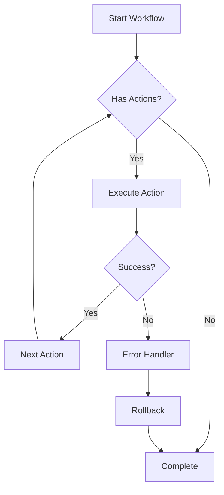
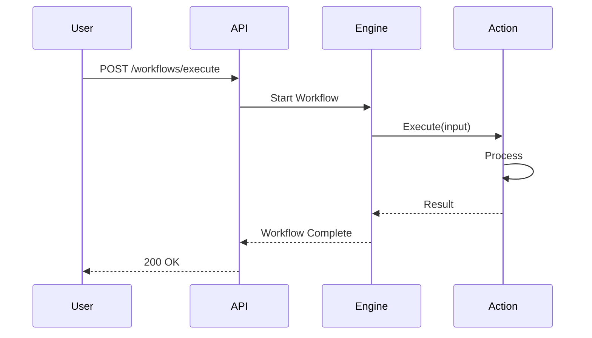
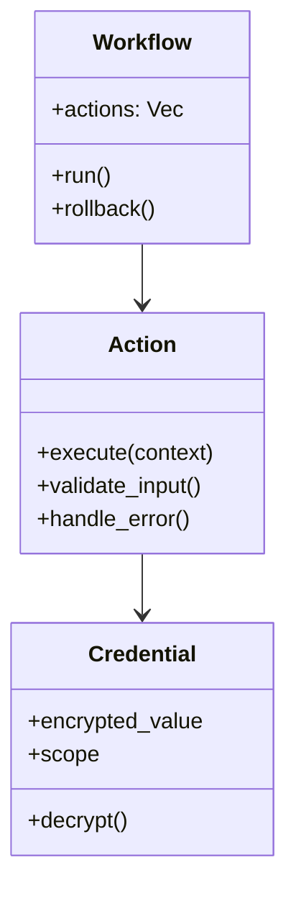
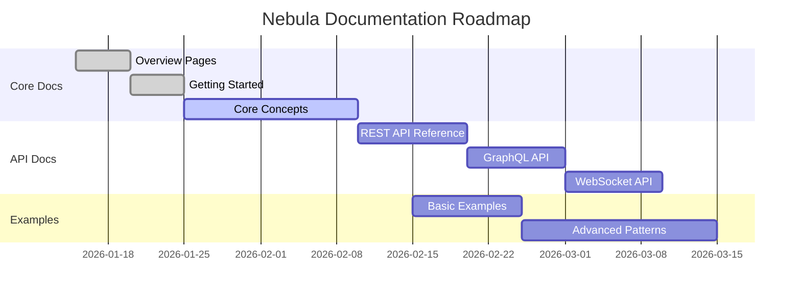

# Obsidian Plugins Guide for Nebula Docs

Это руководство объясняет, как использовать установленные плагины Obsidian для эффективной работы с документацией Nebula.

## 📋 Встроенные плагины (Core Plugins)

### 🔄 Быстрый переход (Quick Switcher)

**Горячая клавиша**: `Ctrl+O` (Windows/Linux) или `Cmd+O` (Mac)

**Использование**:
- Быстрый переход между страницами документации
- Поиск по названию файла
- Навигация без использования мыши

**Примеры**:
```
Ctrl+O → "action" → Enter
→ Переход к документации Actions

Ctrl+O → "getting started" → Enter
→ Открывается Getting Started
```

---

### 📂 Восстановление файлов (File Recovery)

**Назначение**: Автоматическое восстановление несохранённых изменений

**Как работает**:
- Obsidian автоматически сохраняет snapshots
- При сбое можно восстановить последние изменения
- Доступ: Settings → File Recovery

**Best Practice**:
- Держите включённым всегда
- Используйте для восстановления после случайных потерь

---

### 📅 Ежедневные заметки (Daily Notes)

**Использование для документации**:

Создайте журнал работы над документацией:

```markdown
# 2026-02-03 - Documentation Log

## Сегодня работал над:
- [ ] Обновил [[Credential Management]]
- [ ] Добавил примеры в [[Action Development]]
- [ ] Проверил ссылки в [[API Reference]]

## Завтра:
- [ ] Закончить [[Performance Optimization]]
- [ ] Создать диаграммы для [[Architecture]]

## Вопросы:
- Нужна ли страница про [[Event System]]?
```

**Настройка**:
- Settings → Daily Notes
- Формат даты: `YYYY-MM-DD`
- Папка: `08-Reference/Logs/`

---

### 🔖 Компоновщик заметок (Note Composer)

**Функции**:
- Объединение нескольких заметок в одну
- Разделение большой заметки на части
- Извлечение секций в отдельные файлы

**Пример использования**:

Если страница `Actions.md` стала слишком большой:

1. Выделите секцию "HTTP Actions"
2. ПКМ → "Extract current selection"
3. Создаётся `HTTP Actions.md`
4. В `Actions.md` остаётся ссылка `[[HTTP Actions]]`

**Best Practice для Nebula Docs**:
- Разделяйте страницы >500 строк
- Извлекайте примеры в `06-Examples/`
- Держите концепции в `03-Concepts/` компактными

---

### 🔗 Обратные ссылки (Backlinks)

**Как использовать**:

Правая панель показывает все страницы, которые ссылаются на текущую.

**Примеры**:
- Открыта страница `[[Credentials]]`
- Backlinks показывают:
  - `[[Security Model]]` упоминает credentials 3 раза
  - `[[Action Development]]` ссылается на credential context
  - `[[AWS Integration]]` описывает AWS credential provider

**Best Practice**:
- Проверяйте backlinks перед удалением страницы
- Используйте для поиска связанных тем
- Находите страницы, которые нужно обновить вместе

---

### ➡️ Палитра команд (Command Palette)

**Горячая клавиша**: `Ctrl+P`

**Полезные команды для документации**:

```
Ctrl+P → "dataview" → Refresh all views
→ Обновить все Dataview запросы

Ctrl+P → "template" → Insert template
→ Вставить шаблон страницы

Ctrl+P → "export" → Export to PDF
→ Экспортировать в PDF

Ctrl+P → "check" → Check for broken links
→ Проверить битые ссылки
```

---

### 👁️ Предпросмотр страницы (Page Preview on Hover)

**Как работает**:
- Наведите на `[[wikilink]]`
- Появится preview содержимого
- Можно читать без перехода на страницу

**Идеально для**:
- Быстрого просмотра API reference
- Проверки, та ли это страница
- Чтения коротких концепций inline

---

### 🔄 Синхронизация (Sync)

**Для команды**:
- Obsidian Sync (платная) - синхронизация через облако
- Альтернатива: Git + GitHub для version control

**Best Practice для Nebula**:
- Используйте Git для version control
- Коммитьте изменения с описанием:
  ```bash
  git add .
  git commit -m "docs: add credential rotation guide"
  git push
  ```

---

### 🎯 Холст (Canvas)

**Использование для архитектурных диаграмм**:

Создайте визуальную карту документации:

```
Canvas: "Nebula Architecture Overview"

┌─────────────┐
│   Actions   │
└──────┬──────┘
       │
       ↓
┌─────────────┐     ┌──────────────┐
│  Workflows  │────→│  Resources   │
└──────┬──────┘     └──────────────┘
       │
       ↓
┌─────────────┐
│ Credentials │
└─────────────┘
```

**Где использовать**:
- `01-Overview/Architecture Canvas.canvas`
- Визуализация связей между crates
- Диаграммы workflow execution flow
- Roadmap планирование

**Экспорт**:
- Canvas можно экспортировать как PNG/SVG
- Использовать в презентациях
- Встраивать в документацию

---

### 📑 Шаблоны (Templates)

**Назначение**: Быстрое создание страниц по шаблонам

**Примеры шаблонов для Nebula**:

#### Template 1: Crate Documentation

```markdown
---
title: nebula-{{crate-name}}
tags: [crate, {{category}}]
status: draft
lang: ru
created: {{date}}
last_updated: {{date}}
---

# nebula-{{crate-name}}

**TL;DR**: {{one-sentence-description}}

## Назначение

{{why-this-crate-exists}}

## Установка

\`\`\`toml
[dependencies]
nebula-{{crate-name}} = "0.1.0"
\`\`\`

## Quick Example

\`\`\`rust
// TODO: Add minimal example
\`\`\`

## Architecture

{{describe-internal-structure}}

## API Reference

See [[API Reference]] for complete documentation.

## See Also

- [[Related Crate 1]]
- [[Related Concept]]
- [[Example Usage]]
```

#### Template 2: Concept Page

```markdown
---
title: {{concept-name}}
tags: [concept, {{category}}]
status: draft
lang: ru
created: {{date}}
last_updated: {{date}}
---

# {{concept-name}}

**TL;DR**: {{one-sentence-explanation}}

## Why {{concept-name}} Matters

{{motivation-paragraph}}

## How It Works

{{technical-explanation}}

## Example

\`\`\`rust
// Simple example
\`\`\`

## Advanced Usage

- [[Advanced Topic 1]]
- [[Advanced Topic 2]]

## Common Pitfalls

> [!WARNING] {{common-mistake}}
> {{how-to-avoid}}

## See Also

- [[Related Concept 1]]
- [[Related Concept 2]]
```

#### Template 3: API Endpoint Documentation

```markdown
---
title: {{endpoint-name}}
tags: [api, endpoint, {{method}}]
status: draft
lang: en
created: {{date}}
last_updated: {{date}}
---

# {{METHOD}} /api/v1/{{endpoint}}

{{brief-description}}

## Request

**Endpoint**: `{{METHOD}} /api/v1/{{endpoint}}`

**Headers**:
\`\`\`http
Content-Type: application/json
Authorization: Bearer {{token}}
\`\`\`

**Body**:
\`\`\`json
{
  "field1": "value",
  "field2": 123
}
\`\`\`

## Response

**Success (200)**:
\`\`\`json
{
  "success": true,
  "data": {}
}
\`\`\`

**Error (4xx/5xx)**:
\`\`\`json
{
  "error": "message"
}
\`\`\`

## Example

\`\`\`bash
curl -X {{METHOD}} http://localhost:3000/api/v1/{{endpoint}} \\
  -H "Content-Type: application/json" \\
  -d '{"field": "value"}'
\`\`\`

## See Also

- [[API Authentication]]
- [[Error Codes]]
```

**Настройка Templates**:
1. Создайте папку `_templates/` в корне vault
2. Добавьте файлы шаблонов (`.md`)
3. Settings → Templates → Template folder: `_templates`
4. Горячая клавиша: `Ctrl+P` → "Insert template"

---

## 🔌 Сторонние плагины (Community Plugins)

### 📊 Dataview

**Назначение**: SQL-подобные запросы к вашей документации

**Установка**: Community Plugins → Search "Dataview" → Install

#### Пример 1: Все страницы со статусом "draft"

```dataview
TABLE status, last_updated
FROM ""
WHERE status = "draft"
SORT last_updated DESC
```

**Результат**:
| File | Status | Last Updated |
|------|--------|--------------|
| [[Performance Guide]] | draft | 2026-02-01 |
| [[Custom Actions]] | draft | 2026-01-28 |

#### Пример 2: Все страницы с тегом "security"

```dataview
LIST
FROM #security
SORT file.ctime DESC
```

#### Пример 3: Dashboard недавних изменений

Создайте `00-Home/Documentation Dashboard.md`:

```markdown
# Documentation Dashboard

## 🚧 Draft Pages (Needs Completion)

\`\`\`dataview
TABLE tags, last_updated as "Updated"
FROM ""
WHERE status = "draft"
SORT last_updated DESC
LIMIT 10
\`\`\`

## ✅ Recently Published

\`\`\`dataview
TABLE tags, last_updated as "Updated"
FROM ""
WHERE status = "published"
SORT last_updated DESC
LIMIT 5
\`\`\`

## ⚠️ Outdated Pages (Needs Review)

\`\`\`dataview
TABLE last_updated as "Updated"
FROM ""
WHERE status = "outdated"
SORT last_updated ASC
\`\`\`

## 📦 Crate Documentation Status

\`\`\`dataview
TABLE status, tags
FROM "02-Crates"
SORT file.name ASC
\`\`\`
```

#### Пример 4: Roadmap из задач

```dataview
TASK
FROM "08-Reference"
WHERE !completed
GROUP BY file.link
```

**Best Practices**:
- Создайте Dashboard на главной странице
- Используйте для отслеживания progress
- Автоматизируйте reporting

---

### 🎨 Excalidraw

**Назначение**: Рисование диаграмм вручную

**Использование**:
- Архитектурные схемы
- Workflow diagrams
- UML диаграммы
- Наброски концепций

**Пример: Workflow Execution Flow**

1. Создайте `Architecture Diagram.excalidraw`
2. Нарисуйте блоки: Action → Executor → Resource
3. Добавьте стрелки и аннотации
4. Встройте в документацию: `![[Architecture Diagram]]`

**Преимущества vs Mermaid**:
- Mermaid: Текстовые диаграммы, version control friendly
- Excalidraw: Свободное рисование, более гибкое

**Используйте Excalidraw когда**:
- Нужна нестандартная визуализация
- Brainstorming новых концепций
- Презентационные диаграммы

---

### 🗂️ Git

**Плагин Obsidian Git**

**Функции**:
- Автоматический commit и push
- Sync на background
- Version history просмотр

**Настройка**:
```
Settings → Obsidian Git:
✅ Auto commit: Every 10 minutes
✅ Auto push: Every 30 minutes
✅ Pull on startup
Commit message: "docs: auto backup {{date}}"
```

**Ручные команды**:
- `Ctrl+P` → "Git: Commit all changes"
- `Ctrl+P` → "Git: Push"
- `Ctrl+P` → "Git: Pull"

**Best Practice**:
- Автоматический backup для безопасности
- Ручные коммиты для significant changes
- Описательные commit messages:
  ```
  docs: add credential rotation guide
  docs: update architecture diagrams
  docs: fix broken links in API reference
  ```

---

### 📋 Kanban

**Назначение**: Трекинг задач документации

**Создание Kanban Board**:

1. Создайте `00-Home/Documentation Kanban.md`
2. Добавьте:

```markdown
---
kanban-plugin: basic
---

## 📝 To Write

- [ ] [[Performance Optimization Guide]]
- [ ] [[Security Best Practices]]
- [ ] [[Deployment Guide]]


## ✍️ In Progress

- [ ] [[Action Development]] #writing
- [ ] [[API Reference]] #updating


## 👀 Review Needed

- [ ] [[Getting Started]] #review @team
- [ ] [[Architecture Overview]] #review @lead


## ✅ Completed

- [x] [[What is Nebula]] #published
- [x] [[Key Features]] #published

```

**Features**:
- Drag-and-drop между колонками
- Тэги для категоризации
- Assignee через @mentions
- Архивирование completed tasks

**Use Cases**:
- Tracking documentation progress
- Sprint planning для doc team
- Roadmap визуализация

---

### 🧰 Mermaid Tools

**Назначение**: Расширенные Mermaid диаграммы

**Obsidian поддерживает Mermaid natively**:

#### Flowchart (Workflow Execution)



#### Sequence Diagram (API Call Flow)



#### Class Diagram (Crate Architecture)



#### Gantt Chart (Documentation Roadmap)



**Best Practice**:
- Используйте Mermaid для documentation (version control)
- Используйте Excalidraw для presentations
- Комбинируйте оба подхода

---

### ✅ Tasks

**Плагин Obsidian Tasks**

**Функции**:
- Advanced task management
- Due dates, priorities, recurrence
- Queries для фильтрации задач

**Пример использования**:

```markdown
## Documentation Tasks

- [ ] Написать [[Credential Rotation]] 📅 2026-02-05 ⏫
- [ ] Обновить [[API Reference]] 📅 2026-02-10 🔼
- [ ] Проверить links в [[Examples]] 📅 2026-02-15

## Query: High Priority Tasks

\`\`\`tasks
not done
priority is high
sort by due
\`\`\`

## Query: Overdue Tasks

\`\`\`tasks
not done
due before today
\`\`\`
```

**Symbols**:
- 📅 Due date
- ⏫ High priority
- 🔼 Medium priority
- 🔽 Low priority
- 🔁 Recurring

---

### 📐 Templater

**Advanced templating with JavaScript**

**Отличия от встроенного Templates**:
- Динамические значения (дата, время)
- JavaScript функции
- User prompts
- File manipulation

**Пример: Dynamic Crate Template**

```markdown
---
title: nebula-<% tp.file.title %>
tags: [crate, <% tp.system.prompt("Category?") %>]
status: draft
lang: ru
created: <% tp.date.now("YYYY-MM-DD") %>
last_updated: <% tp.date.now("YYYY-MM-DD") %>
version: <% tp.system.prompt("Crate version?", "0.1.0") %>
---

# nebula-<% tp.file.title %>

**TL;DR**: <% tp.system.prompt("One-line description") %>

## Назначение

<% tp.system.prompt("Why this crate exists?") %>

## Установка

\`\`\`toml
[dependencies]
nebula-<% tp.file.title %> = "<% tp.system.prompt("Version?", "0.1.0") %>"
\`\`\`

## Quick Example

\`\`\`rust
use nebula_<% tp.file.title.replace("-", "_") %>::*;

// TODO: Add example
\`\`\`

## See Also

- [[nebula-action]]
- [[nebula-workflow]]

---
*Created: <% tp.date.now("YYYY-MM-DD HH:mm") %>*
```

**Интерактивное создание**: Templater спросит все необходимые поля!

---

## 🎯 Рекомендуемый Workflow

### Ежедневная работа

1. **Утро**: Открыть [[Documentation Dashboard]] (Dataview)
2. **Планирование**: Открыть [[Documentation Kanban]]
3. **Работа**: Использовать Templates для новых страниц
4. **Коммит**: Auto-commit через Git plugin

### Создание новой страницы концепции

1. `Ctrl+N` - новый файл
2. `Ctrl+P` → "Insert template" → "Concept Page"
3. Заполнить frontmatter
4. Написать содержимое
5. Добавить wikilinks к связанным страницам
6. Проверить backlinks в правой панели
7. Update status: `draft` → `published`

### Еженедельный review

1. Запустить Dataview query "Draft Pages"
2. Закончить незавершённые страницы
3. Проверить "Outdated Pages" query
4. Обновить Kanban board
5. Git commit с summary изменений

---

## 📖 Дополнительные ресурсы

### Obsidian Documentation

- [Official Obsidian Help](https://help.obsidian.md/)
- [Dataview Plugin Docs](https://blacksmithgu.github.io/obsidian-dataview/)
- [Templater Plugin Docs](https://silentvoid13.github.io/Templater/)

### Примеры публичных Obsidian vaults

- [Obsidian Hub](https://publish.obsidian.md/hub/)
- [Developer Documentation Examples](https://github.com/topics/obsidian-vault)

---

## См. также

- [[Constitution]] - принципы документации
- [[Documentation Dashboard]] - status tracking
- [[Documentation Kanban]] - task management
- [[Quick Start]] - начало работы с Nebula docs
