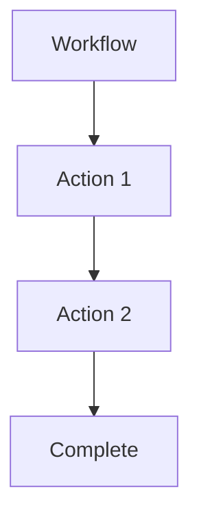

# 🚀 Quick Start - Работа с документацией Nebula

Добро пожаловать! Это руководство поможет вам начать эффективно работать с документацией Nebula в Obsidian.

---

## ✅ Предварительные требования

- [x] Установлен [Obsidian](https://obsidian.md/)
- [x] Открыт vault `nebula-docs`
- [x] Включены Community Plugins

---

## 📚 Шаг 1: Понять структуру документации

Документация организована по папкам:

```
nebula-docs/
├── 00-Home/          👈 ВЫ ЗДЕСЬ - Главная, навигация, гайды
├── 01-Overview/      📖 Обзор проекта, фичи, сравнения
├── 02-Crates/        📦 Техническая документация Rust crates
├── 03-Concepts/      💡 Ключевые концепции (Actions, Workflows, Security)
├── 04-Development/   🔨 Гайды для разработчиков
├── 05-API-Reference/ 📚 REST, GraphQL, WebSocket API
├── 06-Examples/      💻 Рабочие примеры кода
├── 07-Advanced/      🚀 Deployment, мониторинг, производительность
└── 08-Reference/     📋 Глоссарий, FAQ, changelog
```

---

## 🎯 Шаг 2: Настроить Obsidian плагины

### Обязательные плагины (уже установлены)

1. **Dataview** - Динамические запросы к документации
2. **Templates** / **Templater** - Шаблоны страниц
3. **Excalidraw** - Рисование диаграмм
4. **Git** - Version control
5. **Kanban** - Трекинг задач

### Настройка Templates

1. Settings → Core Plugins → **Templates** (включить)
2. Settings → Templates → **Template folder location**: `_templates`
3. Готово! Теперь `Ctrl+P` → "Insert template"

### Настройка Dataview

1. Settings → Community Plugins → Dataview → **Enable**
2. Откройте [[Documentation Dashboard]]
3. Вы увидите таблицы со статусами страниц

---

## 🗺️ Шаг 3: Навигация по документации

### Способ 1: Quick Switcher (самый быстрый)

```
Ctrl+O → напишите название страницы → Enter
```

**Примеры**:
- `Ctrl+O` → `action` → найдёт все страницы про Actions
- `Ctrl+O` → `api ref` → откроет API Reference

### Способ 2: Wikilinks (клик по ссылкам)

Все страницы связаны через `[[wikilinks]]`. Кликайте по ним!

- Наведите мышь на ссылку → preview содержимого
- Кликните → переход на страницу
- `Ctrl+Click` → открыть в новой вкладке

### Способ 3: Структура папок

Слева в File Explorer → открывайте папки по категориям

---

## 📝 Шаг 4: Создать новую страницу

### Вариант A: Использовать Template

1. `Ctrl+N` - создать новый файл
2. Дайте имя файлу (например, `HTTP Actions`)
3. `Ctrl+P` → "Insert template" → выберите шаблон:
   - **Crate Documentation** - для документации crate
   - **Concept Page** - для концепции
4. Заполните placeholders (`{{...}}`)
5. Начните писать!

### Вариант B: Создать вручную

1. `Ctrl+N` - новый файл
2. Добавьте frontmatter:

```yaml
---
title: Название страницы
tags: [category, topic]
status: draft
lang: ru
created: 2026-02-03
last_updated: 2026-02-03
---
```

3. Напишите содержимое
4. Добавьте wikilinks к связанным страницам

---

## 🔍 Шаг 5: Проверить свою работу

### Dashboard для отслеживания прогресса

Откройте [[Documentation Dashboard]] - увидите:
- ✅ Какие страницы опубликованы
- 🚧 Что в работе
- ⚠️ Что требует обновления
- 📊 Статистику по тегам, статусам, языкам

### Проверить ссылки

В правой панели → **Backlinks** → видите, кто ссылается на текущую страницу

Если backlinks пусто → страница "осиротела", добавьте ссылки на неё!

---

## 📊 Шаг 6: Использовать Kanban для планирования

Откройте [[Documentation Kanban]] для визуального трекинга задач:

```
📝 To Write → ✍️ In Progress → 👀 Review → ✅ Done
```

Drag-and-drop карточки между колонками по мере работы.

---

## 🎨 Шаг 7: Добавить диаграммы

### Mermaid (текстовые диаграммы)



Просто вставьте код в markdown - Obsidian отрендерит автоматически!

### Excalidraw (рисование от руки)

1. `Ctrl+P` → "Excalidraw: Create new drawing"
2. Нарисуйте схему
3. Сохраните (имя файла с `.excalidraw`)
4. Вставьте в документацию: `![[Diagram Name]]`

---

## ✅ Шаг 8: Следовать принципам Constitution

Прочитайте [[Constitution]] - там описаны правила документации:

✅ **Обязательно**:
- Использовать wikilinks `[[Page]]`, не markdown links
- Добавлять frontmatter с метаданными
- Связывать страницы (минимум 3 outgoing links)
- Писать исполняемые примеры кода
- Обновлять `last_updated` при изменениях

❌ **Избегать**:
- Orphan pages (без backlinks)
- Страницы без примеров кода
- Битые ссылки
- Страницы без тегов

---

## 🔥 Шаг 9: Ежедневный workflow

### Утро (5 минут)

1. Открыть [[Documentation Dashboard]]
2. Посмотреть "В работе" - что продолжить
3. Проверить "Требуют обновления" - что устарело
4. Открыть [[Documentation Kanban]] - выбрать задачу

### Работа

1. Выбрать задачу из Kanban
2. Создать/обновить страницу
3. Использовать Templates для быстроты
4. Добавить code examples
5. Связать с другими страницами через wikilinks
6. Обновить `status: draft` → `published` когда готово

### Вечер (Git commit)

Если настроен плагин Git:
- Auto-commit каждые 10 минут (автоматически)

Или вручную:
```bash
git add .
git commit -m "docs: add HTTP actions guide"
git push
```

---

## 🆘 Полезные горячие клавиши

| Клавиша | Действие |
|---------|----------|
| `Ctrl+N` | Новый файл |
| `Ctrl+O` | Quick Switcher (поиск файлов) |
| `Ctrl+P` | Command Palette (все команды) |
| `Ctrl+E` | Toggle Edit/Preview mode |
| `Ctrl+F` | Поиск в текущем файле |
| `Ctrl+Shift+F` | Глобальный поиск по vault |
| `Ctrl+Click` на `[[link]]` | Открыть в новой вкладке |
| Hover на `[[link]]` | Предпросмотр страницы |

---

## 📖 Дальнейшее изучение

### Для новичков

1. Прочитайте [[Obsidian Plugins Guide]] - детали всех плагинов
2. Изучите [[Constitution]] - принципы документации
3. Посмотрите примеры в `02-Crates/` - как выглядит хорошая документация

### Для опытных пользователей

1. Создайте свои Dataview queries в Dashboard
2. Напишите собственные Templates для специфичных случаев
3. Настройте Templater для интерактивных промптов
4. Используйте Canvas для визуализации связей между концепциями

---

## 🔗 Важные ссылки

- [[Documentation Dashboard]] - центральная панель статусов
- [[Documentation Kanban]] - трекинг задач
- [[Obsidian Plugins Guide]] - полный гайд по плагинам
- [[Constitution]] - принципы документации
- [[What is Nebula]] - начните отсюда, если новичок в проекте

---

## ❓ Частые вопросы

### Как добавить новый crate в документацию?

1. `Ctrl+N` → создать файл в `02-Crates/nebula-{{name}}/`
2. `Ctrl+P` → "Insert template" → "Crate Documentation"
3. Заполнить placeholders
4. Добавить ссылку в [[Crates Overview]]

### Как найти все страницы с определённым тегом?

```dataview
LIST
FROM #your-tag
```

Или используйте поиск: `tag:#your-tag`

### Как проверить битые ссылки?

`Ctrl+P` → "Check for broken links" (если установлен соответствующий плагин)

Или вручную: смотрите на wikilinks с серым цветом - они битые.

### Как экспортировать документацию в PDF?

`Ctrl+P` → "Export to PDF"

---

## 🎉 Готово!

Теперь вы готовы эффективно работать с документацией Nebula в Obsidian!

**Следующий шаг**: Откройте [[Documentation Dashboard]] и выберите страницу для работы.

---

*Последнее обновление: 2026-02-03*  
*Есть вопросы? Создайте issue на GitHub или обновите эту страницу.*
