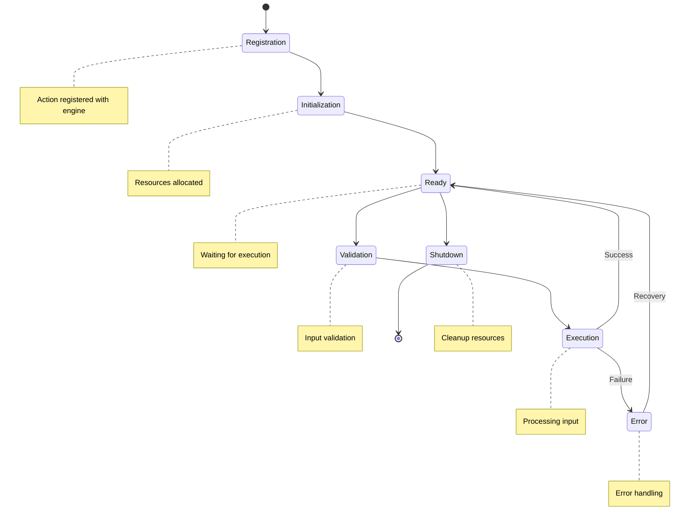
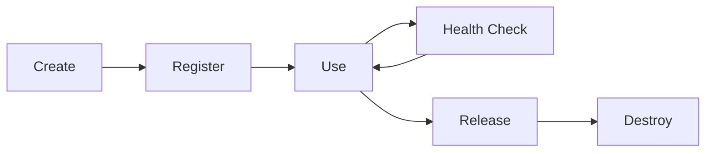

# Action Lifecycle

## Overview

Every action in Nebula follows a well-defined lifecycle from registration to destruction. Understanding this lifecycle is crucial for proper resource management and error handling.

## Lifecycle Phases



## Phase Details

### 1. Registration Phase

**When**: Action is registered with the workflow engine

**What Happens**:

- Action metadata is validated
- Action is added to the registry
- Dependencies are checked
- Parameters schema is registered

**Code Example**:

```rust
// Registration with the engine
let registry = ActionRegistry::new();
registry.register::<MyAction>("my_action")?;

// Or with factory pattern
registry.register_factory(
    "my_action",
    Box::new(MyActionFactory::new())
)?;
```

**Hooks Available**:

- `validate_metadata()` - Validate action metadata
- `check_dependencies()` - Verify required dependencies

---

### 2. Initialization Phase

**When**: Action instance is created for first use

**What Happens**:

- Resources are allocated
- Connections are established
- Configuration is loaded
- Internal state is initialized

**Code Example**:

```rust
impl Action for MyAction {
    async fn initialize(&self, context: &InitContext) -> Result<(), ActionError> {
        // Allocate resources
        self.client = HttpClient::new()?;
        
        // Establish connections
        self.db_pool = create_pool(&context.config).await?;
        
        // Load configuration
        self.settings = load_settings()?;
        
        // Initialize internal state
        self.cache = Cache::new(1000);
        
        Ok(())
    }
}
```

**Best Practices**:

- ✅ Fail fast if resources unavailable
- ✅ Log initialization steps
- ✅ Set up monitoring/metrics
- ❌ Don't perform heavy computation
- ❌ Don't start background tasks yet

---

### 3. Ready Phase

**When**: Action is initialized and waiting for execution

**What Happens**:

- Action is idle
- Health checks may run
- Metrics are collected
- Ready for execution requests

**Health Checking**:

```rust
impl Action for MyAction {
    async fn health_check(&self) -> Result<HealthStatus, ActionError> {
        // Check database connection
        if !self.db_pool.is_healthy().await {
            return Ok(HealthStatus::Unhealthy {
                reason: "Database connection lost".to_string(),
                recoverable: true,
            });
        }
        
        // Check external service
        if !self.check_external_service().await {
            return Ok(HealthStatus::Degraded {
                reason: "External service slow".to_string(),
            });
        }
        
        Ok(HealthStatus::Healthy)
    }
}
```

---

### 4. Validation Phase

**When**: Before each execution

**What Happens**:

- Input parameters are validated
- Preconditions are checked
- Resources availability verified
- Rate limits checked

**Code Example**:

```rust
impl ProcessAction for MyAction {
    async fn validate_input(
        &self,
        input: &Self::Input,
        context: &ExecutionContext,
    ) -> Result<(), ValidationError> {
        // Validate required fields
        if input.name.is_empty() {
            return Err(ValidationError::Required {
                field: "name".to_string(),
            });
        }
        
        // Validate formats
        if !is_valid_email(&input.email) {
            return Err(ValidationError::Format {
                field: "email".to_string(),
                expected: "valid email address".to_string(),
            });
        }
        
        // Check business rules
        if input.amount > self.max_amount {
            return Err(ValidationError::BusinessRule {
                rule: "amount_limit".to_string(),
                message: format!("Amount exceeds limit of {}", self.max_amount),
            });
        }
        
        Ok(())
    }
}
```

---

### 5. Execution Phase

**When**: Processing input to produce output

**What Happens**:

- Pre-execution hooks run
- Main execution logic runs
- Post-execution hooks run
- Result is returned

**Execution Flow**:

```rust
impl ProcessAction for MyAction {
    async fn execute(
        &self,
        input: Self::Input,
        context: &ExecutionContext,
    ) -> Result<ActionResult<Self::Output>, ActionError> {
        // Pre-execution hook
        self.before_execute(&input, context).await?;
        
        // Main execution
        let result = self.process(input, context).await?;
        
        // Post-execution hook
        self.after_execute(&result, context).await?;
        
        Ok(ActionResult::Success(result))
    }
}
```

**Execution Context**:

```rust
// Available during execution
context.execution_id()     // Unique execution ID
context.node_id()          // Current node ID
context.workflow_id()      // Parent workflow ID
context.is_cancelled()     // Check cancellation
context.deadline()         // Execution deadline
```

---

### 6. Error Phase

**When**: Execution fails or errors occur

**What Happens**:

- Error is captured and logged
- Recovery attempted if possible
- Retry scheduled if appropriate
- Compensation executed if needed

**Error Handling**:

```rust
impl ProcessAction for MyAction {
    async fn handle_error(
        &self,
        error: ActionError,
        context: &ExecutionContext,
    ) -> Result<ErrorRecovery, ActionError> {
        match error {
            // Retry transient errors
            ActionError::NetworkError(e) => {
                Ok(ErrorRecovery::Retry {
                    after: Duration::from_secs(5),
                    max_attempts: 3,
                })
            }
            
            // Skip and continue on specific errors
            ActionError::NotFound => {
                Ok(ErrorRecovery::Skip {
                    reason: "Resource not found".to_string(),
                })
            }
            
            // Compensate for partial failures
            ActionError::PartialFailure { completed, failed } => {
                self.compensate(completed).await?;
                Ok(ErrorRecovery::Compensated)
            }
            
            // Propagate unrecoverable errors
            _ => Err(error),
        }
    }
}
```

---

### 7. Shutdown Phase

**When**: Action is being removed or system shutting down

**What Happens**:

- Graceful shutdown initiated
- Current executions complete
- Resources are released
- Connections are closed
- Final metrics are flushed

**Code Example**:

```rust
impl Action for MyAction {
    async fn shutdown(&self, context: &ShutdownContext) -> Result<(), ActionError> {
        // Signal shutdown to background tasks
        self.shutdown_signal.send(()).await?;
        
        // Wait for current operations with timeout
        let timeout = context.grace_period();
        tokio::time::timeout(timeout, async {
            while self.active_operations() > 0 {
                tokio::time::sleep(Duration::from_millis(100)).await;
            }
        }).await?;
        
        // Close connections
        self.db_pool.close().await;
        
        // Flush metrics
        self.metrics.flush().await?;
        
        // Release resources
        self.cleanup_resources().await?;
        
        Ok(())
    }
}
```

## Lifecycle Hooks

### Available Hooks

|Hook|Phase|Purpose|Required|
|---|---|---|---|
|`validate_metadata()`|Registration|Validate action metadata|No|
|`initialize()`|Initialization|Set up resources|No|
|`health_check()`|Ready|Check action health|No|
|`validate_input()`|Validation|Validate input|No|
|`before_execute()`|Execution|Pre-processing|No|
|`execute()`|Execution|Main logic|**Yes**|
|`after_execute()`|Execution|Post-processing|No|
|`handle_error()`|Error|Error recovery|No|
|`shutdown()`|Shutdown|Cleanup|No|

### Hook Implementation

```rust
#[async_trait]
impl ActionLifecycle for MyAction {
    async fn initialize(&self, context: &InitContext) -> Result<(), ActionError> {
        // Optional: Set up resources
        Ok(())
    }
    
    async fn before_execute(
        &self,
        input: &Self::Input,
        context: &ExecutionContext,
    ) -> Result<(), ActionError> {
        // Optional: Pre-processing
        context.log_info("Starting execution");
        Ok(())
    }
    
    async fn after_execute(
        &self,
        result: &ActionResult<Self::Output>,
        context: &ExecutionContext,
    ) -> Result<(), ActionError> {
        // Optional: Post-processing
        context.record_metric("execution_complete", 1.0, &[]);
        Ok(())
    }
    
    async fn shutdown(&self, context: &ShutdownContext) -> Result<(), ActionError> {
        // Optional: Cleanup
        Ok(())
    }
}
```

## State Management

### Stateless Actions

```rust
// ProcessAction - no state between executions
impl ProcessAction for StatelessAction {
    async fn execute(&self, input: Input, context: &ExecutionContext) 
        -> Result<ActionResult<Output>, ActionError> {
        // Each execution is independent
        let result = process(input);
        Ok(ActionResult::Success(result))
    }
}
```

### Stateful Actions

```rust
// StatefulAction - maintains state
impl StatefulAction for StatefulCounter {
    type State = CounterState;
    
    async fn load_state(&self, context: &ExecutionContext) 
        -> Result<Self::State, ActionError> {
        // Load from persistent storage
        context.get_state::<Self::State>().await
    }
    
    async fn save_state(
        &self,
        state: &Self::State,
        context: &ExecutionContext,
    ) -> Result<(), ActionError> {
        // Save to persistent storage
        context.set_state(state).await
    }
    
    async fn execute_with_state(
        &self,
        input: Input,
        state: &mut Self::State,
        context: &ExecutionContext,
    ) -> Result<ActionResult<Output>, ActionError> {
        // Modify state
        state.count += input.increment;
        
        // Return result
        Ok(ActionResult::Success(Output {
            current_count: state.count,
        }))
    }
}
```

## Resource Management

### Resource Allocation

```rust
impl SupplyAction for ResourceSupplier {
    type Resource = DatabasePool;
    
    async fn create(
        &self,
        config: Config,
        context: &ExecutionContext,
    ) -> Result<Self::Resource, ActionError> {
        // Create expensive resource once
        let pool = DatabasePool::new(config).await?;
        
        // Register for cleanup
        context.register_resource(pool.clone());
        
        Ok(pool)
    }
    
    async fn destroy(&self, resource: Self::Resource) -> Result<(), ActionError> {
        // Clean up resource
        resource.close().await;
        Ok(())
    }
}
```

### Resource Lifecycle



## Concurrency and Parallelism

### Concurrent Execution

```rust
impl ProcessAction for ConcurrentAction {
    async fn execute(&self, input: Input, context: &ExecutionContext) 
        -> Result<ActionResult<Output>, ActionError> {
        // Execute multiple operations concurrently
        let (result1, result2, result3) = tokio::join!(
            self.operation1(&input),
            self.operation2(&input),
            self.operation3(&input),
        );
        
        // Combine results
        Ok(ActionResult::Success(Output {
            data: combine(result1?, result2?, result3?),
        }))
    }
}
```

### Parallel Actions

```rust
// Return parallel execution request
Ok(ActionResult::Parallel {
    results: vec![
        (node_id_1, ActionResult::Success(output1)),
        (node_id_2, ActionResult::Success(output2)),
    ],
    aggregation: AggregationStrategy::All,
    partial_failure_ok: false,
})
```

## Monitoring and Observability

### Metrics Collection

```rust
impl Action for MonitoredAction {
    async fn execute(&self, input: Input, context: &ExecutionContext) 
        -> Result<ActionResult<Output>, ActionError> {
        // Start timer
        let timer = context.start_timer("action_duration");
        
        // Record input metrics
        context.record_metric("input_size", input.size() as f64, &[
            ("action", self.metadata().id),
        ]);
        
        // Execute
        let result = self.process(input).await?;
        
        // Stop timer and record
        timer.stop_and_record();
        
        // Record output metrics
        context.record_metric("output_size", result.size() as f64, &[
            ("action", self.metadata().id),
            ("status", "success"),
        ]);
        
        Ok(ActionResult::Success(result))
    }
}
```

### Logging

```rust
// Structured logging throughout lifecycle
context.log_info("Action initialized");
context.log_debug(&format!("Processing input: {:?}", input));
context.log_warning("Retry attempt 2 of 3");
context.log_error(&format!("Failed: {}", error));
```

## Best Practices

### Initialization

- ✅ Validate configuration early
- ✅ Fail fast on missing dependencies
- ✅ Set up monitoring/metrics
- ✅ Log initialization steps

### Execution

- ✅ Check cancellation regularly
- ✅ Respect timeouts
- ✅ Handle errors gracefully
- ✅ Clean up on failure

### Shutdown

- ✅ Implement graceful shutdown
- ✅ Wait for active operations
- ✅ Release all resources
- ✅ Flush metrics/logs

### Resource Management

- ✅ Use resource pools
- ✅ Implement health checks
- ✅ Handle connection failures
- ✅ Clean up on errors

## Common Patterns

### Retry Pattern

```rust
impl ProcessAction for RetryableAction {
    async fn execute(&self, input: Input, context: &ExecutionContext) 
        -> Result<ActionResult<Output>, ActionError> {
        match self.try_operation(input).await {
            Ok(output) => Ok(ActionResult::Success(output)),
            Err(e) if e.is_transient() => {
                Ok(ActionResult::Retry {
                    after: Duration::from_secs(5),
                    reason: e.to_string(),
                })
            }
            Err(e) => Err(e.into()),
        }
    }
}
```

### Circuit Breaker Pattern

```rust
struct CircuitBreakerAction {
    circuit_breaker: CircuitBreaker,
}

impl ProcessAction for CircuitBreakerAction {
    async fn execute(&self, input: Input, context: &ExecutionContext) 
        -> Result<ActionResult<Output>, ActionError> {
        if self.circuit_breaker.is_open() {
            return Ok(ActionResult::Skip {
                reason: "Circuit breaker open".to_string(),
            });
        }
        
        match self.try_operation(input).await {
            Ok(output) => {
                self.circuit_breaker.on_success();
                Ok(ActionResult::Success(output))
            }
            Err(e) => {
                self.circuit_breaker.on_failure();
                Err(e)
            }
        }
    }
}
```

## Related Documentation

- [[Action Types]] - Different types of actions
- [[Error Model]] - Error handling strategies
- [[Action Result System]] - Control flow results
- [[Development Approaches]] - Creating actions