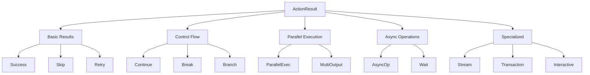
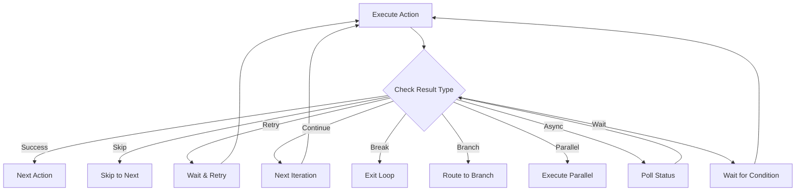

# Action Result System

## Overview

The ActionResult system provides fine-grained control over workflow execution flow. Instead of simple success/failure, actions can return rich results that direct the workflow engine's behavior.

## Result Types



## Basic Results

### Success

**Purpose**: Indicate successful completion with output

```rust
Ok(ActionResult::Success(output))
```

**When to Use**:

- ✅ Operation completed successfully
- ✅ Have output to return
- ✅ Ready for next action

**Example**:

```rust
async fn execute(&self, input: Input, context: &ExecutionContext) 
    -> Result<ActionResult<Output>, ActionError> {
    let processed = self.process_data(input)?;
    Ok(ActionResult::Success(processed))
}
```

---

### Skip

**Purpose**: Skip execution with a reason

```rust
Ok(ActionResult::Skip {
    reason: String,
})
```

**When to Use**:

- ✅ Conditions not met
- ✅ Already processed (idempotency)
- ✅ Not applicable for current context

**Example**:

```rust
if already_processed(&input) {
    return Ok(ActionResult::Skip {
        reason: "Already processed this input".to_string(),
    });
}
```

---

### Retry

**Purpose**: Request retry after delay

```rust
Ok(ActionResult::Retry {
    after: Duration,
    reason: String,
})
```

**When to Use**:

- ✅ Transient failures
- ✅ Rate limiting
- ✅ Temporary resource unavailability

**Example**:

```rust
match external_api_call().await {
    Err(ApiError::RateLimited) => {
        Ok(ActionResult::Retry {
            after: Duration::from_secs(60),
            reason: "Rate limited, retry in 1 minute".to_string(),
        })
    }
    // ...
}
```

## Control Flow Results

### Continue

**Purpose**: Continue loop execution with progress

```rust
Ok(ActionResult::Continue {
    output: T,
    progress: LoopProgress,
    delay: Option<Duration>,
})
```

**Fields**:

- `output`: Current iteration output
- `progress`: Loop progress information
- `delay`: Optional delay before next iteration

**LoopProgress Structure**:

```rust
pub struct LoopProgress {
    pub current_iteration: usize,
    pub total_items: Option<usize>,
    pub processed_items: usize,
    pub percentage: Option<f32>,
    pub estimated_time_remaining: Option<Duration>,
    pub status_message: Option<String>,
}
```

**Example**:

```rust
// Processing paginated data
Ok(ActionResult::Continue {
    output: page_data,
    progress: LoopProgress {
        current_iteration: page_num,
        total_items: Some(total_pages),
        processed_items: items_processed,
        percentage: Some((page_num as f32 / total_pages as f32) * 100.0),
        estimated_time_remaining: Some(Duration::from_secs(remaining_secs)),
        status_message: Some(format!("Processing page {} of {}", page_num, total_pages)),
    },
    delay: Some(Duration::from_millis(100)), // Rate limiting
})
```

---

### Break

**Purpose**: Break from loop with final output

```rust
Ok(ActionResult::Break {
    output: T,
    reason: BreakReason,
})
```

**BreakReason Variants**:

```rust
pub enum BreakReason {
    Completed,                           // Normal completion
    ConditionMet { condition: String },  // Specific condition met
    MaxIterationsReached { limit: usize }, // Hit iteration limit
    Timeout,                             // Operation timed out
    Error { message: String },           // Error occurred
    UserRequested,                       // User cancelled
}
```

**Example**:

```rust
if all_items_processed {
    Ok(ActionResult::Break {
        output: final_result,
        reason: BreakReason::Completed,
    })
} else if iterations > MAX_ITERATIONS {
    Ok(ActionResult::Break {
        output: partial_result,
        reason: BreakReason::MaxIterationsReached { limit: MAX_ITERATIONS },
    })
}
```

---

### Branch

**Purpose**: Direct workflow to specific branch

```rust
Ok(ActionResult::Branch {
    branch: BranchSelection,
    output: T,
    decision_metadata: Option<Value>,
})
```

**BranchSelection Types**:

```rust
pub enum BranchSelection {
    // Single choice
    Choice { selected: String },
    
    // Multiple parallel branches
    Multiple { branches: Vec<String> },
    
    // Conditional with fallback
    Conditional {
        primary: String,
        fallback: Option<String>,
    },
    
    // Weighted random selection
    WeightedRandom {
        weights: HashMap<String, f32>,
    },
}
```

**Example**:

```rust
// Route based on data type
let branch = match input.data_type {
    DataType::Image => "image_processing",
    DataType::Video => "video_processing",
    DataType::Text => "text_processing",
};

Ok(ActionResult::Branch {
    branch: BranchSelection::Choice { 
        selected: branch.to_string() 
    },
    output: preprocessed_data,
    decision_metadata: Some(json!({
        "data_type": input.data_type,
        "size": input.size,
        "timestamp": Utc::now(),
    })),
})
```

## Parallel Execution Results

### Parallel

**Purpose**: Execute multiple actions in parallel

```rust
Ok(ActionResult::Parallel {
    results: Vec<(NodeId, ActionResult<T>)>,
    aggregation: AggregationStrategy,
    partial_failure_ok: bool,
})
```

**AggregationStrategy Options**:

```rust
pub enum AggregationStrategy {
    All,              // All must succeed
    Any,              // At least one must succeed
    Majority,         // Majority must succeed
    Custom(Box<dyn Fn(Vec<Result<T, E>>) -> Result<T, E>>),
}
```

**Example**:

```rust
// Fetch from multiple sources in parallel
Ok(ActionResult::Parallel {
    results: vec![
        ("fetch_db", ActionResult::Success(db_data)),
        ("fetch_api", ActionResult::Success(api_data)),
        ("fetch_cache", ActionResult::Success(cache_data)),
    ],
    aggregation: AggregationStrategy::Any,
    partial_failure_ok: true,
})
```

---

### MultiOutput

**Purpose**: Send different outputs to different ports

```rust
Ok(ActionResult::MultiOutput(HashMap<PortKey, T>))
```

**Example**:

```rust
// Split data to different processing pipelines
let mut outputs = HashMap::new();
outputs.insert("valid_records", valid_data);
outputs.insert("invalid_records", invalid_data);
outputs.insert("statistics", stats);

Ok(ActionResult::MultiOutput(outputs))
```

## Async Operation Results

### AsyncOperation

**Purpose**: Start long-running async operation

```rust
Ok(ActionResult::AsyncOperation {
    operation_id: String,
    estimated_duration: Duration,
    poll_interval: Duration,
    initial_status: T,
})
```

**Use Cases**:

- Long-running jobs
- External async APIs
- Batch processing
- File uploads/downloads

**Example**:

```rust
// Start video encoding job
let job_id = start_encoding_job(input).await?;

Ok(ActionResult::AsyncOperation {
    operation_id: job_id,
    estimated_duration: Duration::from_secs(300),
    poll_interval: Duration::from_secs(10),
    initial_status: EncodingStatus {
        state: "started",
        progress: 0.0,
        eta: Some(300),
    },
})
```

---

### Wait

**Purpose**: Wait for condition before continuing

```rust
Ok(ActionResult::Wait {
    wait_condition: WaitCondition,
    timeout: Option<Duration>,
    partial_output: Option<T>,
})
```

**WaitCondition Types**:

```rust
pub enum WaitCondition {
    Time(Duration),                    // Wait for duration
    Until(DateTime<Utc>),             // Wait until timestamp
    Event { event_type: String },      // Wait for event
    Resource { resource_id: String },  // Wait for resource
    Signal { signal_name: String },    // Wait for signal
    Custom(Box<dyn Fn() -> bool>),    // Custom condition
}
```

**Example**:

```rust
// Wait for file to be ready
Ok(ActionResult::Wait {
    wait_condition: WaitCondition::Resource {
        resource_id: "uploaded_file_123".to_string(),
    },
    timeout: Some(Duration::from_secs(60)),
    partial_output: Some(UploadStatus {
        file_id: "123",
        state: "waiting",
    }),
})
```

## Specialized Results

### StreamItem

**Purpose**: Emit item in stream processing

```rust
Ok(ActionResult::StreamItem {
    output: T,
    stream_metadata: StreamMetadata,
    side_outputs: Option<HashMap<String, T>>,
})
```

**StreamMetadata**:

```rust
pub struct StreamMetadata {
    pub sequence_number: u64,
    pub timestamp: DateTime<Utc>,
    pub partition_key: Option<String>,
    pub is_last: bool,
    pub window_id: Option<String>,
}
```

**Example**:

```rust
// Process stream item
Ok(ActionResult::StreamItem {
    output: processed_event,
    stream_metadata: StreamMetadata {
        sequence_number: seq_num,
        timestamp: Utc::now(),
        partition_key: Some(event.user_id.clone()),
        is_last: false,
        window_id: Some(current_window_id),
    },
    side_outputs: Some(hashmap! {
        "metrics" => event_metrics,
        "errors" => validation_errors,
    }),
})
```

---

### TransactionPrepared

**Purpose**: Prepare phase of 2PC transaction

```rust
Ok(ActionResult::TransactionPrepared {
    transaction_id: String,
    rollback_data: T,
    vote: TransactionVote,
    expires_at: DateTime<Utc>,
})
```

**TransactionVote**:

```rust
pub enum TransactionVote {
    Commit,    // Ready to commit
    Abort,     // Must abort
    Uncertain, // Need more information
}
```

---

### InteractionRequired

**Purpose**: Request user interaction

```rust
Ok(ActionResult::InteractionRequired {
    interaction_request: InteractionRequest,
    state_output: T,
    response_timeout: Duration,
})
```

## Result Combinators

### Chaining Results

```rust
// Chain multiple results
let result = action1.execute(input, context).await?
    .and_then(|output| action2.execute(output, context))
    .map(|output| transform(output));
```

### Result Transformation

```rust
// Transform result output
impl ActionResult<T> {
    pub fn map<U, F>(self, f: F) -> ActionResult<U>
    where
        F: FnOnce(T) -> U,
    {
        match self {
            ActionResult::Success(output) => ActionResult::Success(f(output)),
            // Handle other variants...
        }
    }
}
```

## Decision Flow



## Best Practices

### Result Selection

1. **Use the most specific result type**
    
    - Don't use generic Success when Branch is more appropriate
    - Provide rich metadata for debugging
2. **Include context in results**
    
    ```rust
    Ok(ActionResult::Skip {
        reason: format!("User {} already exists with email {}", 
                       user_id, email),
    })
    ```
    
3. **Handle all result types in workflow**
    
    ```rust
    match action.execute(input, context).await? {
        ActionResult::Success(output) => process_output(output),
        ActionResult::Skip { reason } => log_skip(reason),
        ActionResult::Retry { after, .. } => schedule_retry(after),
        // Handle all variants
    }
    ```
    

### Progress Reporting

```rust
// Good: Detailed progress information
Ok(ActionResult::Continue {
    output: batch_result,
    progress: LoopProgress {
        current_iteration: batch_num,
        total_items: Some(total_batches),
        processed_items: records_processed,
        percentage: Some(progress_pct),
        estimated_time_remaining: Some(eta),
        status_message: Some(format!(
            "Processing batch {}/{}: {} records/sec",
            batch_num, total_batches, throughput
        )),
    },
    delay: None,
})

// Bad: Minimal progress
Ok(ActionResult::Continue {
    output: result,
    progress: LoopProgress::default(),
    delay: None,
})
```

### Error Recovery

```rust
// Use appropriate result for recoverable errors
match operation().await {
    Ok(data) => Ok(ActionResult::Success(data)),
    Err(e) if e.is_transient() => {
        Ok(ActionResult::Retry {
            after: calculate_backoff(),
            reason: e.to_string(),
        })
    },
    Err(e) if e.is_not_found() => {
        Ok(ActionResult::Skip {
            reason: format!("Resource not found: {}", e),
        })
    },
    Err(e) => Err(e.into()),
}
```

## Testing Results

```rust
#[cfg(test)]
mod tests {
    use super::*;
    
    #[test]
    fn test_result_patterns() {
        // Test success path
        let result = ActionResult::Success(42);
        assert!(matches!(result, ActionResult::Success(42)));
        
        // Test branch selection
        let result = ActionResult::Branch {
            branch: BranchSelection::Choice { 
                selected: "path_a".to_string() 
            },
            output: "data",
            decision_metadata: None,
        };
        
        if let ActionResult::Branch { branch, .. } = result {
            assert_eq!(
                branch,
                BranchSelection::Choice { 
                    selected: "path_a".to_string() 
                }
            );
        }
    }
}
```

## Related Documentation

- [[Action Types]] - Different action types
- [[Action Lifecycle]] - Execution lifecycle
- [[Error Model]] - Error handling
- [[Examples]] - Practical examples
