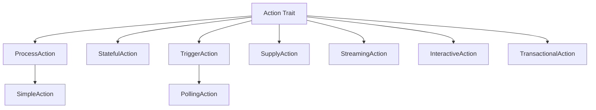
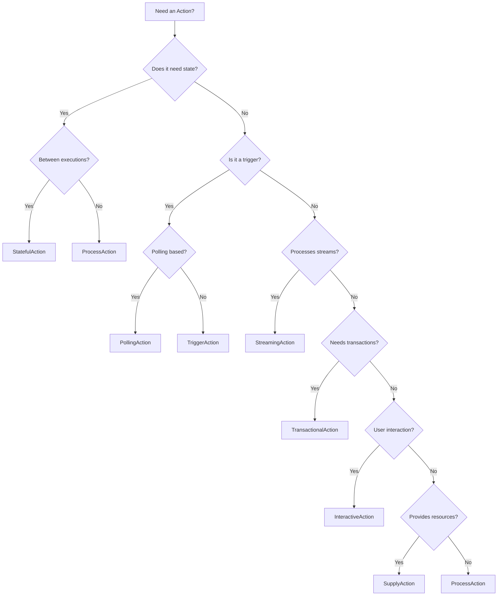

# Action Types

## Overview

Nebula supports multiple action types, each designed for specific use cases. All action types extend the base `Action` trait and provide specialized functionality.

## Type Hierarchy



## Core Action Types

### ProcessAction

**Purpose**: Stateless data processing and transformation

**Use Cases**:

- Data transformation
- API calls
- Calculations
- Format conversion
- Validation

**Key Features**:

- No state between executions
- Pure input → output transformation
- Simple to test and reason about

**Example**:

```rust
#[async_trait]
impl ProcessAction for DataTransformer {
    type Input = RawData;
    type Output = ProcessedData;
    
    async fn execute(&self, input: Self::Input, context: &ExecutionContext) 
        -> Result<ActionResult<Self::Output>, ActionError> {
        let processed = transform(input);
        Ok(ActionResult::Success(processed))
    }
}
```

**When to Use**:

- ✅ Simple data transformations
- ✅ Stateless API calls
- ✅ Calculations and validations
- ❌ Need to remember previous executions
- ❌ Long-running operations with checkpoints

---

### StatefulAction

**Purpose**: Actions that maintain state between executions

**Use Cases**:

- Counters and accumulators
- Progress tracking
- Session management
- Iterative processing
- Batch processing with checkpoints

**Key Features**:

- Persistent state storage
- State migration support
- Automatic state recovery
- Loop control (continue/break)

**Example**:

```rust
#[async_trait]
impl StatefulAction for BatchProcessor {
    type State = ProcessingState;
    type Input = BatchInput;
    type Output = BatchOutput;
    
    async fn execute_with_state(
        &self,
        input: Self::Input,
        state: &mut Self::State,
        context: &ExecutionContext,
    ) -> Result<ActionResult<Self::Output>, ActionError> {
        state.items_processed += input.items.len();
        
        if state.items_processed >= state.total_items {
            Ok(ActionResult::Break { 
                output: create_output(state),
                reason: BreakReason::Completed 
            })
        } else {
            Ok(ActionResult::Continue {
                output: create_output(state),
                progress: calculate_progress(state),
                delay: None,
            })
        }
    }
}
```

**When to Use**:

- ✅ Iterative processing
- ✅ Need to track progress
- ✅ Batch operations with resume capability
- ✅ Accumulating results over time
- ❌ Simple one-time transformations

---

### TriggerAction

**Purpose**: Event sources that initiate workflows

**Use Cases**:

- Webhook endpoints
- Message queue consumers
- File watchers
- Schedule triggers
- Database change streams

**Key Features**:

- Async event streaming
- Backpressure handling
- Error recovery
- Graceful shutdown

**Example**:

```rust
#[async_trait]
impl TriggerAction for WebhookTrigger {
    type Config = WebhookConfig;
    type Event = HttpRequest;
    
    async fn start(
        &self,
        config: Self::Config,
        context: &TriggerContext,
    ) -> Result<TriggerEventStream<Self::Event>, ActionError> {
        let server = start_http_server(config).await?;
        let stream = create_request_stream(server);
        Ok(Box::pin(stream))
    }
}
```

**When to Use**:

- ✅ External event sources
- ✅ Workflow initiation points
- ✅ Real-time data ingestion
- ❌ Data transformation
- ❌ One-time operations

---

### SupplyAction

**Purpose**: Provide long-lived resources to other actions

**Use Cases**:

- Database connection pools
- HTTP clients
- Cache connections
- File handles
- External service clients

**Key Features**:

- Resource lifecycle management
- Health checking
- Automatic cleanup
- Resource pooling

**Example**:

```rust
#[async_trait]
impl SupplyAction for DatabaseSupplier {
    type Config = DatabaseConfig;
    type Resource = PgPool;
    
    async fn create(
        &self,
        config: Self::Config,
        context: &ExecutionContext,
    ) -> Result<Self::Resource, ActionError> {
        let pool = PgPoolOptions::new()
            .max_connections(config.max_connections)
            .connect(&config.url)
            .await?;
        Ok(pool)
    }
    
    async fn health_check(&self, resource: &Self::Resource) 
        -> Result<HealthStatus, ActionError> {
        match resource.acquire().await {
            Ok(_) => Ok(HealthStatus::Healthy),
            Err(e) => Ok(HealthStatus::Unhealthy { 
                reason: e.to_string(),
                recoverable: true 
            }),
        }
    }
}
```

**When to Use**:

- ✅ Expensive resource initialization
- ✅ Connection pooling
- ✅ Shared resources across actions
- ❌ Simple data processing
- ❌ Short-lived operations

---

### StreamingAction

**Purpose**: Process continuous data streams

**Use Cases**:

- Real-time data processing
- Log streaming
- Event stream processing
- Live data transformation
- Windowed aggregations

**Key Features**:

- Backpressure support
- Windowing operations
- Watermark handling
- Side outputs

**Example**:

```rust
#[async_trait]
impl StreamingAction for StreamProcessor {
    type Input = DataStream;
    type Output = ProcessedStream;
    type Config = StreamConfig;
    
    async fn process_stream(
        &self,
        input: Self::Input,
        config: Self::Config,
        context: &StreamContext,
    ) -> Result<Self::Output, ActionError> {
        let processed = input
            .window(config.window_size)
            .aggregate(|window| process_window(window))
            .filter(|item| item.is_valid());
        Ok(processed)
    }
}
```

**When to Use**:

- ✅ Continuous data flows
- ✅ Real-time processing
- ✅ Event stream processing
- ❌ Batch operations
- ❌ Request-response patterns

---

### InteractiveAction

**Purpose**: Handle user interactions and approvals

**Use Cases**:

- User approvals
- Form submissions
- Multi-step wizards
- Manual interventions
- Human-in-the-loop workflows

**Key Features**:

- Interaction requests
- Response validation
- Timeout handling
- UI metadata

**Example**:

```rust
#[async_trait]
impl InteractiveAction for ApprovalAction {
    type Request = ApprovalRequest;
    type Response = ApprovalResponse;
    
    async fn create_interaction(
        &self,
        context: &ExecutionContext,
    ) -> Result<InteractionRequest, ActionError> {
        Ok(InteractionRequest {
            prompt: "Please approve this action".to_string(),
            form_fields: vec![
                FormField::checkbox("approve", "I approve"),
                FormField::text("comments", "Comments"),
            ],
            timeout: Duration::from_hours(24),
        })
    }
    
    async fn process_response(
        &self,
        response: Self::Response,
        context: &ExecutionContext,
    ) -> Result<ActionResult<bool>, ActionError> {
        Ok(ActionResult::Success(response.approved))
    }
}
```

**When to Use**:

- ✅ Human approvals needed
- ✅ User input required
- ✅ Manual intervention points
- ❌ Fully automated processes
- ❌ High-frequency operations

---

### TransactionalAction

**Purpose**: Execute operations with ACID guarantees

**Use Cases**:

- Financial transactions
- Multi-database operations
- Distributed transactions
- Saga patterns
- Compensating transactions

**Key Features**:

- Two-phase commit
- Rollback support
- Compensation logic
- Distributed coordination

**Example**:

```rust
#[async_trait]
impl TransactionalAction for PaymentAction {
    type Input = PaymentRequest;
    type Output = PaymentResult;
    
    async fn prepare(
        &self,
        input: Self::Input,
        context: &TransactionContext,
    ) -> Result<TransactionVote, ActionError> {
        // Validate and prepare
        if self.can_process_payment(&input).await? {
            Ok(TransactionVote::Commit)
        } else {
            Ok(TransactionVote::Abort)
        }
    }
    
    async fn commit(
        &self,
        input: Self::Input,
        context: &TransactionContext,
    ) -> Result<Self::Output, ActionError> {
        // Execute the transaction
        let result = self.process_payment(input).await?;
        Ok(result)
    }
    
    async fn rollback(
        &self,
        input: Self::Input,
        context: &TransactionContext,
    ) -> Result<(), ActionError> {
        // Compensate if needed
        self.reverse_payment(input).await?;
        Ok(())
    }
}
```

**When to Use**:

- ✅ Multi-step operations requiring atomicity
- ✅ Financial transactions
- ✅ Distributed operations
- ❌ Simple read operations
- ❌ Best-effort processing

## Specialized Action Types

### PollingAction

**Extends**: TriggerAction

**Purpose**: Periodically check for changes or new data

**Use Cases**:

- API polling
- File system monitoring
- Database polling
- Status checking

---

### SimpleAction

**Extends**: ProcessAction

**Purpose**: Simplified API for basic actions

**Use Cases**:

- Quick prototypes
- Simple transformations
- Learning examples

## Choosing the Right Action Type

### Decision Tree



### Comparison Table

|Action Type|State|Async|Streaming|User Input|Transactions|Use Case|
|---|---|---|---|---|---|---|
|ProcessAction|❌|✅|❌|❌|❌|Data transformation|
|StatefulAction|✅|✅|❌|❌|❌|Iterative processing|
|TriggerAction|❌|✅|✅|❌|❌|Event sources|
|SupplyAction|❌|✅|❌|❌|❌|Resource management|
|StreamingAction|❌|✅|✅|❌|❌|Stream processing|
|InteractiveAction|✅|✅|❌|✅|❌|User interactions|
|TransactionalAction|✅|✅|❌|❌|✅|ACID operations|

## Best Practices

### General Guidelines

1. **Start Simple**: Use ProcessAction for most cases
2. **Add State When Needed**: Upgrade to StatefulAction only when necessary
3. **Separate Concerns**: Don't mix trigger logic with processing
4. **Resource Management**: Use SupplyAction for expensive resources
5. **Error Handling**: Implement proper error recovery for each type

### Performance Tips

- **ProcessAction**: Keep stateless, avoid side effects
- **StatefulAction**: Minimize state size, implement efficient migrations
- **TriggerAction**: Handle backpressure, implement graceful shutdown
- **SupplyAction**: Pool resources, implement health checks
- **StreamingAction**: Use appropriate window sizes, handle late data
- **InteractiveAction**: Set reasonable timeouts, validate responses
- **TransactionalAction**: Keep transactions short, implement compensation

## Related Documentation

- [[Action Lifecycle]] - Lifecycle hooks and management
- [[Action Result System]] - Control flow through results
- [[Custom Actions]] - Creating custom action types
- [[Examples]] - Practical examples for each type