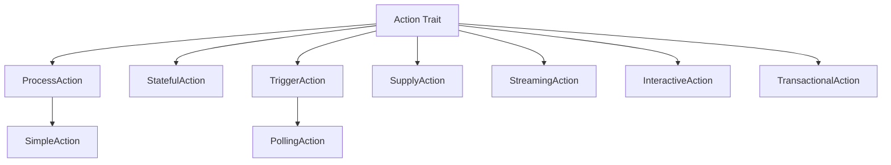
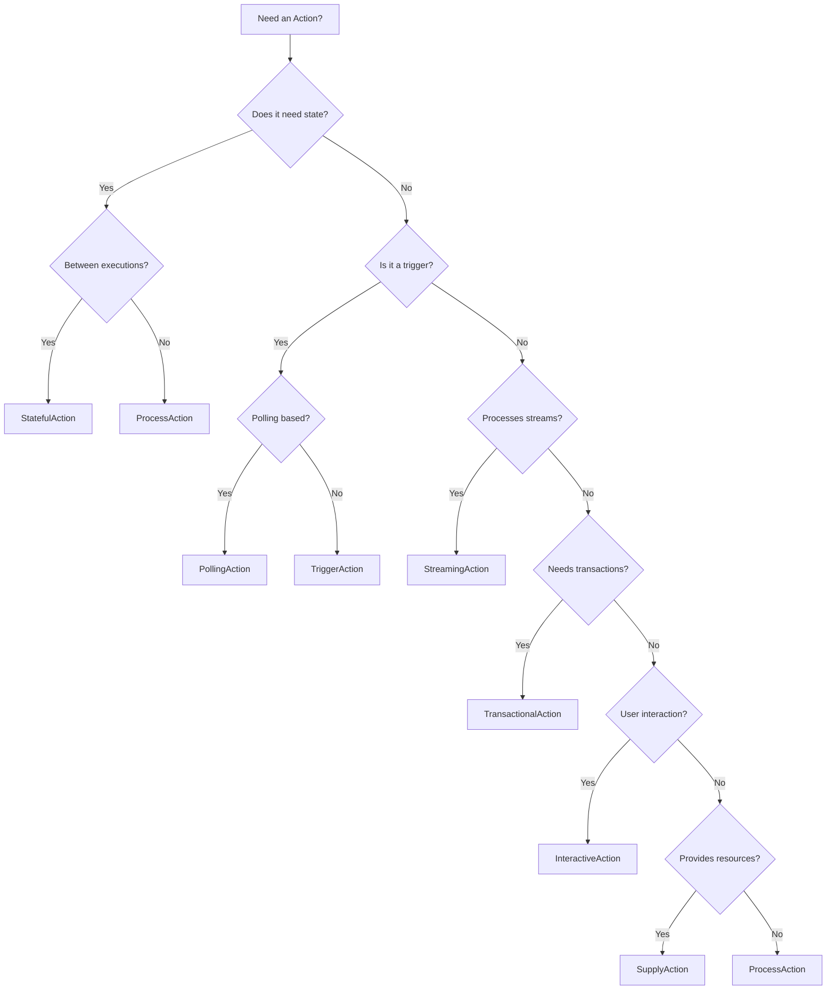

# Action Types

## Overview

Nebula provides a rich type system for actions, allowing you to model everything from simple data transformations to complex transactional workflows. Each action type extends the base `Action` trait and provides specialized functionality optimized for specific use cases.

**Key Principles**:
- **Type Safety**: Compile-time guarantees for action behavior
- **Composability**: Actions can be combined and nested
- **Extensibility**: Create custom action types for domain-specific needs
- **Performance**: Zero-cost abstractions where possible

All action types are designed to work seamlessly with Nebula's workflow engine, supporting features like error recovery, observability, and distributed execution.

## Type Hierarchy



## Core Action Types

### ProcessAction

**Purpose**: Stateless data processing and transformation

ProcessAction is the most common and straightforward action type. It represents a pure function: given an input, it produces an output without maintaining any state between executions. This makes ProcessActions easy to test, reason about, and scale horizontally.

**Use Cases**:
- Data transformation and normalization
- API calls without side effects
- Mathematical calculations
- Format conversion (JSON ↔ XML, image formats, etc.)
- Data validation and sanitization
- Content generation and templating

**Key Features**:
- **Stateless**: No state preserved between executions
- **Pure**: Same input always produces same output (when deterministic)
- **Parallelizable**: Can safely run multiple instances concurrently
- **Simple**: Easiest to test and reason about
- **Composable**: Can be chained together easily

#### Trait Definition

```rust
#[async_trait]
pub trait ProcessAction: Action {
    type Input: Send + Sync + 'static;
    type Output: Send + Sync + 'static;

    /// Execute the action with the given input
    async fn execute(
        &self,
        input: Self::Input,
        context: &ExecutionContext,
    ) -> Result<ActionResult<Self::Output>, ActionError>;

    /// Optional: Validate input before execution
    async fn validate_input(&self, input: &Self::Input) -> Result<(), ActionError> {
        Ok(())
    }

    /// Optional: Transform output before returning
    async fn transform_output(&self, output: Self::Output) -> Result<Self::Output, ActionError> {
        Ok(output)
    }
}
```

#### Complete Example: Image Transformation Service

```rust
use nebula_action::{ProcessAction, Action, ActionError, ActionResult, ExecutionContext};
use async_trait::async_trait;
use image::{DynamicImage, ImageFormat, GenericImageView};
use serde::{Deserialize, Serialize};
use tracing::{info, warn, instrument};

#[derive(Debug, Clone, Deserialize)]
pub struct ImageTransformInput {
    pub image_url: String,
    pub operations: Vec<ImageOperation>,
    pub output_format: ImageFormat,
    pub quality: Option<u8>,
}

#[derive(Debug, Clone, Deserialize)]
#[serde(tag = "type", rename_all = "snake_case")]
pub enum ImageOperation {
    Resize { width: u32, height: u32 },
    Crop { x: u32, y: u32, width: u32, height: u32 },
    Rotate { degrees: f32 },
    Grayscale,
    Blur { sigma: f32 },
}

#[derive(Debug, Serialize)]
pub struct ImageTransformOutput {
    pub processed_url: String,
    pub original_dimensions: (u32, u32),
    pub final_dimensions: (u32, u32),
    pub file_size: usize,
    pub operations_applied: usize,
}

pub struct ImageTransformAction {
    http_client: reqwest::Client,
    storage_client: Arc<dyn StorageBackend>,
    max_file_size: usize,
}

#[async_trait]
impl Action for ImageTransformAction {
    fn name(&self) -> &str {
        "image_transform"
    }

    fn description(&self) -> &str {
        "Transform images with resize, crop, rotate, and filter operations"
    }
}

#[async_trait]
impl ProcessAction for ImageTransformAction {
    type Input = ImageTransformInput;
    type Output = ImageTransformOutput;

    #[instrument(skip(self, input, context), fields(url = %input.image_url))]
    async fn execute(
        &self,
        input: Self::Input,
        context: &ExecutionContext,
    ) -> Result<ActionResult<Self::Output>, ActionError> {
        context.emit_metric("image_transform.started", 1.0);
        let start = std::time::Instant::now();

        // Download image
        info!("Downloading image from {}", input.image_url);
        let image_bytes = self.download_image(&input.image_url).await?;

        if image_bytes.len() > self.max_file_size {
            return Err(ActionError::validation(
                format!("Image size {} exceeds limit {}", image_bytes.len(), self.max_file_size)
            ));
        }

        // Load image
        let mut img = image::load_from_memory(&image_bytes)
            .map_err(|e| ActionError::processing(format!("Failed to load image: {}", e)))?;

        let original_dimensions = img.dimensions();
        info!("Original dimensions: {:?}", original_dimensions);

        // Apply operations sequentially
        for (idx, operation) in input.operations.iter().enumerate() {
            info!("Applying operation {}/{}: {:?}", idx + 1, input.operations.len(), operation);
            img = self.apply_operation(img, operation)?;
        }

        let final_dimensions = img.dimensions();

        // Encode to target format
        let mut output_buffer = Vec::new();
        img.write_to(&mut std::io::Cursor::new(&mut output_buffer), input.output_format)
            .map_err(|e| ActionError::processing(format!("Failed to encode image: {}", e)))?;

        // Upload to storage
        let processed_url = self.storage_client
            .upload(
                &format!("processed/{}.{}", uuid::Uuid::new_v4(), get_extension(input.output_format)),
                output_buffer.clone(),
                mime_from_format(input.output_format),
            )
            .await?;

        let elapsed = start.elapsed();
        context.emit_metric("image_transform.duration_ms", elapsed.as_millis() as f64);
        context.emit_metric("image_transform.output_size_bytes", output_buffer.len() as f64);

        info!(
            "Image transformation completed in {:?}. {} operations applied. Output size: {} bytes",
            elapsed,
            input.operations.len(),
            output_buffer.len()
        );

        Ok(ActionResult::Success(ImageTransformOutput {
            processed_url,
            original_dimensions,
            final_dimensions,
            file_size: output_buffer.len(),
            operations_applied: input.operations.len(),
        }))
    }

    async fn validate_input(&self, input: &Self::Input) -> Result<(), ActionError> {
        // Validate URL
        reqwest::Url::parse(&input.image_url)
            .map_err(|e| ActionError::validation(format!("Invalid URL: {}", e)))?;

        // Validate operations
        if input.operations.is_empty() {
            return Err(ActionError::validation("At least one operation required"));
        }

        // Validate quality
        if let Some(quality) = input.quality {
            if quality > 100 {
                return Err(ActionError::validation("Quality must be 0-100"));
            }
        }

        Ok(())
    }
}

impl ImageTransformAction {
    async fn download_image(&self, url: &str) -> Result<Vec<u8>, ActionError> {
        let response = self.http_client
            .get(url)
            .timeout(Duration::from_secs(30))
            .send()
            .await
            .map_err(|e| ActionError::transient(format!("Failed to download image: {}", e)))?;

        if !response.status().is_success() {
            return Err(ActionError::permanent(
                format!("HTTP error: {}", response.status())
            ));
        }

        let bytes = response.bytes().await
            .map_err(|e| ActionError::transient(format!("Failed to read response: {}", e)))?
            .to_vec();

        Ok(bytes)
    }

    fn apply_operation(
        &self,
        img: DynamicImage,
        operation: &ImageOperation,
    ) -> Result<DynamicImage, ActionError> {
        match operation {
            ImageOperation::Resize { width, height } => {
                Ok(img.resize(*width, *height, image::imageops::FilterType::Lanczos3))
            }
            ImageOperation::Crop { x, y, width, height } => {
                Ok(img.crop_imm(*x, *y, *width, *height))
            }
            ImageOperation::Rotate { degrees } => {
                // Implement rotation logic
                Ok(img)
            }
            ImageOperation::Grayscale => {
                Ok(DynamicImage::ImageLuma8(img.to_luma8()))
            }
            ImageOperation::Blur { sigma } => {
                Ok(img.blur(*sigma))
            }
        }
    }
}
```

#### Advanced Patterns

**1. Caching Results**

```rust
pub struct CachedProcessAction<A: ProcessAction> {
    inner: A,
    cache: Arc<dyn Cache<A::Input, A::Output>>,
}

#[async_trait]
impl<A: ProcessAction> ProcessAction for CachedProcessAction<A>
where
    A::Input: Hash + Eq,
{
    type Input = A::Input;
    type Output = A::Output;

    async fn execute(
        &self,
        input: Self::Input,
        context: &ExecutionContext,
    ) -> Result<ActionResult<Self::Output>, ActionError> {
        // Check cache first
        if let Some(cached) = self.cache.get(&input).await {
            context.emit_metric("cache.hit", 1.0);
            return Ok(ActionResult::Success(cached));
        }

        context.emit_metric("cache.miss", 1.0);

        // Execute and cache
        let result = self.inner.execute(input.clone(), context).await?;
        if let ActionResult::Success(ref output) = result {
            self.cache.set(input, output.clone()).await;
        }

        Ok(result)
    }
}
```

**2. Retry with Exponential Backoff**

```rust
pub struct RetryableProcessAction<A: ProcessAction> {
    inner: A,
    max_retries: u32,
    initial_delay: Duration,
}

#[async_trait]
impl<A: ProcessAction> ProcessAction for RetryableProcessAction<A> {
    type Input = A::Input;
    type Output = A::Output;

    async fn execute(
        &self,
        input: Self::Input,
        context: &ExecutionContext,
    ) -> Result<ActionResult<Self::Output>, ActionError> {
        let mut retries = 0;
        let mut delay = self.initial_delay;

        loop {
            match self.inner.execute(input.clone(), context).await {
                Ok(result) => return Ok(result),
                Err(e) if e.is_transient() && retries < self.max_retries => {
                    warn!("Transient error, retrying in {:?}: {}", delay, e);
                    tokio::time::sleep(delay).await;
                    retries += 1;
                    delay *= 2; // Exponential backoff
                }
                Err(e) => return Err(e),
            }
        }
    }
}
```

**3. Batching Multiple Inputs**

```rust
pub struct BatchProcessAction<A: ProcessAction> {
    inner: A,
    batch_size: usize,
}

impl<A: ProcessAction> BatchProcessAction<A> {
    pub async fn execute_batch(
        &self,
        inputs: Vec<A::Input>,
        context: &ExecutionContext,
    ) -> Vec<Result<ActionResult<A::Output>, ActionError>> {
        stream::iter(inputs)
            .map(|input| self.inner.execute(input, context))
            .buffer_unordered(self.batch_size)
            .collect()
            .await
    }
}
```

#### Common Pitfalls

❌ **Hidden State**: Don't use mutable fields
```rust
// BAD: Stateful ProcessAction
pub struct BadCounter {
    count: AtomicUsize, // This breaks the contract!
}
```

✅ **Keep it Stateless**
```rust
// GOOD: Truly stateless
pub struct GoodTransformer {
    config: TransformConfig, // Immutable configuration only
}
```

❌ **Side Effects**: Avoid untracked side effects
```rust
// BAD: Writing to filesystem without tracking
async fn execute(&self, input: Input) -> Result<Output> {
    std::fs::write("/tmp/data", &input.data)?; // Hidden side effect!
    Ok(output)
}
```

✅ **Explicit Side Effects**
```rust
// GOOD: Return side effects as part of output
#[derive(Serialize)]
struct Output {
    result: Data,
    files_written: Vec<PathBuf>, // Explicit
}
```

#### Performance Considerations

- **Parallelization**: ProcessActions can be executed in parallel safely
- **Memory**: Keep input/output sizes reasonable; stream large data
- **CPU**: Expensive transformations should emit progress metrics
- **Network**: Use connection pooling for HTTP clients

#### Testing Strategies

```rust
#[cfg(test)]
mod tests {
    use super::*;

    #[tokio::test]
    async fn test_basic_transformation() {
        let action = MyProcessAction::new();
        let input = TestInput { value: 42 };
        let context = ExecutionContext::test();

        let result = action.execute(input, &context).await.unwrap();

        assert!(matches!(result, ActionResult::Success(_)));
    }

    #[tokio::test]
    async fn test_idempotency() {
        let action = MyProcessAction::new();
        let input = TestInput { value: 42 };
        let context = ExecutionContext::test();

        let result1 = action.execute(input.clone(), &context).await.unwrap();
        let result2 = action.execute(input, &context).await.unwrap();

        assert_eq!(result1, result2);
    }

    #[tokio::test]
    async fn test_validation() {
        let action = MyProcessAction::new();
        let invalid_input = TestInput { value: -1 };

        let result = action.validate_input(&invalid_input).await;
        assert!(result.is_err());
    }
}
```

**When to Use**:

- ✅ Simple data transformations
- ✅ Stateless API calls
- ✅ Calculations and validations
- ✅ Most general-purpose actions
- ❌ Need to remember previous executions → Use StatefulAction
- ❌ Long-running operations with checkpoints → Use StatefulAction
- ❌ Event sources → Use TriggerAction
- ❌ Continuous streams → Use StreamingAction

---

### StatefulAction

**Purpose**: Actions that maintain state between executions

StatefulAction enables iterative and progressive processing by maintaining state across multiple executions. This is essential for long-running operations, batch processing, and workflows that need to track progress or accumulate results over time.

**Use Cases**:
- Batch processing with progress tracking
- Pagination through large datasets
- Rate-limited API consumption
- Iterative algorithms (convergence, optimization)
- Session management and user flows
- Data aggregation and accumulation
- Checkpoint-based resumable operations

**Key Features**:
- **Persistent State**: State automatically persisted between executions
- **Loop Control**: Return `Continue` or `Break` to control iteration
- **Progress Tracking**: Built-in progress reporting
- **State Migration**: Version state for schema evolution
- **Crash Recovery**: Resume from last checkpoint
- **Delay Control**: Schedule next execution with custom delay

#### Trait Definition

```rust
#[async_trait]
pub trait StatefulAction: Action {
    type State: Serialize + DeserializeOwned + Send + Sync + 'static;
    type Input: Send + Sync + 'static;
    type Output: Send + Sync + 'static;

    /// Execute with mutable state access
    async fn execute_with_state(
        &self,
        input: Self::Input,
        state: &mut Self::State,
        context: &ExecutionContext,
    ) -> Result<ActionResult<Self::Output>, ActionError>;

    /// Initialize state for first execution
    async fn initialize_state(
        &self,
        input: &Self::Input,
        context: &ExecutionContext,
    ) -> Result<Self::State, ActionError> {
        Ok(Self::State::default())
    }

    /// Migrate state from previous version
    async fn migrate_state(
        &self,
        old_state: serde_json::Value,
        old_version: u32,
        new_version: u32,
    ) -> Result<Self::State, ActionError> {
        serde_json::from_value(old_state)
            .map_err(|e| ActionError::permanent(format!("State migration failed: {}", e)))
    }

    /// Get current state version
    fn state_version(&self) -> u32 {
        1
    }

    /// Validate state consistency
    async fn validate_state(&self, state: &Self::State) -> Result<(), ActionError> {
        Ok(())
    }
}
```

#### Complete Example: Paginated API Scraper

```rust
use nebula_action::{StatefulAction, Action, ActionError, ActionResult, ExecutionContext};
use async_trait::async_trait;
use serde::{Deserialize, Serialize};
use tracing::{info, warn};

#[derive(Debug, Clone, Deserialize)]
pub struct ScraperInput {
    pub api_url: String,
    pub total_pages: Option<usize>, // None = scrape until empty
    pub items_per_page: usize,
    pub rate_limit_per_minute: usize,
}

#[derive(Debug, Serialize, Deserialize, Clone)]
pub struct ScraperState {
    pub current_page: usize,
    pub total_items_collected: usize,
    pub items: Vec<serde_json::Value>,
    pub errors: Vec<String>,
    pub started_at: DateTime<Utc>,
    pub last_request_at: Option<DateTime<Utc>>,
    pub consecutive_empty_pages: usize,
}

impl Default for ScraperState {
    fn default() -> Self {
        Self {
            current_page: 0,
            total_items_collected: 0,
            items: Vec::new(),
            errors: Vec::new(),
            started_at: Utc::now(),
            last_request_at: None,
            consecutive_empty_pages: 0,
        }
    }
}

#[derive(Debug, Serialize)]
pub struct ScraperOutput {
    pub page: usize,
    pub items_this_page: usize,
    pub total_items: usize,
    pub progress: Option<f64>,
    pub errors: usize,
    pub elapsed: Duration,
}

pub struct PaginatedScraperAction {
    http_client: reqwest::Client,
    max_consecutive_empty_pages: usize,
}

#[async_trait]
impl Action for PaginatedScraperAction {
    fn name(&self) -> &str {
        "paginated_scraper"
    }

    fn description(&self) -> &str {
        "Scrape paginated API with rate limiting and progress tracking"
    }
}

#[async_trait]
impl StatefulAction for PaginatedScraperAction {
    type State = ScraperState;
    type Input = ScraperInput;
    type Output = ScraperOutput;

    async fn initialize_state(
        &self,
        input: &Self::Input,
        context: &ExecutionContext,
    ) -> Result<Self::State, ActionError> {
        info!("Initializing scraper for {}", input.api_url);
        Ok(ScraperState::default())
    }

    async fn execute_with_state(
        &self,
        input: Self::Input,
        state: &mut Self::State,
        context: &ExecutionContext,
    ) -> Result<ActionResult<Self::Output>, ActionError> {
        // Rate limiting: ensure minimum delay between requests
        if let Some(last_request) = state.last_request_at {
            let min_delay = Duration::from_secs(60) / input.rate_limit_per_minute as u32;
            let elapsed = Utc::now().signed_duration_since(last_request);

            if elapsed.num_milliseconds() < min_delay.as_millis() as i64 {
                let wait_time = min_delay - Duration::from_millis(elapsed.num_milliseconds() as u64);
                info!("Rate limiting: waiting {:?}", wait_time);

                return Ok(ActionResult::Continue {
                    output: self.create_output(&input, state),
                    progress: self.calculate_progress(&input, state),
                    delay: Some(wait_time),
                });
            }
        }

        // Fetch current page
        info!("Fetching page {}", state.current_page);
        let url = format!("{}?page={}&limit={}",
            input.api_url,
            state.current_page,
            input.items_per_page
        );

        match self.fetch_page(&url).await {
            Ok(page_items) => {
                state.last_request_at = Some(Utc::now());

                if page_items.is_empty() {
                    state.consecutive_empty_pages += 1;
                    info!("Empty page {} (consecutive: {})",
                        state.current_page,
                        state.consecutive_empty_pages
                    );

                    // Stop if we hit too many empty pages
                    if state.consecutive_empty_pages >= self.max_consecutive_empty_pages {
                        info!("Reached {} consecutive empty pages, stopping",
                            self.max_consecutive_empty_pages
                        );
                        return Ok(ActionResult::Break {
                            output: self.create_output(&input, state),
                            reason: BreakReason::Completed,
                        });
                    }
                } else {
                    state.consecutive_empty_pages = 0;
                    state.total_items_collected += page_items.len();
                    state.items.extend(page_items);

                    info!("Collected {} items from page {}. Total: {}",
                        state.items.len(),
                        state.current_page,
                        state.total_items_collected
                    );
                }

                state.current_page += 1;

                // Check if we've reached total_pages limit
                if let Some(total_pages) = input.total_pages {
                    if state.current_page >= total_pages {
                        info!("Reached target page count: {}", total_pages);
                        return Ok(ActionResult::Break {
                            output: self.create_output(&input, state),
                            reason: BreakReason::Completed,
                        });
                    }
                }

                // Continue to next page
                Ok(ActionResult::Continue {
                    output: self.create_output(&input, state),
                    progress: self.calculate_progress(&input, state),
                    delay: None, // Will be rate-limited on next execution
                })
            }
            Err(e) => {
                warn!("Error fetching page {}: {}", state.current_page, e);
                state.errors.push(format!("Page {}: {}", state.current_page, e));

                // Decide whether to retry or fail
                if state.errors.len() >= 3 {
                    Err(ActionError::permanent(
                        format!("Too many errors ({}), stopping", state.errors.len())
                    ))
                } else {
                    // Retry with exponential backoff
                    Ok(ActionResult::Continue {
                        output: self.create_output(&input, state),
                        progress: self.calculate_progress(&input, state),
                        delay: Some(Duration::from_secs(2_u64.pow(state.errors.len() as u32))),
                    })
                }
            }
        }
    }

    async fn validate_state(&self, state: &Self::State) -> Result<(), ActionError> {
        if state.errors.len() > 10 {
            return Err(ActionError::permanent(
                format!("State has too many errors: {}", state.errors.len())
            ));
        }
        Ok(())
    }

    fn state_version(&self) -> u32 {
        2 // Incremented when state schema changes
    }

    async fn migrate_state(
        &self,
        old_state: serde_json::Value,
        old_version: u32,
        new_version: u32,
    ) -> Result<Self::State, ActionError> {
        match (old_version, new_version) {
            (1, 2) => {
                // Migration example: added consecutive_empty_pages field
                let mut state: ScraperState = serde_json::from_value(old_state)
                    .map_err(|e| ActionError::permanent(format!("Migration failed: {}", e)))?;
                state.consecutive_empty_pages = 0;
                Ok(state)
            }
            _ => Err(ActionError::permanent(
                format!("Unsupported state migration: v{} -> v{}", old_version, new_version)
            )),
        }
    }
}

impl PaginatedScraperAction {
    async fn fetch_page(&self, url: &str) -> Result<Vec<serde_json::Value>, ActionError> {
        let response = self.http_client
            .get(url)
            .timeout(Duration::from_secs(30))
            .send()
            .await
            .map_err(|e| ActionError::transient(format!("Request failed: {}", e)))?;

        if !response.status().is_success() {
            return Err(ActionError::transient(
                format!("HTTP {}", response.status())
            ));
        }

        let items: Vec<serde_json::Value> = response.json().await
            .map_err(|e| ActionError::permanent(format!("Invalid JSON: {}", e)))?;

        Ok(items)
    }

    fn create_output(&self, input: &ScraperInput, state: &ScraperState) -> ScraperOutput {
        ScraperOutput {
            page: state.current_page,
            items_this_page: state.items.len(),
            total_items: state.total_items_collected,
            progress: self.calculate_progress(input, state),
            errors: state.errors.len(),
            elapsed: Utc::now().signed_duration_since(state.started_at).to_std().unwrap(),
        }
    }

    fn calculate_progress(&self, input: &ScraperInput, state: &ScraperState) -> Option<f64> {
        input.total_pages.map(|total| {
            (state.current_page as f64 / total as f64 * 100.0).min(100.0)
        })
    }
}
```

#### Advanced Patterns

**1. State Checkpointing**

```rust
pub struct CheckpointedAction<A: StatefulAction> {
    inner: A,
    checkpoint_interval: usize,
    executions_since_checkpoint: AtomicUsize,
}

#[async_trait]
impl<A: StatefulAction> StatefulAction for CheckpointedAction<A> {
    type State = A::State;
    type Input = A::Input;
    type Output = A::Output;

    async fn execute_with_state(
        &self,
        input: Self::Input,
        state: &mut Self::State,
        context: &ExecutionContext,
    ) -> Result<ActionResult<Self::Output>, ActionError> {
        let result = self.inner.execute_with_state(input, state, context).await?;

        // Force checkpoint every N executions
        let count = self.executions_since_checkpoint.fetch_add(1, Ordering::Relaxed);
        if count % self.checkpoint_interval == 0 {
            context.checkpoint_state(state).await?;
            info!("Checkpoint created at execution {}", count);
        }

        Ok(result)
    }
}
```

**2. State Snapshotting**

```rust
#[derive(Serialize, Deserialize)]
pub struct SnapshotableState<T> {
    pub data: T,
    pub snapshots: Vec<(DateTime<Utc>, T)>,
    pub max_snapshots: usize,
}

impl<T: Clone> SnapshotableState<T> {
    pub fn snapshot(&mut self) {
        self.snapshots.push((Utc::now(), self.data.clone()));
        if self.snapshots.len() > self.max_snapshots {
            self.snapshots.remove(0);
        }
    }

    pub fn rollback(&mut self, index: usize) -> Result<(), String> {
        if let Some((_, snapshot)) = self.snapshots.get(index) {
            self.data = snapshot.clone();
            Ok(())
        } else {
            Err(format!("Snapshot {} not found", index))
        }
    }
}
```

**3. Conditional Loop Control**

```rust
pub enum LoopCondition {
    MaxIterations(usize),
    Timeout(Duration),
    UntilCondition(Box<dyn Fn(&State) -> bool + Send + Sync>),
    ErrorThreshold(usize),
}

impl LoopCondition {
    pub fn should_break(&self, state: &State, started_at: DateTime<Utc>) -> bool {
        match self {
            Self::MaxIterations(max) => state.iteration >= *max,
            Self::Timeout(duration) => {
                Utc::now().signed_duration_since(started_at) > *duration
            }
            Self::UntilCondition(f) => f(state),
            Self::ErrorThreshold(max) => state.errors >= *max,
        }
    }
}
```

#### Common Pitfalls

❌ **Large State Objects**
```rust
// BAD: Storing huge data in state
#[derive(Serialize, Deserialize)]
struct BadState {
    all_results: Vec<HugeDataStructure>, // This grows unbounded!
}
```

✅ **Bounded State**
```rust
// GOOD: Store metadata, flush data separately
#[derive(Serialize, Deserialize)]
struct GoodState {
    processed_count: usize,
    last_cursor: String,
    checkpoint_url: String, // Results flushed to storage
}
```

❌ **Non-Serializable State**
```rust
// BAD: Can't serialize file handles
struct BadState {
    file: std::fs::File, // Not Serialize!
}
```

✅ **Serializable State**
```rust
// GOOD: Store path, reopen on resume
#[derive(Serialize, Deserialize)]
struct GoodState {
    file_path: PathBuf,
    position: u64,
}
```

#### Performance Considerations

- **State Size**: Keep state small; flush large data to external storage
- **Serialization**: Use efficient formats (bincode > JSON for large state)
- **Checkpointing**: Balance frequency vs overhead
- **Memory**: Avoid accumulating unbounded data in state

#### Testing Strategies

```rust
#[cfg(test)]
mod tests {
    use super::*;

    #[tokio::test]
    async fn test_state_persistence() {
        let action = MyStatefulAction::new();
        let input = TestInput { ... };
        let context = ExecutionContext::test();

        // First execution
        let mut state = action.initialize_state(&input, &context).await.unwrap();
        let result1 = action.execute_with_state(input.clone(), &mut state, &context).await.unwrap();

        // Simulate serialization/deserialization
        let serialized = serde_json::to_string(&state).unwrap();
        let mut restored_state: TestState = serde_json::from_str(&serialized).unwrap();

        // Continue from restored state
        let result2 = action.execute_with_state(input, &mut restored_state, &context).await.unwrap();

        assert!(matches!(result2, ActionResult::Continue { .. }));
    }

    #[tokio::test]
    async fn test_state_migration() {
        let action = MyStatefulAction::new();

        // Old state from v1
        let old_state = json!({
            "current_page": 5,
            "total_items": 100,
        });

        let migrated = action.migrate_state(old_state, 1, 2).await.unwrap();

        assert_eq!(migrated.current_page, 5);
        assert_eq!(migrated.consecutive_empty_pages, 0); // New field
    }
}
```

**When to Use**:

- ✅ Iterative processing with progress tracking
- ✅ Batch operations with resume capability
- ✅ Paginated API consumption
- ✅ Accumulating results over time
- ✅ Long-running operations with checkpoints
- ❌ Simple one-time transformations → Use ProcessAction
- ❌ Event sources → Use TriggerAction
- ❌ Fully stateless operations → Use ProcessAction

---

### TriggerAction

**Purpose**: Event sources that initiate workflows

TriggerAction represents long-running event sources that produce a stream of events to initiate workflow executions. Unlike ProcessAction which is invoked on-demand, TriggerAction actively monitors external sources and generates events.

**Use Cases**:
- HTTP webhook endpoints
- Message queue consumers (Kafka, RabbitMQ, SQS)
- File system watchers
- Schedule/cron triggers
- Database change data capture (CDC)
- MQTT/IoT device streams
- Cloud event subscriptions (S3, CloudWatch)

**Key Features**:
- **Event Streaming**: Produces async stream of events
- **Backpressure**: Handles slow downstream consumers
- **Error Recovery**: Retry and error handling built-in
- **Graceful Shutdown**: Clean resource cleanup
- **Health Monitoring**: Track trigger health and metrics

#### Trait Definition

```rust
#[async_trait]
pub trait TriggerAction: Action {
    type Config: Send + Sync + 'static;
    type Event: Send + Sync + 'static;

    async fn start(
        &self,
        config: Self::Config,
        context: &TriggerContext,
    ) -> Result<BoxStream<'static, Result<Self::Event, ActionError>>, ActionError>;

    async fn health_check(&self) -> Result<HealthStatus, ActionError> {
        Ok(HealthStatus::Healthy)
    }

    async fn shutdown(&self) -> Result<(), ActionError> {
        Ok(())
    }

    fn max_concurrency(&self) -> usize {
        100
    }
}
```

**When to Use**:

- ✅ External event sources (webhooks, queues)
- ✅ Workflow initiation points
- ✅ Real-time data ingestion
- ✅ Continuous monitoring
- ❌ Data transformation → Use ProcessAction
- ❌ One-time operations → Use ProcessAction

---

### SupplyAction

**Purpose**: Provide long-lived resources to other actions

SupplyAction manages the lifecycle of expensive or long-lived resources that need to be shared across multiple action executions. It handles initialization, health checking, and cleanup of resources like database pools, HTTP clients, and external service connections.

**Use Cases**:
- Database connection pools
- HTTP/gRPC clients with connection pooling
- Cache connections (Redis, Memcached)
- File handles and temporary directories
- External service clients (S3, SQS, etc.)
- Shared in-memory data structures

**Key Features**:
- **Lifecycle Management**: Automatic initialization and cleanup
- **Health Checking**: Periodic health verification
- **Auto-Recovery**: Recreate unhealthy resources
- **Resource Pooling**: Efficient resource reuse
- **Warm-up Support**: Pre-initialize resources

#### Trait Definition

```rust
#[async_trait]
pub trait SupplyAction: Action {
    type Config: Send + Sync + 'static;
    type Resource: Send + Sync + 'static;

    async fn create(
        &self,
        config: Self::Config,
        context: &ExecutionContext,
    ) -> Result<Self::Resource, ActionError>;

    async fn health_check(&self, resource: &Self::Resource)
        -> Result<HealthStatus, ActionError> {
        Ok(HealthStatus::Healthy)
    }

    async fn cleanup(&self, resource: Self::Resource) -> Result<(), ActionError> {
        drop(resource);
        Ok(())
    }

    fn health_check_interval(&self) -> Duration {
        Duration::from_secs(30)
    }
}
```

**When to Use**:

- ✅ Expensive resource initialization
- ✅ Connection pooling
- ✅ Shared resources across actions
- ✅ External service clients
- ❌ Simple data processing → Use ProcessAction
- ❌ Short-lived operations → Use ProcessAction

---

### StreamingAction

**Purpose**: Process continuous data streams

StreamingAction handles continuous streams of data, applying transformations, aggregations, and filtering in real-time. Unlike ProcessAction which handles single input/output, StreamingAction processes potentially infinite streams.

**Use Cases**:
- Real-time log processing and analysis
- Event stream transformations
- Live data enrichment
- Windowed aggregations (tumbling, sliding, session)
- Stream joins and correlations
- Real-time alerting and monitoring

**Key Features**:
- **Backpressure**: Handles slow consumers gracefully
- **Windowing**: Time and count-based windows
- **Watermarks**: Handle out-of-order events
- **Side Outputs**: Multiple output streams
- **Stateful Processing**: Maintain state across events

#### Trait Definition

```rust
#[async_trait]
pub trait StreamingAction: Action {
    type Input: Send + 'static;
    type Item: Send + 'static;

    async fn stream(
        &self,
        input: Self::Input,
        context: &Context,
    ) -> Result<BoxStream<'static, Result<Self::Item, ActionError>>, ActionError>;

    fn buffer_size(&self) -> usize {
        1000
    }
}
```

**When to Use**:

- ✅ Continuous data flows
- ✅ Real-time processing
- ✅ Event stream processing
- ✅ Live transformations
- ❌ Batch operations → Use StatefulAction
- ❌ Request-response patterns → Use ProcessAction

---

### InteractiveAction

**Purpose**: Handle user interactions and approvals

InteractiveAction enables human-in-the-loop workflows by pausing execution to wait for user input, approvals, or manual interventions. This is essential for workflows that require human judgment or compliance requirements.

**Use Cases**:
- Approval workflows (expense approval, deployment approval)
- Form submissions and data collection
- Multi-step wizards and onboarding
- Manual interventions and exception handling
- Compliance and audit checkpoints
- A/B testing and manual review

**Key Features**:
- **Interaction Requests**: Define forms and prompts
- **Response Validation**: Validate user input
- **Timeout Handling**: Auto-escalate or fail on timeout
- **UI Metadata**: Provide rich UI hints
- **Notification Integration**: Alert users via email/Slack

#### Trait Definition

```rust
#[async_trait]
pub trait InteractiveAction: Action {
    type InteractionData: Serialize + DeserializeOwned + Send + Sync + 'static;

    async fn request_interaction(
        &self,
        input: Self::Input,
        context: &Context,
    ) -> Result<InteractionRequest<Self::InteractionData>, ActionError>;

    async fn process_response(
        &self,
        interaction: InteractionResponse<Self::InteractionData>,
        context: &Context,
    ) -> Result<Self::Output, ActionError>;

    async fn on_timeout(
        &self,
        context: &Context,
    ) -> Result<TimeoutAction, ActionError> {
        Ok(TimeoutAction::Fail)
    }
}
```

**When to Use**:

- ✅ Human approvals needed
- ✅ User input required
- ✅ Manual intervention points
- ✅ Compliance checkpoints
- ❌ Fully automated processes → Use ProcessAction
- ❌ High-frequency operations → Use ProcessAction

---

### TransactionalAction

**Purpose**: Execute operations with ACID guarantees

TransactionalAction provides distributed transaction support using the Saga pattern or two-phase commit. It ensures that multi-step operations either complete entirely or are fully compensated, maintaining data consistency across services.

**Use Cases**:
- Financial transactions (payments, transfers)
- Multi-database operations
- Distributed state changes
- Order processing with inventory and payment
- Saga orchestration
- Compensating transactions

**Key Features**:
- **Atomicity**: All-or-nothing execution
- **Compensation**: Automatic rollback on failure
- **Distributed Coordination**: Cross-service transactions
- **Idempotency**: Safe retries
- **Audit Trail**: Transaction logging

#### Trait Definition

```rust
#[async_trait]
pub trait TransactionalAction: Action {
    type CompensationData: Serialize + DeserializeOwned + Send + Sync + 'static;

    async fn execute_tx(
        &self,
        input: Self::Input,
        context: &Context,
    ) -> Result<(Self::Output, Self::CompensationData), ActionError>;

    async fn compensate(
        &self,
        data: Self::CompensationData,
        context: &Context,
    ) -> Result<(), ActionError>;

    fn max_compensation_retries(&self) -> u32 {
        3
    }
}
```

**When to Use**:

- ✅ Multi-step operations requiring atomicity
- ✅ Financial transactions
- ✅ Distributed operations
- ✅ Cross-service consistency
- ❌ Simple read operations → Use ProcessAction
- ❌ Best-effort processing → Use ProcessAction

## Specialized Action Types

### PollingAction

**Extends**: TriggerAction

**Purpose**: Periodically check for changes or new data

**Use Cases**:

- API polling
- File system monitoring
- Database polling
- Status checking

---

### SimpleAction

**Extends**: ProcessAction

**Purpose**: Simplified API for basic actions

**Use Cases**:

- Quick prototypes
- Simple transformations
- Learning examples

## Choosing the Right Action Type

### Decision Tree



### Comparison Table

|Action Type|State|Async|Streaming|User Input|Transactions|Use Case|
|---|---|---|---|---|---|---|
|ProcessAction|❌|✅|❌|❌|❌|Data transformation|
|StatefulAction|✅|✅|❌|❌|❌|Iterative processing|
|TriggerAction|❌|✅|✅|❌|❌|Event sources|
|SupplyAction|❌|✅|❌|❌|❌|Resource management|
|StreamingAction|❌|✅|✅|❌|❌|Stream processing|
|InteractiveAction|✅|✅|❌|✅|❌|User interactions|
|TransactionalAction|✅|✅|❌|❌|✅|ACID operations|

## Migration Between Action Types

### Upgrading from ProcessAction to StatefulAction

```rust
// Before: ProcessAction
#[async_trait]
impl ProcessAction for BatchProcessor {
    type Input = BatchInput;
    type Output = BatchOutput;

    async fn execute(&self, input: Self::Input, context: &ExecutionContext)
        -> Result<ActionResult<Self::Output>, ActionError> {
        // Process entire batch in one go
        process_all_items(input.items).await
    }
}

// After: StatefulAction with progress tracking
#[async_trait]
impl StatefulAction for BatchProcessor {
    type State = BatchState;
    type Input = BatchInput;
    type Output = BatchOutput;

    async fn execute_with_state(
        &self,
        input: Self::Input,
        state: &mut Self::State,
        context: &ExecutionContext,
    ) -> Result<ActionResult<Self::Output>, ActionError> {
        // Process in chunks with checkpointing
        let chunk = get_next_chunk(&input, state);
        process_chunk(chunk, state).await?;

        if state.is_complete() {
            Ok(ActionResult::Break { ... })
        } else {
            Ok(ActionResult::Continue { ... })
        }
    }
}
```

### From TriggerAction to StreamingAction

```rust
// TriggerAction generates events
impl TriggerAction for EventSource {
    async fn start(...) -> Result<BoxStream<Event>, ActionError> {
        // Produce raw events
    }
}

// StreamingAction transforms the stream
impl StreamingAction for EventProcessor {
    async fn stream(...) -> Result<BoxStream<ProcessedEvent>, ActionError> {
        let raw_stream = event_source.start(...).await?;
        let processed = raw_stream.map(|event| process_event(event));
        Ok(Box::pin(processed))
    }
}
```

## Best Practices

### General Guidelines

1. **Start Simple**: Use ProcessAction for most cases, upgrade only when needed
2. **Explicit State**: If you need state, use StatefulAction explicitly
3. **Separate Concerns**: One action type per responsibility
4. **Resource Management**: Use SupplyAction for expensive resources
5. **Error Handling**: Match error recovery to action type semantics
6. **Observability**: Emit metrics and logs appropriate to action type
7. **Testing**: Test state persistence, compensation logic, and edge cases

### Type Selection Checklist

**Choose ProcessAction when:**
- [ ] Operation is stateless
- [ ] Same input always produces same output
- [ ] No memory between executions needed
- [ ] Can run in parallel safely

**Choose StatefulAction when:**
- [ ] Need to track progress across executions
- [ ] Iterative or paginated processing
- [ ] Resumable after interruption
- [ ] Accumulating results over time

**Choose TriggerAction when:**
- [ ] Need to monitor external event source
- [ ] Initiate workflows based on events
- [ ] Long-running listener
- [ ] Push-based integration

**Choose StreamingAction when:**
- [ ] Processing continuous data flows
- [ ] Real-time transformations
- [ ] Event-by-event processing
- [ ] Windowing or aggregations

**Choose TransactionalAction when:**
- [ ] Multi-step operations must be atomic
- [ ] Need compensation on failure
- [ ] Distributed consistency required
- [ ] Financial or critical operations

**Choose InteractiveAction when:**
- [ ] Human input or approval needed
- [ ] Manual intervention points
- [ ] Compliance checkpoints
- [ ] Exception handling requires judgment

### Performance Tips

**ProcessAction:**
- Keep stateless, avoid hidden side effects
- Use connection pooling for external services
- Implement caching for expensive computations
- Parallelize independent operations

**StatefulAction:**
- Minimize state size (< 1MB recommended)
- Use efficient serialization (bincode > JSON)
- Checkpoint frequently for long-running operations
- Flush large datasets to external storage

**TriggerAction:**
- Handle backpressure with bounded channels
- Implement graceful shutdown
- Monitor event lag and throughput
- Use appropriate buffer sizes

**SupplyAction:**
- Implement proper health checks
- Pool connections efficiently
- Handle connection failures gracefully
- Monitor resource usage

**StreamingAction:**
- Use appropriate window sizes
- Handle out-of-order events with watermarks
- Implement backpressure
- Monitor stream lag

**InteractiveAction:**
- Set reasonable timeouts (minutes to hours)
- Validate all user input
- Provide clear prompts and instructions
- Handle timeout gracefully

**TransactionalAction:**
- Keep transactions short (< 30s)
- Make compensations idempotent
- Log all transaction state changes
- Implement proper retry logic

### Error Handling Patterns

**Transient vs Permanent Errors:**

```rust
match error {
    // Retry transient errors
    HttpError::Timeout | HttpError::ServiceUnavailable => {
        ActionError::transient("Temporary failure, will retry")
    }
    // Fail permanently on validation errors
    HttpError::BadRequest | HttpError::Unauthorized => {
        ActionError::permanent("Invalid request, cannot retry")
    }
}
```

**Circuit Breaker for External Services:**

```rust
pub struct CircuitBreakerAction<A> {
    inner: A,
    circuit_breaker: Arc<CircuitBreaker>,
}

impl<A: ProcessAction> ProcessAction for CircuitBreakerAction<A> {
    async fn execute(...) -> Result<ActionResult<Output>, ActionError> {
        if self.circuit_breaker.is_open() {
            return Err(ActionError::transient("Circuit breaker open"));
        }

        match self.inner.execute(...).await {
            Ok(result) => {
                self.circuit_breaker.record_success();
                Ok(result)
            }
            Err(e) if e.is_transient() => {
                self.circuit_breaker.record_failure();
                Err(e)
            }
            Err(e) => Err(e),
        }
    }
}
```

## Common Anti-Patterns

❌ **Using ProcessAction with Hidden State**
```rust
// BAD
struct Counter {
    count: Arc<AtomicUsize>, // Violates statelessness!
}
```

✅ **Use StatefulAction for Stateful Operations**
```rust
// GOOD
#[derive(Serialize, Deserialize)]
struct CounterState {
    count: usize,
}

impl StatefulAction for Counter {
    type State = CounterState;
    // ... proper state management
}
```

❌ **Mixing Trigger Logic with Processing**
```rust
// BAD
impl TriggerAction for WebhookProcessor {
    async fn start(...) -> BoxStream<ProcessedEvent> {
        // DON'T process here, just emit raw events!
        stream.map(|event| complex_processing(event))
    }
}
```

✅ **Separate Trigger from Processing**
```rust
// GOOD
impl TriggerAction for WebhookTrigger {
    async fn start(...) -> BoxStream<RawEvent> {
        // Just emit events
        raw_event_stream
    }
}

impl ProcessAction for EventProcessor {
    async fn execute(event: RawEvent, ...) -> Output {
        // Process in separate action
        complex_processing(event)
    }
}
```

## Testing Strategies

### Unit Testing ProcessAction

```rust
#[tokio::test]
async fn test_process_action() {
    let action = MyProcessAction::new();
    let input = TestInput { value: 42 };
    let context = ExecutionContext::test();

    let result = action.execute(input, &context).await.unwrap();

    assert!(matches!(result, ActionResult::Success(_)));
}
```

### Integration Testing StatefulAction

```rust
#[tokio::test]
async fn test_stateful_action_persistence() {
    let action = MyStatefulAction::new();
    let input = TestInput::default();
    let context = ExecutionContext::test();

    // First execution
    let mut state = action.initialize_state(&input, &context).await.unwrap();
    action.execute_with_state(input.clone(), &mut state, &context).await.unwrap();

    // Serialize and deserialize state
    let serialized = serde_json::to_string(&state).unwrap();
    let restored: MyState = serde_json::from_str(&serialized).unwrap();

    // Continue from restored state
    action.execute_with_state(input, &mut restored, &context).await.unwrap();
}
```

### Testing TransactionalAction Compensation

```rust
#[tokio::test]
async fn test_compensation() {
    let action = MyTransactionalAction::new();
    let input = TestInput::default();
    let context = ExecutionContext::test();

    // Execute transaction
    let (output, compensation_data) = action.execute_tx(input, &context).await.unwrap();

    // Simulate failure and compensate
    action.compensate(compensation_data, &context).await.unwrap();

    // Verify compensation worked
    assert!(verify_rollback_complete());
}
```

## Related Documentation

- [[02-Crates/nebula-action/README|nebula-action]] - Action system overview
- [[02-Crates/nebula-action/Examples|Examples]] - Complete working examples
- [[02-Crates/nebula-action/Architecture|Architecture]] - Internal architecture
- [[03-Concepts/Actions|Actions]] - Conceptual overview
- [[04-Development/Creating Actions|Creating Actions]] - Development guide