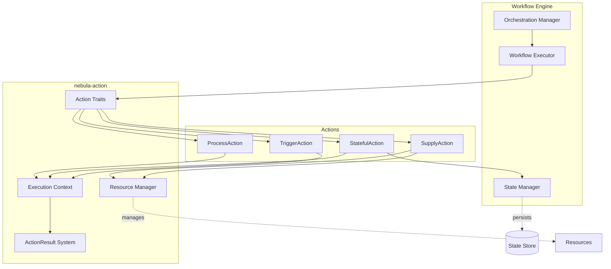
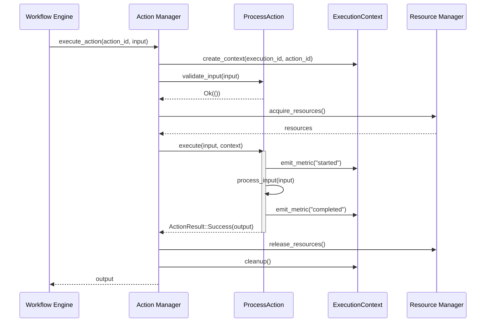
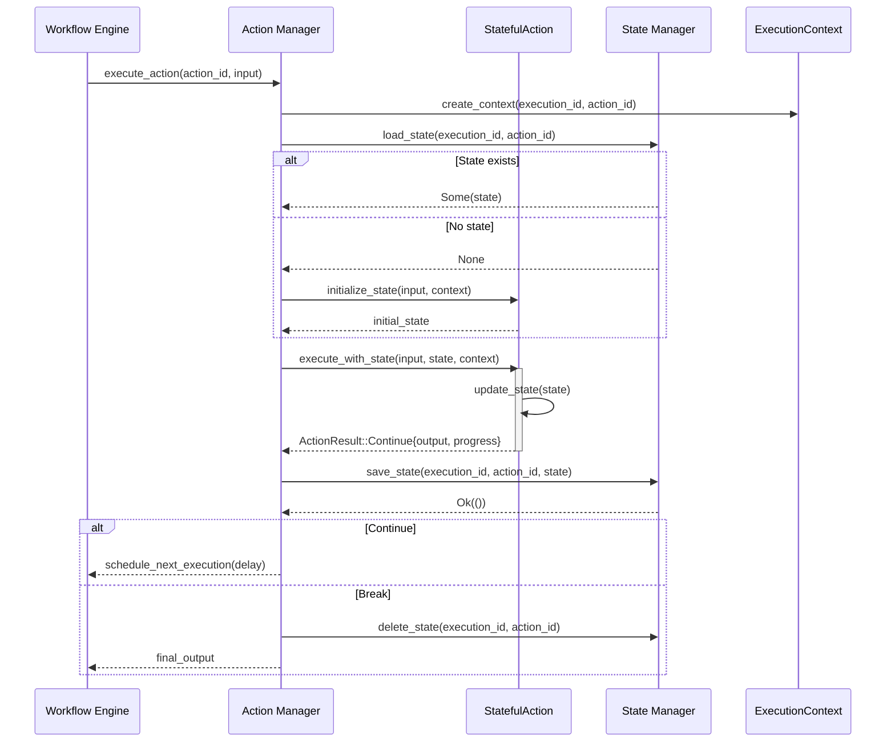
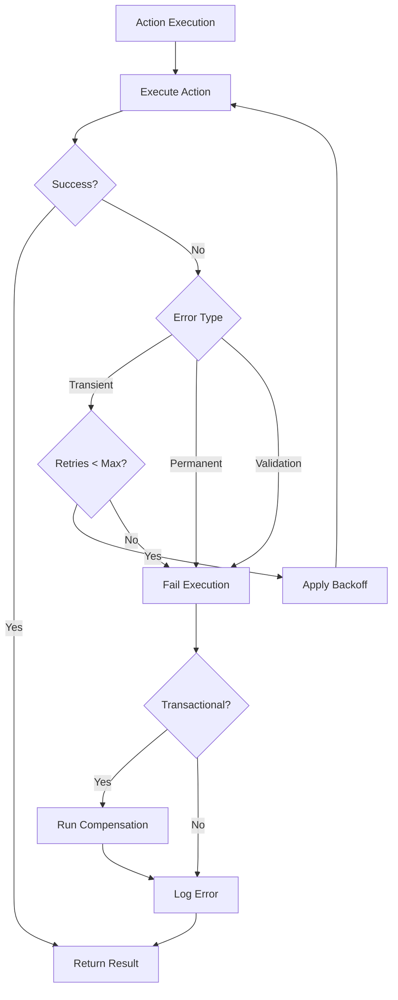
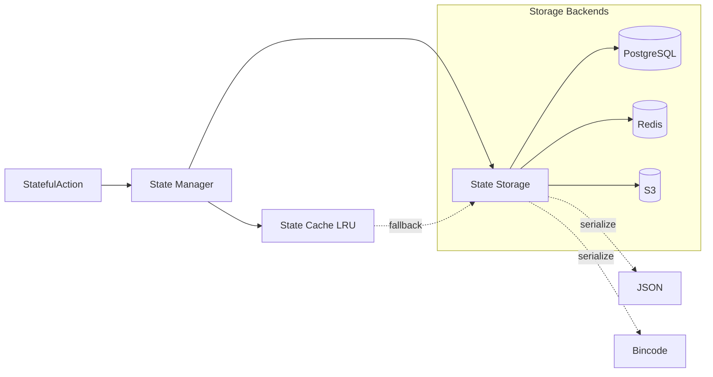
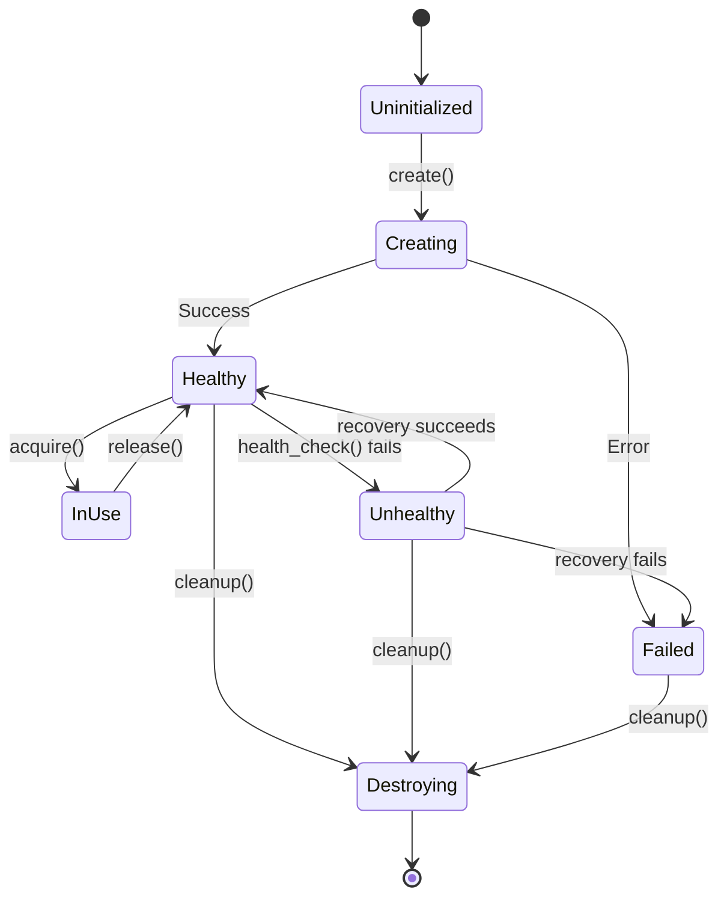
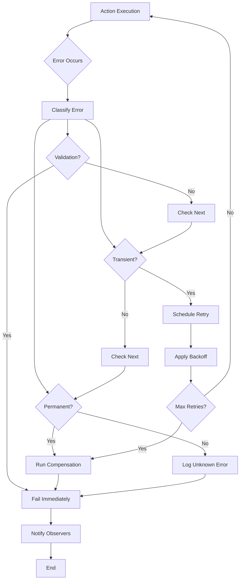

# Architecture

This document provides a comprehensive overview of the **nebula-action** crate architecture, its role within the Nebula workflow engine, and the design decisions that enable scalable, reliable, and extensible workflow automation.

## Table of Contents

1. [High-Level Overview](#high-level-overview)
2. [Core Components](#core-components)
3. [Action Type System](#action-type-system)
4. [Execution Flow](#execution-flow)
5. [State Management](#state-management)
6. [Resource Lifecycle](#resource-lifecycle)
7. [Error Handling](#error-handling)
8. [Observability](#observability)
9. [Security Architecture](#security-architecture)
10. [Performance Considerations](#performance-considerations)

## High-Level Overview

The `nebula-action` crate is the foundation of Nebula's workflow automation system. It provides a trait-based architecture for defining, executing, and composing workflow actions with strong type safety and runtime guarantees.



### Design Principles

1. **Type Safety**: Compile-time guarantees for action behavior
2. **Composability**: Actions can be combined and nested
3. **Extensibility**: Easy to add custom action types
4. **Performance**: Zero-cost abstractions where possible
5. **Observability**: Built-in metrics, logging, and tracing
6. **Resilience**: Comprehensive error handling and recovery

## Core Components

### 1. Action Trait

The base `Action` trait defines the minimal interface all actions must implement:

```rust
pub trait Action: Send + Sync + 'static {
    /// Unique identifier for this action type
    fn name(&self) -> &str;

    /// Human-readable description
    fn description(&self) -> &str;

    /// Version for schema evolution
    fn version(&self) -> u32 {
        1
    }

    /// Tags for categorization and discovery
    fn tags(&self) -> Vec<String> {
        Vec::new()
    }

    /// Validate configuration at registration time
    fn validate_config(&self) -> Result<(), ValidationError> {
        Ok(())
    }
}
```

**Design Rationale:**
- **Minimal Interface**: Only essential metadata required
- **Opt-in Features**: Advanced features via specialized traits
- **Static Dispatch**: `'static` enables efficient dispatch
- **Send + Sync**: Required for async runtime compatibility

### 2. ActionResult System

The `ActionResult` enum provides fine-grained control flow for workflow execution:

```rust
pub enum ActionResult<T> {
    /// Successful execution with output
    Success(T),

    /// Skip this action without error
    Skip {
        reason: String,
    },

    /// Request retry with backoff
    Retry {
        delay: Duration,
        reason: String,
    },

    /// Continue loop (StatefulAction only)
    Continue {
        output: T,
        progress: Option<f64>,
        delay: Option<Duration>,
    },

    /// Break loop (StatefulAction only)
    Break {
        output: T,
        reason: BreakReason,
    },

    /// Branch to different workflow path
    Branch {
        path: String,
        data: T,
    },

    /// Wait for external event
    Wait {
        event_id: String,
        timeout: Duration,
        partial_output: Option<T>,
    },

    /// Route to specific action
    Route {
        target: String,
        data: T,
    },
}
```

**Design Rationale:**
- **Explicit Control Flow**: No hidden magic, clear semantics
- **Type Safety**: Generic `T` ensures type correctness
- **Extensible**: Easy to add new result types
- **Self-Documenting**: Each variant clearly states intent

### 3. Execution Context

The `ExecutionContext` provides actions with access to runtime services:

```rust
pub struct ExecutionContext {
    /// Workflow execution ID
    execution_id: ExecutionId,

    /// Action execution ID (unique per action invocation)
    action_id: ActionId,

    /// Logger with structured metadata
    logger: Logger,

    /// Metrics client
    metrics: Arc<MetricsClient>,

    /// Tracing span
    span: Span,

    /// Workflow variables (read/write)
    variables: Arc<RwLock<Variables>>,

    /// Credential manager
    credentials: Arc<CredentialManager>,

    /// Resource manager
    resources: Arc<ResourceManager>,

    /// Cancellation token
    cancellation: CancellationToken,

    /// Temporary file manager
    temp_files: Arc<TempFileManager>,

    /// Event bus for emitting events
    events: Arc<EventBus>,

    /// Clock for time operations (mockable for tests)
    clock: Arc<dyn Clock>,
}
```

**Key Features:**
- **Immutable by Default**: Only variables are mutable (via RwLock)
- **Arc-based Sharing**: Efficient cloning across async tasks
- **Testable**: All dependencies injectable
- **Scoped Resources**: Automatic cleanup on context drop

### 4. State Manager

Handles persistent state for `StatefulAction`:

```rust
pub struct StateManager {
    /// State storage backend
    storage: Arc<dyn StateStorage>,

    /// Serialization format
    serializer: Arc<dyn Serializer>,

    /// State cache (optional)
    cache: Option<Arc<StateCache>>,

    /// Checkpoint interval
    checkpoint_interval: Duration,
}

impl StateManager {
    /// Load state for action execution
    pub async fn load_state<S: DeserializeOwned>(
        &self,
        execution_id: &ExecutionId,
        action_id: &ActionId,
        version: u32,
    ) -> Result<Option<S>, StateError> {
        // Try cache first
        if let Some(cache) = &self.cache {
            if let Some(state) = cache.get(execution_id, action_id).await? {
                return Ok(Some(state));
            }
        }

        // Load from storage
        let raw_state = self.storage.get(execution_id, action_id).await?;

        if let Some(raw) = raw_state {
            let state = self.serializer.deserialize(&raw, version)?;
            Ok(Some(state))
        } else {
            Ok(None)
        }
    }

    /// Save state after execution
    pub async fn save_state<S: Serialize>(
        &self,
        execution_id: &ExecutionId,
        action_id: &ActionId,
        state: &S,
        version: u32,
    ) -> Result<(), StateError> {
        let serialized = self.serializer.serialize(state, version)?;

        // Save to storage
        self.storage.set(execution_id, action_id, &serialized).await?;

        // Update cache
        if let Some(cache) = &self.cache {
            cache.set(execution_id, action_id, state.clone()).await?;
        }

        Ok(())
    }
}
```

**Design Features:**
- **Pluggable Storage**: Interface-based storage backends
- **Version Migration**: Automatic state schema migration
- **Optional Caching**: Performance optimization
- **Atomic Updates**: State changes are transactional

### 5. Resource Manager

Manages long-lived resources provided by `SupplyAction`:

```rust
pub struct ResourceManager {
    /// Resource instances
    resources: Arc<RwLock<HashMap<ResourceId, Arc<dyn Any + Send + Sync>>>>,

    /// Health check scheduler
    health_checker: Arc<HealthChecker>,

    /// Resource lifecycle hooks
    lifecycle_hooks: Arc<LifecycleHooks>,
}

impl ResourceManager {
    /// Get or create a resource
    pub async fn get_or_create<R: 'static>(
        &self,
        resource_id: &ResourceId,
        factory: impl Future<Output = Result<R, ResourceError>>,
    ) -> Result<Arc<R>, ResourceError> {
        // Try to get existing resource
        {
            let resources = self.resources.read().await;
            if let Some(resource) = resources.get(resource_id) {
                if let Some(typed) = resource.clone().downcast::<R>().ok() {
                    return Ok(typed);
                }
            }
        }

        // Create new resource
        let resource = factory.await?;
        let arc_resource = Arc::new(resource);

        // Store resource
        {
            let mut resources = self.resources.write().await;
            resources.insert(resource_id.clone(), arc_resource.clone() as Arc<dyn Any + Send + Sync>);
        }

        // Register for health checks
        self.health_checker.register(resource_id, arc_resource.clone()).await;

        Ok(arc_resource)
    }

    /// Remove a resource and clean up
    pub async fn remove(&self, resource_id: &ResourceId) -> Result<(), ResourceError> {
        // Unregister from health checks
        self.health_checker.unregister(resource_id).await;

        // Remove from map
        let resource = {
            let mut resources = self.resources.write().await;
            resources.remove(resource_id)
        };

        // Run cleanup hooks
        if let Some(resource) = resource {
            self.lifecycle_hooks.on_cleanup(&resource).await;
        }

        Ok(())
    }
}
```

**Key Features:**
- **Lazy Initialization**: Resources created on first use
- **Automatic Health Checks**: Periodic verification
- **Graceful Cleanup**: Lifecycle hooks for cleanup
- **Type-Safe Access**: Downcast ensures type safety

## Action Type System

### Type Hierarchy

```mermaid
classDiagram
    class Action {
        <<trait>>
        +name() str
        +description() str
        +version() u32
        +validate_config() Result
    }

    class ProcessAction {
        <<trait>>
        +execute(input, context) Result~Output~
        +validate_input(input) Result
    }

    class StatefulAction {
        <<trait>>
        +execute_with_state(input, state, context) Result~Output~
        +initialize_state(input, context) Result~State~
        +migrate_state(old, version) Result~State~
    }

    class TriggerAction {
        <<trait>>
        +start(config, context) Result~Stream~
        +health_check() Result~Health~
        +shutdown() Result
    }

    class SupplyAction {
        <<trait>>
        +create(config, context) Result~Resource~
        +health_check(resource) Result~Health~
        +cleanup(resource) Result
    }

    class StreamingAction {
        <<trait>>
        +stream(input, context) Result~Stream~Item~~
    }

    class TransactionalAction {
        <<trait>>
        +execute_tx(input, context) Result~Output CompensationData~
        +compensate(data, context) Result
    }

    class InteractiveAction {
        <<trait>>
        +request_interaction(input, context) Result~Request~
        +process_response(response, context) Result~Output~
        +on_timeout(context) Result~TimeoutAction~
    }

    Action <|-- ProcessAction
    Action <|-- StatefulAction
    Action <|-- TriggerAction
    Action <|-- SupplyAction
    Action <|-- StreamingAction
    Action <|-- TransactionalAction
    Action <|-- InteractiveAction
```



### Trait Specialization

Each action type extends the base `Action` trait with specialized behavior:

| Action Type | State | Async | Streaming | Transactions | Use Case |
|------------|-------|-------|-----------|--------------|----------|
| ProcessAction | ❌ | ✅ | ❌ | ❌ | Data transformation |
| StatefulAction | ✅ | ✅ | ❌ | ❌ | Iterative processing |
| TriggerAction | ❌ | ✅ | ✅ | ❌ | Event sources |
| SupplyAction | ❌ | ✅ | ❌ | ❌ | Resource management |
| StreamingAction | ❌ | ✅ | ✅ | ❌ | Stream processing |
| TransactionalAction | ✅ | ✅ | ❌ | ✅ | ACID operations |
| InteractiveAction | ✅ | ✅ | ❌ | ❌ | User interactions |

### Design Patterns

**1. Trait Composition**

Actions can implement multiple trait types:

```rust
pub struct DatabaseAction {
    // ...
}

impl Action for DatabaseAction { /* ... */ }
impl ProcessAction for DatabaseAction { /* ... */ }
impl SupplyAction for DatabaseAction { /* create connection pool ... */ }
```

**2. Decorator Pattern**

Wrap actions to add cross-cutting concerns:

```rust
pub struct RetryDecorator<A> {
    inner: A,
    max_retries: u32,
    backoff: ExponentialBackoff,
}

impl<A: ProcessAction> ProcessAction for RetryDecorator<A> {
    async fn execute(&self, input: Self::Input, context: &ExecutionContext)
        -> Result<ActionResult<Self::Output>, ActionError> {
        let mut retries = 0;

        loop {
            match self.inner.execute(input.clone(), context).await {
                Ok(result) => return Ok(result),
                Err(e) if e.is_transient() && retries < self.max_retries => {
                    retries += 1;
                    tokio::time::sleep(self.backoff.next_delay()).await;
                }
                Err(e) => return Err(e),
            }
        }
    }
}
```

**3. Builder Pattern**

Configure actions with fluent API:

```rust
let action = HttpRequestAction::builder()
    .url("https://api.example.com")
    .method(Method::POST)
    .timeout(Duration::from_secs(30))
    .retry_policy(RetryPolicy::exponential(3))
    .build()?;
```

## Execution Flow

### ProcessAction Execution



### StatefulAction Execution



### Error Recovery Flow



## State Management

### State Persistence Architecture



### State Lifecycle

1. **Initialization**: `initialize_state()` called on first execution
2. **Load**: State loaded from storage before each execution
3. **Execute**: Action modifies state during `execute_with_state()`
4. **Save**: State persisted after successful execution
5. **Migration**: Automatic schema migration when version changes
6. **Cleanup**: State deleted after `Break` result or workflow completion

### State Migration Strategy

```rust
pub trait StatefulAction: Action {
    fn state_version(&self) -> u32 {
        1
    }

    async fn migrate_state(
        &self,
        old_state: serde_json::Value,
        old_version: u32,
        new_version: u32,
    ) -> Result<Self::State, ActionError> {
        match (old_version, new_version) {
            (1, 2) => {
                // Add new field with default
                let mut state: StateV2 = serde_json::from_value(old_state)?;
                state.new_field = Default::default();
                Ok(state)
            }
            (2, 3) => {
                // Rename field
                let old: StateV2 = serde_json::from_value(old_state)?;
                Ok(StateV3 {
                    renamed_field: old.old_field_name,
                    // ... other fields
                })
            }
            _ => Err(ActionError::permanent(
                format!("Unsupported migration: v{} -> v{}", old_version, new_version)
            ))
        }
    }
}
```

### State Compression

For large state objects, automatic compression is applied:

```rust
pub struct CompressedStateStorage {
    inner: Arc<dyn StateStorage>,
    compression_threshold: usize, // bytes
    algorithm: CompressionAlgorithm,
}

impl StateStorage for CompressedStateStorage {
    async fn set(&self, key: &StateKey, data: &[u8]) -> Result<(), StateError> {
        let data_to_store = if data.len() > self.compression_threshold {
            // Compress large state
            self.algorithm.compress(data)?
        } else {
            data.to_vec()
        };

        self.inner.set(key, &data_to_store).await
    }
}
```

## Resource Lifecycle

### Resource States



### Health Check System

```rust
pub struct HealthChecker {
    checks: Arc<RwLock<HashMap<ResourceId, HealthCheckTask>>>,
    scheduler: Arc<Scheduler>,
}

impl HealthChecker {
    pub async fn register<R: 'static>(
        &self,
        resource_id: ResourceId,
        resource: Arc<R>,
        check_fn: impl Fn(&R) -> Future<Output = Result<HealthStatus, ResourceError>> + Send + Sync + 'static,
        interval: Duration,
    ) {
        let task = HealthCheckTask {
            resource_id: resource_id.clone(),
            last_check: Instant::now(),
            status: HealthStatus::Healthy,
        };

        self.checks.write().await.insert(resource_id.clone(), task);

        // Schedule periodic health checks
        self.scheduler.schedule_recurring(interval, move || {
            let resource = resource.clone();
            let check_fn = check_fn.clone();

            async move {
                match check_fn(&*resource).await {
                    Ok(HealthStatus::Healthy) => {
                        info!("Health check passed for {}", resource_id);
                    }
                    Ok(HealthStatus::Unhealthy { reason, recoverable }) => {
                        warn!("Health check failed for {}: {}", resource_id, reason);
                        if recoverable {
                            // Attempt recovery
                            self.attempt_recovery(&resource_id).await;
                        }
                    }
                    Err(e) => {
                        error!("Health check error for {}: {}", resource_id, e);
                    }
                }
            }
        }).await;
    }
}
```

### Resource Pooling

```rust
pub struct ResourcePool<R> {
    available: Arc<Mutex<Vec<R>>>,
    in_use: Arc<Mutex<HashSet<ResourceId>>>,
    max_size: usize,
    min_size: usize,
    factory: Arc<dyn Fn() -> Future<Output = Result<R, ResourceError>> + Send + Sync>,
}

impl<R: 'static> ResourcePool<R> {
    pub async fn acquire(&self) -> Result<PooledResource<R>, ResourceError> {
        // Try to get from pool
        let resource = {
            let mut available = self.available.lock().await;
            available.pop()
        };

        match resource {
            Some(r) => Ok(PooledResource::new(r, self.available.clone())),
            None => {
                // Check if we can create new resource
                let in_use_count = self.in_use.lock().await.len();
                if in_use_count < self.max_size {
                    let new_resource = (self.factory)().await?;
                    Ok(PooledResource::new(new_resource, self.available.clone()))
                } else {
                    Err(ResourceError::PoolExhausted)
                }
            }
        }
    }

    pub async fn warm_up(&self) -> Result<(), ResourceError> {
        // Pre-create minimum number of resources
        let mut resources = Vec::new();
        for _ in 0..self.min_size {
            let resource = (self.factory)().await?;
            resources.push(resource);
        }

        *self.available.lock().await = resources;
        Ok(())
    }
}
```

## Error Handling

### Error Type Hierarchy

```rust
#[derive(Debug, thiserror::Error)]
pub enum ActionError {
    /// Validation error (user input invalid)
    #[error("Validation error: {message}")]
    Validation {
        message: String,
        field: Option<String>,
    },

    /// Transient error (retryable)
    #[error("Transient error: {message}")]
    Transient {
        message: String,
        cause: Option<Box<dyn std::error::Error + Send + Sync>>,
        retry_after: Option<Duration>,
    },

    /// Permanent error (not retryable)
    #[error("Permanent error: {message}")]
    Permanent {
        message: String,
        cause: Option<Box<dyn std::error::Error + Send + Sync>>,
    },

    /// Timeout error
    #[error("Timeout after {duration:?}")]
    Timeout {
        duration: Duration,
    },

    /// Resource error
    #[error("Resource error: {message}")]
    Resource {
        message: String,
        resource_id: ResourceId,
    },

    /// State error
    #[error("State error: {message}")]
    State {
        message: String,
    },
}

impl ActionError {
    pub fn is_retryable(&self) -> bool {
        matches!(self, ActionError::Transient { .. } | ActionError::Timeout { .. })
    }

    pub fn is_transient(&self) -> bool {
        matches!(self, ActionError::Transient { .. })
    }

    pub fn is_permanent(&self) -> bool {
        matches!(self, ActionError::Permanent { .. })
    }
}
```

### Error Propagation



### Circuit Breaker Implementation

```rust
pub struct CircuitBreaker {
    state: Arc<Mutex<CircuitState>>,
    failure_threshold: u32,
    success_threshold: u32,
    timeout: Duration,
}

enum CircuitState {
    Closed { failures: u32 },
    Open { opened_at: Instant },
    HalfOpen { successes: u32 },
}

impl CircuitBreaker {
    pub async fn call<F, T, E>(&self, f: F) -> Result<T, CircuitBreakerError<E>>
    where
        F: Future<Output = Result<T, E>>,
    {
        let mut state = self.state.lock().await;

        match *state {
            CircuitState::Open { opened_at } => {
                if opened_at.elapsed() > self.timeout {
                    *state = CircuitState::HalfOpen { successes: 0 };
                } else {
                    return Err(CircuitBreakerError::Open);
                }
            }
            _ => {}
        }

        drop(state); // Release lock before calling function

        match f.await {
            Ok(result) => {
                self.record_success().await;
                Ok(result)
            }
            Err(e) => {
                self.record_failure().await;
                Err(CircuitBreakerError::Inner(e))
            }
        }
    }

    async fn record_success(&self) {
        let mut state = self.state.lock().await;
        match *state {
            CircuitState::HalfOpen { ref mut successes } => {
                *successes += 1;
                if *successes >= self.success_threshold {
                    *state = CircuitState::Closed { failures: 0 };
                }
            }
            CircuitState::Closed { ref mut failures } => {
                *failures = 0;
            }
            _ => {}
        }
    }

    async fn record_failure(&self) {
        let mut state = self.state.lock().await;
        match *state {
            CircuitState::Closed { ref mut failures } => {
                *failures += 1;
                if *failures >= self.failure_threshold {
                    *state = CircuitState::Open {
                        opened_at: Instant::now(),
                    };
                }
            }
            CircuitState::HalfOpen { .. } => {
                *state = CircuitState::Open {
                    opened_at: Instant::now(),
                };
            }
            _ => {}
        }
    }
}
```

## Observability

### Metrics Architecture

```rust
pub trait MetricsClient: Send + Sync {
    fn counter(&self, name: &str, value: u64, tags: &[(&str, &str)]);
    fn gauge(&self, name: &str, value: f64, tags: &[(&str, &str)]);
    fn histogram(&self, name: &str, value: f64, tags: &[(&str, &str)]);
    fn timing(&self, name: &str, duration: Duration, tags: &[(&str, &str)]);
}

// Standard metrics emitted by actions
pub mod metrics {
    pub const ACTION_STARTED: &str = "action.started";
    pub const ACTION_COMPLETED: &str = "action.completed";
    pub const ACTION_FAILED: &str = "action.failed";
    pub const ACTION_DURATION: &str = "action.duration_ms";
    pub const ACTION_RETRY: &str = "action.retry";

    pub const STATE_LOADED: &str = "action.state.loaded";
    pub const STATE_SAVED: &str = "action.state.saved";
    pub const STATE_SIZE: &str = "action.state.size_bytes";

    pub const RESOURCE_ACQUIRED: &str = "action.resource.acquired";
    pub const RESOURCE_RELEASED: &str = "action.resource.released";
    pub const RESOURCE_HEALTH_CHECK: &str = "action.resource.health_check";
}
```

### Distributed Tracing

```rust
use tracing::{span, Level, instrument};

#[instrument(
    skip(self, input, context),
    fields(
        action.name = %self.name(),
        execution.id = %context.execution_id(),
        action.id = %context.action_id(),
    )
)]
async fn execute(&self, input: Self::Input, context: &ExecutionContext)
    -> Result<ActionResult<Self::Output>, ActionError> {

    let span = span!(Level::INFO, "action.execute");
    let _enter = span.enter();

    // Execution logic with automatic span context
    let result = self.process_input(input).await?;

    Ok(ActionResult::Success(result))
}
```

### Logging Strategy

```rust
pub struct StructuredLogger {
    base_logger: Logger,
    execution_id: ExecutionId,
    action_id: ActionId,
}

impl StructuredLogger {
    pub fn info(&self, message: &str, fields: &[(&str, &dyn std::fmt::Display)]) {
        let mut log = slog::Record::new(
            &self.base_logger,
            slog::Level::Info,
            message,
            file!(),
            line!(),
            module_path!(),
        );

        // Add standard fields
        log.add("execution_id", &self.execution_id);
        log.add("action_id", &self.action_id);

        // Add custom fields
        for (key, value) in fields {
            log.add(key, value);
        }

        self.base_logger.log(&log);
    }
}
```

## Security Architecture

### Credential Management

```rust
pub trait CredentialManager: Send + Sync {
    async fn get_credential(
        &self,
        credential_id: &CredentialId,
        scope: &Scope,
    ) -> Result<Credential, CredentialError>;

    async fn refresh_credential(
        &self,
        credential_id: &CredentialId,
    ) -> Result<Credential, CredentialError>;
}

// Credentials are encrypted at rest
pub struct EncryptedCredential {
    ciphertext: Vec<u8>,
    nonce: [u8; 12],
    algorithm: EncryptionAlgorithm,
}

impl EncryptedCredential {
    pub fn decrypt(&self, key: &EncryptionKey) -> Result<Credential, CryptoError> {
        match self.algorithm {
            EncryptionAlgorithm::AES256GCM => {
                aes_gcm_decrypt(&self.ciphertext, &self.nonce, key)
            }
        }
    }
}
```

### Input Validation

```rust
pub trait ValidateInput {
    fn validate(&self) -> Result<(), ValidationError>;
}

#[derive(Debug)]
pub struct ValidationError {
    pub field: String,
    pub message: String,
    pub code: ValidationErrorCode,
}

pub enum ValidationErrorCode {
    Required,
    InvalidFormat,
    OutOfRange,
    TooLong,
    TooShort,
    InvalidValue,
}

// Example validation
impl ValidateInput for HttpRequestInput {
    fn validate(&self) -> Result<(), ValidationError> {
        // Validate URL
        reqwest::Url::parse(&self.url)
            .map_err(|_| ValidationError {
                field: "url".to_string(),
                message: "Invalid URL format".to_string(),
                code: ValidationErrorCode::InvalidFormat,
            })?;

        // Validate headers
        for (key, value) in &self.headers {
            if key.is_empty() {
                return Err(ValidationError {
                    field: "headers".to_string(),
                    message: "Header key cannot be empty".to_string(),
                    code: ValidationErrorCode::Required,
                });
            }
        }

        Ok(())
    }
}
```

### Sandboxing and Resource Limits

```rust
pub struct ResourceLimits {
    pub max_memory: usize,
    pub max_cpu_time: Duration,
    pub max_file_size: usize,
    pub max_open_files: usize,
    pub max_network_bandwidth: usize,
}

pub struct SandboxedExecutor {
    limits: ResourceLimits,
    monitor: ResourceMonitor,
}

impl SandboxedExecutor {
    pub async fn execute<F, T>(&self, f: F) -> Result<T, SandboxError>
    where
        F: Future<Output = T> + Send,
    {
        // Start resource monitoring
        let monitor_handle = self.monitor.start().await;

        // Execute with timeout
        let result = tokio::time::timeout(self.limits.max_cpu_time, f).await;

        // Stop monitoring and check limits
        let usage = monitor_handle.stop().await;

        if usage.memory > self.limits.max_memory {
            return Err(SandboxError::MemoryLimitExceeded);
        }

        result.map_err(|_| SandboxError::TimeoutExceeded)?
    }
}
```

## Performance Considerations

### Zero-Cost Abstractions

The action system is designed for minimal runtime overhead:

```rust
// Static dispatch via trait objects avoided where possible
pub struct ActionExecutor {
    actions: HashMap<ActionId, Box<dyn Action>>,
}

// Prefer monomorphization for performance-critical paths
pub async fn execute_typed<A: ProcessAction>(
    action: &A,
    input: A::Input,
    context: &ExecutionContext,
) -> Result<A::Output, ActionError> {
    // Fully monomorphized, no dynamic dispatch
    action.execute(input, context).await
}
```

### Async Runtime Optimization

```rust
// Use spawn_blocking for CPU-intensive work
pub async fn cpu_intensive_action(data: Vec<u8>) -> Result<Vec<u8>, ActionError> {
    tokio::task::spawn_blocking(move || {
        // Heavy computation that would block async runtime
        expensive_computation(data)
    })
    .await
    .map_err(|e| ActionError::permanent(e.to_string()))?
}

// Use buffered streams for backpressure
pub async fn process_stream(
    input: BoxStream<'static, Result<Item, ActionError>>,
) -> Result<Vec<ProcessedItem>, ActionError> {
    input
        .map(|item| async move { process_item(item?).await })
        .buffer_unordered(10) // Process up to 10 items concurrently
        .try_collect()
        .await
}
```

### Memory Management

```rust
// Use Arc for shared data instead of cloning
pub struct SharedConfig {
    pub settings: Arc<HashMap<String, String>>,
    pub features: Arc<HashSet<String>>,
}

// Implement custom Drop for cleanup
impl Drop for ActionContext {
    fn drop(&mut self) {
        // Clean up temporary files
        if let Some(temp_dir) = &self.temp_dir {
            let _ = std::fs::remove_dir_all(temp_dir);
        }

        // Release resources
        for resource_id in &self.acquired_resources {
            let _ = self.resource_manager.release(resource_id);
        }
    }
}
```

### Caching Strategy

```rust
pub struct ActionCache {
    cache: Arc<RwLock<LruCache<CacheKey, CacheValue>>>,
    ttl: Duration,
}

impl ActionCache {
    pub async fn get_or_execute<F, T>(
        &self,
        key: CacheKey,
        f: F,
    ) -> Result<T, ActionError>
    where
        F: Future<Output = Result<T, ActionError>>,
        T: Clone + Serialize + DeserializeOwned,
    {
        // Try cache first
        {
            let cache = self.cache.read().await;
            if let Some(entry) = cache.get(&key) {
                if entry.expires_at > Instant::now() {
                    return Ok(entry.value.clone());
                }
            }
        }

        // Execute and cache
        let value = f.await?;

        {
            let mut cache = self.cache.write().await;
            cache.put(key, CacheValue {
                value: value.clone(),
                expires_at: Instant::now() + self.ttl,
            });
        }

        Ok(value)
    }
}
```

## Related Documentation

- [[02-Crates/nebula-action/README|nebula-action]] - Crate overview
- [[02-Crates/nebula-action/Action Types|Action Types]] - Action type system
- [[02-Crates/nebula-action/Examples|Examples]] - Complete examples
- [[03-Concepts/Actions|Actions]] - Conceptual overview
- [[03-Concepts/Error Handling|Error Handling]] - Error handling patterns
- [[03-Concepts/Security Model|Security Model]] - Security architecture
