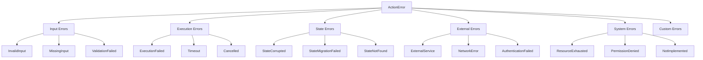

# Error Model

## Overview

Nebula's error model provides comprehensive error handling with clear categorization, recovery strategies, and context preservation. Errors are strongly typed and carry rich information for debugging and recovery.

## Error Hierarchy



## Error Types

### Input Errors

**InvalidInput**

```rust
ActionError::InvalidInput {
    field: String,
    reason: String,
}
```

**When Occurs**:

- Invalid format
- Out of range values
- Type mismatch

**Example**:

```rust
// Validation
if !email_regex.is_match(&input.email) {
    return Err(ActionError::InvalidInput {
        field: "email".to_string(),
        reason: "Invalid email format".to_string(),
    });
}

if input.age < 0 || input.age > 150 {
    return Err(ActionError::InvalidInput {
        field: "age".to_string(),
        reason: format!("Age must be between 0 and 150, got {}", input.age),
    });
}
```

---

**MissingInput**

```rust
ActionError::MissingInput {
    field: String,
}
```

**When Occurs**:

- Required field is None
- Empty required collection
- Missing configuration

**Example**:

```rust
let api_key = input.api_key.ok_or_else(|| {
    ActionError::MissingInput {
        field: "api_key".to_string(),
    }
})?;
```

---

**ValidationFailed**

```rust
ActionError::ValidationFailed {
    errors: Vec<ValidationError>,
}
```

**ValidationError Structure**:

```rust
pub struct ValidationError {
    pub field: String,
    pub code: String,
    pub message: String,
    pub context: Option<HashMap<String, Value>>,
}
```

**Example**:

```rust
let mut errors = Vec::new();

if input.password.len() < 8 {
    errors.push(ValidationError {
        field: "password".to_string(),
        code: "MIN_LENGTH".to_string(),
        message: "Password must be at least 8 characters".to_string(),
        context: Some(hashmap! {
            "min_length" => json!(8),
            "actual_length" => json!(input.password.len()),
        }),
    });
}

if !errors.is_empty() {
    return Err(ActionError::ValidationFailed { errors });
}
```

### Execution Errors

**ExecutionFailed**

```rust
ActionError::ExecutionFailed(String)
```

**When Occurs**:

- General execution failure
- Business logic errors
- Processing failures

**Example**:

```rust
let result = process_data(&input).map_err(|e| {
    ActionError::ExecutionFailed(
        format!("Failed to process data: {}", e)
    )
})?;
```

---

**Timeout**

```rust
ActionError::Timeout {
    operation: String,
    duration: Duration,
}
```

**When Occurs**:

- Operation exceeds time limit
- Deadline exceeded
- Slow external calls

**Example**:

```rust
let result = tokio::time::timeout(
    Duration::from_secs(30),
    fetch_data()
).await.map_err(|_| {
    ActionError::Timeout {
        operation: "fetch_data".to_string(),
        duration: Duration::from_secs(30),
    }
})?;
```

---

**Cancelled**

```rust
ActionError::Cancelled
```

**When Occurs**:

- User cancellation
- Workflow stopped
- Shutdown initiated

**Example**:

```rust
// Check cancellation token
if context.is_cancelled() {
    return Err(ActionError::Cancelled);
}

// Or with select
tokio::select! {
    result = do_work() => result,
    _ = context.cancellation_token().cancelled() => {
        Err(ActionError::Cancelled)
    }
}
```

### State Errors

**StateCorrupted**

```rust
ActionError::StateCorrupted(String)
```

**When Occurs**:

- Invalid state data
- Deserialization failure
- Inconsistent state

**Example**:

```rust
let state: MyState = serde_json::from_value(state_data)
    .map_err(|e| {
        ActionError::StateCorrupted(
            format!("Failed to deserialize state: {}", e)
        )
    })?;

// Validate state consistency
if state.total != state.items.len() {
    return Err(ActionError::StateCorrupted(
        "State total doesn't match items count".to_string()
    ));
}
```

---

**StateMigrationFailed**

```rust
ActionError::StateMigrationFailed(String)
```

**When Occurs**:

- Version incompatibility
- Migration logic failure
- Schema changes

**Example**:

```rust
impl StatefulAction for MyAction {
    async fn migrate_state(
        &self,
        old_state: Value,
        old_version: Version,
    ) -> Result<Self::State, ActionError> {
        if old_version.major < 2 {
            // Migrate v1 to v2
            migrate_v1_to_v2(old_state).map_err(|e| {
                ActionError::StateMigrationFailed(
                    format!("Failed to migrate from v{} to v2: {}", 
                           old_version, e)
                )
            })
        } else {
            Err(ActionError::StateMigrationFailed(
                format!("Unknown version: {}", old_version)
            ))
        }
    }
}
```

### External Errors

**ExternalServiceError**

```rust
ActionError::ExternalServiceError {
    service: String,
    error: String,
}
```

**When Occurs**:

- API failures
- Database errors
- Third-party service issues

**Example**:

```rust
let response = http_client
    .post(&url)
    .json(&payload)
    .send()
    .await
    .map_err(|e| {
        ActionError::ExternalServiceError {
            service: "payment_api".to_string(),
            error: e.to_string(),
        }
    })?;
```

---

**NetworkError**

```rust
ActionError::NetworkError {
    operation: String,
    error: String,
}
```

**When Occurs**:

- Connection failures
- DNS resolution issues
- Network timeouts

---

**AuthenticationFailed**

```rust
ActionError::AuthenticationFailed {
    reason: String,
}
```

**When Occurs**:

- Invalid credentials
- Expired tokens
- Missing permissions

### System Errors

**ResourceExhausted**

```rust
ActionError::ResourceExhausted {
    resource: String,
}
```

**When Occurs**:

- Out of memory
- Connection pool exhausted
- Rate limits hit

**Example**:

```rust
let connection = pool.acquire().await.map_err(|_| {
    ActionError::ResourceExhausted {
        resource: "database_connections".to_string(),
    }
})?;
```

## Error Recovery Strategies

### Retry Strategy

```rust
impl Action for RetryableAction {
    async fn handle_error(
        &self,
        error: ActionError,
        context: &ExecutionContext,
    ) -> Result<ErrorRecovery, ActionError> {
        match error {
            // Retry network errors with exponential backoff
            ActionError::NetworkError { .. } => {
                Ok(ErrorRecovery::Retry {
                    strategy: RetryStrategy::ExponentialBackoff {
                        initial_delay: Duration::from_secs(1),
                        max_delay: Duration::from_secs(60),
                        multiplier: 2.0,
                    },
                    max_attempts: 5,
                })
            }
            
            // Retry rate limits with fixed delay
            ActionError::ExternalServiceError { error, .. } 
                if error.contains("rate limit") => {
                Ok(ErrorRecovery::Retry {
                    strategy: RetryStrategy::FixedDelay {
                        delay: Duration::from_secs(60),
                    },
                    max_attempts: 3,
                })
            }
            
            // Don't retry validation errors
            ActionError::InvalidInput { .. } |
            ActionError::ValidationFailed { .. } => {
                Err(error)
            }
            
            _ => Err(error),
        }
    }
}
```

### Compensation Strategy

```rust
impl Action for CompensatingAction {
    async fn compensate(
        &self,
        error: ActionError,
        partial_result: Option<Value>,
        context: &ExecutionContext,
    ) -> Result<(), ActionError> {
        match error {
            ActionError::ExecutionFailed(_) if partial_result.is_some() => {
                // Rollback partial changes
                self.rollback_changes(partial_result.unwrap()).await?;
                Ok(())
            }
            _ => Ok(()),
        }
    }
}
```

### Circuit Breaker

```rust
pub struct CircuitBreaker {
    failure_threshold: usize,
    success_threshold: usize,
    timeout: Duration,
    state: Arc<Mutex<CircuitState>>,
}

enum CircuitState {
    Closed,
    Open { until: Instant },
    HalfOpen,
}

impl CircuitBreaker {
    pub async fn call<F, T>(&self, f: F) -> Result<T, ActionError>
    where
        F: Future<Output = Result<T, ActionError>>,
    {
        let state = self.state.lock().await;
        
        match *state {
            CircuitState::Open { until } if Instant::now() < until => {
                Err(ActionError::CircuitBreakerOpen)
            }
            _ => {
                let result = f.await;
                self.record_result(&result).await;
                result
            }
        }
    }
}
```

## Error Context

### Adding Context

```rust
use anyhow::Context;

// Add context to errors
let data = load_data()
    .await
    .context("Failed to load data from database")?;

let parsed = parse_json(&data)
    .with_context(|| format!("Failed to parse JSON with {} bytes", data.len()))?;
```

### Error Chain

```rust
#[derive(Debug, thiserror::Error)]
pub enum ActionError {
    #[error("Database error: {0}")]
    Database(#[from] sqlx::Error),
    
    #[error("HTTP error: {0}")]
    Http(#[from] reqwest::Error),
    
    #[error("Serialization error: {0}")]
    Serialization(#[from] serde_json::Error),
    
    #[error("Custom error: {message}")]
    Custom {
        message: String,
        #[source]
        source: Option<Box<dyn std::error::Error + Send + Sync>>,
    },
}
```

## Error Reporting

### Structured Logging

```rust
impl Action for LoggingAction {
    async fn execute(&self, input: Input, context: &ExecutionContext) 
        -> Result<ActionResult<o>, ActionError> {
        match self.process(input).await {
            Ok(output) => Ok(ActionResult::Success(output)),
            Err(e) => {
                // Log with structured data
                context.log_error_with_fields(
                    "Action execution failed",
                    &[
                        ("error_type", e.error_type()),
                        ("error_code", e.error_code()),
                        ("action_id", self.metadata().id),
                        ("input_size", &input.size().to_string()),
                    ],
                );
                
                // Record metrics
                context.increment_counter("action_errors", 1.0, &[
                    ("action", self.metadata().id),
                    ("error_type", e.error_type()),
                ]);
                
                Err(e)
            }
        }
    }
}
```

### Error Telemetry

```rust
use tracing::{error, warn, instrument};

#[instrument(skip(self, context), err)]
async fn execute(&self, input: Input, context: &ExecutionContext) 
    -> Result<ActionResult<o>, ActionError> {
    // Automatic span creation and error recording
    self.process(input).await
}
```

## Testing Error Handling

```rust
#[cfg(test)]
mod tests {
    use super::*;
    
    #[tokio::test]
    async fn test_error_recovery() {
        let action = MyAction::new();
        let context = TestContext::new();
        
        // Test retry on transient error
        let error = ActionError::NetworkError {
            operation: "fetch".to_string(),
            error: "timeout".to_string(),
        };
        
        let recovery = action.handle_error(error, &context).await.unwrap();
        assert!(matches!(recovery, ErrorRecovery::Retry { .. }));
    }
    
    #[tokio::test]
    async fn test_validation_errors() {
        let action = MyAction::new();
        let context = TestContext::new();
        
        let input = Input {
            email: "invalid",
            age: -1,
        };
        
        let result = action.execute(input, &context).await;
        
        match result {
            Err(ActionError::ValidationFailed { errors }) => {
                assert_eq!(errors.len(), 2);
                assert!(errors.iter().any(|e| e.field == "email"));
                assert!(errors.iter().any(|e| e.field == "age"));
            }
            _ => panic!("Expected validation error"),
        }
    }
}
```

## Best Practices

### DO's

1. ✅ **Use specific error types**
    
    ```rust
    // Good
    Err(ActionError::InvalidInput {
        field: "email".to_string(),
        reason: "Invalid email format".to_string(),
    })
    
    // Bad
    Err(ActionError::ExecutionFailed("Invalid input".to_string()))
    ```
    
2. ✅ **Include context**
    
    ```rust
    .map_err(|e| ActionError::ExternalServiceError {
        service: "payment_gateway".to_string(),
        error: format!("Transaction {} failed: {}", tx_id, e),
    })
    ```
    
3. ✅ **Handle all error cases**
    
    ```rust
    match operation().await {
        Ok(result) => Ok(result),
        Err(e) if e.is_transient() => retry(e),
        Err(e) if e.is_permanent() => Err(e),
        Err(e) => handle_unknown(e),
    }
    ```
    

### DON'Ts

1. ❌ **Don't swallow errors**
    
    ```rust
    // Bad
    let _ = operation().await;
    
    // Good
    operation().await.map_err(|e| {
        context.log_error(&format!("Operation failed: {}", e));
        e
    })?;
    ```
    
2. ❌ **Don't use generic errors**
    
    ```rust
    // Bad
    Err(ActionError::Internal("Something went wrong".to_string()))
    
    // Good
    Err(ActionError::DatabaseError {
        operation: "insert_user".to_string(),
        error: e.to_string(),
    })
    ```
    

## Related Documentation

- [[Action Lifecycle]] - Error handling in lifecycle
- [[Action Result System]] - Error results
- [[Testing]] - Testing error scenarios
- [[Examples]] - Error handling examples