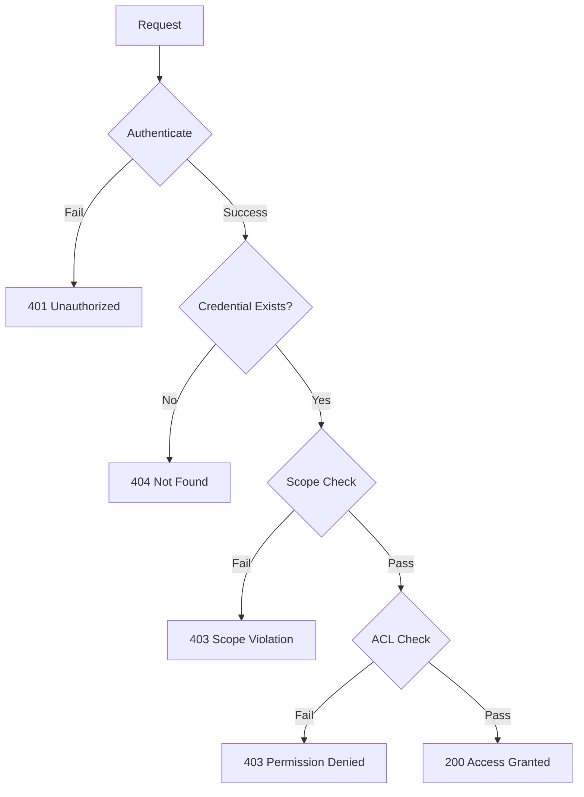

# Access Control System

> [!NOTE] Ownership + ACL Model
> nebula-credential implements a hybrid access control model combining ownership (single accountable owner per credential) with Access Control Lists (ACLs) providing fine-grained permission management.

## TL;DR

Access control in nebula-credential:
- **Ownership Model**: Every credential has single immutable owner
- **6 Permission Types**: Read, Write, Delete, Rotate, Grant, Execute
- **ACLs**: Fine-grained permissions per user/service
- **Scope Isolation**: Workflow/Organization/Global scopes
- **Least Privilege**: Minimal permissions by default
- **Audit Logging**: All access decisions logged

---

## Ownership Model

### Single Accountable Owner

Every credential has exactly one owner who:
- Created the credential (or was assigned ownership on creation)
- Has all permissions (cannot be revoked)
- Cannot transfer ownership (immutable after creation)
- Is accountable for credential security

```rust
pub struct Credential {
    pub id: CredentialId,
    pub owner: OwnerId,  // Immutable - no setter
    pub created_by: OwnerId,
    pub created_at: DateTime<Utc>,
    pub acl: AccessControlList,
    // ...
}

impl Credential {
    /// Create new credential (ownership assigned)
    pub fn new(owner: OwnerId, data: CredentialData) -> Self {
        Self {
            id: CredentialId::generate(),
            owner,  // Set once, never changes
            created_by: owner.clone(),
            created_at: Utc::now(),
            acl: AccessControlList::new(owner.clone()),
            // ...
        }
    }
    
    /// Check if user is owner
    pub fn is_owner(&self, user_id: &OwnerId) -> bool {
        user_id == &self.owner
    }
}
```

**Why Immutable Ownership?**
- **Accountability**: Clear responsibility for credential security
- **Audit Trail**: Owner cannot disclaim responsibility
- **Prevents Privilege Escalation**: Attacker cannot take ownership
- **Simplifies Access Control**: Owner always has full access

---

## Permission Types

### 6 Core Permissions

```rust
#[derive(Debug, Clone, Copy, PartialEq, Eq, Hash)]
pub enum Permission {
    /// Read credential value
    Read,
    
    /// Modify credential value
    Write,
    
    /// Delete credential permanently
    Delete,
    
    /// Rotate credential (generate new value)
    Rotate,
    
    /// Modify Access Control List
    Grant,
    
    /// Use credential in workflow/action
    Execute,
}

pub type PermissionSet = HashSet<Permission>;
```

### Permission Descriptions

| Permission | Description | Example Use Case | Risk Level |
|------------|-------------|------------------|------------|
| **Read** | View credential metadata and encrypted value | Audit, backup, migration | Medium |
| **Write** | Modify credential value or metadata | Update password, change scope | High |
| **Delete** | Permanently delete credential | Cleanup, decommissioning | Critical |
| **Rotate** | Generate new credential value | Scheduled rotation, security incident | High |
| **Grant** | Add/remove permissions in ACL | Delegation, team management | Critical |
| **Execute** | Use credential in workflow | API calls, database connections | Medium |

---

## Access Control List (ACL)

### ACL Structure

```rust
pub struct AccessControlList {
    /// Immutable owner (always has all permissions)
    owner: OwnerId,
    
    /// Explicit permission grants
    permissions: HashMap<OwnerId, PermissionSet>,
    
    /// Metadata
    created_at: DateTime<Utc>,
    last_modified: DateTime<Utc>,
    modified_by: OwnerId,
}

impl AccessControlList {
    /// Create new ACL with owner
    pub fn new(owner: OwnerId) -> Self {
        Self {
            owner,
            permissions: HashMap::new(),
            created_at: Utc::now(),
            last_modified: Utc::now(),
            modified_by: owner.clone(),
        }
    }
    
    /// Check if user has permission
    pub fn has_permission(
        &self,
        user_id: &OwnerId,
        permission: Permission,
    ) -> bool {
        // Owner has all permissions
        if user_id == &self.owner {
            return true;
        }
        
        // Check explicit grants
        self.permissions
            .get(user_id)
            .map(|perms| perms.contains(&permission))
            .unwrap_or(false)
    }
    
    /// Grant permission (requires Grant permission)
    pub fn grant_permission(
        &mut self,
        granter: &OwnerId,
        grantee: &OwnerId,
        permission: Permission,
    ) -> Result<(), AccessError> {
        // Verify granter has Grant permission
        if !self.has_permission(granter, Permission::Grant) {
            return Err(AccessError::InsufficientPermissions);
        }
        
        // Cannot grant permissions granter doesn't have
        if !self.has_permission(granter, permission) {
            return Err(AccessError::CannotGrantHigherPrivilege);
        }
        
        // Grant permission
        self.permissions
            .entry(grantee.clone())
            .or_default()
            .insert(permission);
        
        self.last_modified = Utc::now();
        self.modified_by = granter.clone();
        
        Ok(())
    }
    
    /// Revoke permission
    pub fn revoke_permission(
        &mut self,
        revoker: &OwnerId,
        revokee: &OwnerId,
        permission: Permission,
    ) -> Result<(), AccessError> {
        // Only owner or Grant permission holder can revoke
        if !self.has_permission(revoker, Permission::Grant) {
            return Err(AccessError::InsufficientPermissions);
        }
        
        // Cannot revoke owner's permissions
        if revokee == &self.owner {
            return Err(AccessError::CannotRevokeOwnerPermissions);
        }
        
        // Revoke permission
        if let Some(perms) = self.permissions.get_mut(revokee) {
            perms.remove(&permission);
            
            // Remove entry if no permissions left
            if perms.is_empty() {
                self.permissions.remove(revokee);
            }
        }
        
        self.last_modified = Utc::now();
        self.modified_by = revoker.clone();
        
        Ok(())
    }
    
    /// List all users with permissions
    pub fn list_grants(&self) -> Vec<(OwnerId, PermissionSet)> {
        let mut grants: Vec<_> = self.permissions
            .iter()
            .map(|(id, perms)| (id.clone(), perms.clone()))
            .collect();
        
        // Add owner with all permissions
        grants.insert(0, (
            self.owner.clone(),
            [
                Permission::Read,
                Permission::Write,
                Permission::Delete,
                Permission::Rotate,
                Permission::Grant,
                Permission::Execute,
            ].iter().cloned().collect()
        ));
        
        grants
    }
}
```

---

## Scope Isolation

### Three Scope Levels

```rust
#[derive(Debug, Clone, PartialEq, Eq, Hash, Serialize, Deserialize)]
pub enum CredentialScope {
    /// Accessible only within specific workflow
    Workflow(WorkflowId),
    
    /// Accessible within organization
    Organization(OrganizationId),
    
    /// Globally accessible (admin only)
    Global,
}

impl CredentialScope {
    /// Verify user can access this scope
    pub fn can_access(
        &self,
        user: &User,
        context: &AccessContext,
    ) -> bool {
        match self {
            Self::Workflow(wf_id) => {
                // Must be in same workflow
                context.workflow_id == Some(wf_id)
            }
            
            Self::Organization(org_id) => {
                // Must belong to organization
                user.organization_id == Some(org_id)
            }
            
            Self::Global => {
                // Admin only
                user.is_admin()
            }
        }
    }
}
```

### Scope Hierarchy

```
Global (admin only)
  ├─ Organization A
  │  ├─ Workflow A1
  │  ├─ Workflow A2
  │  └─ Workflow A3
  ├─ Organization B
  │  ├─ Workflow B1
  │  └─ Workflow B2
  └─ Organization C
     └─ Workflow C1
```

**Access Rules**:
- User in `Workflow A1` **CANNOT** access credentials in `Workflow A2`
- User in `Organization A` **CAN** access credentials in `Workflow A1` (if granted permission)
- Admin **CAN** access `Global` credentials

---

## Authorization Flow

### Complete Authorization Check

```rust
pub async fn authorize_access(
    &self,
    credential_id: &CredentialId,
    requester: &OwnerId,
    permission: Permission,
    context: &AccessContext,
) -> Result<(), AccessError> {
    // 1. Authenticate requester
    let user = self.authenticate(requester).await?;
    
    // 2. Fetch credential
    let credential = self.storage.get(credential_id).await
        .map_err(|_| AccessError::CredentialNotFound)?;
    
    // 3. Check scope isolation
    if !credential.scope.can_access(&user, context) {
        self.audit_logger.log(AuditEvent::ScopeViolation {
            credential_id: credential_id.clone(),
            requester: requester.clone(),
            required_scope: credential.scope.clone(),
            actual_context: context.clone(),
            timestamp: Utc::now(),
        }).await;
        
        return Err(AccessError::ScopeViolation);
    }
    
    // 4. Check ACL permission
    if !credential.acl.has_permission(requester, permission) {
        self.audit_logger.log(AuditEvent::PermissionDenied {
            credential_id: credential_id.clone(),
            requester: requester.clone(),
            required_permission: permission,
            timestamp: Utc::now(),
        }).await;
        
        return Err(AccessError::PermissionDenied);
    }
    
    // 5. Access granted
    Ok(())
}
```

**Authorization Flowchart**:


---

## Common Access Patterns

### Pattern 1: Read-Only Access for Monitoring

```rust
// Grant read-only access to monitoring service
credential.acl.grant_permission(
    &owner_id,
    &monitoring_service_id,
    Permission::Read,
)?;

// Monitoring can now read credential metadata
let metadata = credential_service
    .get_metadata(&credential_id, &monitoring_service_id)
    .await?;
```

---

### Pattern 2: Delegated Rotation

```rust
// Grant rotation permission to security team
credential.acl.grant_permission(
    &owner_id,
    &security_team_id,
    Permission::Rotate,
)?;

// Security team can rotate credentials
credential_service
    .rotate_credential(&credential_id, &security_team_id)
    .await?;
```

---

### Pattern 3: Team Access with Manager Control

```rust
// Manager grants team access
for team_member in team_members {
    // Grant Read and Execute permissions
    credential.acl.grant_permission(&manager_id, &team_member, Permission::Read)?;
    credential.acl.grant_permission(&manager_id, &team_member, Permission::Execute)?;
}

// Manager retains Grant permission for delegation
credential.acl.grant_permission(&owner_id, &manager_id, Permission::Grant)?;
```

---

### Pattern 4: Emergency Access with Audit Trail

```rust
// Emergency access bypasses ACL (with logging)
pub async fn emergency_access(
    &self,
    credential_id: &CredentialId,
    responder: &OwnerId,
    justification: &str,
) -> Result<Credential, AccessError> {
    // Verify responder has emergency role
    let user = self.authenticate(responder).await?;
    if !user.has_role(Role::EmergencyResponder) {
        return Err(AccessError::InsufficientPermissions);
    }
    
    // Fetch credential (bypass ACL)
    let credential = self.storage.get(credential_id).await?;
    
    // CRITICAL: Log emergency access
    self.audit_logger.log(AuditEvent::EmergencyAccess {
        credential_id: credential_id.clone(),
        responder: responder.clone(),
        justification: justification.to_string(),
        timestamp: Utc::now(),
        alert_level: AlertLevel::Critical,
    }).await;
    
    // Notify compliance team immediately
    self.notify_compliance_team(EmergencyAccessAlert {
        credential: credential_id.clone(),
        responder: responder.clone(),
        justification: justification.to_string(),
    }).await;
    
    Ok(credential)
}
```

---

## Security Best Practices

### 1. Principle of Least Privilege

```rust
// ✅ GOOD: Minimal permissions
credential.acl.grant_permission(&owner, &user, Permission::Execute)?;
// User can use credential but not modify or delete

// ❌ BAD: Excessive permissions
for permission in [Permission::Read, Permission::Write, Permission::Delete, Permission::Rotate, Permission::Grant, Permission::Execute] {
    credential.acl.grant_permission(&owner, &user, permission)?;
}
// User has all permissions unnecessarily
```

---

### 2. Regular Access Reviews

```rust
/// Generate access review report
pub async fn review_access(
    &self,
    credential_id: &CredentialId,
) -> AccessReviewReport {
    let credential = self.storage.get(credential_id).await.unwrap();
    
    let mut stale_grants = Vec::new();
    
    // Check for stale permissions (not used in 90 days)
    for (user_id, permissions) in &credential.acl.permissions {
        if let Some(last_access) = self.get_last_access(credential_id, user_id).await {
            if Utc::now() - last_access > Duration::days(90) {
                stale_grants.push((user_id.clone(), permissions.clone()));
            }
        }
    }
    
    AccessReviewReport {
        credential_id: credential_id.clone(),
        owner: credential.owner.clone(),
        total_grants: credential.acl.permissions.len(),
        stale_grants,
        recommendations: generate_recommendations(&credential),
        review_date: Utc::now(),
    }
}
```

---

### 3. Audit All Permission Changes

```rust
impl AccessControlList {
    fn audit_log_grant(
        &self,
        granter: &OwnerId,
        grantee: &OwnerId,
        permission: Permission,
    ) {
        audit_logger.log(AuditEvent::PermissionGranted {
            credential_id: self.credential_id.clone(),
            granter: granter.clone(),
            grantee: grantee.clone(),
            permission,
            timestamp: Utc::now(),
        });
    }
    
    fn audit_log_revoke(
        &self,
        revoker: &OwnerId,
        revokee: &OwnerId,
        permission: Permission,
    ) {
        audit_logger.log(AuditEvent::PermissionRevoked {
            credential_id: self.credential_id.clone(),
            revoker: revoker.clone(),
            revokee: revokee.clone(),
            permission,
            timestamp: Utc::now(),
        });
    }
}
```

---

## Access Control Checklist

### Design Phase

- [ ] Every credential has single owner
- [ ] Ownership is immutable
- [ ] Permissions follow least privilege
- [ ] Scope isolation implemented
- [ ] Default permissions deny all
- [ ] Grant permission required for ACL changes

### Implementation Phase

- [ ] Authorization checked before every operation
- [ ] All permission changes logged
- [ ] Scope validated on every access
- [ ] Emergency access procedures documented
- [ ] Access denied by default (fail-secure)

### Operational Phase

- [ ] Regular access reviews (monthly)
- [ ] Audit logs monitored for violations
- [ ] Stale permissions identified and removed
- [ ] Emergency access tested and documented
- [ ] Compliance reports generated quarterly

---

## Troubleshooting

### Issue: Permission Denied Despite Owner Status

**Symptoms**:
```
Error: PermissionDenied
User: owner_abc123
Credential: cred_xyz789
```

**Cause**: User is not actually the owner (check ownership)

**Solution**:
```rust
// Verify ownership
let credential = storage.get(&credential_id).await?;
println!("Owner: {}", credential.owner);
println!("Requester: {}", requester_id);

// Owner should have all permissions automatically
assert_eq!(credential.owner, requester_id);
```

---

### Issue: Cannot Grant Permission

**Symptoms**:
```
Error: InsufficientPermissions
Operation: grant_permission
Required: Grant permission
```

**Cause**: User doesn't have Grant permission

**Solution**:
```rust
// Check granter's permissions
let has_grant = credential.acl.has_permission(&granter_id, Permission::Grant);
println!("Has Grant permission: {}", has_grant);

// Only owner or users with Grant permission can modify ACL
if !has_grant {
    println!("Request owner to grant you Grant permission first");
}
```

---

### Issue: Scope Violation

**Symptoms**:
```
Error: ScopeViolation
Required scope: Workflow(wf_123)
Actual context: Workflow(wf_456)
```

**Cause**: Accessing credential from wrong workflow

**Solution**:
```rust
// Verify access context matches credential scope
match &credential.scope {
    CredentialScope::Workflow(wf_id) => {
        println!("Credential requires workflow: {}", wf_id);
        println!("Current workflow: {:?}", context.workflow_id);
        
        // Ensure accessing from correct workflow
        assert_eq!(Some(wf_id), &context.workflow_id);
    }
    // ...
}
```

---

## See Also

- [[Advanced/Security-Architecture|Security Architecture]]
- [[Advanced/Threat-Model|Threat Model]]
- [[How-To/Enable-Audit-Logging|Audit Logging Setup]]
- [[Advanced/Compliance-SOC2|SOC 2 Compliance]]
- [[Advanced/Compliance-ISO27001|ISO 27001 Compliance]]
- [[Advanced/Security-Best-Practices|Security Best Practices]]
