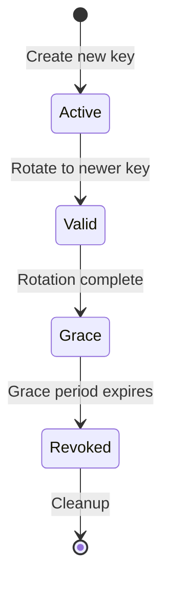
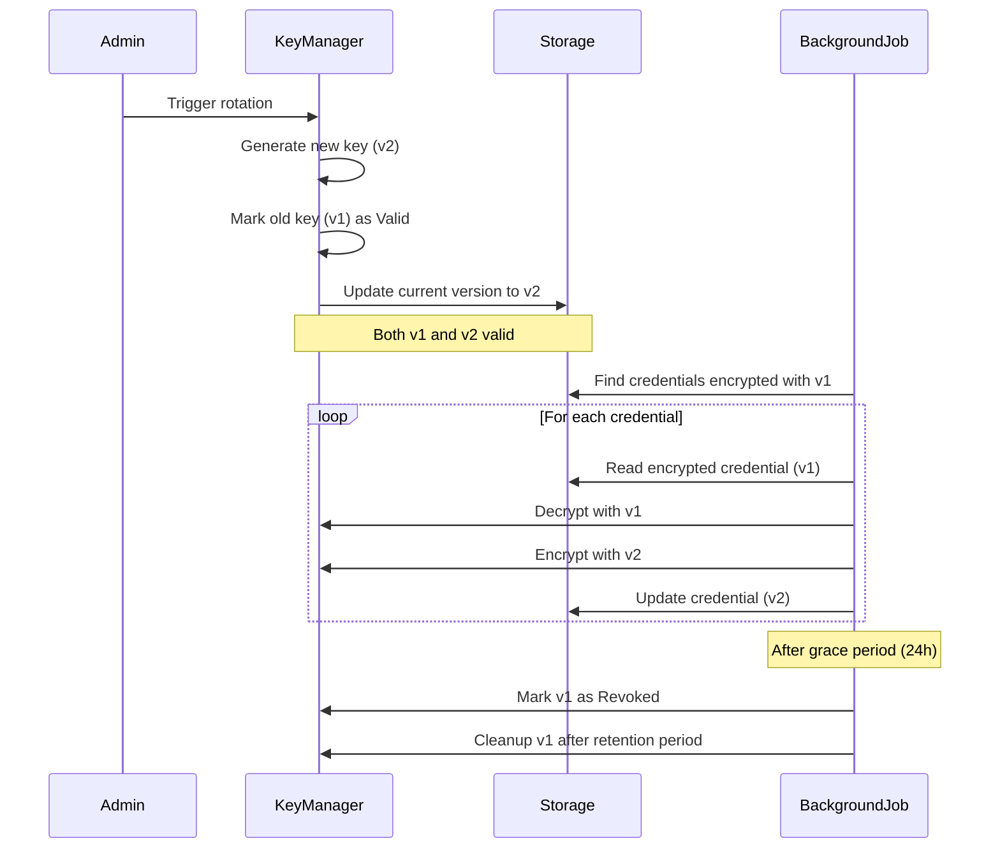

# Key Management

> [!NOTE] Enterprise Key Management
> nebula-credential supports versioned encryption keys with automatic rotation, Hardware Security Module (HSM) integration, and cloud Key Management Service (KMS) providers.

## TL;DR

Key management in nebula-credential:
- **Versioned keys**: Multiple key versions active simultaneously
- **Automatic rotation**: Scheduled rotation with zero downtime
- **Re-encryption**: Transparent re-encryption during rotation
- **HSM/KMS support**: AWS KMS, Azure Key Vault, HashiCorp Vault, PKCS#11 HSM
- **Grace period**: Old keys remain valid during transition

Security engineers can configure rotation policies (periodic, before-expiry, manual) and integrate with existing enterprise key infrastructure.

---

## Overview

Encryption keys are the foundation of credential security. Compromised keys allow attackers to decrypt all stored credentials. nebula-credential implements comprehensive key management:

**Key Features**:
- ✅ **Key versioning**: Track multiple key versions
- ✅ **Rotation support**: Zero-downtime key rotation
- ✅ **Re-encryption**: Background re-encryption of old data
- ✅ **HSM integration**: PKCS#11 interface support
- ✅ **KMS integration**: AWS KMS, Azure Key Vault, HashiCorp Vault
- ✅ **Automatic cleanup**: Remove old keys after grace period
- ✅ **Audit trail**: Log all key operations

---

## Key Versioning

### EncryptionKey Structure

```rust
use zeroize::{Zeroize, ZeroizeOnDrop};

/// Versioned encryption key
#[derive(Clone, Zeroize, ZeroizeOnDrop)]
pub struct VersionedKey {
    version: KeyVersion,
    key: EncryptionKey,
    created_at: DateTime<Utc>,
    expires_at: Option<DateTime<Utc>>,
    status: KeyStatus,
}

#[derive(Debug, Clone, Copy, PartialEq, Eq, Hash)]
pub struct KeyVersion(u32);

#[derive(Debug, Clone, Copy, PartialEq, Eq)]
pub enum KeyStatus {
    Active,        // Current key for encryption
    Valid,         // Can decrypt but not encrypt
    Grace,         // Grace period before revocation
    Revoked,       // No longer usable
}
```

**Key Lifecycle**:


---

### KeyManager Implementation

```rust
use std::collections::HashMap;
use std::sync::Arc;
use tokio::sync::RwLock;

pub struct KeyManager {
    keys: Arc<RwLock<HashMap<KeyVersion, VersionedKey>>>,
    current_version: Arc<RwLock<KeyVersion>>,
    config: KeyManagementConfig,
}

pub struct KeyManagementConfig {
    pub grace_period: Duration,           // Default: 24 hours
    pub max_key_age: Duration,            // Default: 90 days
    pub auto_rotation: bool,              // Default: true
    pub rotation_schedule: RotationSchedule,
    pub retention_policy: KeyRetentionPolicy,
}

impl KeyManager {
    /// Get current encryption key (for new encryptions)
    pub async fn current_key(&self) -> VersionedKey {
        let version = *self.current_version.read().await;
        let keys = self.keys.read().await;
        keys[&version].clone()
    }
    
    /// Get key by version (for decryption)
    pub async fn get_key(&self, version: KeyVersion) -> Result<VersionedKey, KeyError> {
        let keys = self.keys.read().await;
        keys.get(&version)
            .cloned()
            .ok_or(KeyError::KeyNotFound(version))
    }
    
    /// Rotate to new key
    pub async fn rotate(&self) -> Result<KeyVersion, KeyError> {
        let mut keys = self.keys.write().await;
        let mut current = self.current_version.write().await;
        
        // Generate new key
        let new_version = KeyVersion(current.0 + 1);
        let new_key = VersionedKey {
            version: new_version,
            key: EncryptionKey::generate(),
            created_at: Utc::now(),
            expires_at: Some(Utc::now() + self.config.max_key_age),
            status: KeyStatus::Active,
        };
        
        // Mark current key as Valid (can still decrypt)
        if let Some(old_key) = keys.get_mut(&current) {
            old_key.status = KeyStatus::Valid;
        }
        
        // Insert new key
        keys.insert(new_version, new_key);
        *current = new_version;
        
        // Audit log
        self.audit_log(AuditEvent::KeyRotated {
            old_version: *current,
            new_version,
            timestamp: Utc::now(),
        }).await;
        
        // Schedule grace period expiration
        self.schedule_grace_period_expiration(*current).await;
        
        Ok(new_version)
    }
    
    /// Re-encrypt credential with current key
    pub async fn re_encrypt_credential(
        &self,
        encrypted: &EncryptedCredential,
    ) -> Result<EncryptedCredential, KeyError> {
        // Get old key for decryption
        let old_key = self.get_key(encrypted.key_version).await?;
        
        // Get current key for encryption
        let new_key = self.current_key().await;
        
        // Decrypt with old key
        let plaintext = decrypt(&encrypted.ciphertext, &old_key.key, &encrypted.nonce)?;
        
        // Generate new nonce
        let new_nonce = self.nonce_generator.generate()?;
        
        // Encrypt with new key
        let new_ciphertext = encrypt(&plaintext, &new_key.key, &new_nonce)?;
        
        Ok(EncryptedCredential {
            key_version: new_key.version,
            nonce: new_nonce,
            ciphertext: new_ciphertext,
            metadata: encrypted.metadata.clone(),
        })
    }
    
    /// Background re-encryption job
    pub async fn background_re_encryption(&self) -> Result<(), KeyError> {
        let current = *self.current_version.read().await;
        
        // Find all credentials encrypted with old keys
        let old_credentials = self.storage
            .find_by_key_version(|v| v != current)
            .await?;
        
        log::info!("Re-encrypting {} credentials", old_credentials.len());
        
        for credential in old_credentials {
            match self.re_encrypt_credential(&credential).await {
                Ok(re_encrypted) => {
                    self.storage.update(&credential.id, re_encrypted).await?;
                }
                Err(e) => {
                    log::error!("Failed to re-encrypt credential {}: {}", credential.id, e);
                    // Continue with others, don't fail entire job
                }
            }
        }
        
        Ok(())
    }
    
    /// Cleanup old keys after grace period
    pub async fn cleanup_old_keys(&self) -> Result<(), KeyError> {
        let mut keys = self.keys.write().await;
        let current = *self.current_version.read().await;
        
        // Identify keys to remove
        let now = Utc::now();
        let to_remove: Vec<KeyVersion> = keys
            .iter()
            .filter(|(version, key)| {
                // Keep current and previous key
                if **version >= current.0.saturating_sub(1) {
                    return false;
                }
                
                // Remove revoked keys older than retention period
                key.status == KeyStatus::Revoked
                    && key.created_at + self.config.retention_policy.min_retention < now
            })
            .map(|(v, _)| *v)
            .collect();
        
        // Remove keys
        for version in to_remove {
            keys.remove(&version);
            log::info!("Removed old key version {}", version.0);
        }
        
        Ok(())
    }
}
```

---

## Key Rotation Strategies

### 1. Periodic Rotation

**Use Case**: Compliance requirements (SOC 2, PCI DSS, HIPAA)

**Implementation**:
```rust
pub struct PeriodicRotation {
    interval: Duration,  // e.g., 90 days
}

impl RotationStrategy for PeriodicRotation {
    async fn should_rotate(&self, key: &VersionedKey) -> bool {
        Utc::now() - key.created_at > self.interval
    }
}

// Example: Rotate every 90 days
let strategy = PeriodicRotation {
    interval: Duration::days(90),
};
```

**Recommended Intervals**:
- **High security**: 30 days
- **Moderate security**: 90 days
- **Low security**: 180 days
- **Development**: Manual only

---

### 2. Before-Expiry Rotation

**Use Case**: Prevent credential expiration interruptions

**Implementation**:
```rust
pub struct BeforeExpiryRotation {
    threshold: Duration,  // e.g., 7 days before expiry
}

impl RotationStrategy for BeforeExpiryRotation {
    async fn should_rotate(&self, key: &VersionedKey) -> bool {
        if let Some(expires_at) = key.expires_at {
            expires_at - Utc::now() < self.threshold
        } else {
            false
        }
    }
}

// Example: Rotate 7 days before expiry
let strategy = BeforeExpiryRotation {
    threshold: Duration::days(7),
};
```

---

### 3. Scheduled Rotation

**Use Case**: Maintenance windows, off-peak hours

**Implementation**:
```rust
use cron::Schedule;
use std::str::FromStr;

pub struct ScheduledRotation {
    schedule: Schedule,  // Cron expression
}

impl RotationStrategy for ScheduledRotation {
    async fn should_rotate(&self, key: &VersionedKey) -> bool {
        let now = Utc::now();
        let upcoming = self.schedule.upcoming(Utc).take(1).next();
        
        // Check if we're within 5 minutes of scheduled time
        if let Some(next_time) = upcoming {
            (next_time - now).num_minutes().abs() < 5
        } else {
            false
        }
    }
}

// Example: Rotate every Sunday at 2 AM
let strategy = ScheduledRotation {
    schedule: Schedule::from_str("0 2 * * SUN").unwrap(),
};
```

---

### 4. Manual Rotation

**Use Case**: Security incident response, on-demand rotation

**Implementation**:
```rust
pub struct ManualRotation;

impl RotationStrategy for ManualRotation {
    async fn should_rotate(&self, _key: &VersionedKey) -> bool {
        // Never auto-rotate, only manual trigger
        false
    }
}

// Trigger manual rotation
key_manager.rotate().await?;
```

---

## Re-Encryption Process

### Zero-Downtime Re-Encryption

**Strategy**: Background re-encryption with grace period



**Implementation**:
```rust
/// Re-encryption job (runs in background)
pub async fn re_encryption_job(key_manager: Arc<KeyManager>) {
    let mut interval = tokio::time::interval(Duration::from_secs(3600)); // Every hour
    
    loop {
        interval.tick().await;
        
        // Check if rotation occurred
        if let Err(e) = key_manager.background_re_encryption().await {
            log::error!("Re-encryption job failed: {}", e);
            // Don't panic, retry on next iteration
        }
    }
}
```

---

### Partial Re-Encryption

**Strategy**: Re-encrypt high-priority credentials first

```rust
impl KeyManager {
    /// Re-encrypt by priority (high-value credentials first)
    pub async fn priority_re_encryption(&self) -> Result<(), KeyError> {
        let current = *self.current_version.read().await;
        
        // Priority 1: Production credentials
        let prod_creds = self.storage
            .find_by_scope(CredentialScope::Production)
            .filter(|c| c.key_version != current)
            .await?;
        
        for cred in prod_creds {
            self.re_encrypt_credential(&cred).await?;
        }
        
        // Priority 2: User credentials
        let user_creds = self.storage
            .find_by_scope(CredentialScope::User)
            .filter(|c| c.key_version != current)
            .await?;
        
        for cred in user_creds {
            self.re_encrypt_credential(&cred).await?;
        }
        
        // Priority 3: Development credentials
        let dev_creds = self.storage
            .find_by_scope(CredentialScope::Development)
            .filter(|c| c.key_version != current)
            .await?;
        
        for cred in dev_creds {
            self.re_encrypt_credential(&cred).await?;
        }
        
        Ok(())
    }
}
```

---

## HSM Integration

### PKCS#11 Interface

**Use Case**: Hardware Security Module for key storage

```rust
use pkcs11::{Ctx, types::*};

pub struct HsmKeyManager {
    ctx: Ctx,
    slot: CK_SLOT_ID,
    session: CK_SESSION_HANDLE,
}

impl HsmKeyManager {
    /// Initialize HSM connection
    pub fn new(library_path: &str, pin: &[u8]) -> Result<Self, HsmError> {
        let ctx = Ctx::new_and_initialize(library_path)?;
        
        // Get first available slot
        let slots = ctx.get_slot_list(false)?;
        let slot = slots[0];
        
        // Open session
        let session = ctx.open_session(slot, CKF_SERIAL_SESSION | CKF_RW_SESSION, None, None)?;
        
        // Login
        ctx.login(session, CKU_USER, Some(pin))?;
        
        Ok(Self { ctx, slot, session })
    }
    
    /// Generate key in HSM (key never leaves HSM)
    pub fn generate_key(&self, label: &str) -> Result<CK_OBJECT_HANDLE, HsmError> {
        let template = vec![
            CK_ATTRIBUTE::new(CKA_CLASS).with_ck_ulong(&CKO_SECRET_KEY),
            CK_ATTRIBUTE::new(CKA_KEY_TYPE).with_ck_ulong(&CKK_AES),
            CK_ATTRIBUTE::new(CKA_VALUE_LEN).with_ck_ulong(&32), // 256 bits
            CK_ATTRIBUTE::new(CKA_LABEL).with_string(label),
            CK_ATTRIBUTE::new(CKA_ENCRYPT).with_bool(&true),
            CK_ATTRIBUTE::new(CKA_DECRYPT).with_bool(&true),
            CK_ATTRIBUTE::new(CKA_EXTRACTABLE).with_bool(&false), // Key cannot be extracted
            CK_ATTRIBUTE::new(CKA_SENSITIVE).with_bool(&true),
        ];
        
        let mechanism = CK_MECHANISM {
            mechanism: CKM_AES_KEY_GEN,
            pParameter: std::ptr::null_mut(),
            ulParameterLen: 0,
        };
        
        let key_handle = self.ctx.generate_key(self.session, &mechanism, &template)?;
        Ok(key_handle)
    }
    
    /// Encrypt using HSM (data sent to HSM, encrypted, returned)
    pub fn encrypt_hsm(
        &self,
        key_handle: CK_OBJECT_HANDLE,
        plaintext: &[u8],
        nonce: &[u8; 12],
    ) -> Result<Vec<u8>, HsmError> {
        // AES-GCM mechanism
        let gcm_params = CK_GCM_PARAMS {
            pIv: nonce.as_ptr() as *mut _,
            ulIvLen: nonce.len() as CK_ULONG,
            pAAD: std::ptr::null_mut(),
            ulAADLen: 0,
            ulTagBits: 128,
        };
        
        let mechanism = CK_MECHANISM {
            mechanism: CKM_AES_GCM,
            pParameter: &gcm_params as *const _ as *mut _,
            ulParameterLen: std::mem::size_of::<CK_GCM_PARAMS>() as CK_ULONG,
        };
        
        // Initialize encryption
        self.ctx.encrypt_init(self.session, &mechanism, key_handle)?;
        
        // Encrypt
        let ciphertext = self.ctx.encrypt(self.session, plaintext)?;
        Ok(ciphertext)
    }
    
    /// Decrypt using HSM
    pub fn decrypt_hsm(
        &self,
        key_handle: CK_OBJECT_HANDLE,
        ciphertext: &[u8],
        nonce: &[u8; 12],
    ) -> Result<Vec<u8>, HsmError> {
        let gcm_params = CK_GCM_PARAMS {
            pIv: nonce.as_ptr() as *mut _,
            ulIvLen: nonce.len() as CK_ULONG,
            pAAD: std::ptr::null_mut(),
            ulAADLen: 0,
            ulTagBits: 128,
        };
        
        let mechanism = CK_MECHANISM {
            mechanism: CKM_AES_GCM,
            pParameter: &gcm_params as *const _ as *mut _,
            ulParameterLen: std::mem::size_of::<CK_GCM_PARAMS>() as CK_ULONG,
        };
        
        self.ctx.decrypt_init(self.session, &mechanism, key_handle)?;
        let plaintext = self.ctx.decrypt(self.session, ciphertext)?;
        Ok(plaintext)
    }
}
```

**Benefits**:
- Keys never leave HSM (cannot be extracted)
- FIPS 140-2 Level 3 compliance possible
- Tamper-resistant hardware
- Physical security

**Drawbacks**:
- Higher latency (~10-50ms vs <1ms for software)
- More expensive
- Requires hardware deployment

---

## KMS Integration

### AWS KMS

**Use Case**: AWS-native credential management

```rust
use aws_sdk_kms::{Client, types::DataKeySpec};

pub struct AwsKmsKeyManager {
    client: Client,
    key_id: String,  // CMK (Customer Master Key) ID
}

impl AwsKmsKeyManager {
    pub async fn new(key_id: String) -> Self {
        let config = aws_config::load_from_env().await;
        let client = Client::new(&config);
        Self { client, key_id }
    }
    
    /// Generate data key (encrypted + plaintext)
    pub async fn generate_data_key(&self) -> Result<(Vec<u8>, Vec<u8>), AwsError> {
        let response = self.client
            .generate_data_key()
            .key_id(&self.key_id)
            .key_spec(DataKeySpec::Aes256)  // 256-bit key
            .send()
            .await?;
        
        let plaintext = response.plaintext()
            .ok_or(AwsError::MissingPlaintext)?
            .as_ref()
            .to_vec();
        
        let ciphertext_blob = response.ciphertext_blob()
            .ok_or(AwsError::MissingCiphertext)?
            .as_ref()
            .to_vec();
        
        Ok((plaintext, ciphertext_blob))
    }
    
    /// Decrypt data key (get plaintext from encrypted blob)
    pub async fn decrypt_data_key(&self, encrypted_key: &[u8]) -> Result<Vec<u8>, AwsError> {
        let response = self.client
            .decrypt()
            .key_id(&self.key_id)
            .ciphertext_blob(Blob::new(encrypted_key))
            .send()
            .await?;
        
        let plaintext = response.plaintext()
            .ok_or(AwsError::MissingPlaintext)?
            .as_ref()
            .to_vec();
        
        Ok(plaintext)
    }
}

/// Encrypt credential using AWS KMS envelope encryption
pub async fn encrypt_with_kms(
    kms: &AwsKmsKeyManager,
    plaintext: &[u8],
) -> Result<KmsEncryptedData, AwsError> {
    // Generate new data key for each credential
    let (data_key, encrypted_data_key) = kms.generate_data_key().await?;
    
    // Use data key to encrypt credential
    let nonce = generate_nonce();
    let ciphertext = aes_gcm_encrypt(plaintext, &data_key, &nonce)?;
    
    // Zeroize plaintext data key
    let mut data_key = data_key;
    data_key.zeroize();
    
    Ok(KmsEncryptedData {
        encrypted_data_key,
        ciphertext,
        nonce,
    })
}
```

**Envelope Encryption**:
```
1. KMS generates data key (DEK)
2. KMS encrypts DEK with CMK
3. Application receives: plaintext DEK + encrypted DEK
4. Application encrypts credential with plaintext DEK
5. Application stores: encrypted DEK + encrypted credential
6. Application zeroizes plaintext DEK

To decrypt:
1. Application sends encrypted DEK to KMS
2. KMS decrypts DEK with CMK
3. Application receives plaintext DEK
4. Application decrypts credential with DEK
5. Application zeroizes plaintext DEK
```

---

### Azure Key Vault

**Use Case**: Azure-native credential management

```rust
use azure_security_keyvault::KeyClient;
use azure_identity::DefaultAzureCredential;

pub struct AzureKeyManager {
    client: KeyClient,
    key_name: String,
}

impl AzureKeyManager {
    pub async fn new(vault_url: &str, key_name: String) -> Result<Self, AzureError> {
        let credential = DefaultAzureCredential::default();
        let client = KeyClient::new(vault_url, credential)?;
        
        Ok(Self { client, key_name })
    }
    
    /// Encrypt using Azure Key Vault
    pub async fn encrypt_azure(
        &self,
        plaintext: &[u8],
    ) -> Result<Vec<u8>, AzureError> {
        let result = self.client
            .encrypt(&self.key_name, EncryptionAlgorithm::RsaOaep256, plaintext)
            .await?;
        
        Ok(result.ciphertext)
    }
    
    /// Decrypt using Azure Key Vault
    pub async fn decrypt_azure(
        &self,
        ciphertext: &[u8],
    ) -> Result<Vec<u8>, AzureError> {
        let result = self.client
            .decrypt(&self.key_name, EncryptionAlgorithm::RsaOaep256, ciphertext)
            .await?;
        
        Ok(result.plaintext)
    }
}
```

---

### HashiCorp Vault Transit Engine

**Use Case**: Multi-cloud, cloud-agnostic key management

```rust
use vaultrs::client::{VaultClient, VaultClientSettingsBuilder};
use vaultrs::transit;

pub struct VaultKeyManager {
    client: VaultClient,
    mount: String,
    key_name: String,
}

impl VaultKeyManager {
    pub async fn new(
        vault_addr: &str,
        token: &str,
        mount: String,
        key_name: String,
    ) -> Result<Self, VaultError> {
        let client = VaultClient::new(
            VaultClientSettingsBuilder::default()
                .address(vault_addr)
                .token(token)
                .build()?,
        )?;
        
        Ok(Self { client, mount, key_name })
    }
    
    /// Encrypt using Vault Transit engine
    pub async fn encrypt_vault(
        &self,
        plaintext: &[u8],
    ) -> Result<String, VaultError> {
        let ciphertext = transit::data::encrypt(
            &self.client,
            &self.mount,
            &self.key_name,
            base64::encode(plaintext),
            None,
        ).await?;
        
        Ok(ciphertext.ciphertext)
    }
    
    /// Decrypt using Vault Transit engine
    pub async fn decrypt_vault(
        &self,
        ciphertext: &str,
    ) -> Result<Vec<u8>, VaultError> {
        let plaintext = transit::data::decrypt(
            &self.client,
            &self.mount,
            &self.key_name,
            ciphertext,
            None,
        ).await?;
        
        let decoded = base64::decode(plaintext.plaintext)?;
        Ok(decoded)
    }
    
    /// Rotate Vault encryption key
    pub async fn rotate_vault_key(&self) -> Result<(), VaultError> {
        transit::key::rotate(
            &self.client,
            &self.mount,
            &self.key_name,
        ).await?;
        
        Ok(())
    }
    
    /// Rewrap data (re-encrypt with latest key version)
    pub async fn rewrap_vault(
        &self,
        ciphertext: &str,
    ) -> Result<String, VaultError> {
        let result = transit::data::rewrap(
            &self.client,
            &self.mount,
            &self.key_name,
            ciphertext,
            None,
        ).await?;
        
        Ok(result.ciphertext)
    }
}
```

**Vault Benefits**:
- **Zero-knowledge rotation**: Rewrap without decrypting
- **Key versioning**: Built-in version tracking
- **Multi-tenant**: Separate keys per tenant
- **Audit logging**: All operations logged

---

## Key Retention Policies

### Retention Policy Types

```rust
pub enum KeyRetentionPolicy {
    /// Keep keys for minimum duration
    MinimumRetention {
        min_retention: Duration,  // e.g., 90 days
    },
    
    /// Keep last N key versions
    VersionBased {
        max_versions: usize,  // e.g., 3 versions
    },
    
    /// Keep until all credentials re-encrypted
    UntilReEncrypted,
    
    /// Custom policy
    Custom(Box<dyn Fn(&VersionedKey) -> bool + Send + Sync>),
}

impl KeyRetentionPolicy {
    /// Check if key can be deleted
    pub fn can_delete(&self, key: &VersionedKey, current_version: KeyVersion) -> bool {
        match self {
            Self::MinimumRetention { min_retention } => {
                Utc::now() - key.created_at > *min_retention
            }
            
            Self::VersionBased { max_versions } => {
                current_version.0 - key.version.0 >= *max_versions as u32
            }
            
            Self::UntilReEncrypted => {
                // Check if any credentials still use this key
                // (implementation depends on storage backend)
                false
            }
            
            Self::Custom(predicate) => {
                predicate(key)
            }
        }
    }
}
```

**Recommended Policies**:

| Use Case | Policy | Rationale |
|----------|--------|-----------|
| **High security** | VersionBased { max_versions: 2 } | Minimize exposure window |
| **Compliance** | MinimumRetention { 90 days } | Meet audit requirements |
| **Operational** | UntilReEncrypted | Ensure all data re-encrypted |
| **Development** | VersionBased { max_versions: 5 } | Debugging, rollback |

---

## Monitoring & Alerting

### Key Metrics

```rust
/// Metrics for key management
pub struct KeyMetrics {
    /// Active key versions
    pub active_versions: Gauge,
    
    /// Key rotation events
    pub rotation_events: Counter,
    
    /// Re-encryption progress
    pub re_encryption_progress: Gauge,
    
    /// Key age (current key)
    pub current_key_age_days: Gauge,
    
    /// Credentials per key version
    pub credentials_per_version: HashMap<KeyVersion, u64>,
}
```

**Alert Rules**:

| Metric | Threshold | Action |
|--------|-----------|--------|
| **current_key_age_days** | >80 days | Schedule rotation |
| **rotation_events** | 0 in 100 days | Verify auto-rotation enabled |
| **re_encryption_progress** | <50% after 7 days | Investigate slow re-encryption |
| **active_versions** | >5 | Cleanup old keys |
| **key_access_errors** | >1% of requests | Check key availability |

---

## Best Practices

### 1. Key Generation

```rust
// ✅ GOOD: Use cryptographically secure RNG
let key = EncryptionKey::generate();

// ❌ BAD: Predictable key
let key = EncryptionKey::from_bytes([0u8; 32]);
```

### 2. Key Storage

```rust
// ✅ GOOD: Use HSM or KMS
let kms_key = aws_kms.generate_data_key().await?;

// ❌ BAD: Store in environment variable
let key = std::env::var("ENCRYPTION_KEY")?;  // Leaks in process list
```

### 3. Key Rotation

```rust
// ✅ GOOD: Automatic rotation with grace period
key_manager.config.auto_rotation = true;
key_manager.config.grace_period = Duration::hours(24);

// ❌ BAD: Manual rotation only, no grace period
key_manager.config.auto_rotation = false;
// Risk: Forget to rotate, sudden cutover breaks decryption
```

### 4. Re-Encryption

```rust
// ✅ GOOD: Background re-encryption
tokio::spawn(async move {
    key_manager.background_re_encryption().await
});

// ❌ BAD: Synchronous re-encryption blocking API
key_manager.re_encrypt_all_credentials()?;  // Blocks for minutes!
```

---

## Troubleshooting

### Issue: Decryption Fails After Rotation

**Symptoms**:
```
Error: DecryptionFailed
Key version: 5 (not found)
```

**Cause**: Old key version deleted before all credentials re-encrypted

**Solution**:
```rust
// Check re-encryption status
let old_credentials = storage.find_by_key_version(|v| v != current).await?;
println!("Credentials pending re-encryption: {}", old_credentials.len());

// Manually re-encrypt
for cred in old_credentials {
    key_manager.re_encrypt_credential(&cred).await?;
}
```

---

### Issue: HSM Connection Failures

**Symptoms**:
```
Error: HsmError::SessionClosed
```

**Cause**: HSM session expired or network issue

**Solution**:
```rust
// Implement connection retry
async fn with_hsm_retry<F, T>(f: F) -> Result<T, HsmError>
where
    F: Fn() -> Result<T, HsmError>,
{
    for attempt in 1..=3 {
        match f() {
            Ok(result) => return Ok(result),
            Err(e) if attempt < 3 => {
                log::warn!("HSM operation failed (attempt {}): {}", attempt, e);
                tokio::time::sleep(Duration::from_secs(1)).await;
            }
            Err(e) => return Err(e),
        }
    }
    unreachable!()
}
```

---

## See Also

- [[Security/Encryption|Encryption Deep Dive]]
- [[Advanced/Security-Architecture|Security Architecture]]
- [[How-To/Rotate-Credentials|Credential Rotation Guide]]
- [[Advanced/Rotation-Policies|Rotation Policies]]
- [[Integrations/AWS-Secrets-Manager|AWS Secrets Manager Integration]]
- [[Integrations/HashiCorp-Vault|HashiCorp Vault Integration]]
- [[Integrations/Azure-Key-Vault|Azure Key Vault Integration]]
- [[Troubleshooting/Decryption-Failures|Troubleshooting Decryption Issues]]
