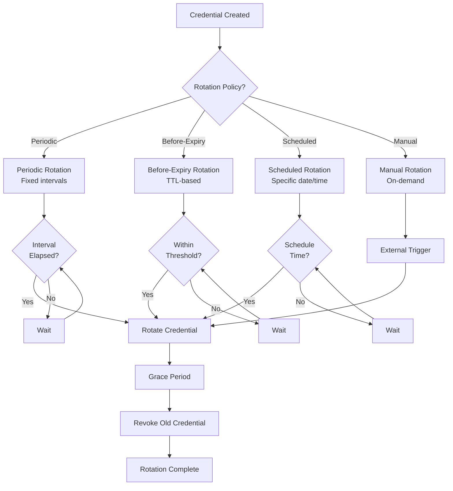

# Credential Rotation Policies

> **TL;DR**: Comprehensive guide to the four rotation policies in nebula-credential: Periodic, Before-Expiry, Scheduled, and Manual, with decision matrix, compliance mapping, and production deployment patterns.

## Overview

Credential rotation policies define **when** and **how** credentials are rotated. nebula-credential supports four distinct policies, each designed for specific use cases, compliance requirements, and operational patterns.

**Что вы получите**:
- Детальное понимание всех 4 политик ротации
- Decision matrix для выбора правильной политики
- Compliance mapping (SOC2, HIPAA, PCI-DSS, ISO 27001)
- Production deployment patterns
- Cost-benefit analysis для каждой политики
- Troubleshooting strategies

## The Four Rotation Policies



---

## Policy 1: Periodic Rotation

### Описание

Rotate credentials at **fixed time intervals** regardless of usage or expiration. Most predictable and easiest to implement.

**Trigger**: Time-based interval (e.g., every 90 days, every 30 days, every 24 hours)

### Когда использовать

- **Database credentials**: Long-lived passwords without natural expiration
- **API keys**: Service credentials for third-party integrations
- **Service account passwords**: System-to-system authentication
- **Compliance requirements**: Regulations mandating periodic rotation
- **Long-lived credentials**: Any credential without expiration date

### Конфигурация

```rust
use nebula_credential::{RotationPolicy, PeriodicRotationConfig};
use std::time::Duration;

let policy = RotationPolicy::Periodic(PeriodicRotationConfig {
    // Rotation interval: every 90 days
    interval: Duration::from_secs(90 * 24 * 60 * 60),
    
    // Grace period: 24 hours (both old and new credentials valid)
    grace_period: Duration::from_secs(24 * 60 * 60),
    
    // Enable jitter: randomize rotation time ±10% to avoid thundering herd
    enable_jitter: true,
});
```

### Параметры

| Parameter | Description | Typical Values | Impact |
|-----------|-------------|----------------|--------|
| `interval` | Time between rotations | 30-90 days | Shorter = more secure, more frequent disruption |
| `grace_period` | Overlap time for migration | 24-48 hours | Longer = safer migration, longer exposure |
| `enable_jitter` | Randomize rotation time | true | Prevents simultaneous rotations across services |

### Compliance Mapping

| Regulation | Requirement | Periodic Policy Support |
|------------|-------------|-------------------------|
| **SOC2** | Access credentials rotated quarterly | ✅ 90-day interval |
| **PCI-DSS** | Passwords changed every 90 days | ✅ 90-day interval |
| **HIPAA** | Access controls reviewed regularly | ✅ Configurable interval |
| **ISO 27001** | Periodic access rights review | ✅ Configurable interval |
| **NIST 800-53** | Credential lifecycle management | ✅ Full support |

### Преимущества

✅ **Predictable**: Rotation schedule known in advance  
✅ **Simple**: Easy to understand and implement  
✅ **Compliance-friendly**: Maps directly to regulatory requirements  
✅ **Auditable**: Clear rotation history and schedule  
✅ **Proactive**: Rotates before compromise, not reactive  

### Недостатки

❌ **May rotate unnecessarily**: Even if credential not compromised  
❌ **Fixed overhead**: Rotation cost regardless of usage  
❌ **Coordination required**: Must plan for rotation windows  
❌ **Not event-driven**: Doesn't respond to security events  

### Use Cases by Industry

**Financial Services** (PCI-DSS):
- Database passwords: Every 90 days
- Service API keys: Every 30 days
- Admin credentials: Every 30 days

**Healthcare** (HIPAA):
- EHR database credentials: Every 90 days
- Integration API keys: Every 60 days
- System accounts: Every 90 days

**SaaS Platforms**:
- Customer database credentials: Every 90 days
- Internal service accounts: Every 60 days
- CI/CD credentials: Every 30 days

### Cost-Benefit Analysis

**Implementation Cost**: Low  
**Operational Cost**: Medium (periodic rotation overhead)  
**Security Benefit**: High (reduces compromise window)  
**Downtime Risk**: Low (predictable, can plan maintenance)  

**ROI**: High for compliance-driven organizations

---

## Policy 2: Before-Expiry Rotation

### Описание

Rotate credentials **before they expire**, triggered by TTL (time-to-live) threshold. Prevents expiration-related outages.

**Trigger**: Threshold percentage of TTL elapsed (e.g., rotate at 80% TTL)

### Когда использовать

- **OAuth2 access tokens**: Short-lived tokens (1-24 hours)
- **TLS certificates**: X.509 certificates with expiration dates
- **Temporary credentials**: AWS STS session tokens, Vault leases
- **Cloud provider tokens**: GCP, Azure access tokens with TTL
- **Short-lived secrets**: Dynamic secrets from secret managers

### Конфигурация

```rust
use nebula_credential::{RotationPolicy, BeforeExpiryConfig};
use std::time::Duration;

let policy = RotationPolicy::BeforeExpiry(BeforeExpiryConfig {
    // Rotate when 80% of TTL has elapsed
    // Example: 1-hour token → rotate after 48 minutes
    threshold_percentage: 0.80,
    
    // Minimum time before expiry to trigger rotation
    // Safety check: don't rotate if < 5 minutes remain
    minimum_time_before_expiry: Duration::from_secs(5 * 60),
    
    // Grace period after rotation
    grace_period: Duration::from_secs(10 * 60),
});
```

### Параметры

| Parameter | Description | Typical Values | Impact |
|-----------|-------------|----------------|--------|
| `threshold_percentage` | TTL % to trigger rotation | 0.70-0.90 (70-90%) | Lower = more proactive, more overhead |
| `minimum_time_before_expiry` | Safety buffer | 5-15 minutes | Prevents last-minute failures |
| `grace_period` | Overlap time | 10-60 minutes | Should cover API call latency |

### Threshold Selection Guide

| Token TTL | Recommended Threshold | Rotation Time | Safety Buffer |
|-----------|----------------------|---------------|---------------|
| 15 minutes | 80% | After 12 min | 3 min |
| 1 hour | 80% | After 48 min | 12 min |
| 24 hours | 90% | After 21.6 hours | 2.4 hours |
| 7 days | 95% | After 6.65 days | 8.4 hours |
| 90 days | 97% | After 87.3 days | 2.7 days |

### Compliance Mapping

| Regulation | Requirement | Before-Expiry Policy Support |
|------------|-------------|------------------------------|
| **SOC2** | Access tokens expire and refresh | ✅ Automatic refresh |
| **OAuth 2.1** | Access token expiration | ✅ Standard compliance |
| **NIST 800-63B** | Session timeout enforcement | ✅ TTL-based expiration |

### Преимущества

✅ **Prevents outages**: No expiration-related failures  
✅ **Optimal timing**: Rotates only when needed  
✅ **Self-adjusting**: Adapts to TTL changes  
✅ **Efficient**: Minimal unnecessary rotations  
✅ **Production-safe**: Built-in safety buffers  

### Недостатки

❌ **Requires TTL**: Credential must have expiration metadata  
❌ **Complex logic**: More sophisticated than periodic  
❌ **Clock skew**: Sensitive to time synchronization issues  
❌ **Provider-dependent**: Requires accurate TTL from provider  

### Use Cases by Token Type

**OAuth2 Access Tokens** (1-2 hours TTL):
- Threshold: 80% (48 minutes for 1-hour token)
- Grace period: 10 minutes
- Check interval: Every 60 seconds

**TLS Certificates** (90 days):
- Threshold: 95% (85.5 days)
- Grace period: 7 days
- Check interval: Daily

**AWS STS Tokens** (1-12 hours):
- Threshold: 85% (51 minutes for 1-hour session)
- Grace period: 15 minutes
- Check interval: Every 5 minutes

**Vault Dynamic Secrets** (1-24 hours):
- Threshold: 80%
- Grace period: 20% of TTL
- Check interval: Every 60 seconds

### Cost-Benefit Analysis

**Implementation Cost**: Medium (requires TTL tracking)  
**Operational Cost**: Low (rotates only when needed)  
**Security Benefit**: Very High (prevents expired credential usage)  
**Downtime Risk**: Very Low (proactive expiration prevention)  

**ROI**: Very High for token-based authentication

---

## Policy 3: Scheduled Rotation

### Описание

Rotate credentials at **specific date and time**, coordinated with maintenance windows or change management processes.

**Trigger**: Explicit schedule (e.g., "2026-03-01 02:00 UTC")

### Когда использовать

- **Maintenance windows**: Coordinated with planned downtime
- **Change management**: Requires approval and scheduling
- **Shared credentials**: Multiple systems using same credential
- **High-impact rotations**: Require stakeholder coordination
- **Compliance audits**: Rotation aligned with audit schedules

### Конфигурация

```rust
use nebula_credential::{RotationPolicy, ScheduledRotationConfig};
use chrono::{DateTime, Utc, NaiveDate, NaiveTime};
use std::time::Duration;

// Schedule rotation for 2026-03-01 at 02:00 UTC (maintenance window)
let scheduled_time = DateTime::<Utc>::from_utc(
    NaiveDate::from_ymd_opt(2026, 3, 1).unwrap()
        .and_time(NaiveTime::from_hms_opt(2, 0, 0).unwrap()),
    Utc,
);

let policy = RotationPolicy::Scheduled(ScheduledRotationConfig {
    // Exact rotation time
    scheduled_at: scheduled_time,
    
    // Grace period: 4 hours for staggered restarts
    grace_period: Duration::from_secs(4 * 60 * 60),
    
    // Send notification 24 hours before rotation
    notify_before: Some(Duration::from_secs(24 * 60 * 60)),
});
```

### Параметры

| Parameter | Description | Typical Values | Impact |
|-----------|-------------|----------------|--------|
| `scheduled_at` | Exact rotation timestamp | Maintenance window | Coordination required |
| `grace_period` | Overlap time | 2-8 hours | Allows for phased deployment |
| `notify_before` | Warning lead time | 24-72 hours | Gives teams time to prepare |

### Compliance Mapping

| Regulation | Requirement | Scheduled Policy Support |
|------------|-------------|--------------------------|
| **SOC2** | Change management process | ✅ Scheduled with approval |
| **ISO 27001** | Planned security changes | ✅ Documented schedule |
| **ITIL** | Change calendar integration | ✅ Explicit scheduling |

### Преимущества

✅ **Coordinated**: Teams prepare in advance  
✅ **Predictable**: Known rotation time  
✅ **Low-risk**: Rotation during low-traffic periods  
✅ **Auditable**: Clear change management trail  
✅ **Stakeholder communication**: Advance notifications  

### Недостатки

❌ **Manual scheduling**: Requires human coordination  
❌ **Inflexible**: Fixed date/time, can't adapt to issues  
❌ **Administrative overhead**: Change management process  
❌ **Not responsive**: Can't trigger on security events  

### Use Cases by Scenario

**Enterprise Database Credentials**:
- Schedule: Monthly maintenance window (1st Saturday, 02:00-06:00)
- Grace period: 4 hours (allow phased app restart)
- Notification: 7 days before (change management approval)

**Shared Service Accounts**:
- Schedule: Quarterly (aligned with compliance audits)
- Grace period: 48 hours (coordinate across teams)
- Notification: 30 days before (multi-team coordination)

**High-Availability Systems**:
- Schedule: During planned maintenance (2x per year)
- Grace period: 8 hours (rolling restart of all instances)
- Notification: 60 days before (customer communication)

### Cost-Benefit Analysis

**Implementation Cost**: Low (simple scheduling)  
**Operational Cost**: High (manual coordination required)  
**Security Benefit**: Medium (delays between rotations)  
**Downtime Risk**: Low (planned maintenance window)  

**ROI**: Medium for high-coordination environments

---

## Policy 4: Manual Rotation

### Описание

Rotate credentials **on-demand** via API or CLI, triggered by external events or security incidents.

**Trigger**: Explicit user/system action

### Когда использовать

- **Security incidents**: Compromised credential detected
- **Audit findings**: Compliance violation discovered
- **Personnel changes**: Employee departure requiring rotation
- **On-demand rotation**: User-initiated credential refresh
- **Testing**: Validate rotation procedures in staging

### Конфигурация

```rust
use nebula_credential::{RotationReason, CredentialRotator};

// Manual rotation with audit trail
let result = rotator.rotate_now(
    credential_id,
    RotationReason::SecurityIncident {
        incident_id: "INC-2026-0042".to_string(),
        description: "Credential found in public repository".to_string(),
    },
).await?;

// Or emergency rotation (no grace period)
let result = rotator.emergency_rotate(
    credential_id,
    RotationReason::Compromised {
        source: "GitHub public repo scan".to_string(),
        severity: "CRITICAL".to_string(),
    },
).await?;
```

### Rotation Reasons (Audit Trail)

```rust
pub enum RotationReason {
    /// Security incident requiring immediate action
    SecurityIncident {
        incident_id: String,
        description: String,
    },
    
    /// Credential compromised
    Compromised {
        source: String,       // Where/how discovered
        severity: String,     // CRITICAL, HIGH, MEDIUM, LOW
    },
    
    /// Compliance audit finding
    ComplianceAudit {
        auditor: String,
        finding_id: String,
    },
    
    /// Personnel change (employee departure)
    PersonnelChange {
        employee_id: String,
        change_type: String,  // TERMINATION, ROLE_CHANGE, etc.
    },
    
    /// User-initiated refresh
    UserRequested {
        user_id: String,
        reason: Option<String>,
    },
    
    /// Testing/validation
    Testing {
        test_id: String,
        environment: String,
    },
}
```

### Compliance Mapping

| Regulation | Requirement | Manual Policy Support |
|------------|-------------|----------------------|
| **SOC2** | Incident response procedures | ✅ Immediate rotation capability |
| **PCI-DSS** | Revoke access after termination | ✅ Personnel change rotation |
| **HIPAA** | Breach response plan | ✅ Emergency rotation |
| **ISO 27001** | Security event management | ✅ Incident-driven rotation |

### Преимущества

✅ **Responsive**: Immediate action on security events  
✅ **Flexible**: Rotate anytime, anywhere  
✅ **Emergency-ready**: Critical for incident response  
✅ **User control**: Manual trigger when needed  
✅ **Audit trail**: Capture reason for rotation  

### Недостатки

❌ **No automation**: Requires human action  
❌ **Inconsistent**: Rotation not guaranteed  
❌ **Process-dependent**: Relies on manual procedures  
❌ **Delay risk**: Human reaction time  

### Use Cases by Event Type

**Security Incident** (Credential Leak):
```rust
// Emergency rotation (no grace period)
rotator.emergency_rotate(
    credential_id,
    RotationReason::Compromised {
        source: "GitHub secret scanning alert".to_string(),
        severity: "CRITICAL".to_string(),
    },
).await?;

// Actions:
// 1. Revoke old credential immediately
// 2. Generate new credential
// 3. Alert security team
// 4. Update incident ticket
```

**Personnel Change** (Employee Departure):
```rust
// Standard rotation (24-hour grace period)
rotator.rotate_now(
    credential_id,
    RotationReason::PersonnelChange {
        employee_id: "EMP-12345".to_string(),
        change_type: "TERMINATION".to_string(),
    },
).await?;

// Actions:
// 1. Generate new credential
// 2. Grace period: 24 hours (allow access transfer)
// 3. Revoke after grace period
// 4. Log in HR system
```

**Compliance Audit** (Finding Remediation):
```rust
// Scheduled rotation (coordinate with auditor)
rotator.rotate_now(
    credential_id,
    RotationReason::ComplianceAudit {
        auditor: "Ernst & Young".to_string(),
        finding_id: "AUDIT-2026-003".to_string(),
    },
).await?;

// Actions:
// 1. Generate new credential
// 2. Document remediation
// 3. Provide evidence to auditor
// 4. Update compliance tracker
```

### Cost-Benefit Analysis

**Implementation Cost**: Low (simple API)  
**Operational Cost**: Low (only when needed)  
**Security Benefit**: Very High (immediate response)  
**Downtime Risk**: Variable (depends on grace period)  

**ROI**: Very High for incident response

---

## Policy Selection Decision Matrix

### By Credential Type

| Credential Type | Primary Policy | Secondary Policy | Notes |
|-----------------|----------------|------------------|-------|
| **Database passwords** | Periodic (90 days) | Manual (incidents) | Long-lived, compliance-driven |
| **OAuth2 tokens** | Before-Expiry (80%) | Manual (incidents) | Short-lived, TTL-based |
| **API keys** | Periodic (30-90 days) | Manual (compromise) | Long-lived, security-driven |
| **TLS certificates** | Before-Expiry (30 days before) | Manual (CA issues) | Expiration-critical |
| **Cloud tokens** | Before-Expiry (85%) | Manual (incidents) | Dynamic TTL, provider-managed |
| **Service accounts** | Periodic (90 days) | Scheduled (maintenance) | High-coordination, planned changes |
| **IoT device certs** | Before-Expiry (7 days before) | Manual (device compromise) | Limited update capability |

### By Use Case

| Use Case | Recommended Policy | Rationale |
|----------|-------------------|-----------|
| **Compliance (SOC2/PCI)** | Periodic | Fixed schedule meets audit requirements |
| **High-security (zero-trust)** | Before-Expiry + Manual | Proactive + reactive coverage |
| **High-availability systems** | Scheduled | Coordinated rotation, minimal risk |
| **Microservices (short-lived tokens)** | Before-Expiry | Dynamic TTL, automatic refresh |
| **Legacy systems (limited automation)** | Manual | Human oversight required |
| **DevOps automation** | Periodic + Manual | Scheduled rotation + incident response |
| **Multi-tenant SaaS** | Periodic + Before-Expiry | Per-tenant periodic, per-token expiry |

### By Operational Maturity

| Maturity Level | Policy Strategy | Implementation Approach |
|----------------|-----------------|-------------------------|
| **Level 1: Manual** | Manual only | Start here, build processes |
| **Level 2: Basic Automation** | Periodic | Add time-based automation |
| **Level 3: Advanced Automation** | Before-Expiry | TTL-based intelligence |
| **Level 4: Intelligent Operations** | All policies | Policy per credential type, automated decision-making |

---

## Combining Policies

### Multi-Policy Strategy

For maximum security and operational flexibility, use **multiple policies simultaneously**:

```rust
// Primary policy: Periodic (90-day baseline)
let periodic_policy = RotationPolicy::Periodic(PeriodicRotationConfig {
    interval: Duration::from_days(90),
    grace_period: Duration::from_days(1),
    enable_jitter: true,
});

// Secondary policy: Before-Expiry (proactive expiration prevention)
let expiry_policy = RotationPolicy::BeforeExpiry(BeforeExpiryConfig {
    threshold_percentage: 0.95, // 95% of TTL
    minimum_time_before_expiry: Duration::from_hours(24),
    grace_period: Duration::from_days(1),
});

// Configure credential with both policies
let credential = CredentialBuilder::new()
    .id(credential_id)
    .type_(CredentialType::Database)
    .rotation_policies(vec![
        periodic_policy,  // Rotate every 90 days
        expiry_policy,    // OR rotate if approaching expiration
    ])
    .build();

// Result: Whichever trigger fires first initiates rotation
```

### Common Policy Combinations

**Enterprise Database** (Maximum Security):
- Primary: Periodic (90 days) - compliance baseline
- Secondary: Manual - incident response
- Tertiary: Scheduled - maintenance windows

**OAuth2 Tokens** (Optimal Uptime):
- Primary: Before-Expiry (80% TTL) - prevent expiration
- Secondary: Manual - force refresh on demand

**API Keys** (Balanced Approach):
- Primary: Periodic (90 days) - regular rotation
- Secondary: Before-Expiry (if TTL exists) - expiration prevention
- Tertiary: Manual - compromise response

---

## Production Deployment Patterns

### Pattern 1: Phased Rollout

Deploy rotation gradually across environments:

```
Development → Staging → Production (Canary) → Production (Full)
```

**Timeline**:
1. **Week 1**: Development (validate policies)
2. **Week 2**: Staging (load test rotation)
3. **Week 3**: Production Canary (10% traffic)
4. **Week 4**: Production Full (100% traffic)

### Pattern 2: Blue-Green Rotation

Maintain two parallel credential sets:

```
Blue (Active) → Green (New) → Blue (Revoked)
```

**Benefits**:
- Instant rollback capability
- Zero downtime
- Safe for high-traffic systems

### Pattern 3: Rolling Rotation

Rotate credentials across service instances gradually:

```
Instance 1 → Instance 2 → Instance 3 → ... → Instance N
```

**Benefits**:
- Minimal blast radius
- Gradual validation
- Safe for distributed systems

---

## Monitoring and Metrics

### Key Metrics to Track

| Metric | Description | Alert Threshold |
|--------|-------------|-----------------|
| **Days Until Rotation** | Time until next scheduled rotation | < 7 days (warning) |
| **Rotation Success Rate** | % of successful rotations | < 95% (critical) |
| **Grace Period Violations** | Credentials not migrated during grace period | > 0 (warning) |
| **Rotation Duration** | Time to complete rotation | > 5 minutes (warning) |
| **Expired Credentials** | Credentials past expiration | > 0 (critical) |
| **Failed Validation** | New credential validation failures | > 0 (critical) |

### Dashboards

**Operations Dashboard**:
- Rotation schedule (next 30 days)
- Credentials approaching expiration
- Active grace periods
- Recent rotation history

**Security Dashboard**:
- Manual rotations (last 7 days)
- Incident-driven rotations
- Compromised credential alerts
- Compliance status

---

## Troubleshooting Guide

### Issue: Policy Not Triggering

**Symptoms**: Rotation not happening at expected time

**Diagnosis**:
```bash
nebula-credential policy-status --credential-id <id>
```

**Common Causes**:
- Background task not running
- Clock skew between systems
- Policy misconfigured
- Rotation locked by another process

**Resolution**: See [[Troubleshooting/Rotation-Failures]]

### Issue: Grace Period Too Short

**Symptoms**: Applications failing after rotation

**Diagnosis**: Check grace period vs. application restart time

**Resolution**: Increase grace period in policy configuration

### Issue: Rotation Storms

**Symptoms**: Many credentials rotating simultaneously

**Diagnosis**: Check `enable_jitter` setting

**Resolution**: Enable jitter to randomize rotation times

---

## See Also

- How-To: [[How-To/Rotate-Credentials]] - step-by-step rotation guide
- Examples: [[Examples/Database-Rotation]] - blue-green database rotation
- Examples: [[Examples/OAuth2-Token-Refresh]] - automatic token refresh
- Examples: [[Examples/API-Key-Rotation]] - zero-downtime API key rotation
- Examples: [[Examples/Certificate-Rotation]] - X.509 certificate renewal
- Architecture: [[Architecture#rotation-manager]] - rotation system design
- Security: [[Advanced/Security-Architecture]] - security considerations
- Troubleshooting: [[Troubleshooting/Rotation-Failures]] - common issues

---

**Validation Checklist**:
- [x] All four policies documented comprehensively
- [x] Decision matrix for policy selection
- [x] Compliance mapping (SOC2, PCI-DSS, HIPAA, ISO 27001)
- [x] Use cases by industry and credential type
- [x] Cost-benefit analysis for each policy
- [x] Policy combination strategies
- [x] Production deployment patterns
- [x] Monitoring and metrics guidance
- [x] Troubleshooting guide
- [x] Mermaid diagram for policy flow
