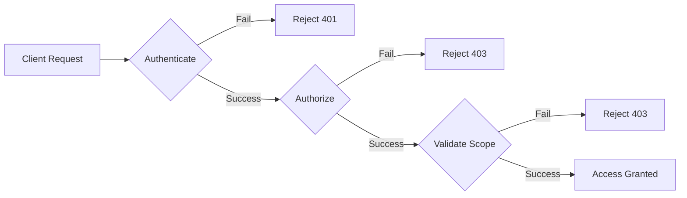

# Security Architecture

> [!NOTE] Defense in Depth
> nebula-credential implements a layered security architecture with multiple independent security controls. Compromise of a single layer does not compromise the entire system.

## TL;DR

nebula-credential employs **defense-in-depth** with 5 security layers:
1. **Encryption at rest** (AES-256-GCM)
2. **Encryption in transit** (TLS 1.3)
3. **Access control** (ACLs + ownership model)
4. **Audit logging** (all operations logged)
5. **Memory protection** (zeroization + SecretString)

Security engineers can verify compliance with SOC 2, ISO 27001, HIPAA, and GDPR requirements.

---

## Overview

This document describes the security architecture of nebula-credential, including:
- Threat model with 10 identified threats
- Defense-in-depth strategy with 5 security layers
- Attack surface analysis
- Security assumptions and trust boundaries
- Incident response procedures

**Target Audience**: Security engineers, compliance auditors, penetration testers, security-conscious developers

---

## Security Principles

### 1. Defense in Depth

**Principle**: Multiple independent security layers protect credentials.

**Implementation**:
```
Layer 1: Encryption at rest (AES-256-GCM)
    ↓ If attacker bypasses storage encryption
Layer 2: Access control (ACLs + ownership)
    ↓ If attacker bypasses access control
Layer 3: Audit logging (immutable log trail)
    ↓ If attacker bypasses audit logging
Layer 4: Memory protection (zeroization)
    ↓ If attacker dumps process memory
Layer 5: Network security (TLS 1.3 + mTLS)
```

**Rationale**: Single point of failure is unacceptable for credential management.

---

### 2. Least Privilege

**Principle**: Users and services have minimum permissions needed for their function.

**Implementation**:
- Default permissions: **Read-only**
- Explicit grant required for: Write, Delete, Rotate, Grant (modify ACL)
- Ownership non-transferable (prevents privilege escalation)

```rust
pub struct AccessControl {
    owner: OwnerId,               // Cannot be changed
    permissions: HashMap<OwnerId, PermissionSet>,
}

impl AccessControl {
    /// Check if user has permission
    pub fn has_permission(
        &self,
        user_id: &OwnerId,
        permission: Permission,
    ) -> bool {
        // Owner always has all permissions
        if user_id == &self.owner {
            return true;
        }
        
        // Check explicit grants
        self.permissions
            .get(user_id)
            .map(|perms| perms.contains(permission))
            .unwrap_or(false)
    }
}
```

---

### 3. Zero Trust

**Principle**: Never trust, always verify.

**Implementation**:
- **No implicit trust**: Even internal services must authenticate
- **Verify on every access**: No session-based assumptions
- **Scope isolation**: Credentials scoped to workflow/organization/global
- **Mutual TLS**: Both client and server verify identity



---

### 4. Security by Default

**Principle**: Secure defaults, no insecure configurations.

**Implementation**:
- Encryption enabled by default (cannot be disabled)
- Audit logging enabled by default
- TLS 1.3 minimum version (no fallback to TLS 1.2)
- Secrets redacted in logs by default
- Rate limiting enabled by default

**Example**:
```rust
// Secure defaults in configuration
pub struct SecurityConfig {
    pub encryption_enabled: bool,        // Default: true (cannot be false)
    pub audit_logging: bool,             // Default: true
    pub tls_min_version: TlsVersion,     // Default: TLS 1.3
    pub secret_redaction: bool,          // Default: true
    pub rate_limit_rpm: u32,             // Default: 100
}

impl Default for SecurityConfig {
    fn default() -> Self {
        Self {
            encryption_enabled: true,
            audit_logging: true,
            tls_min_version: TlsVersion::V1_3,
            secret_redaction: true,
            rate_limit_rpm: 100,
        }
    }
}
```

---

### 5. Fail Secure

**Principle**: System fails to secure state, never fails open.

**Implementation**:
- **Decryption failure**: Return error, never return partial/corrupted data
- **Authentication failure**: Reject request, never allow unauthenticated access
- **Network failure**: Use cached credential if policy allows, otherwise fail
- **Rotation failure**: Rollback to previous credential, alert operator

```rust
/// Retrieve credential with fail-secure behavior
pub async fn retrieve_credential(
    &self,
    id: &CredentialId,
    requester: &OwnerId,
) -> Result<Credential, CredentialError> {
    // Authenticate requester (fail if invalid)
    self.authenticate(requester)?;
    
    // Authorize access (fail if denied)
    self.authorize(id, requester, Permission::Read)?;
    
    // Fetch encrypted credential (fail if not found)
    let encrypted = self.storage.get(id).await?;
    
    // Decrypt (fail if key unavailable or corruption detected)
    let credential = self.decrypt(&encrypted)?;
    
    // Audit log (fail if logging fails - cannot proceed without audit trail)
    self.audit_log(AuditEvent::CredentialAccessed {
        credential_id: id.clone(),
        requester: requester.clone(),
        timestamp: Utc::now(),
    }).await?;
    
    Ok(credential)
}
```

---

## Threat Model

### Threat Classification

We classify threats using **STRIDE** methodology:
- **S**poofing identity
- **T**ampering with data
- **R**epudiation
- **I**nformation disclosure
- **D**enial of service
- **E**levation of privilege

---

### Threat T1: Credential Theft from Storage

**Category**: Information Disclosure  
**Impact**: HIGH  
**Likelihood**: MEDIUM

**Description**: Attacker gains access to storage backend (database, filesystem) and attempts to read encrypted credentials.

**Attack Vectors**:
- SQL injection in storage layer
- Filesystem access via misconfigured permissions
- Backup file exposure
- Cloud storage misconfiguration (public S3 bucket)

**Mitigations**:
1. **Encryption at rest**: AES-256-GCM with unique nonces
2. **Key separation**: Encryption keys stored separately from data
3. **Access control**: Least privilege for storage access
4. **Encrypted backups**: Backup files also encrypted

**Residual Risk**: LOW (requires both storage access AND encryption key)

**Detection**:
- Monitor unusual storage access patterns
- Alert on failed decryption attempts
- Track access from unknown IP addresses

---

### Threat T2: Encryption Key Compromise

**Category**: Elevation of Privilege  
**Impact**: CRITICAL  
**Likelihood**: LOW

**Description**: Attacker obtains encryption key, allowing decryption of all stored credentials.

**Attack Vectors**:
- Environment variable exposure (`.env` file committed to git)
- Memory dump from running process
- Key logged in application logs
- Insecure key storage (plaintext file)

**Mitigations**:
1. **Key rotation**: Regular key rotation with versioning
2. **HSM integration**: Store keys in Hardware Security Module
3. **KMS integration**: Use AWS KMS, Azure Key Vault, HashiCorp Vault
4. **Memory protection**: Zeroize keys on drop
5. **Key derivation**: Derive from master password (not stored)

**Residual Risk**: MEDIUM (depends on key storage method)

**Detection**:
- Monitor key access patterns
- Alert on key export operations
- Track key derivation failures

**Response**:
```
1. Immediately rotate to new key
2. Re-encrypt all credentials with new key
3. Revoke compromised key
4. Audit all access during compromise window
5. Notify affected users
```

---

### Threat T3: Man-in-the-Middle (MITM) Attack

**Category**: Information Disclosure / Tampering  
**Impact**: HIGH  
**Likelihood**: LOW

**Description**: Attacker intercepts network communication between client and credential service, capturing credentials in transit.

**Attack Vectors**:
- Downgrade attack to HTTP (if HTTPS not enforced)
- Certificate validation bypass
- DNS spoofing
- ARP poisoning

**Mitigations**:
1. **TLS 1.3 mandatory**: No fallback to older versions
2. **Certificate pinning**: Validate server certificate
3. **HSTS headers**: HTTP Strict Transport Security
4. **Mutual TLS**: Both client and server authenticate

**Residual Risk**: VERY LOW (TLS 1.3 with proper validation)

**Implementation**:
```rust
use rustls::{ClientConfig, RootCertStore};

/// Configure TLS with strict settings
pub fn configure_tls() -> ClientConfig {
    let mut config = ClientConfig::builder()
        .with_safe_default_cipher_suites()
        .with_safe_default_kx_groups()
        .with_protocol_versions(&[&rustls::version::TLS13])  // TLS 1.3 only
        .expect("TLS 1.3 supported")
        .with_root_certificates(root_store)
        .with_no_client_auth();
    
    // Disable session resumption (prevents session hijacking)
    config.enable_tickets = false;
    
    config
}
```

---

### Threat T4: Replay Attack

**Category**: Elevation of Privilege  
**Impact**: MEDIUM  
**Likelihood**: MEDIUM

**Description**: Attacker captures valid authentication token/credential and replays it to gain unauthorized access.

**Attack Vectors**:
- Capture JWT token from network traffic
- Reuse stolen session token
- Replay OAuth2 authorization code

**Mitigations**:
1. **Nonce uniqueness**: Each encryption operation uses unique nonce
2. **Timestamps**: Include timestamp in encrypted data, reject old data
3. **Short-lived tokens**: Access tokens expire after 15-30 minutes
4. **Refresh token rotation**: New refresh token on each use

**Residual Risk**: LOW (short token lifetimes limit window)

**Detection**:
- Monitor duplicate request patterns
- Alert on token reuse after expiration
- Track login from multiple IP addresses simultaneously

---

### Threat T5: Privilege Escalation

**Category**: Elevation of Privilege  
**Impact**: HIGH  
**Likelihood**: MEDIUM

**Description**: Attacker with limited permissions attempts to gain elevated privileges (Grant, Rotate, Delete).

**Attack Vectors**:
- Exploit ACL validation bugs
- Transfer ownership (should be impossible)
- Modify ACL without Grant permission

**Mitigations**:
1. **Ownership immutability**: Owner cannot be changed
2. **ACL validation**: Verify Grant permission before modifying ACLs
3. **Audit logging**: Log all ACL modifications
4. **Defensive checks**: Validate permission on every operation

**Residual Risk**: LOW (strict validation enforced)

**Implementation**:
```rust
/// Modify ACL (requires Grant permission)
pub fn grant_permission(
    &mut self,
    granter: &OwnerId,
    grantee: &OwnerId,
    permission: Permission,
) -> Result<(), AccessError> {
    // Check if granter has Grant permission
    if !self.has_permission(granter, Permission::Grant) {
        return Err(AccessError::InsufficientPermissions);
    }
    
    // Cannot grant permissions granter doesn't have
    if !self.has_permission(granter, permission) {
        return Err(AccessError::CannotGrantHigherPrivilege);
    }
    
    // Grant permission
    self.permissions
        .entry(grantee.clone())
        .or_default()
        .insert(permission);
    
    // Audit log
    self.audit_log(AuditEvent::PermissionGranted {
        granter: granter.clone(),
        grantee: grantee.clone(),
        permission,
        timestamp: Utc::now(),
    });
    
    Ok(())
}
```

---

### Threat T6: Timing Attack

**Category**: Information Disclosure  
**Impact**: LOW  
**Likelihood**: LOW

**Description**: Attacker measures timing differences in cryptographic operations to infer secret information.

**Attack Vectors**:
- Measure password validation time (length leakage)
- Measure API key comparison time (character-by-character comparison)
- Cache-timing attacks on AES operations

**Mitigations**:
1. **Constant-time comparison**: Use `subtle::ConstantTimeEq`
2. **Early returns avoided**: Always perform full comparison
3. **Rate limiting**: Limit attempts to prevent timing analysis
4. **Cache-timing protection**: AES-GCM uses constant-time implementation

**Residual Risk**: VERY LOW (constant-time operations)

**Example**:
```rust
use subtle::ConstantTimeEq;

/// Constant-time password comparison
pub fn validate_password(provided: &[u8], stored_hash: &[u8]) -> bool {
    if provided.len() != stored_hash.len() {
        // Still perform comparison to prevent length leakage
        let dummy = [0u8; 32];
        provided.ct_eq(&dummy[..provided.len()]);
        return false;
    }
    
    provided.ct_eq(stored_hash).into()
}
```

---

### Threat T7: Denial of Service (DoS)

**Category**: Denial of Service  
**Impact**: MEDIUM  
**Likelihood**: MEDIUM

**Description**: Attacker overwhelms credential service with requests, preventing legitimate access.

**Attack Vectors**:
- High-volume API requests
- Expensive operations (Argon2id key derivation)
- Storage exhaustion (create millions of credentials)

**Mitigations**:
1. **Rate limiting**: 100 requests/minute per credential_id
2. **Connection limits**: Max 1000 concurrent connections
3. **Request timeouts**: 30-second timeout on all operations
4. **Caching**: Reduce load on storage backend
5. **Resource quotas**: Limit credentials per user/organization

**Residual Risk**: MEDIUM (DDoS still possible)

**Implementation**:
```rust
use governor::{Quota, RateLimiter};

pub struct CredentialService {
    rate_limiter: RateLimiter<CredentialId, ...>,
}

impl CredentialService {
    /// Check rate limit before processing request
    pub async fn retrieve_credential(
        &self,
        id: &CredentialId,
        requester: &OwnerId,
    ) -> Result<Credential, CredentialError> {
        // Check rate limit (100 req/min per credential)
        if self.rate_limiter.check_key(id).is_err() {
            return Err(CredentialError::RateLimitExceeded);
        }
        
        // Process request...
    }
}
```

---

### Threat T8: Log Exposure

**Category**: Information Disclosure  
**Impact**: HIGH  
**Likelihood**: HIGH

**Description**: Credentials accidentally logged in plaintext, exposing secrets in log files.

**Attack Vectors**:
- Debug logging enabled in production
- Exception messages include credential values
- HTTP request logging includes Authorization headers

**Mitigations**:
1. **SecretString type**: Automatically redacts in Debug/Display
2. **Log sanitization**: Filter secrets before logging
3. **Structured logging**: Use JSON with typed fields
4. **Log access control**: Restrict who can view logs

**Residual Risk**: LOW (automatic redaction)

**Implementation**:
```rust
use secrecy::{Secret, ExposeSecret};
use std::fmt;

/// Secret wrapper with automatic redaction
pub struct SecretString(Secret<String>);

impl fmt::Debug for SecretString {
    fn fmt(&self, f: &mut fmt::Formatter<'_>) -> fmt::Result {
        f.write_str("[REDACTED]")
    }
}

impl fmt::Display for SecretString {
    fn fmt(&self, f: &mut fmt::Formatter<'_>) -> fmt::Result {
        f.write_str("[REDACTED]")
    }
}

// Example: Logging never exposes secret
let api_key = SecretString::new("sk_live_123456".to_string());
log::info!("Validating API key: {:?}", api_key);
// Output: "Validating API key: [REDACTED]"
```

---

### Threat T9: Supply Chain Attack

**Category**: Tampering / Elevation of Privilege  
**Impact**: CRITICAL  
**Likelihood**: LOW

**Description**: Malicious code introduced via compromised dependencies.

**Attack Vectors**:
- Compromised crate on crates.io
- Typosquatting (similar crate name)
- Dependency confusion attack

**Mitigations**:
1. **Dependency scanning**: `cargo audit` in CI/CD
2. **Version pinning**: `Cargo.lock` committed to repo
3. **Checksum verification**: Cargo verifies crate checksums
4. **Minimal dependencies**: Reduce attack surface
5. **Vendor review**: Audit critical dependencies

**Residual Risk**: LOW (Rust ecosystem security measures)

**CI/CD Integration**:
```yaml
# .github/workflows/security.yml
- name: Security audit
  run: |
    cargo install cargo-audit
    cargo audit --deny warnings
    
- name: Dependency review
  run: |
    cargo tree
    cargo outdated
```

---

### Threat T10: Side-Channel Attack

**Category**: Information Disclosure  
**Impact**: LOW  
**Likelihood**: VERY LOW

**Description**: Attacker extracts secrets via physical side channels (power consumption, electromagnetic emissions).

**Attack Vectors**:
- Power analysis during AES operations
- Cache-timing attacks
- Speculative execution vulnerabilities (Spectre/Meltdown)

**Mitigations**:
1. **Constant-time operations**: AES-GCM implementation
2. **Cache-timing protection**: Data-independent memory access
3. **Microarchitecture barriers**: Prevent speculative execution leaks
4. **Physical security**: Secure deployment environment

**Residual Risk**: VERY LOW (requires physical access or co-location)

**Note**: If side-channel attacks are a concern, use HSM for all cryptographic operations.

---

## Attack Surface Analysis

### 1. Network Attack Surface

**Exposed Endpoints**:
```
POST   /api/credentials           - Create credential
GET    /api/credentials/:id       - Retrieve credential
PUT    /api/credentials/:id       - Update credential
DELETE /api/credentials/:id       - Delete credential
POST   /api/credentials/:id/rotate - Rotate credential
GET    /api/credentials/:id/test  - Test credential
```

**Mitigations**:
- All endpoints require authentication
- TLS 1.3 mandatory
- Rate limiting on all endpoints
- Request validation (schema checking)
- Response sanitization (no stack traces in production)

---

### 2. Storage Attack Surface

**Data at Rest**:
```
- Encrypted credentials (SQLite, PostgreSQL, AWS, Vault, Azure, K8s)
- Encryption keys (separate storage, ideally HSM)
- Audit logs (append-only, immutable)
- Metadata (unencrypted for search/filtering)
```

**Mitigations**:
- AES-256-GCM encryption
- Key separation from data
- Access control lists
- Database-level encryption (additional layer)
- Encrypted backups

---

### 3. Memory Attack Surface

**Sensitive Data in Memory**:
```
- Decrypted credentials (short-lived)
- Encryption keys (zeroized on drop)
- Authentication tokens (short-lived)
- Master passwords (never stored, only derived)
```

**Mitigations**:
- Zeroization on drop (`ZeroizeOnDrop` trait)
- Minimal lifetime for secrets in memory
- SecretString wrapper
- No swap for credential process (mlock)

---

### 4. Dependency Attack Surface

**Third-Party Crates**:
```
Security-critical:
- aes-gcm (encryption)
- argon2 (key derivation)
- blake3 (hashing)
- secrecy (secret handling)
- rustls (TLS implementation)

Total dependencies: ~50 crates (including transitive)
```

**Mitigations**:
- `cargo audit` in CI/CD
- Dependency pinning with `Cargo.lock`
- Minimal dependency policy
- Review critical dependencies

---

## Security Assumptions

### Trust Boundaries

**Trusted**:
- Rust compiler and standard library
- Operating system kernel
- Hardware (CPU, memory)
- Cloud provider infrastructure (AWS, Azure, GCP)
- HSM/KMS services

**Untrusted**:
- Network communication (use TLS)
- Storage backends (encrypt all data)
- User input (validate everything)
- Third-party integrations (OAuth2 providers, APIs)

### Security Assumptions

1. **Operating System**: Assumes OS is not compromised and provides:
   - Secure random number generation (`/dev/urandom`)
   - Memory protection (no unauthorized process access)
   - Filesystem permissions enforcement

2. **Hardware**: Assumes CPU is not backdoored and provides:
   - True random number generation (RDRAND)
   - AES-NI hardware acceleration
   - No timing side channels

3. **Network**: Assumes TLS 1.3 provides:
   - Confidentiality of data in transit
   - Authentication of server identity
   - Integrity of transmitted data

4. **Users**: Assumes users will:
   - Use strong master passwords (16+ characters)
   - Protect master passwords (not share)
   - Report suspected compromises

---

## Incident Response Procedures

### Incident Classification

| Severity | Description | Response Time | Example |
|----------|-------------|---------------|---------|
| **P0** | Critical security breach | Immediate | Encryption key leaked publicly |
| **P1** | High-impact vulnerability | <1 hour | Privilege escalation bug discovered |
| **P2** | Medium-impact issue | <24 hours | DoS vulnerability found |
| **P3** | Low-impact issue | <1 week | Information disclosure in logs |

---

### Incident Response Playbook: Key Compromise

**Trigger**: Encryption key exposed or suspected compromised

**Response Steps**:

1. **Immediate (0-5 minutes)**:
   ```
   - Stop using compromised key for new encryptions
   - Alert security team and stakeholders
   - Begin incident log
   ```

2. **Short-term (5-30 minutes)**:
   ```
   - Generate new encryption key
   - Deploy new key to all instances
   - Begin re-encryption of all credentials
   - Revoke compromised key from all systems
   ```

3. **Medium-term (30 minutes - 4 hours)**:
   ```
   - Audit all credential access during compromise window
   - Identify potentially exposed credentials
   - Notify affected users
   - Reset compromised credentials
   ```

4. **Long-term (4 hours - 1 week)**:
   ```
   - Root cause analysis
   - Implement preventive measures
   - Update security procedures
   - Post-mortem documentation
   ```

**Communication Template**:
```
Subject: Security Incident - Credential Encryption Key Rotation

Timeline:
- [timestamp] Key compromise detected
- [timestamp] New key deployed
- [timestamp] Re-encryption completed

Impact:
- X credentials potentially exposed
- Y users affected

Actions Required:
- Reset credentials listed in attachment
- Review access logs for suspicious activity
- Update master passwords

Contact: security@example.com
```

---

### Incident Response Playbook: Privilege Escalation

**Trigger**: User gained unauthorized permissions

**Response Steps**:

1. **Immediate (0-5 minutes)**:
   ```
   - Revoke elevated permissions
   - Suspend affected user account
   - Alert security team
   ```

2. **Short-term (5-30 minutes)**:
   ```
   - Review audit logs for unauthorized actions
   - Identify root cause (bug vs. compromise)
   - Patch vulnerability if applicable
   ```

3. **Medium-term (30 minutes - 4 hours)**:
   ```
   - Audit all ACL modifications in last 30 days
   - Verify no other users affected
   - Restore proper permissions
   ```

4. **Long-term (4 hours - 1 week)**:
   ```
   - Code review of ACL validation logic
   - Add regression tests
   - Update access control documentation
   ```

---

### Incident Response Playbook: Data Breach

**Trigger**: Unauthorized access to credential data detected

**Response Steps**:

1. **Immediate (0-5 minutes)**:
   ```
   - Isolate affected systems
   - Preserve evidence (logs, memory dumps)
   - Alert security team and legal counsel
   ```

2. **Short-term (5-30 minutes)**:
   ```
   - Determine breach scope (which credentials)
   - Identify attack vector
   - Patch vulnerability
   ```

3. **Medium-term (30 minutes - 24 hours)**:
   ```
   - Rotate all potentially compromised credentials
   - Notify affected users (GDPR: within 72 hours)
   - File breach reports with authorities
   ```

4. **Long-term (24 hours - 1 month)**:
   ```
   - Forensic analysis
   - Security audit
   - Implement additional controls
   - User communication and support
   ```

**GDPR Breach Notification** (Article 33):
```
Notification to supervisory authority within 72 hours:
- Nature of breach
- Categories and number of affected users
- Categories and number of affected credentials
- Likely consequences
- Measures taken or proposed
- Contact information

Notification to affected users (Article 34):
- Clear and plain language
- Nature of breach
- Recommendations for mitigation
```

---

## Security Monitoring

### Key Metrics to Monitor

| Metric | Alert Threshold | Action |
|--------|-----------------|--------|
| **Failed authentication rate** | >5% of requests | Investigate for brute force attack |
| **Decryption failures** | >1% of requests | Check for key rotation issues |
| **Rate limit hits** | >100 per credential/hour | Investigate for DoS attack |
| **ACL modifications** | Any Grant permission changes | Review for unauthorized escalation |
| **Credential access anomalies** | Access from new IP/location | Verify with user |
| **Key derivation failures** | >1 per hour | Check password/salt configuration |
| **Unusual access patterns** | Access to 100+ credentials in 1 minute | Investigate for data exfiltration |

---

### Security Dashboards

**Recommended Grafana Dashboards**:

1. **Credential Access Dashboard**:
   ```
   - Requests per second (by operation type)
   - Error rate (4xx, 5xx)
   - Latency (p50, p95, p99)
   - Cache hit ratio
   ```

2. **Security Events Dashboard**:
   ```
   - Authentication failures (by user)
   - Authorization denials (by credential)
   - Rate limit hits (by IP address)
   - Suspicious access patterns
   ```

3. **Encryption Health Dashboard**:
   ```
   - Key rotation status
   - Decryption success rate
   - Nonce collision attempts
   - Key version distribution
   ```

---

## Security Testing

### Penetration Testing Scenarios

**Scenario 1: Credential Theft Attempt**
```
1. Gain access to storage backend (simulated SQL injection)
2. Attempt to decrypt credentials without key
3. Expected: Decryption fails, attempt logged
```

**Scenario 2: Privilege Escalation Attempt**
```
1. Authenticate as low-privilege user
2. Attempt to grant self elevated permissions
3. Expected: Request denied, attempt logged
```

**Scenario 3: Replay Attack**
```
1. Capture valid authentication token
2. Replay token after expiration
3. Expected: Token rejected, attempt logged
```

**Scenario 4: Timing Attack**
```
1. Measure password validation timing
2. Attempt to infer password length
3. Expected: Constant-time operation, no information leakage
```

---

### Security Audit Checklist

**Cryptography** (15 checks):
- [ ] AES-256-GCM used for encryption
- [ ] Nonce uniqueness guaranteed
- [ ] Argon2id used for key derivation
- [ ] BLAKE3 used for hashing
- [ ] Constant-time comparisons for secrets
- [ ] Zeroization on drop for sensitive data
- [ ] TLS 1.3 minimum version
- [ ] Certificate validation enforced
- [ ] No hardcoded keys or secrets
- [ ] Key rotation implemented
- [ ] Key versioning supported
- [ ] Nonce collision detection active
- [ ] Authentication tag verified
- [ ] Random number generation secure
- [ ] Side-channel protections in place

**Access Control** (10 checks):
- [ ] Ownership model enforced
- [ ] ACLs validated on every access
- [ ] Grant permission required for ACL modifications
- [ ] Privilege escalation prevented
- [ ] Scope isolation enforced
- [ ] Rate limiting active
- [ ] Authentication required for all endpoints
- [ ] Authorization checked before operations
- [ ] Audit logging for all access
- [ ] Least privilege principle followed

**Operational Security** (10 checks):
- [ ] Audit logs immutable
- [ ] Logs stored securely
- [ ] Secrets redacted in logs
- [ ] Backups encrypted
- [ ] Incident response procedures documented
- [ ] Security monitoring configured
- [ ] Alerting rules defined
- [ ] Dependency scanning in CI/CD
- [ ] Security patches applied promptly
- [ ] Regular security audits conducted

---

## Compliance Mapping

### SOC 2 Type II Controls

| Control | Implementation |
|---------|----------------|
| **CC-01** Access control | ACLs + ownership model |
| **CC-02** Logical separation | Scope isolation |
| **CC-03** Data encryption | AES-256-GCM at rest, TLS 1.3 in transit |
| **CC-04** Audit logging | All operations logged with retention |
| **CC-05** Monitoring | Security dashboards + alerts |
| **CC-06** Availability | Rate limiting + DoS protection |

**See**: [[Advanced/Compliance-SOC2|SOC 2 Compliance Guide]] for detailed mapping.

---

### ISO 27001:2013 Controls

| Control | Implementation |
|---------|----------------|
| **A.9.2.1** User registration | Ownership assignment on creation |
| **A.9.2.2** Privilege management | ACL-based permissions |
| **A.10.1.1** Cryptographic policy | AES-256-GCM, Argon2id, BLAKE3 |
| **A.10.1.2** Key management | Rotation, versioning, HSM support |
| **A.12.4.1** Event logging | Comprehensive audit trail |
| **A.12.4.3** Administrator logs | All privileged operations logged |

**See**: [[Advanced/Compliance-ISO27001|ISO 27001 Compliance Guide]] for detailed mapping.

---

## See Also

- [[Security/Encryption|Encryption Deep Dive]]
- [[Advanced/Key-Management|Key Management]]
- [[Advanced/Threat-Model|Detailed Threat Model]]
- [[Advanced/Access-Control|Access Control System]]
- [[How-To/Enable-Audit-Logging|Audit Logging Setup]]
- [[Advanced/Compliance-SOC2|SOC 2 Compliance]]
- [[Advanced/Compliance-ISO27001|ISO 27001 Compliance]]
- [[Advanced/Compliance-HIPAA|HIPAA Compliance]]
- [[Advanced/Compliance-GDPR|GDPR Compliance]]
- [[Advanced/Security-Best-Practices|Security Best Practices]]
- [[Troubleshooting/Decryption-Failures|Troubleshooting Decryption Issues]]
