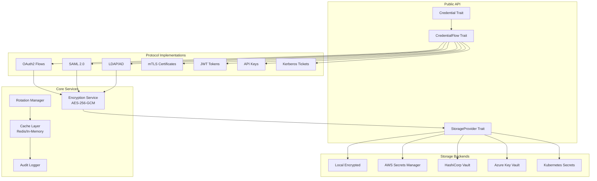
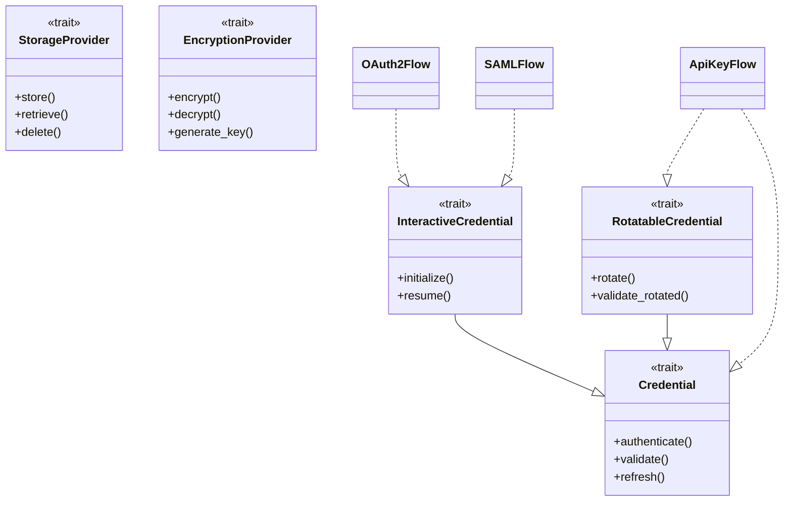
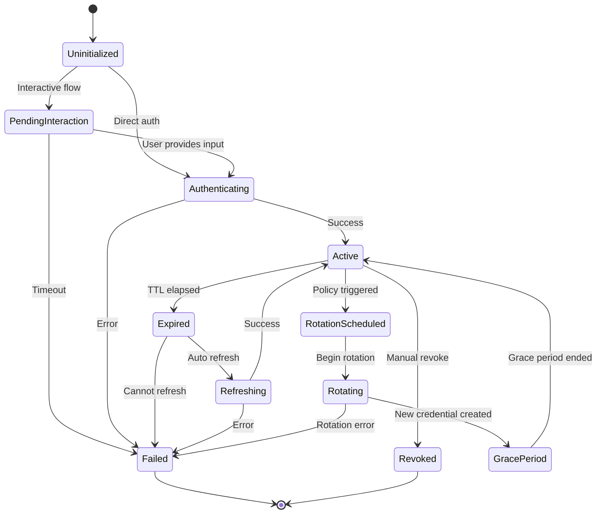

# nebula-credential Architecture

> [!NOTE] Complete Architectural Design
> This document describes the complete architecture of nebula-credential from the ground up, leveraging Rust 1.93+ features (async traits, GATs, const generics, type-state pattern) and supporting all major authentication protocols.

**Design Goals**:
1. **Protocol-Agnostic** - OAuth2, SAML, LDAP, mTLS, JWT, API Keys, Kerberos
2. **Type-Safe** - Compile-time verification using Rust's type system
3. **Zero-Copy** - Minimal allocations for sensitive data with zeroization
4. **Production-Ready** - Audit logging, metrics, rotation, distributed coordination

---

## Table of Contents

1. [Overview](#overview)
2. [Core Principles](#core-principles)
3. [Trait Hierarchy](#trait-hierarchy)
4. [Type System Design](#type-system-design)
5. [Protocol Support Matrix](#protocol-support-matrix)
6. [State Machine Architecture](#state-machine-architecture)
7. [Storage Abstraction](#storage-abstraction)
8. [Security Model](#security-model)
9. [Concurrency Model](#concurrency-model)
10. [Extension Points](#extension-points)

---

## Overview

### System Goals

nebula-credential is a **universal credential management system** for workflow automation that:

1. **Protocol-Agnostic**: Supports OAuth2, SAML, LDAP, mTLS, JWT, API Keys, Kerberos, SSO
2. **Type-Safe**: Leverages Rust's type system for compile-time verification
3. **Zero-Copy**: Minimal allocations for sensitive data
4. **Async-First**: Built on Tokio for high-performance async I/O
5. **Extensible**: Easy to add new authentication protocols
6. **Production-Ready**: Audit logging, metrics, rotation, distributed coordination

### High-Level Architecture



---

## Core Principles

### 1. Type-State Pattern

**Principle**: Use Rust's type system to enforce state transitions at compile time.

**Example**:
```rust
// State types
struct Uninitialized;
struct Interactive;
struct Authenticated;

// Generic over state
struct OAuth2Flow<State> {
    config: OAuth2Config,
    _state: PhantomData<State>,
}

// Only certain methods available in certain states
impl OAuth2Flow<Uninitialized> {
    pub fn start(self) -> OAuth2Flow<Interactive> { /* ... */ }
}

impl OAuth2Flow<Interactive> {
    pub async fn complete(self, code: String) -> OAuth2Flow<Authenticated> { /* ... */ }
}

impl OAuth2Flow<Authenticated> {
    pub fn access_token(&self) -> &SecretString { /* ... */ }
}
```

**Benefits**:
- Impossible to call methods in wrong state
- Compiler enforces correct flow
- No runtime state checking needed

### 2. Zero-Copy Secrets

**Principle**: Sensitive data never copied unnecessarily, always zeroized on drop.

```rust
use zeroize::{Zeroize, ZeroizeOnDrop};

#[derive(Zeroize, ZeroizeOnDrop)]
pub struct SecretString {
    inner: String,
}

impl SecretString {
    pub fn new(s: impl Into<String>) -> Self {
        Self { inner: s.into() }
    }
    
    // Explicit access, makes usage auditable
    pub fn expose(&self) -> &str {
        &self.inner
    }
}

// String zeroized when SecretString dropped
```

### 3. Async Trait Composition

**Principle**: Use `async_trait` with GATs (Generic Associated Types) for flexible async APIs.

```rust
use async_trait::async_trait;

#[async_trait]
pub trait Credential: Send + Sync {
    type Output: Send;
    type Error: std::error::Error + Send + Sync;
    
    async fn authenticate(
        &self,
        ctx: &CredentialContext,
    ) -> Result<Self::Output, Self::Error>;
    
    async fn refresh(
        &self,
        credential: &Self::Output,
    ) -> Result<Self::Output, Self::Error>;
}
```

### 4. Builder Pattern for Configuration

**Principle**: Complex configurations use builder pattern with compile-time validation.

```rust
pub struct OAuth2ConfigBuilder<HasClientId, HasClientSecret, HasAuthUrl> {
    client_id: Option<String>,
    client_secret: Option<SecretString>,
    auth_url: Option<Url>,
    token_url: Option<Url>,
    scopes: Vec<String>,
    _markers: PhantomData<(HasClientId, HasClientSecret, HasAuthUrl)>,
}

// Type-level flags
struct Yes;
struct No;

impl OAuth2ConfigBuilder<No, No, No> {
    pub fn new() -> Self { /* ... */ }
}

impl<S, A> OAuth2ConfigBuilder<No, S, A> {
    pub fn client_id(self, id: String) -> OAuth2ConfigBuilder<Yes, S, A> { /* ... */ }
}

impl<I, A> OAuth2ConfigBuilder<I, No, A> {
    pub fn client_secret(self, secret: String) -> OAuth2ConfigBuilder<I, Yes, A> { /* ... */ }
}

// Only when all required fields set
impl OAuth2ConfigBuilder<Yes, Yes, Yes> {
    pub fn build(self) -> OAuth2Config { /* ... */ }
}
```

### 5. Newtype Pattern for IDs

**Principle**: Strong typing for IDs prevents mixing credential types.

```rust
#[derive(Debug, Clone, Copy, PartialEq, Eq, Hash)]
pub struct CredentialId(Uuid);

#[derive(Debug, Clone, Copy, PartialEq, Eq, Hash)]
pub struct WorkflowId(Uuid);

#[derive(Debug, Clone, Copy, PartialEq, Eq, Hash)]
pub struct TenantId(Uuid);

// Cannot accidentally pass CredentialId where WorkflowId expected
fn get_credential(id: CredentialId) -> Credential { /* ... */ }
fn get_workflow(id: WorkflowId) -> Workflow { /* ... */ }
```

---

## Trait Hierarchy

### Core Traits

```rust
/// Base trait for all credentials
#[async_trait]
pub trait Credential: Send + Sync + 'static {
    /// The authenticated credential output type
    type Output: Send + Sync;
    
    /// Error type for this credential
    type Error: std::error::Error + Send + Sync + 'static;
    
    /// Authenticate and return credential
    async fn authenticate(
        &self,
        ctx: &CredentialContext,
    ) -> Result<Self::Output, Self::Error>;
    
    /// Check if credential is still valid
    async fn validate(&self, credential: &Self::Output) -> Result<bool, Self::Error>;
    
    /// Refresh expired credential
    async fn refresh(&self, credential: &Self::Output) 
        -> Result<Self::Output, Self::Error>;
}

/// Trait for credentials requiring user interaction
#[async_trait]
pub trait InteractiveCredential: Credential {
    /// Interaction request type
    type Request: InteractionRequest;
    
    /// Initialize authentication flow
    async fn initialize(
        &self,
        ctx: &CredentialContext,
    ) -> Result<FlowState<Self::Request, Self::Output>, Self::Error>;
    
    /// Resume flow after user interaction
    async fn resume(
        &self,
        input: UserInput,
        ctx: &CredentialContext,
    ) -> Result<FlowState<Self::Request, Self::Output>, Self::Error>;
}

/// Trait for credentials supporting rotation
#[async_trait]
pub trait RotatableCredential: Credential {
    /// Rotation policy configuration
    type Policy: RotationPolicy;
    
    /// Create new credential version
    async fn rotate(
        &self,
        current: &Self::Output,
        policy: &Self::Policy,
    ) -> Result<Self::Output, Self::Error>;
    
    /// Validate old credential during grace period
    async fn validate_rotated(
        &self,
        old: &Self::Output,
        new: &Self::Output,
    ) -> Result<bool, Self::Error>;
}

/// Trait for storage backends
#[async_trait]
pub trait StorageProvider: Send + Sync {
    /// Store encrypted credential
    async fn store(
        &self,
        id: CredentialId,
        data: EncryptedCredential,
    ) -> Result<(), StorageError>;
    
    /// Retrieve encrypted credential
    async fn retrieve(
        &self,
        id: CredentialId,
    ) -> Result<Option<EncryptedCredential>, StorageError>;
    
    /// Delete credential
    async fn delete(&self, id: CredentialId) -> Result<(), StorageError>;
    
    /// List credentials by scope
    async fn list_by_scope(
        &self,
        scope: &CredentialScope,
    ) -> Result<Vec<CredentialId>, StorageError>;
}

/// Trait for encryption providers
pub trait EncryptionProvider: Send + Sync {
    /// Encrypt credential data
    fn encrypt(
        &self,
        plaintext: &[u8],
        context: &EncryptionContext,
    ) -> Result<Vec<u8>, EncryptionError>;
    
    /// Decrypt credential data
    fn decrypt(
        &self,
        ciphertext: &[u8],
        context: &EncryptionContext,
    ) -> Result<Vec<u8>, EncryptionError>;
    
    /// Generate new encryption key
    fn generate_key(&self) -> Result<EncryptionKey, EncryptionError>;
}

/// Trait for distributed coordination
#[async_trait]
pub trait DistributedLock: Send + Sync {
    type Guard: LockGuard;
    
    /// Acquire lock with timeout
    async fn acquire(
        &self,
        key: &str,
        ttl: Duration,
    ) -> Result<Self::Guard, LockError>;
    
    /// Try to acquire lock (non-blocking)
    async fn try_acquire(
        &self,
        key: &str,
        ttl: Duration,
    ) -> Result<Option<Self::Guard>, LockError>;
}

/// Trait for audit logging
#[async_trait]
pub trait AuditLogger: Send + Sync {
    /// Log credential access
    async fn log_access(
        &self,
        event: CredentialAccessEvent,
    ) -> Result<(), AuditError>;
    
    /// Log rotation event
    async fn log_rotation(
        &self,
        event: RotationEvent,
    ) -> Result<(), AuditError>;
    
    /// Log security violation
    async fn log_violation(
        &self,
        event: SecurityViolation,
    ) -> Result<(), AuditError>;
}
```

### Trait Relationships



---

## Type System Design

### Protocol Type Hierarchy

```rust
/// Marker trait for credential protocols
pub trait CredentialProtocol: Send + Sync + 'static {
    const PROTOCOL_NAME: &'static str;
    const SUPPORTS_REFRESH: bool;
    const SUPPORTS_ROTATION: bool;
    const REQUIRES_INTERACTION: bool;
}

// Protocol implementations
pub struct OAuth2Protocol;
impl CredentialProtocol for OAuth2Protocol {
    const PROTOCOL_NAME: &'static str = "oauth2";
    const SUPPORTS_REFRESH: bool = true;
    const SUPPORTS_ROTATION: bool = false;
    const REQUIRES_INTERACTION: bool = true;
}

pub struct ApiKeyProtocol;
impl CredentialProtocol for ApiKeyProtocol {
    const PROTOCOL_NAME: &'static str = "api_key";
    const SUPPORTS_REFRESH: bool = false;
    const SUPPORTS_ROTATION: bool = true;
    const REQUIRES_INTERACTION: bool = false;
}

pub struct SAMLProtocol;
impl CredentialProtocol for SAMLProtocol {
    const PROTOCOL_NAME: &'static str = "saml";
    const SUPPORTS_REFRESH: bool = false;
    const SUPPORTS_ROTATION: bool = false;
    const REQUIRES_INTERACTION: bool = true;
}
```

### Generic Flow Type

```rust
/// Generic credential flow parameterized by protocol
pub struct CredentialFlow<P: CredentialProtocol> {
    config: P::Config,
    storage: Arc<dyn StorageProvider>,
    encryption: Arc<dyn EncryptionProvider>,
    _protocol: PhantomData<P>,
}

impl<P: CredentialProtocol> CredentialFlow<P> {
    pub fn new(
        config: P::Config,
        storage: Arc<dyn StorageProvider>,
        encryption: Arc<dyn EncryptionProvider>,
    ) -> Self {
        Self {
            config,
            storage,
            encryption,
            _protocol: PhantomData,
        }
    }
}

// Protocol-specific configurations
pub trait ProtocolConfig: Send + Sync {
    type Protocol: CredentialProtocol;
}

pub struct OAuth2Config {
    pub client_id: String,
    pub client_secret: SecretString,
    pub auth_url: Url,
    pub token_url: Url,
    pub scopes: Vec<String>,
}

impl ProtocolConfig for OAuth2Config {
    type Protocol = OAuth2Protocol;
}
```

### Credential Output Types

```rust
/// Sealed trait for credential outputs
pub trait CredentialOutput: Send + Sync + Serialize + DeserializeOwned {
    /// Check if credential has expired
    fn is_expired(&self) -> bool;
    
    /// Get expiration time if applicable
    fn expires_at(&self) -> Option<DateTime<Utc>>;
    
    /// Get credential scope
    fn scope(&self) -> &CredentialScope;
}

// OAuth2 token output
#[derive(Serialize, Deserialize)]
pub struct OAuth2Token {
    pub access_token: SecretString,
    pub refresh_token: Option<SecretString>,
    pub token_type: String,
    pub expires_at: Option<DateTime<Utc>>,
    pub scope: CredentialScope,
}

impl CredentialOutput for OAuth2Token {
    fn is_expired(&self) -> bool {
        self.expires_at.map_or(false, |exp| Utc::now() >= exp)
    }
    
    fn expires_at(&self) -> Option<DateTime<Utc>> {
        self.expires_at
    }
    
    fn scope(&self) -> &CredentialScope {
        &self.scope
    }
}

// API Key output
#[derive(Serialize, Deserialize)]
pub struct ApiKeyCredential {
    pub key: SecretString,
    pub key_id: String,
    pub created_at: DateTime<Utc>,
    pub expires_at: Option<DateTime<Utc>>,
    pub scope: CredentialScope,
}

impl CredentialOutput for ApiKeyCredential { /* ... */ }

// SAML assertion output
#[derive(Serialize, Deserialize)]
pub struct SAMLAssertion {
    pub assertion_xml: String,
    pub subject: String,
    pub issuer: String,
    pub not_before: DateTime<Utc>,
    pub not_on_or_after: DateTime<Utc>,
    pub attributes: HashMap<String, Vec<String>>,
    pub scope: CredentialScope,
}

impl CredentialOutput for SAMLAssertion { /* ... */ }
```

### Type-Level Protocol Selection

```rust
/// Compile-time protocol selection
pub enum Protocol {
    OAuth2(OAuth2Config),
    SAML(SAMLConfig),
    LDAP(LDAPConfig),
    MTLS(MTLSConfig),
    JWT(JWTConfig),
    ApiKey(ApiKeyConfig),
    Kerberos(KerberosConfig),
}

impl Protocol {
    /// Create credential flow from protocol config
    pub fn into_flow(
        self,
        storage: Arc<dyn StorageProvider>,
        encryption: Arc<dyn EncryptionProvider>,
    ) -> Box<dyn Credential<Output = Box<dyn CredentialOutput>, Error = CredentialError>> {
        match self {
            Protocol::OAuth2(config) => {
                Box::new(OAuth2Flow::new(config, storage, encryption))
            }
            Protocol::SAML(config) => {
                Box::new(SAMLFlow::new(config, storage, encryption))
            }
            Protocol::LDAP(config) => {
                Box::new(LDAPFlow::new(config, storage, encryption))
            }
            Protocol::MTLS(config) => {
                Box::new(MTLSFlow::new(config, storage, encryption))
            }
            Protocol::JWT(config) => {
                Box::new(JWTFlow::new(config, storage, encryption))
            }
            Protocol::ApiKey(config) => {
                Box::new(ApiKeyFlow::new(config, storage, encryption))
            }
            Protocol::Kerberos(config) => {
                Box::new(KerberosFlow::new(config, storage, encryption))
            }
        }
    }
}
```

---

## Protocol Support Matrix

| Protocol | Interactive | Refresh | Rotation | Scope Isolation | Audit Logging | Multi-Tenant |
|----------|-------------|---------|----------|-----------------|---------------|--------------|
| **OAuth2** | ✅ Yes | ✅ Yes | ⚠️ Token refresh | ✅ Yes | ✅ Yes | ✅ Yes |
| **SAML 2.0** | ✅ Yes | ❌ No | ❌ No | ✅ Yes | ✅ Yes | ✅ Yes |
| **LDAP/AD** | ⚠️ Optional | ❌ No | ✅ Yes | ✅ Yes | ✅ Yes | ✅ Yes |
| **mTLS** | ❌ No | ❌ No | ✅ Yes | ✅ Yes | ✅ Yes | ✅ Yes |
| **JWT** | ⚠️ Optional | ✅ Yes | ⚠️ Reissue | ✅ Yes | ✅ Yes | ✅ Yes |
| **API Keys** | ❌ No | ❌ No | ✅ Yes | ✅ Yes | ✅ Yes | ✅ Yes |
| **Kerberos** | ✅ Yes | ✅ Yes | ❌ No | ✅ Yes | ✅ Yes | ⚠️ Limited |
| **Basic Auth** | ❌ No | ❌ No | ✅ Yes | ✅ Yes | ✅ Yes | ✅ Yes |

**Legend**:
- ✅ Yes: Fully supported
- ❌ No: Not applicable or not supported
- ⚠️ Limited: Partial support or special handling required

---

## State Machine Architecture

### Credential Lifecycle States

```rust
#[derive(Debug, Clone, Copy, PartialEq, Eq, Serialize, Deserialize)]
pub enum CredentialState {
    /// Initial state, not yet authenticated
    Uninitialized,
    
    /// Waiting for user interaction
    PendingInteraction,
    
    /// Authentication in progress
    Authenticating,
    
    /// Successfully authenticated, active
    Active,
    
    /// Credential expired, needs refresh
    Expired,
    
    /// Refresh in progress
    Refreshing,
    
    /// Rotation scheduled
    RotationScheduled,
    
    /// Rotation in progress
    Rotating,
    
    /// Grace period (old and new credentials both valid)
    GracePeriod,
    
    /// Credential revoked
    Revoked,
    
    /// Error state
    Failed,
}

impl CredentialState {
    /// Check if state allows credential usage
    pub fn is_usable(&self) -> bool {
        matches!(self, Self::Active | Self::GracePeriod)
    }
    
    /// Check if state requires user action
    pub fn requires_interaction(&self) -> bool {
        matches!(self, Self::PendingInteraction)
    }
    
    /// Check if state is terminal
    pub fn is_terminal(&self) -> bool {
        matches!(self, Self::Revoked | Self::Failed)
    }
}
```

### State Transition Graph



### State Machine Implementation

```rust
pub struct CredentialStateMachine<P: CredentialProtocol> {
    current_state: CredentialState,
    credential: Option<P::Output>,
    metadata: CredentialMetadata,
    transitions: Vec<StateTransition>,
}

impl<P: CredentialProtocol> CredentialStateMachine<P> {
    /// Transition to new state
    pub fn transition(&mut self, new_state: CredentialState) -> Result<(), StateError> {
        // Validate transition is legal
        if !self.can_transition_to(new_state) {
            return Err(StateError::IllegalTransition {
                from: self.current_state,
                to: new_state,
            });
        }
        
        // Record transition
        self.transitions.push(StateTransition {
            from: self.current_state,
            to: new_state,
            timestamp: Utc::now(),
        });
        
        // Update state
        self.current_state = new_state;
        
        Ok(())
    }
    
    /// Check if transition is valid
    fn can_transition_to(&self, target: CredentialState) -> bool {
        use CredentialState::*;
        
        match (self.current_state, target) {
            // From Uninitialized
            (Uninitialized, PendingInteraction | Authenticating) => true,
            
            // From PendingInteraction
            (PendingInteraction, Authenticating | Failed) => true,
            
            // From Authenticating
            (Authenticating, Active | Failed) => true,
            
            // From Active
            (Active, Expired | RotationScheduled | Revoked) => true,
            
            // From Expired
            (Expired, Refreshing | Failed) => true,
            
            // From Refreshing
            (Refreshing, Active | Failed) => true,
            
            // From RotationScheduled
            (RotationScheduled, Rotating) => true,
            
            // From Rotating
            (Rotating, GracePeriod | Failed) => true,
            
            // From GracePeriod
            (GracePeriod, Active) => true,
            
            // Terminal states cannot transition
            (Failed | Revoked, _) => false,
            
            _ => false,
        }
    }
}
```

---

## Storage Abstraction

### Storage Provider Trait

```rust
#[async_trait]
pub trait StorageProvider: Send + Sync {
    /// Store encrypted credential
    async fn store(
        &self,
        id: CredentialId,
        data: EncryptedCredential,
    ) -> Result<(), StorageError>;
    
    /// Retrieve encrypted credential
    async fn retrieve(
        &self,
        id: CredentialId,
    ) -> Result<Option<EncryptedCredential>, StorageError>;
    
    /// Delete credential
    async fn delete(&self, id: CredentialId) -> Result<(), StorageError>;
    
    /// List credentials matching filter
    async fn list(
        &self,
        filter: CredentialFilter,
    ) -> Result<Vec<CredentialMetadata>, StorageError>;
    
    /// Update credential metadata (no re-encryption)
    async fn update_metadata(
        &self,
        id: CredentialId,
        metadata: CredentialMetadata,
    ) -> Result<(), StorageError>;
    
    /// Atomic compare-and-swap for rotation
    async fn cas(
        &self,
        id: CredentialId,
        expected_version: u64,
        new_data: EncryptedCredential,
    ) -> Result<(), StorageError>;
}

/// Encrypted credential blob
#[derive(Serialize, Deserialize)]
pub struct EncryptedCredential {
    /// Version for optimistic locking
    pub version: u64,
    
    /// Encrypted payload
    pub ciphertext: Vec<u8>,
    
    /// Encryption metadata (algorithm, key ID, nonce)
    pub encryption_metadata: EncryptionMetadata,
    
    /// Credential metadata (unencrypted)
    pub metadata: CredentialMetadata,
    
    /// Creation timestamp
    pub created_at: DateTime<Utc>,
    
    /// Last updated timestamp
    pub updated_at: DateTime<Utc>,
}
```

### StorageProvider Architecture Diagram

```mermaid
graph TB
    subgraph "Trait Hierarchy"
        SP[StorageProvider Trait<br/>async trait]
    end
    
    subgraph "Core Operations"
        Store[store<br/>CredentialId, EncryptedCredential]
        Retrieve[retrieve<br/>CredentialId]
        Delete[delete<br/>CredentialId]
        List[list<br/>CredentialFilter]
        CAS[cas<br/>Compare-and-Swap]
    end
    
    SP --> Store
    SP --> Retrieve
    SP --> Delete
    SP --> List
    SP --> CAS
    
    subgraph "Provider Implementations"
        Local[LocalStorageProvider<br/>SQLite + AES-256-GCM]
        AWS[AwsSecretsManagerProvider<br/>AWS SDK + IAM]
        Azure[AzureKeyVaultProvider<br/>Azure SDK + Managed Identity]
        Vault[VaultProvider<br/>vaultrs + AppRole]
        K8s[KubernetesSecretsProvider<br/>kube-rs + RBAC]
    end
    
    SP -.implements.-> Local
    SP -.implements.-> AWS
    SP -.implements.-> Azure
    SP -.implements.-> Vault
    SP -.implements.-> K8s
    
    subgraph "Local Storage Details"
        Local --> SQLite[(SQLite Database<br/>credentials.db)]
        Local --> Encryption[AES-256-GCM<br/>Argon2id KDF]
        SQLite --> WAL[Write-Ahead Log]
    end
    
    subgraph "AWS Details"
        AWS --> IAM[IAM Authentication]
        AWS --> KMS[AWS KMS Encryption]
        AWS --> Lambda[Lambda Rotation]
        IAM --> SecretsManager[AWS Secrets Manager]
        KMS --> SecretsManager
    end
    
    subgraph "Azure Details"
        Azure --> MI[Managed Identity]
        Azure --> RBAC[Azure RBAC]
        Azure --> EG[Event Grid Rotation]
        MI --> KeyVault[Azure Key Vault]
        RBAC --> KeyVault
    end
    
    subgraph "Vault Details"
        Vault --> AppRole[AppRole Auth]
        Vault --> Transit[Transit Engine<br/>Encryption-as-a-Service]
        Vault --> KV[KV v2 Secrets Engine]
        AppRole --> VaultServer[HashiCorp Vault]
        Transit --> VaultServer
        KV --> VaultServer
    end
    
    subgraph "Kubernetes Details"
        K8s --> SA[ServiceAccount Token]
        K8s --> K8sRBAC[Kubernetes RBAC]
        K8s --> ESO[External Secrets Operator<br/>Optional]
        SA --> Secrets[Kubernetes Secrets]
        K8sRBAC --> Secrets
        ESO -.syncs from.-> AWS
        ESO -.syncs from.-> Azure
        ESO -.syncs from.-> Vault
    end
    
    style SP fill:#326ce5,color:#fff
    style Local fill:#107c10,color:#fff
    style AWS fill:#ff9900,color:#000
    style Azure fill:#0078d4,color:#fff
    style Vault fill:#000,color:#fff
    style K8s fill:#326ce5,color:#fff
```



**Architecture Notes**:

1. **Trait Design**: All providers implement the same `StorageProvider` trait with async methods
2. **Encryption Layer**: 
   - Local: Application-level AES-256-GCM with Argon2id KDF
   - Cloud: Provider-managed HSM/KMS encryption (AWS KMS, Azure HSM, Vault Transit)
3. **Authentication**:
   - AWS: IAM roles (EC2, Lambda, ECS) or IAM users
   - Azure: Managed Identity (system or user-assigned)
   - Vault: AppRole, Kubernetes, AWS, Azure auth methods
   - Kubernetes: ServiceAccount tokens with RBAC
   - Local: Master password with keyring storage
4. **Atomicity**: Compare-and-swap (CAS) for rotation across all providers
5. **High Availability**:
   - AWS/Azure: Built-in multi-AZ replication
   - Vault: Raft clustering (3-5 nodes)
   - Kubernetes: etcd HA (3-5 nodes)
   - Local: Single-machine only
6. **Hybrid Patterns**:
   - External Secrets Operator syncs from AWS/Azure/Vault into Kubernetes Secrets
   - Enables cloud-agnostic K8s deployments with cloud provider security

**Performance Characteristics**:

| Provider | Latency (p50) | Latency (p99) | Throughput | Cost/10K Ops |
|----------|---------------|---------------|------------|--------------|
| Local | <1ms | <5ms | 100K+ RPS | $0 |
| Kubernetes | 5-15ms | 30-100ms | 50K+ RPS | $0 |
| Vault (local) | 10-50ms | 100-200ms | 10K+ RPS | $0 (OSS) |
| Azure Key Vault | 30-80ms | 150-300ms | 2K+ RPS | $0.03 |
| AWS Secrets Mgr | 50-100ms | 200-500ms | 5K+ RPS | $0.40 |

**See Also**: [[Provider-Comparison]] for detailed feature comparison.

### Provider Implementations

#### Local File Storage

```rust
pub struct LocalStorage {
    base_path: PathBuf,
    file_lock: Arc<RwLock<()>>,
}

#[async_trait]
impl StorageProvider for LocalStorage {
    async fn store(&self, id: CredentialId, data: EncryptedCredential) 
        -> Result<(), StorageError> 
    {
        let path = self.credential_path(id);
        
        // Acquire write lock
        let _guard = self.file_lock.write().await;
        
        // Serialize and write atomically
        let json = serde_json::to_vec(&data)?;
        let temp_path = path.with_extension("tmp");
        tokio::fs::write(&temp_path, json).await?;
        tokio::fs::rename(&temp_path, &path).await?;
        
        Ok(())
    }
    
    async fn retrieve(&self, id: CredentialId) 
        -> Result<Option<EncryptedCredential>, StorageError> 
    {
        let path = self.credential_path(id);
        
        if !path.exists() {
            return Ok(None);
        }
        
        let _guard = self.file_lock.read().await;
        let json = tokio::fs::read(&path).await?;
        let data = serde_json::from_slice(&json)?;
        
        Ok(Some(data))
    }
}
```

#### AWS Secrets Manager

```rust
pub struct AWSSecretsManager {
    client: aws_sdk_secretsmanager::Client,
    kms_key_id: Option<String>,
}

#[async_trait]
impl StorageProvider for AWSSecretsManager {
    async fn store(&self, id: CredentialId, data: EncryptedCredential) 
        -> Result<(), StorageError> 
    {
        let secret_name = format!("nebula/credentials/{}", id);
        let secret_value = serde_json::to_string(&data)?;
        
        // Try update first, create if doesn't exist
        match self.client
            .put_secret_value()
            .secret_id(&secret_name)
            .secret_string(secret_value)
            .send()
            .await
        {
            Ok(_) => Ok(()),
            Err(e) if is_not_found_error(&e) => {
                // Create new secret
                self.client
                    .create_secret()
                    .name(&secret_name)
                    .secret_string(secret_value)
                    .kms_key_id(self.kms_key_id.as_ref().unwrap_or(&String::new()))
                    .send()
                    .await?;
                Ok(())
            }
            Err(e) => Err(e.into()),
        }
    }
}
```

#### HashiCorp Vault

```rust
pub struct VaultStorage {
    client: vaultrs::client::VaultClient,
    mount_path: String,
}

#[async_trait]
impl StorageProvider for VaultStorage {
    async fn store(&self, id: CredentialId, data: EncryptedCredential) 
        -> Result<(), StorageError> 
    {
        let path = format!("{}/credentials/{}", self.mount_path, id);
        
        vaultrs::kv2::set(
            &self.client,
            &self.mount_path,
            &format!("credentials/{}", id),
            &data,
        ).await?;
        
        Ok(())
    }
}
```

#### Azure Key Vault

```rust
pub struct AzureKeyVault {
    client: azure_security_keyvault::KeyVaultClient,
    vault_url: String,
}

#[async_trait]
impl StorageProvider for AzureKeyVault {
    async fn store(&self, id: CredentialId, data: EncryptedCredential) 
        -> Result<(), StorageError> 
    {
        let secret_name = format!("nebula-credential-{}", id);
        let secret_value = serde_json::to_string(&data)?;
        
        self.client
            .set_secret(&self.vault_url, &secret_name, secret_value)
            .await?;
        
        Ok(())
    }
}
```

#### Kubernetes Secrets

```rust
pub struct KubernetesSecrets {
    client: kube::Client,
    namespace: String,
}

#[async_trait]
impl StorageProvider for KubernetesSecrets {
    async fn store(&self, id: CredentialId, data: EncryptedCredential) 
        -> Result<(), StorageError> 
    {
        use k8s_openapi::api::core::v1::Secret;
        use kube::api::{Api, PostParams};
        
        let secrets: Api<Secret> = Api::namespaced(self.client.clone(), &self.namespace);
        
        let secret_data = serde_json::to_vec(&data)?;
        let secret = Secret {
            metadata: ObjectMeta {
                name: Some(format!("nebula-credential-{}", id)),
                labels: Some(BTreeMap::from([
                    ("app".to_string(), "nebula".to_string()),
                    ("credential-id".to_string(), id.to_string()),
                ])),
                ..Default::default()
            },
            data: Some(BTreeMap::from([
                ("credential".to_string(), ByteString(secret_data)),
            ])),
            ..Default::default()
        };
        
        secrets.create(&PostParams::default(), &secret).await?;
        
        Ok(())
    }
}
```

---

## Security Model

### Encryption Architecture

```rust
/// Encryption service handling all crypto operations
pub struct EncryptionService {
    /// Master encryption key (from KMS or key file)
    master_key: SecretString,
    
    /// Key derivation function
    kdf: Argon2<'static>,
    
    /// Nonce generator (CSPRNG)
    rng: ThreadRng,
}

impl EncryptionService {
    /// Encrypt credential data with AES-256-GCM
    pub fn encrypt(
        &self,
        plaintext: &[u8],
        context: &EncryptionContext,
    ) -> Result<EncryptedData, EncryptionError> {
        use aes_gcm::{Aes256Gcm, KeyInit, aead::Aead};
        
        // Derive encryption key from master key + context
        let encryption_key = self.derive_key(context)?;
        
        // Create cipher
        let cipher = Aes256Gcm::new(&encryption_key);
        
        // Generate unique nonce (CRITICAL: never reuse!)
        let nonce = Aes256Gcm::generate_nonce(&mut self.rng);
        
        // Encrypt with authenticated encryption
        let ciphertext = cipher.encrypt(&nonce, plaintext)
            .map_err(|_| EncryptionError::EncryptionFailed)?;
        
        Ok(EncryptedData {
            ciphertext,
            nonce: nonce.to_vec(),
            algorithm: "AES-256-GCM".to_string(),
            key_id: context.key_id.clone(),
        })
    }
    
    /// Decrypt credential data
    pub fn decrypt(
        &self,
        encrypted: &EncryptedData,
        context: &EncryptionContext,
    ) -> Result<Vec<u8>, EncryptionError> {
        use aes_gcm::{Aes256Gcm, KeyInit, aead::Aead, Nonce};
        
        // Derive same encryption key
        let encryption_key = self.derive_key(context)?;
        
        // Create cipher
        let cipher = Aes256Gcm::new(&encryption_key);
        
        // Reconstruct nonce
        let nonce = Nonce::from_slice(&encrypted.nonce);
        
        // Decrypt and verify authentication tag
        let plaintext = cipher.decrypt(nonce, encrypted.ciphertext.as_ref())
            .map_err(|_| EncryptionError::DecryptionFailed)?;
        
        Ok(plaintext)
    }
    
    /// Derive encryption key using Argon2id
    fn derive_key(&self, context: &EncryptionContext) -> Result<Key, EncryptionError> {
        use argon2::{Argon2, PasswordHasher};
        
        // Combine master key + context for key derivation
        let mut input = self.master_key.expose().as_bytes().to_vec();
        input.extend_from_slice(context.credential_id.as_bytes());
        input.extend_from_slice(context.tenant_id.as_bytes());
        
        // Derive key with Argon2id
        let salt = context.salt.as_bytes();
        let hash = self.kdf.hash_password(&input, salt)?;
        
        // Extract key material
        let key_bytes = hash.hash.ok_or(EncryptionError::KeyDerivationFailed)?;
        
        Ok(Key::from_slice(&key_bytes.as_bytes()[..32]))
    }
}
```

### Scope Isolation

```rust
#[derive(Debug, Clone, PartialEq, Eq, Serialize, Deserialize)]
pub struct CredentialScope {
    /// Tenant ID (multi-tenancy)
    pub tenant_id: TenantId,
    
    /// Workflow ID (credential only usable by this workflow)
    pub workflow_id: Option<WorkflowId>,
    
    /// User ID (credential only usable by this user)
    pub user_id: Option<UserId>,
    
    /// Tags for fine-grained access control
    pub tags: HashMap<String, String>,
}

impl CredentialScope {
    /// Check if credential is accessible in given context
    pub fn allows_access(&self, ctx: &CredentialContext) -> bool {
        // Tenant must always match
        if self.tenant_id != ctx.tenant_id {
            return false;
        }
        
        // If workflow-scoped, workflow must match
        if let Some(workflow_id) = &self.workflow_id {
            if ctx.workflow_id.as_ref() != Some(workflow_id) {
                return false;
            }
        }
        
        // If user-scoped, user must match
        if let Some(user_id) = &self.user_id {
            if ctx.user_id.as_ref() != Some(user_id) {
                return false;
            }
        }
        
        // Check tag-based policies
        for (key, required_value) in &self.tags {
            if ctx.tags.get(key) != Some(required_value) {
                return false;
            }
        }
        
        true
    }
}
```

---

## Concurrency Model

### Distributed Locking for Rotation

```rust
#[async_trait]
pub trait DistributedLock: Send + Sync {
    type Guard: LockGuard;
    
    /// Acquire exclusive lock
    async fn acquire(&self, key: &str, ttl: Duration) 
        -> Result<Self::Guard, LockError>;
    
    /// Try to acquire lock (non-blocking)
    async fn try_acquire(&self, key: &str, ttl: Duration) 
        -> Result<Option<Self::Guard>, LockError>;
}

/// Redis-based distributed lock (Redlock algorithm)
pub struct RedisLock {
    clients: Vec<redis::aio::ConnectionManager>,
    quorum: usize,
}

#[async_trait]
impl DistributedLock for RedisLock {
    type Guard = RedisLockGuard;
    
    async fn acquire(&self, key: &str, ttl: Duration) 
        -> Result<Self::Guard, LockError> 
    {
        use redis::AsyncCommands;
        
        let lock_value = Uuid::new_v4().to_string();
        let ttl_ms = ttl.as_millis() as usize;
        
        // Try to acquire lock on majority of Redis instances
        let mut acquired = 0;
        for client in &self.clients {
            let result: Option<String> = client
                .clone()
                .set_nx(key, &lock_value)
                .await?;
            
            if result.is_some() {
                // Set expiration
                client.clone().expire(key, ttl_ms).await?;
                acquired += 1;
            }
            
            if acquired >= self.quorum {
                break;
            }
        }
        
        if acquired >= self.quorum {
            Ok(RedisLockGuard {
                key: key.to_string(),
                value: lock_value,
                clients: self.clients.clone(),
            })
        } else {
            Err(LockError::AcquisitionFailed)
        }
    }
}

/// Lock guard that releases on drop
pub struct RedisLockGuard {
    key: String,
    value: String,
    clients: Vec<redis::aio::ConnectionManager>,
}

impl Drop for RedisLockGuard {
    fn drop(&mut self) {
        // Release lock asynchronously
        let key = self.key.clone();
        let value = self.value.clone();
        let clients = self.clients.clone();
        
        tokio::spawn(async move {
            for mut client in clients {
                // Lua script for atomic check-and-delete
                let script = r#"
                    if redis.call("get", KEYS[1]) == ARGV[1] then
                        return redis.call("del", KEYS[1])
                    else
                        return 0
                    end
                "#;
                
                let _: Result<i32, _> = redis::Script::new(script)
                    .key(&key)
                    .arg(&value)
                    .invoke_async(&mut client)
                    .await;
            }
        });
    }
}
```

---

## Extension Points

### Adding New Protocol

```rust
// 1. Define protocol marker
pub struct MyProtocol;

impl CredentialProtocol for MyProtocol {
    const PROTOCOL_NAME: &'static str = "my_protocol";
    const SUPPORTS_REFRESH: bool = true;
    const SUPPORTS_ROTATION: bool = false;
    const REQUIRES_INTERACTION: bool = true;
}

// 2. Define configuration
pub struct MyProtocolConfig {
    pub endpoint: Url,
    pub client_id: String,
    // ... protocol-specific fields
}

// 3. Define output type
#[derive(Serialize, Deserialize)]
pub struct MyProtocolCredential {
    pub token: SecretString,
    pub expires_at: DateTime<Utc>,
    pub scope: CredentialScope,
}

impl CredentialOutput for MyProtocolCredential {
    // ... implement trait
}

// 4. Implement flow
pub struct MyProtocolFlow {
    config: MyProtocolConfig,
    storage: Arc<dyn StorageProvider>,
    encryption: Arc<dyn EncryptionProvider>,
}

#[async_trait]
impl Credential for MyProtocolFlow {
    type Output = MyProtocolCredential;
    type Error = CredentialError;
    
    async fn authenticate(&self, ctx: &CredentialContext) 
        -> Result<Self::Output, Self::Error> 
    {
        // Protocol-specific authentication logic
        todo!()
    }
    
    async fn validate(&self, credential: &Self::Output) -> Result<bool, Self::Error> {
        Ok(!credential.is_expired())
    }
    
    async fn refresh(&self, credential: &Self::Output) 
        -> Result<Self::Output, Self::Error> 
    {
        // Refresh logic
        todo!()
    }
}

// 5. Add to Protocol enum
impl Protocol {
    pub fn my_protocol(config: MyProtocolConfig) -> Self {
        Protocol::MyProtocol(config)
    }
}
```

---

## Summary

### Key Architectural Decisions

1. **Type-State Pattern**: Compile-time state validation
2. **Zero-Copy Secrets**: `SecretString` with automatic zeroization
3. **Async-First**: Built on Tokio with `async_trait`
4. **Trait Composition**: Flexible extension via traits
5. **Storage Abstraction**: Pluggable backends (Local, AWS, Vault, Azure, K8s)
6. **Distributed Coordination**: Redlock for safe concurrent rotation
7. **Scope Isolation**: Multi-tenant with fine-grained access control
8. **Protocol Agnostic**: Support for OAuth2, SAML, LDAP, mTLS, JWT, API Keys, Kerberos

### Rust 1.93+ Features Utilized

- **Async Traits**: `#[async_trait]` for async interfaces
- **GATs** (Generic Associated Types): Flexible associated types in traits
- **Const Generics**: `PROTOCOL_NAME`, `SUPPORTS_REFRESH` constants
- **Type-Level Programming**: `PhantomData`, type-state pattern
- **Pattern Matching**: Exhaustive `match` for state transitions
- **Zero-Cost Abstractions**: Trait objects with dynamic dispatch where needed

### Next Steps

1. **technical-design.md**: Low-level implementation details
2. **data-model-code.md**: Complete Rust type definitions
3. **security-spec.md**: Threat model and mitigations
4. **implementation-plan.md**: Phased development plan

---

**Architecture Complete**: 2026-02-03  
**Next Document**: [[technical-design.md]]

---

## See Also

### Core Documentation
- [[README|nebula-credential Overview]]
- [[Getting-Started/Core-Concepts|Core Concepts]]
- [[Getting-Started/Quick-Start|Quick Start Guide]]

### Implementation Details
- [[Reference/API-Reference|API Reference]] - All public traits and types
- [[Reference/Configuration-Options|Configuration Options]] - Config types and builders
- [[Security/Encryption|Encryption Details]] - AES-256-GCM, Argon2id, BLAKE3

### Protocol Examples
- [[Examples/OAuth2-Flow|OAuth2 Flow]] - Authorization Code + PKCE
- [[Examples/SAML-Authentication|SAML 2.0]] - Enterprise SSO
- [[Examples/LDAP-Authentication|LDAP]] - Active Directory integration
- [[Examples/JWT-Validation|JWT]] - Token validation
- [[Examples/mTLS-Certificate|mTLS]] - Mutual TLS certificates
- [[Examples/API-Key-Basic|API Keys]] - Simple authentication
- [[Examples/Kerberos-Authentication|Kerberos]] - Ticket-based auth

### Advanced Topics
- [[Advanced/Security-Architecture|Security Architecture]] - Threat model
- [[Advanced/Key-Management|Key Management]] - Rotation and HSM
- [[Advanced/Credential-Lifecycle|Credential Lifecycle]] - State machine details
- [[Advanced/Type-State-Pattern|Type-State Pattern]] - Compile-time safety
- [[Advanced/Custom-Providers|Custom Providers]] - Extensibility

### Integration Guides
- [[Integrations/AWS-Secrets-Manager|AWS Secrets Manager]]
- [[Integrations/HashiCorp-Vault|HashiCorp Vault]]
- [[Integrations/Azure-Key-Vault|Azure Key Vault]]
- [[Integrations/Kubernetes-Secrets|Kubernetes Secrets]]
