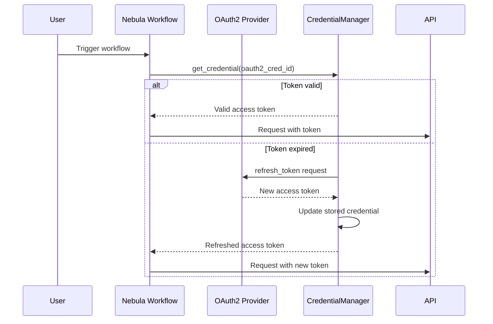

# OAuth2 Flow Example

This guide demonstrates how to implement OAuth2 authentication flows using `nebula-credential`, including authorization code flow, token refresh, and scope management.

## Overview

OAuth2 is an authorization framework that enables applications to obtain limited access to user accounts. Nebula supports the most common OAuth2 flows with automatic token refresh and secure storage.



## Quick Start

### 1. Authorization Code Flow

Complete example of OAuth2 authorization code flow:

```rust
use nebula_credential::{
    CredentialManager, Credential, OAuth2Provider, OAuth2Config,
    SecretString, Scope,
};
use serde::{Deserialize, Serialize};

#[derive(Debug, Deserialize)]
pub struct OAuth2CallbackParams {
    pub code: String,
    pub state: String,
}

#[derive(Debug, Serialize)]
pub struct TokenRequest {
    pub grant_type: String,
    pub code: String,
    pub redirect_uri: String,
    pub client_id: String,
    pub client_secret: String,
}

pub struct OAuth2Flow {
    config: OAuth2Config,
    credential_manager: Arc<CredentialManager>,
}

impl OAuth2Flow {
    pub fn new(
        config: OAuth2Config,
        credential_manager: Arc<CredentialManager>,
    ) -> Self {
        Self {
            config,
            credential_manager,
        }
    }

    /// Step 1: Generate authorization URL
    pub fn authorization_url(&self, scopes: &[&str], state: &str) -> String {
        let scope_str = scopes.join(" ");

        format!(
            "{}?client_id={}&redirect_uri={}&response_type=code&scope={}&state={}",
            self.config.authorize_url,
            urlencoding::encode(&self.config.client_id),
            urlencoding::encode(&self.config.redirect_uri),
            urlencoding::encode(&scope_str),
            urlencoding::encode(state)
        )
    }

    /// Step 2: Exchange authorization code for tokens
    pub async fn exchange_code(
        &self,
        code: &str,
        state: &str,
    ) -> Result<Credential, OAuth2Error> {
        // Validate state parameter (CSRF protection)
        self.validate_state(state)?;

        // Exchange code for token
        let client = reqwest::Client::new();
        let response = client
            .post(&self.config.token_url)
            .form(&[
                ("grant_type", "authorization_code"),
                ("code", code),
                ("redirect_uri", &self.config.redirect_uri),
                ("client_id", &self.config.client_id),
                ("client_secret", &self.config.client_secret),
            ])
            .send()
            .await
            .map_err(|e| OAuth2Error::Network(e.to_string()))?;

        if !response.status().is_success() {
            let error_text = response.text().await.unwrap_or_default();
            return Err(OAuth2Error::TokenExchange(format!(
                "HTTP {}: {}",
                response.status(),
                error_text
            )));
        }

        let token_response: TokenResponse = response
            .json()
            .await
            .map_err(|e| OAuth2Error::InvalidResponse(e.to_string()))?;

        // Create credential
        let credential = Credential::OAuth2 {
            client_id: self.config.client_id.clone(),
            client_secret: SecretString::new(self.config.client_secret.clone()),
            access_token: SecretString::new(token_response.access_token),
            refresh_token: token_response.refresh_token.map(SecretString::new),
            expires_at: token_response.expires_in.map(|seconds| {
                chrono::Utc::now() + chrono::Duration::seconds(seconds)
            }),
            scopes: token_response
                .scope
                .split_whitespace()
                .map(String::from)
                .collect(),
        };

        // Store credential
        let credential_id = self
            .credential_manager
            .store_credential(
                credential.clone(),
                vec![Scope::Global], // Or specific scopes
            )
            .await?;

        info!("OAuth2 credential stored: {}", credential_id);

        Ok(credential)
    }

    fn validate_state(&self, state: &str) -> Result<(), OAuth2Error> {
        // Implement state validation (check against session/cache)
        // This is critical for CSRF protection
        Ok(())
    }
}

#[derive(Debug, Deserialize)]
struct TokenResponse {
    access_token: String,
    token_type: String,
    expires_in: Option<i64>,
    refresh_token: Option<String>,
    scope: String,
}
```

### 2. Using OAuth2 Credentials in Actions

```rust
use nebula_action::{ProcessAction, Action, ActionError, ExecutionContext};
use nebula_credential::{CredentialManager, Credential};

pub struct GitHubApiAction {
    credential_manager: Arc<CredentialManager>,
}

#[derive(Debug, Deserialize)]
pub struct GitHubApiInput {
    pub credential_id: CredentialId,
    pub endpoint: String,
    pub method: String,
}

#[derive(Debug, Serialize)]
pub struct GitHubApiOutput {
    pub status: u16,
    pub body: serde_json::Value,
}

#[async_trait]
impl ProcessAction for GitHubApiAction {
    type Input = GitHubApiInput;
    type Output = GitHubApiOutput;

    async fn execute(
        &self,
        input: Self::Input,
        context: &ExecutionContext,
    ) -> Result<ActionResult<Self::Output>, ActionError> {
        // Get OAuth2 credential
        let credential = self
            .credential_manager
            .get_credential(&input.credential_id, &context.scope())
            .await
            .map_err(|e| ActionError::permanent(format!("Failed to get credential: {}", e)))?;

        // Extract access token
        let access_token = match credential {
            Credential::OAuth2 { access_token, .. } => access_token,
            _ => {
                return Err(ActionError::permanent("Expected OAuth2 credential"));
            }
        };

        // Make API request
        let client = reqwest::Client::new();
        let response = client
            .request(
                input.method.parse().unwrap(),
                format!("https://api.github.com{}", input.endpoint),
            )
            .header(
                "Authorization",
                format!("Bearer {}", access_token.expose_secret()),
            )
            .header("User-Agent", "Nebula-Workflow")
            .send()
            .await
            .map_err(|e| ActionError::transient(format!("API request failed: {}", e)))?;

        let status = response.status().as_u16();
        let body = response
            .json()
            .await
            .map_err(|e| ActionError::permanent(format!("Invalid JSON response: {}", e)))?;

        Ok(ActionResult::Success(GitHubApiOutput { status, body }))
    }
}
```

### 3. Automatic Token Refresh

The credential manager automatically refreshes expired tokens:

```rust
use nebula_credential::{OAuth2Provider, CredentialProvider};

pub struct AutoRefreshExample {
    credential_manager: Arc<CredentialManager>,
}

impl AutoRefreshExample {
    pub async fn make_authenticated_request(
        &self,
        credential_id: &CredentialId,
    ) -> Result<Response, Error> {
        // Get credential - automatically refreshed if needed
        let credential = self
            .credential_manager
            .get_credential(credential_id, &Scope::Global)
            .await?;

        // The credential manager checks expires_at and calls refresh() if needed
        // You always get a valid, non-expired token

        let Credential::OAuth2 { access_token, .. } = credential else {
            return Err(Error::WrongCredentialType);
        };

        // Use the token
        let response = reqwest::Client::new()
            .get("https://api.example.com/data")
            .bearer_auth(access_token.expose_secret())
            .send()
            .await?;

        Ok(response)
    }
}
```

## Advanced Patterns

### 1. Multi-Tenant OAuth2

Handle credentials for multiple users/tenants:

```rust
use std::collections::HashMap;

pub struct MultiTenantOAuth2Manager {
    credential_manager: Arc<CredentialManager>,
    /// Map tenant_id -> credential_id
    tenant_credentials: Arc<RwLock<HashMap<TenantId, CredentialId>>>,
}

impl MultiTenantOAuth2Manager {
    pub async fn get_tenant_credential(
        &self,
        tenant_id: &TenantId,
    ) -> Result<Credential, Error> {
        // Get credential ID for tenant
        let credential_id = self
            .tenant_credentials
            .read()
            .await
            .get(tenant_id)
            .cloned()
            .ok_or(Error::NoCredentialForTenant)?;

        // Get credential with tenant-specific scope
        let scope = Scope::Tenant(tenant_id.clone());
        let credential = self
            .credential_manager
            .get_credential(&credential_id, &scope)
            .await?;

        Ok(credential)
    }

    pub async fn register_tenant_credential(
        &mut self,
        tenant_id: TenantId,
        credential: Credential,
    ) -> Result<(), Error> {
        // Store with tenant scope
        let scope = Scope::Tenant(tenant_id.clone());
        let credential_id = self
            .credential_manager
            .store_credential(credential, vec![scope])
            .await?;

        // Map tenant to credential
        self.tenant_credentials
            .write()
            .await
            .insert(tenant_id, credential_id);

        Ok(())
    }
}
```

### 2. OAuth2 with PKCE (Public Clients)

Proof Key for Code Exchange for mobile/SPA apps:

```rust
use sha2::{Sha256, Digest};
use base64::{Engine as _, engine::general_purpose::URL_SAFE_NO_PAD};

pub struct PKCEFlow {
    config: OAuth2Config,
}

impl PKCEFlow {
    /// Generate code verifier and challenge
    pub fn generate_pkce_pair() -> (String, String) {
        // Generate random code verifier (43-128 characters)
        let code_verifier: String = (0..64)
            .map(|_| {
                let idx = rand::random::<usize>() % 62;
                b"ABCDEFGHIJKLMNOPQRSTUVWXYZabcdefghijklmnopqrstuvwxyz0123456789"[idx]
                    as char
            })
            .collect();

        // Generate code challenge: BASE64URL(SHA256(code_verifier))
        let mut hasher = Sha256::new();
        hasher.update(code_verifier.as_bytes());
        let hash = hasher.finalize();
        let code_challenge = URL_SAFE_NO_PAD.encode(hash);

        (code_verifier, code_challenge)
    }

    /// Step 1: Authorization URL with PKCE
    pub fn authorization_url_with_pkce(
        &self,
        code_challenge: &str,
        scopes: &[&str],
        state: &str,
    ) -> String {
        let scope_str = scopes.join(" ");

        format!(
            "{}?client_id={}&redirect_uri={}&response_type=code&scope={}&state={}&code_challenge={}&code_challenge_method=S256",
            self.config.authorize_url,
            urlencoding::encode(&self.config.client_id),
            urlencoding::encode(&self.config.redirect_uri),
            urlencoding::encode(&scope_str),
            urlencoding::encode(state),
            urlencoding::encode(code_challenge)
        )
    }

    /// Step 2: Exchange code with PKCE verifier
    pub async fn exchange_code_with_pkce(
        &self,
        code: &str,
        code_verifier: &str,
    ) -> Result<Credential, OAuth2Error> {
        let client = reqwest::Client::new();
        let response = client
            .post(&self.config.token_url)
            .form(&[
                ("grant_type", "authorization_code"),
                ("code", code),
                ("redirect_uri", &self.config.redirect_uri),
                ("client_id", &self.config.client_id),
                ("code_verifier", code_verifier),
            ])
            .send()
            .await?;

        let token_response: TokenResponse = response.json().await?;

        Ok(Credential::OAuth2 {
            client_id: self.config.client_id.clone(),
            client_secret: SecretString::new(String::new()), // No client secret for PKCE
            access_token: SecretString::new(token_response.access_token),
            refresh_token: token_response.refresh_token.map(SecretString::new),
            expires_at: token_response.expires_in.map(|s| chrono::Utc::now() + chrono::Duration::seconds(s)),
            scopes: token_response.scope.split_whitespace().map(String::from).collect(),
        })
    }
}
```

### 3. Scope Management

Dynamic scope requests based on workflow requirements:

```rust
pub struct ScopedOAuth2Manager {
    credential_manager: Arc<CredentialManager>,
}

impl ScopedOAuth2Manager {
    /// Request credential with specific scopes
    pub async fn get_credential_with_scopes(
        &self,
        credential_id: &CredentialId,
        required_scopes: &[&str],
    ) -> Result<Credential, Error> {
        let credential = self
            .credential_manager
            .get_credential(credential_id, &Scope::Global)
            .await?;

        // Verify credential has required scopes
        let Credential::OAuth2 { scopes, .. } = &credential else {
            return Err(Error::WrongCredentialType);
        };

        let missing_scopes: Vec<_> = required_scopes
            .iter()
            .filter(|req| !scopes.iter().any(|s| s == **req))
            .collect();

        if !missing_scopes.is_empty() {
            return Err(Error::MissingScopes {
                required: required_scopes.to_vec(),
                missing: missing_scopes.into_iter().map(|s| s.to_string()).collect(),
            });
        }

        Ok(credential)
    }

    /// Upgrade credential with additional scopes
    pub async fn request_additional_scopes(
        &self,
        credential_id: &CredentialId,
        additional_scopes: &[&str],
    ) -> Result<String, Error> {
        // Generate new authorization URL with additional scopes
        let credential = self
            .credential_manager
            .get_credential(credential_id, &Scope::Global)
            .await?;

        let Credential::OAuth2 { scopes, .. } = credential else {
            return Err(Error::WrongCredentialType);
        };

        // Combine existing and new scopes
        let mut all_scopes = scopes.clone();
        all_scopes.extend(additional_scopes.iter().map(|s| s.to_string()));
        all_scopes.sort();
        all_scopes.dedup();

        // Generate authorization URL for re-consent
        // User will be prompted to approve additional scopes
        Ok(format!(
            "{}?client_id={}&scope={}&prompt=consent",
            self.config.authorize_url,
            self.config.client_id,
            all_scopes.join(" ")
        ))
    }
}
```

## Provider-Specific Examples

### GitHub OAuth2

```rust
pub struct GitHubOAuth2 {
    client_id: String,
    client_secret: String,
}

impl GitHubOAuth2 {
    pub fn new(client_id: String, client_secret: String) -> Self {
        Self {
            client_id,
            client_secret,
        }
    }

    pub fn authorization_url(&self, scopes: &[&str], state: &str) -> String {
        format!(
            "https://github.com/login/oauth/authorize?client_id={}&scope={}&state={}",
            self.client_id,
            scopes.join(" "),
            state
        )
    }

    pub async fn exchange_code(&self, code: &str) -> Result<Credential, Error> {
        let client = reqwest::Client::new();
        let response = client
            .post("https://github.com/login/oauth/access_token")
            .header("Accept", "application/json")
            .form(&[
                ("client_id", &self.client_id),
                ("client_secret", &self.client_secret),
                ("code", &code.to_string()),
            ])
            .send()
            .await?;

        let token_response: GitHubTokenResponse = response.json().await?;

        Ok(Credential::OAuth2 {
            client_id: self.client_id.clone(),
            client_secret: SecretString::new(self.client_secret.clone()),
            access_token: SecretString::new(token_response.access_token),
            refresh_token: None, // GitHub doesn't provide refresh tokens
            expires_at: None,    // GitHub tokens don't expire
            scopes: token_response.scope.split(',').map(String::from).collect(),
        })
    }
}

#[derive(Deserialize)]
struct GitHubTokenResponse {
    access_token: String,
    scope: String,
    token_type: String,
}
```

### Google OAuth2

```rust
pub struct GoogleOAuth2 {
    config: OAuth2Config,
}

impl GoogleOAuth2 {
    pub fn authorization_url(&self, scopes: &[&str], state: &str) -> String {
        format!(
            "https://accounts.google.com/o/oauth2/v2/auth?client_id={}&redirect_uri={}&response_type=code&scope={}&state={}&access_type=offline&prompt=consent",
            self.config.client_id,
            urlencoding::encode(&self.config.redirect_uri),
            urlencoding::encode(&scopes.join(" ")),
            state
        )
    }

    pub async fn exchange_code(&self, code: &str) -> Result<Credential, Error> {
        let client = reqwest::Client::new();
        let response = client
            .post("https://oauth2.googleapis.com/token")
            .form(&[
                ("grant_type", "authorization_code"),
                ("code", code),
                ("client_id", &self.config.client_id),
                ("client_secret", &self.config.client_secret),
                ("redirect_uri", &self.config.redirect_uri),
            ])
            .send()
            .await?;

        let token_response: GoogleTokenResponse = response.json().await?;

        Ok(Credential::OAuth2 {
            client_id: self.config.client_id.clone(),
            client_secret: SecretString::new(self.config.client_secret.clone()),
            access_token: SecretString::new(token_response.access_token),
            refresh_token: Some(SecretString::new(token_response.refresh_token)),
            expires_at: Some(chrono::Utc::now() + chrono::Duration::seconds(token_response.expires_in)),
            scopes: token_response.scope.split(' ').map(String::from).collect(),
        })
    }
}

#[derive(Deserialize)]
struct GoogleTokenResponse {
    access_token: String,
    refresh_token: String,
    expires_in: i64,
    scope: String,
    token_type: String,
}
```

## Testing

### Mock OAuth2 Provider for Tests

```rust
#[cfg(test)]
mod tests {
    use super::*;

    struct MockOAuth2Provider;

    #[async_trait]
    impl CredentialProvider for MockOAuth2Provider {
        fn name(&self) -> &str {
            "mock_oauth2"
        }

        fn supported_types(&self) -> &[CredentialType] {
            &[CredentialType::OAuth2]
        }

        async fn refresh(
            &self,
            credential: &Credential,
        ) -> Result<Credential, ProviderError> {
            // Return refreshed credential for testing
            let Credential::OAuth2 { client_id, client_secret, scopes, .. } = credential else {
                return Err(ProviderError::UnsupportedType);
            };

            Ok(Credential::OAuth2 {
                client_id: client_id.clone(),
                client_secret: client_secret.clone(),
                access_token: SecretString::new("mock_refreshed_token".to_string()),
                refresh_token: Some(SecretString::new("mock_refresh_token".to_string())),
                expires_at: Some(chrono::Utc::now() + chrono::Duration::hours(1)),
                scopes: scopes.clone(),
            })
        }

        async fn validate(
            &self,
            _credential: &Credential,
        ) -> Result<ValidationResult, ProviderError> {
            Ok(ValidationResult {
                valid: true,
                expires_at: Some(chrono::Utc::now() + chrono::Duration::hours(1)),
            })
        }
    }

    #[tokio::test]
    async fn test_oauth2_refresh() {
        let provider = MockOAuth2Provider;

        let credential = Credential::OAuth2 {
            client_id: "test_client".to_string(),
            client_secret: SecretString::new("test_secret".to_string()),
            access_token: SecretString::new("old_token".to_string()),
            refresh_token: Some(SecretString::new("refresh_token".to_string())),
            expires_at: Some(chrono::Utc::now() - chrono::Duration::minutes(1)), // Expired
            scopes: vec!["read".to_string(), "write".to_string()],
        };

        let refreshed = provider.refresh(&credential).await.unwrap();

        match refreshed {
            Credential::OAuth2 { access_token, .. } => {
                assert_eq!(access_token.expose_secret(), "mock_refreshed_token");
            }
            _ => panic!("Expected OAuth2 credential"),
        }
    }
}
```

## Best Practices

### 1. State Parameter Validation

Always validate the state parameter to prevent CSRF attacks:

```rust
use rand::Rng;

pub fn generate_state() -> String {
    rand::thread_rng()
        .sample_iter(&rand::distributions::Alphanumeric)
        .take(32)
        .map(char::from)
        .collect()
}

pub fn store_state(state: &str, session_id: &str) {
    // Store in Redis/session with expiry
}

pub fn validate_state(state: &str, session_id: &str) -> Result<(), Error> {
    // Verify state matches stored value
    // Remove state after validation (single use)
}
```

### 2. Token Storage Security

Never log access tokens:

```rust
// ❌ BAD
info!("Access token: {}", access_token);

// ✅ GOOD
info!("Successfully obtained access token");
```

### 3. Scope Principle of Least Privilege

Request minimum required scopes:

```rust
// ❌ BAD - requesting unnecessary scopes
let scopes = ["repo", "user", "admin:org", "delete_repo"];

// ✅ GOOD - minimal scopes
let scopes = ["repo:read", "user:email"];
```

## Troubleshooting

### Common Issues

**Token expired error:**
```rust
// The credential manager should auto-refresh
// If you see expired tokens, check:
// 1. Refresh token is present
// 2. Provider refresh() implementation is correct
// 3. Token endpoint URL is correct
```

**Invalid scope error:**
```rust
// Verify requested scopes match provider's requirements
// Some providers use comma-separated, others use space-separated
```

**Redirect URI mismatch:**
```rust
// Ensure redirect_uri exactly matches the one registered
// Including protocol (http vs https) and trailing slashes
```

## Related Documentation

- [[02-Crates/nebula-credential/Architecture|Architecture]] - Credential system architecture
- [[02-Crates/nebula-credential/How-To/RefreshTokens|Refresh Tokens]] - Token refresh guide
- [[02-Crates/nebula-credential/Security/BestPractices|Security Best Practices]] - Security guidelines
- [[02-Crates/nebula-credential/Examples/BasicApiKey|API Key Example]] - Alternative auth method
