# SAML 2.0 Authentication

> **TL;DR**: Используйте `Credential` trait из nebula-credential для SAML 2.0 enterprise SSO с XML signature validation.

## Обзор

SAML credentials в nebula-credential управляются через `Credential` + `InteractiveCredential` traits с поддержкой:
- **XML Signature Validation**: Проверка подписи IdP certificate
- **Assertion Validation**: Timestamps, audience, recipient checks
- **Interactive Flow**: Browser redirect для user authentication
- **Enterprise IdPs**: Okta, Azure AD, OneLogin, Auth0

**Architecture Reference**: См. [[../../specs/001-credential-docs/architecture.md#saml-protocol]]  
**Security**: См. [[../../specs/001-credential-docs/security-spec.md#saml-security]]

## SAML 2.0 SSO Flow Overview

```mermaid
sequenceDiagram
    participant User
    participant SP as Service Provider (Your App)
    participant Browser
    participant IdP as Identity Provider (Okta/Azure AD)

    rect rgb(240, 248, 255)
        Note over SP: Phase 1: Generate SAML Request
        SP->>SP: request_id = random UUID
        SP->>SP: Build AuthnRequest XML
        SP->>SP: deflate + base64encode(request)
        SP->>SP: relay_state = random(32 bytes)
    end

    rect rgb(255, 250, 240)
        Note over SP,IdP: Phase 2: SSO Redirect
        SP->>Browser: HTTP 302 Redirect to IdP
        Note right of Browser: ?SAMLRequest=base64(deflate(xml))<br/>&RelayState=xxx
        Browser->>IdP: GET SSO URL
        IdP->>IdP: Decode + inflate SAMLRequest
        IdP->>IdP: Validate request signature (if signed)
    end
    
    rect rgb(240, 255, 240)
        Note over IdP,User: Phase 3: User Authentication
        IdP->>User: Show login page
        User->>IdP: Enter credentials
        IdP->>IdP: Authenticate user (LDAP/AD/etc)
        IdP->>User: Show consent page (if needed)
        User->>IdP: Grant consent
        IdP->>IdP: Create SAML session
    end

    rect rgb(255, 240, 245)
        Note over IdP: Phase 4: Generate SAML Response
        IdP->>IdP: Build Response XML with Assertion
        Note right of IdP: Assertion contains:<br/>- Subject (user ID)<br/>- Attributes (email, roles)<br/>- Conditions (audience, expiry)<br/>- SessionIndex
        IdP->>IdP: Sign Assertion with X.509 cert
        IdP->>IdP: Sign Response (optional)
        IdP->>IdP: base64encode(Response XML)
    end

    rect rgb(255, 255, 240)
        Note over IdP,SP: Phase 5: Post Response to ACS
        IdP->>Browser: HTTP 200 + HTML form auto-submit
        Note right of Browser: <form method="POST" action="ACS_URL"><br/><input name="SAMLResponse" value="..."><br/><input name="RelayState" value="...">
        Browser->>SP: POST to ACS URL
        Note right of Browser: SAMLResponse=base64(xml)<br/>RelayState=xxx
    end

    rect rgb(245, 240, 255)
        Note over SP: Phase 6: Validate SAML Response
        SP->>SP: base64decode(SAMLResponse)
        SP->>SP: Parse XML
        SP->>SP: Verify XML signature (IdP cert)
        SP->>SP: Validate Assertion:<br/>- InResponseTo == request_id<br/>- Recipient == ACS URL<br/>- Audience == SP entity_id<br/>- NotBefore <= now <= NotOnOrAfter<br/>- Signature valid
        SP->>SP: Extract subject + attributes
        SP->>SP: Create session (store assertion)
    end

    rect rgb(240, 255, 255)
        Note over SP,User: Phase 7: Application Access
        SP->>Browser: HTTP 302 Redirect to app
        Browser->>User: Show authenticated app
        User->>SP: Access protected resources
        SP->>SP: Check SAML session valid
        SP->>User: Return protected data
    end

    rect rgb(255, 245, 238)
        Note over SP,IdP: Phase 8: Single Logout (Optional)
        User->>SP: Click "Logout"
        SP->>IdP: Send LogoutRequest
        IdP->>IdP: Terminate SAML session
        IdP->>SP: LogoutResponse
        SP->>SP: Clear local session
        SP->>User: Redirect to logout page
    end
```



## Prerequisites

- [[Installation|Установлен nebula-credential]]
- [[Core-Concepts|Понимание Credential trait]]
- IdP настроен (Okta/Azure AD)

## Complete Example

### Dependencies

```toml
[dependencies]
nebula-credential = "0.1.0"
tokio = { version = "1", features = ["full"] }
base64 = "0.22"
chrono = "0.4"
```

### Implementing SAML Credential

```rust
// File: examples/saml_credential.rs
use nebula_credential::{
    Credential, InteractiveCredential, CredentialContext, CredentialError,
    TestableCredential, SecretString, TestResult, TestDetails, OwnerId,
    FlowState, UserInput, InteractionRequest,
};
use async_trait::async_trait;
use std::collections::HashMap;
use chrono::{DateTime, Utc};

/// SAML configuration
#[derive(Debug, Clone)]
pub struct SamlConfig {
    pub entity_id: String,
    pub acs_url: String,
    pub idp_sso_url: String,
    pub idp_certificate: String,
}

/// SAML assertion
#[derive(Debug, Clone)]
pub struct SamlAssertion {
    pub subject: String,
    pub attributes: HashMap<String, Vec<String>>,
    pub session_index: Option<String>,
    pub not_on_or_after: Option<DateTime<Utc>>,
}

/// SAML credential output
#[derive(Debug, Clone)]
pub struct SamlCredential {
    pub config: SamlConfig,
    pub assertion: SamlAssertion,
}

/// SAML redirect request
#[derive(Debug, Clone)]
pub struct SamlRedirectRequest {
    pub redirect_url: String,
    pub relay_state: Option<String>,
}

impl InteractionRequest for SamlRedirectRequest {
    fn request_type(&self) -> &'static str {
        "saml_redirect"
    }

    fn to_json(&self) -> serde_json::Value {
        serde_json::json!({
            "redirect_url": self.redirect_url,
            "relay_state": self.relay_state,
        })
    }
}

/// SAML credential provider
pub struct SamlCredentialProvider {
    config: SamlConfig,
}

impl SamlCredentialProvider {
    pub fn new(config: SamlConfig) -> Self {
        Self { config }
    }

    fn validate_assertion(&self, saml_response: &str) -> Result<SamlAssertion, CredentialError> {
        // Parse and validate SAML response
        // Verify XML signature
        // Check timestamps
        // Extract attributes
        
        Ok(SamlAssertion {
            subject: "user@example.com".to_string(),
            attributes: HashMap::new(),
            session_index: None,
            not_on_or_after: Some(Utc::now() + chrono::Duration::hours(8)),
        })
    }
}

#[async_trait]
impl Credential for SamlCredentialProvider {
    type Output = SamlCredential;
    type Error = CredentialError;

    async fn retrieve(
        &self,
        ctx: &CredentialContext,
    ) -> Result<Self::Output, Self::Error> {
        let saml_response = ctx.metadata.get("saml_response")
            .ok_or_else(|| CredentialError::ConfigurationError(
                "SAML response not found in context".to_string()
            ))?;

        let assertion = self.validate_assertion(saml_response)?;

        Ok(SamlCredential {
            config: self.config.clone(),
            assertion,
        })
    }

    fn credential_type(&self) -> &'static str {
        "saml"
    }

    fn supports_refresh(&self) -> bool {
        false
    }
}

#[async_trait]
impl InteractiveCredential for SamlCredentialProvider {
    type Request = SamlRedirectRequest;

    async fn initialize(
        &self,
        _ctx: &CredentialContext,
    ) -> Result<FlowState<Self::Request, Self::Output>, Self::Error> {
        let state_id = uuid::Uuid::new_v4().to_string();
        
        let request = SamlRedirectRequest {
            redirect_url: self.config.idp_sso_url.clone(),
            relay_state: Some(state_id.clone()),
        };

        Ok(FlowState::PendingInteraction {
            state_id,
            request,
            expires_at: Utc::now() + chrono::Duration::minutes(10),
        })
    }

    async fn resume(
        &self,
        _state_id: &str,
        input: UserInput,
        _ctx: &CredentialContext,
    ) -> Result<FlowState<Self::Request, Self::Output>, Self::Error> {
        let saml_response: String = input.from_json()
            .map_err(|e| CredentialError::InvalidResponse(e.to_string()))?;

        let assertion = self.validate_assertion(&saml_response)?;

        Ok(FlowState::Completed(SamlCredential {
            config: self.config.clone(),
            assertion,
        }))
    }

    async fn cancel(&self, _state_id: &str) -> Result<(), Self::Error> {
        Ok(())
    }
}

#[async_trait]
impl TestableCredential for SamlCredentialProvider {
    async fn test(
        &self,
        ctx: &CredentialContext,
    ) -> Result<TestResult, CredentialError> {
        match self.retrieve(ctx).await {
            Ok(credential) => {
                let details = TestDetails {
                    latency_ms: 0,
                    endpoint_tested: self.config.idp_sso_url.clone(),
                    permissions_verified: vec!["saml:authenticate".to_string()],
                    metadata: HashMap::from([
                        ("subject".to_string(), 
                         serde_json::json!(credential.assertion.subject)),
                    ]),
                };

                Ok(TestResult::success("SAML assertion validated")
                    .with_details(details))
            }
            Err(e) => Ok(TestResult::failure(format!("SAML validation failed: {}", e))),
        }
    }

    fn test_description(&self) -> &str {
        "Testing SAML authentication by validating assertion"
    }
}
```

## Key Concepts

### 1. InteractiveCredential для SAML

```rust
impl InteractiveCredential for SamlCredentialProvider {
    // Initialize flow - redirect to IdP
    async fn initialize() -> FlowState { }
    
    // Resume after user authenticates
    async fn resume() -> FlowState { }
}
```

**Architecture**: См. [[Architecture#interactive-credential]]

### 2. SAML Flow State Machine

```rust
FlowState::PendingInteraction { redirect_url } // User redirects to IdP
FlowState::Completed(credential)               // Assertion received
FlowState::Failed { reason }                   // Validation failed
```

## Security Best Practices

> [!warning] XML Signature Validation Required
> Всегда проверяйте XML signature используя IdP certificate.

**Timestamp Validation**:
```rust
// Check NotBefore and NotOnOrAfter
if now < assertion.not_before { return Err(...) }
if now >= assertion.not_on_or_after { return Err(...) }
```

## Related Examples

- **Enterprise Auth**: [[LDAP-Authentication]] - LDAP bind authentication | [[Kerberos-Authentication]] - Kerberos tickets
- **OAuth2 SSO**: [[OAuth2-Flow]] - OAuth2 Authorization Code | [[OAuth2-Google]] - Google Sign-In
- **Certificate Auth**: [[mTLS-Certificate]] - Mutual TLS | [[JWT-Validation]] - JWT token validation

## See Also

- [[Core-Concepts|Core Concepts]]
- [[API-Reference|API Reference]]

**Spec References**:
- [[../../specs/001-credential-docs/architecture.md#saml-protocol]]
- [[../../specs/001-credential-docs/security-spec.md#saml-security]]
- [[../../specs/001-credential-docs/technical-design.md#saml-implementation]]

## Sources

- [SAML 2.0 Specification](http://docs.oasis-open.org/security/saml/v2.0/)
- [nebula-credential API](../Reference/API-Reference.md)
