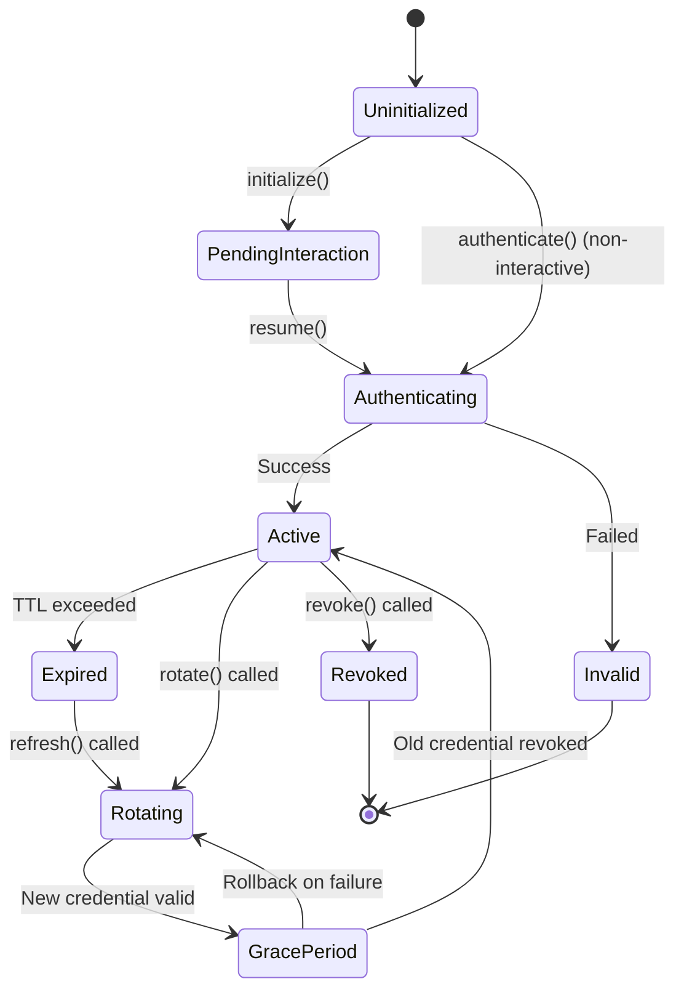

# Core Concepts

> [!NOTE] What You'll Learn
> This guide explains the fundamental concepts behind nebula-credential: what credentials are, how they work, and why they're essential for secure workflow automation.

## TL;DR

- **Credentials** = Secure, typed authentication data (API keys, OAuth tokens, passwords)
- **Never hardcoded** = Stored encrypted, injected at runtime, auto-redacted from logs
- **Type-safe** = Rust's type system prevents using wrong credentials
- **Lifecycle-managed** = Automatic refresh, rotation, and expiration handling
- **Provider-agnostic** = Works with local storage, AWS, Vault, Azure, K8s

---

## What is a Credential?

A **credential** is authentication data used to verify identity when accessing external systems:

```rust
// Simple credential: API Key
struct ApiKeyCredential {
    api_key: String,     // The secret
    endpoint: String,    // Where to use it
}

// Complex credential: OAuth2
struct OAuth2Credential {
    access_token: String,      // Short-lived token
    refresh_token: String,     // Long-lived renewal token
    expires_at: DateTime<Utc>, // When access_token expires
    scopes: Vec<String>,       // Permissions granted
}
```

### Authentication vs Authorization

**Authentication** = *Who are you?* (verifying identity)
- Username + password
- API key
- OAuth2 token
- mTLS certificate

**Authorization** = *What can you do?* (granting permissions)
- Scopes (OAuth2: `read:user`, `repo:write`)
- Roles (Admin, User, Guest)
- ACLs (Alice can Read, Bob can Write)

nebula-credential handles **authentication** (storing and using credentials). Authorization is determined by the external system.

---

## Why Credentials Matter

### The Problem: Insecure Secrets

❌ **Hardcoded credentials** (visible in source control):
```rust
let api_key = "sk_live_ABC123DEF456";  // LEAKED if committed!
```

❌ **Environment variables** (visible in process list):
```bash
export API_KEY="sk_live_ABC123DEF456"  # Visible in `ps aux`!
```

❌ **Logged credentials** (visible in log files):
```rust
log::info!("Using API key: {}", api_key);  // Plaintext in logs!
```

❌ **Unencrypted config files**:
```toml
[credentials]
api_key = "sk_live_ABC123DEF456"  # Readable by anyone!
```

### The Solution: nebula-credential

✅ **Encrypted at rest** (AES-256-GCM):
```rust
// Stored encrypted on disk
manager.store("api_key", credential).await?;
// Decrypted only in memory when needed
```

✅ **Auto-redacted** (never logged):
```rust
// Automatically shows "[REDACTED]" in logs
context.log_info(&format!("Cred: {:?}", credential));
```

✅ **Runtime injection** (never in code):
```rust
// Loaded securely at runtime
let cred = context.get_credential("api_key").await?;
```

✅ **Rotation support** (update without redeployment):
```rust
// Update credential without stopping workflows
manager.rotate("api_key", new_credential).await?;
```

---

## Credential Lifecycle

Every credential goes through a lifecycle with 11 states:



### State Descriptions

| State | Description | Example |
|-------|-------------|---------|
| **Uninitialized** | Credential created but not authenticated | OAuth2 flow started |
| **PendingInteraction** | Waiting for user input | User must authorize in browser |
| **Authenticating** | Verifying with provider | Sending credentials to auth server |
| **Active** | Valid and usable | Access token working |
| **Expired** | Past expiration time | Access token TTL exceeded |
| **Rotating** | Being replaced | Generating new password |
| **GracePeriod** | Both old and new valid | Blue-green deployment period |
| **Revoked** | Explicitly invalidated | User logged out |
| **Invalid** | Authentication failed | Wrong password |

### State Transitions

**Automatic transitions**:
- `Active` → `Expired`: When TTL exceeded
- `Expired` → `Active`: After successful refresh
- `GracePeriod` → `Active`: When grace period ends

**Manual transitions**:
- `Uninitialized` → `Authenticating`: Call `authenticate()`
- `Active` → `Rotating`: Call `rotate()`
- `Active` → `Revoked`: Call `revoke()`

---

## Security Model

### Three Layers of Security

#### 1. Encryption at Rest

All credentials encrypted with **AES-256-GCM**:

```rust
// Before storage: plaintext
let credential = ApiKeyCredential {
    api_key: "sk_live_ABC123".into(),
};

// After storage: encrypted
// File contains: [encrypted_blob, nonce, auth_tag]
// No plaintext on disk!
```

**Key derivation** with Argon2id:
```rust
master_password → Argon2id(19 MiB, 2 iter) → AES-256 key
```

**Unique nonce** per encryption:
```rust
nonce = monotonic_counter + random_bytes + timestamp
// Prevents replay attacks
```

#### 2. Memory Protection

**SecretString** type with automatic zeroization:

```rust
use zeroize::{Zeroize, ZeroizeOnDrop};

#[derive(Zeroize, ZeroizeOnDrop)]
pub struct SecretString {
    inner: String,  // Zeroized when dropped
}

// Automatic memory clearing
{
    let secret = SecretString::new("password");
    // ...use secret...
} // <-- Memory automatically zeroed here!
```

**No accidental logging**:
```rust
impl Debug for SecretString {
    fn fmt(&self, f: &mut Formatter) -> fmt::Result {
        write!(f, "[REDACTED]")  // Never shows actual value
    }
}
```

#### 3. Access Control

**Scopes** isolate credentials:
```rust
// Workflow-scoped: Only accessible within workflow "backup-db"
manager.store_scoped("db_password", credential, Scope::Workflow("backup-db"))?;

// Organization-scoped: Accessible to all workflows in org "acme"
manager.store_scoped("api_key", credential, Scope::Organization("acme"))?;

// Global: Accessible to all (use sparingly!)
manager.store_scoped("admin_key", credential, Scope::Global)?;
```

**ACLs** control operations:
```rust
// Alice can read and use credential
acl.grant("alice", vec![Permission::Read, Permission::Execute]);

// Bob can read, write, and rotate
acl.grant("bob", vec![Permission::Read, Permission::Write, Permission::Rotate]);

// Charlie is owner (all permissions)
acl.set_owner("charlie");
```

---

## Credential Types

### 1. Non-Interactive Credentials

Authenticate without user input:

**API Keys**:
```rust
struct ApiKeyCredential {
    #[secret]
    api_key: String,
}

// Usage: Immediate
let cred = manager.get("api_key").await?;
```

**Database Passwords**:
```rust
struct DatabaseCredential {
    username: String,
    #[secret]
    password: String,
    host: String,
    port: u16,
}

// Usage: Connect directly
let conn = Database::connect(&cred).await?;
```

### 2. Interactive Credentials

Require user interaction:

**OAuth2 Authorization Code Flow**:
```rust
// Step 1: Initialize (generates auth URL)
let flow = OAuth2Flow::new(config);
let auth_url = flow.authorization_url();

// Step 2: User authorizes in browser
println!("Visit: {}", auth_url);

// Step 3: Resume with authorization code
let credential = flow.exchange_code(auth_code).await?;
```

**SAML SSO**:
```rust
// Step 1: Generate SAML request
let saml_flow = SamlFlow::new(config);
let request = saml_flow.generate_request();

// Step 2: User authenticates with IdP
redirect_to_idp(request);

// Step 3: Process SAML response
let credential = saml_flow.process_response(response).await?;
```

### 3. Refreshable Credentials

Automatically renew before expiration:

**OAuth2 with Refresh Token**:
```rust
impl Credential for OAuth2Credential {
    async fn refresh(&self, current: &Self::Output) -> Result<Self::Output> {
        // Automatic refresh before expiration
        let new_token = self.client
            .exchange_refresh_token(&current.refresh_token)
            .await?;
        
        Ok(new_token)
    }
}

// nebula-credential calls refresh() automatically
// when access_token expires in <5 minutes
```

### 4. Rotatable Credentials

Periodic replacement for security:

**Database Password Rotation**:
```rust
impl RotatableCredential for DatabaseCredential {
    type Policy = PeriodicRotation;
    
    async fn rotate(&self, current: &Self::Output, policy: &Self::Policy) 
        -> Result<Self::Output> {
        // 1. Generate new password
        let new_password = generate_secure_password();
        
        // 2. Update in database
        self.db.change_password(&current.username, &new_password).await?;
        
        // 3. Return new credential
        Ok(DatabaseCredential {
            username: current.username.clone(),
            password: new_password,
            ..current.clone()
        })
    }
}
```

---

## Storage Providers

nebula-credential supports multiple backends:

### Local Storage (Development)

Encrypted file storage:

```rust
let manager = CredentialManager::builder()
    .storage(LocalStorage::new("./secrets"))
    .encryption_key(EncryptionKey::from_password("master_password"))
    .build();
```

**Pros**: Simple setup, no dependencies
**Cons**: Not suitable for production, no high availability

### AWS Secrets Manager (Production)

Cloud-native secret management:

```rust
let manager = CredentialManager::builder()
    .storage(AwsSecretsManager::new("us-east-1"))
    .build();
```

**Pros**: Managed service, automatic rotation, audit logs
**Cons**: AWS-specific, costs per secret

### HashiCorp Vault (Enterprise)

Self-hosted or cloud:

```rust
let manager = CredentialManager::builder()
    .storage(VaultStorage::new("https://vault.example.com"))
    .auth(VaultToken::new("s.abc123"))
    .build();
```

**Pros**: Multi-cloud, advanced features (Transit engine, dynamic secrets)
**Cons**: Requires Vault infrastructure

### Comparison

| Provider | Encryption | Rotation | Audit | HA | Cost |
|----------|-----------|----------|-------|-----|------|
| **Local** | AES-256-GCM | Manual | None | No | Free |
| **AWS** | KMS | Automatic | CloudTrail | Yes | $0.40/secret/month |
| **Vault** | Transit/KV | Automatic | Yes | Yes | Self-hosted |
| **Azure** | Key Vault | Automatic | Monitor | Yes | $0.03/10k ops |
| **K8s** | etcd encryption | Manual | Audit logs | Yes | Free |

See [[Integrations/Provider-Comparison|Provider Comparison]] for detailed feature matrix.

---

## Performance Considerations

### Caching

Reduce latency with in-memory cache:

```rust
let manager = CredentialManager::builder()
    .cache(CacheConfig {
        ttl: Duration::from_secs(300),  // 5 minutes
        max_size: 1_000_000_000,        // 1 GB
        eviction: EvictionPolicy::LRU,
    })
    .build();
```

**Cache hit**: <10ms (p95)
**Cache miss**: <100ms (p95)

### Connection Pooling

Reuse connections to storage providers:

```rust
let manager = CredentialManager::builder()
    .connection_pool(PoolConfig {
        max_connections: 100,
        idle_timeout: Duration::from_secs(300),
    })
    .build();
```

### Batch Operations

Reduce round-trips:

```rust
// Fetch multiple credentials in one call
let creds = manager.get_batch(&[
    "api_key_1",
    "api_key_2",
    "db_password",
]).await?;
```

---

## Observability

### Audit Logging

Track all credential access:

```rust
// Logged automatically
context.get_credential("api_key").await?;

// Log entry:
{
    "event": "CredentialAccessed",
    "credential_id": "api_key",
    "user_id": "alice",
    "timestamp": "2026-02-03T10:30:00Z",
    "result": "success",
    "duration_ms": 45
}
```

### Metrics

Prometheus metrics exported:

```prometheus
# Latency histogram
credential_access_duration_seconds{operation="get"} 0.045

# Operation counter
credential_operations_total{operation="get",result="success"} 1234

# Cache hit ratio
credential_cache_hit_ratio 0.85
```

### Tracing

OpenTelemetry spans:

```rust
// Automatic span creation
let _span = tracing::span!(Level::INFO, "credential.get", credential_id = "api_key");
```

---

## Best Practices

### ✅ DO

- **Use scopes** to isolate credentials per workflow
- **Rotate regularly** (90 days for passwords, 30 days for API keys)
- **Enable audit logging** for compliance
- **Use SecretString** for all sensitive data
- **Test credentials** before storing (use `CredentialTest` trait)
- **Cache frequently accessed** credentials
- **Monitor metrics** for anomalies (sudden spike in access = potential breach)

### ❌ DON'T

- **Hardcode credentials** in source code
- **Log credentials** (even for debugging)
- **Share credentials** across unrelated workflows
- **Disable encryption** (even in dev)
- **Ignore expiration warnings**
- **Skip rotation** (old credentials = security risk)
- **Use global scope** unless absolutely necessary

---

## Common Patterns

### Pattern 1: Simple API Key

```rust
// 1. Define credential type
#[derive(Credential)]
struct ApiKeyCredential {
    #[secret]
    api_key: String,
}

// 2. Store
manager.store("api_key", ApiKeyCredential {
    api_key: "sk_live_ABC123".into(),
}).await?;

// 3. Retrieve and use
let cred: ApiKeyCredential = manager.get("api_key").await?;
let client = HttpClient::new()
    .header("Authorization", format!("Bearer {}", cred.api_key.expose()));
```

### Pattern 2: OAuth2 with Auto-Refresh

```rust
// 1. Initial authentication (interactive)
let oauth_cred = OAuth2Flow::new(config)
    .authorize()  // User authorizes in browser
    .await?;

// 2. Store
manager.store("github_oauth", oauth_cred).await?;

// 3. Use (auto-refreshes if expired)
let cred: OAuth2Credential = manager.get("github_oauth").await?;
// If access_token expires in <5 min, automatically refreshed
```

### Pattern 3: Database with Rotation

```rust
// 1. Store database credential
manager.store("prod_db", DatabaseCredential {
    username: "app_user".into(),
    password: SecretString::new("initial_password"),
    host: "db.example.com".into(),
    port: 5432,
}).await?;

// 2. Configure rotation policy
let policy = PeriodicRotation {
    interval: Duration::from_days(90),
};

// 3. Automatic rotation (runs in background)
manager.enable_rotation("prod_db", policy).await?;
```

---

## Next Steps

Now that you understand core concepts:

1. **Quick Start**: [[Quick-Start|Build your first credential in <10 minutes]]
2. **Examples**: [[Examples/OAuth2-Flow|Explore OAuth2]], [[Examples/Database-PostgreSQL|Database credentials]]
3. **How-To Guides**: [[How-To/Store-Credentials|Storing]], [[How-To/Rotate-Credentials|Rotating]]
4. **Architecture**: [[Architecture|Deep dive into system design]]

---

## See Also

- [[Getting-Started/Quick-Start|Quick Start Guide]]
- [[Getting-Started/Installation|Installation]]
- [[Reference/Glossary|Glossary of Terms]]
- [[Architecture|System Architecture]]
- [[Security/Encryption|Encryption Details]]
