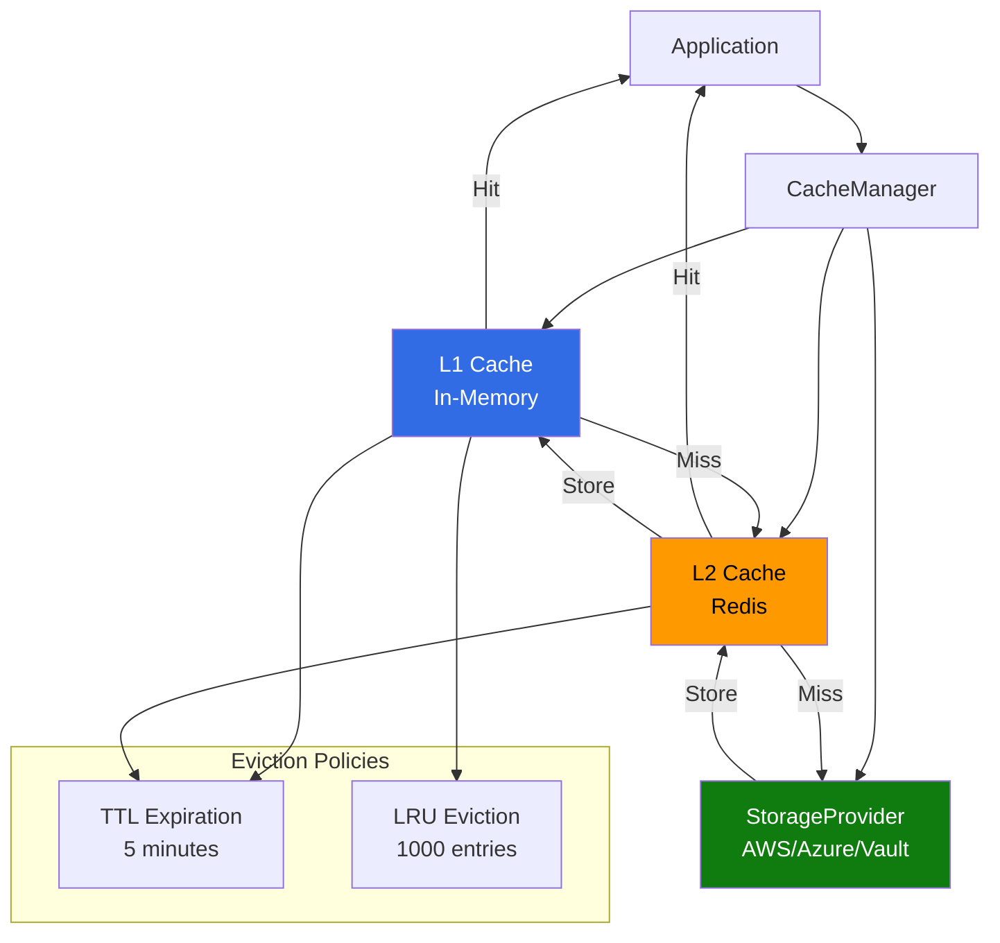

# Configure Credential Caching

> **TL;DR**: Implement in-memory and distributed caching for nebula-credential to reduce storage provider latency and improve application performance.

## Overview

Credential caching reduces latency by storing frequently accessed credentials in memory (local cache) or shared memory (Redis). This guide covers TTL-based expiration, LRU eviction, cache warming, and distributed caching patterns.

**Что вы получите**:
- In-memory caching with TTL and LRU eviction
- Redis-based distributed caching
- Cache warming strategies
- Invalidation patterns
- Monitoring and observability
- Performance benchmarks

**Когда использовать caching**:
- High read-to-write ratio (>10:1)
- Latency-sensitive applications (< 10ms p99)
- Expensive storage provider operations (cloud APIs)
- Multiple application instances sharing credentials
- Credentials don't change frequently (hours to days TTL)

**Когда НЕ использовать caching**:
- Credentials change frequently (< 1 minute TTL)
- Strong consistency required (immediate invalidation)
- Memory-constrained environments
- Single-threaded applications with low QPS

## Architecture Overview



## Step 1: In-Memory Caching (L1)

### 1.1 Add Dependencies

```toml
[dependencies]
moka = { version = "0.12", features = ["future"] }
tokio = { version = "1", features = ["full"] }
serde = { version = "1", features = ["derive"] }
tracing = "0.1"
```

### 1.2 Implement CachedStorageProvider

```rust
use moka::future::Cache;
use std::sync::Arc;
use std::time::Duration;
use tokio::time::Instant;

pub struct CachedStorageProvider<P: StorageProvider> {
    provider: Arc<P>,
    cache: Cache<CredentialId, CachedCredential>,
    stats: Arc<CacheStats>,
}

#[derive(Clone)]
struct CachedCredential {
    credential: Credential,
    cached_at: Instant,
}

impl<P: StorageProvider> CachedStorageProvider<P> {
    pub fn new(provider: P, config: CacheConfig) -> Self {
        let cache = Cache::builder()
            .max_capacity(config.max_entries)
            .time_to_live(Duration::from_secs(config.ttl_seconds))
            .time_to_idle(Duration::from_secs(config.idle_timeout_seconds))
            .build();
        
        Self {
            provider: Arc::new(provider),
            cache,
            stats: Arc::new(CacheStats::default()),
        }
    }
    
    /// Retrieve credential with caching
    pub async fn retrieve_cached(
        &self,
        credential_id: &CredentialId,
    ) -> Result<Option<Credential>, StorageError> {
        // Check cache first
        if let Some(cached) = self.cache.get(credential_id).await {
            self.stats.hits.fetch_add(1, Ordering::Relaxed);
            
            tracing::debug!(
                credential_id = ?credential_id,
                age_ms = cached.cached_at.elapsed().as_millis(),
                "Cache hit"
            );
            
            return Ok(Some(cached.credential.clone()));
        }
        
        self.stats.misses.fetch_add(1, Ordering::Relaxed);
        
        // Cache miss - fetch from provider
        tracing::debug!(credential_id = ?credential_id, "Cache miss");
        
        match self.provider.retrieve(credential_id).await? {
            Some(credential) => {
                // Store in cache
                let cached = CachedCredential {
                    credential: credential.clone(),
                    cached_at: Instant::now(),
                };
                
                self.cache.insert(credential_id.clone(), cached).await;
                
                Ok(Some(credential))
            }
            None => Ok(None),
        }
    }
    
    /// Store credential and invalidate cache
    pub async fn store_and_invalidate(
        &self,
        credential_id: CredentialId,
        credential: &Credential,
    ) -> Result<(), StorageError> {
        // Write to provider
        self.provider.store(credential_id.clone(), credential).await?;
        
        // Invalidate cache entry
        self.cache.invalidate(&credential_id).await;
        
        tracing::debug!(
            credential_id = ?credential_id,
            "Stored and invalidated cache"
        );
        
        Ok(())
    }
    
    /// Delete credential and invalidate cache
    pub async fn delete_and_invalidate(
        &self,
        credential_id: &CredentialId,
    ) -> Result<(), StorageError> {
        // Delete from provider
        self.provider.delete(credential_id).await?;
        
        // Invalidate cache entry
        self.cache.invalidate(credential_id).await;
        
        tracing::debug!(
            credential_id = ?credential_id,
            "Deleted and invalidated cache"
        );
        
        Ok(())
    }
    
    /// Get cache statistics
    pub fn stats(&self) -> CacheStatsSnapshot {
        let hits = self.stats.hits.load(Ordering::Relaxed);
        let misses = self.stats.misses.load(Ordering::Relaxed);
        let total = hits + misses;
        
        CacheStatsSnapshot {
            hits,
            misses,
            hit_rate: if total > 0 {
                (hits as f64 / total as f64) * 100.0
            } else {
                0.0
            },
            entry_count: self.cache.entry_count(),
            weighted_size: self.cache.weighted_size(),
        }
    }
    
    /// Clear entire cache
    pub async fn clear_cache(&self) {
        self.cache.invalidate_all();
        tracing::info!("Cache cleared");
    }
    
    /// Warm cache with frequently accessed credentials
    pub async fn warm_cache(
        &self,
        credential_ids: Vec<CredentialId>,
    ) -> Result<usize, StorageError> {
        let mut warmed = 0;
        
        for id in credential_ids {
            if let Some(credential) = self.provider.retrieve(&id).await? {
                let cached = CachedCredential {
                    credential,
                    cached_at: Instant::now(),
                };
                
                self.cache.insert(id.clone(), cached).await;
                warmed += 1;
            }
        }
        
        tracing::info!(warmed = warmed, "Cache warmed");
        
        Ok(warmed)
    }
}

#[derive(Debug, Clone)]
pub struct CacheConfig {
    pub max_entries: u64,
    pub ttl_seconds: u64,
    pub idle_timeout_seconds: u64,
}

impl Default for CacheConfig {
    fn default() -> Self {
        Self {
            max_entries: 1000,
            ttl_seconds: 300,  // 5 minutes
            idle_timeout_seconds: 600,  // 10 minutes
        }
    }
}

#[derive(Default)]
struct CacheStats {
    hits: AtomicU64,
    misses: AtomicU64,
}

#[derive(Debug)]
pub struct CacheStatsSnapshot {
    pub hits: u64,
    pub misses: u64,
    pub hit_rate: f64,
    pub entry_count: u64,
    pub weighted_size: u64,
}
```

### 1.3 Usage Example

```rust
use nebula_credential::providers::aws::AwsSecretsManagerProvider;

#[tokio::main]
async fn main() -> Result<(), Box<dyn std::error::Error>> {
    // Create base provider
    let aws_provider = AwsSecretsManagerProvider::new(
        Some("us-east-1".to_string()),
        "nebula/credentials".to_string(),
        None,
    ).await?;
    
    // Wrap with caching
    let cached_provider = CachedStorageProvider::new(
        aws_provider,
        CacheConfig {
            max_entries: 1000,
            ttl_seconds: 300,  // 5 minutes
            idle_timeout_seconds: 600,
        },
    );
    
    // First access - cache miss
    let credential_id = CredentialId::from_str("cred_123")?;
    let start = Instant::now();
    let cred = cached_provider.retrieve_cached(&credential_id).await?;
    println!("First access: {:?}", start.elapsed());  // ~100ms (AWS API call)
    
    // Second access - cache hit
    let start = Instant::now();
    let cred = cached_provider.retrieve_cached(&credential_id).await?;
    println!("Second access: {:?}", start.elapsed());  // ~1μs (memory)
    
    // Print stats
    let stats = cached_provider.stats();
    println!("Cache stats: {:?}", stats);
    
    Ok(())
}
```

## Step 2: Distributed Caching (L2 - Redis)

### 2.1 Add Dependencies

```toml
[dependencies]
redis = { version = "0.24", features = ["tokio-comp", "connection-manager"] }
serde_json = "1"
```

### 2.2 Implement Redis Cache Layer

```rust
use redis::{AsyncCommands, Client};
use redis::aio::ConnectionManager;

pub struct RedisCacheLayer {
    connection: ConnectionManager,
    key_prefix: String,
    ttl_seconds: u64,
}

impl RedisCacheLayer {
    pub async fn new(
        redis_url: &str,
        key_prefix: String,
        ttl_seconds: u64,
    ) -> Result<Self, Box<dyn std::error::Error>> {
        let client = Client::open(redis_url)?;
        let connection = ConnectionManager::new(client).await?;
        
        Ok(Self {
            connection,
            key_prefix,
            ttl_seconds,
        })
    }
    
    fn cache_key(&self, credential_id: &CredentialId) -> String {
        format!("{}:{}", self.key_prefix, credential_id.as_str())
    }
    
    pub async fn get(
        &self,
        credential_id: &CredentialId,
    ) -> Result<Option<Credential>, Box<dyn std::error::Error>> {
        let key = self.cache_key(credential_id);
        
        let cached: Option<String> = self.connection.clone().get(&key).await?;
        
        match cached {
            Some(json) => {
                let credential: Credential = serde_json::from_str(&json)?;
                
                tracing::debug!(
                    credential_id = ?credential_id,
                    "Redis cache hit"
                );
                
                Ok(Some(credential))
            }
            None => {
                tracing::debug!(
                    credential_id = ?credential_id,
                    "Redis cache miss"
                );
                
                Ok(None)
            }
        }
    }
    
    pub async fn set(
        &self,
        credential_id: &CredentialId,
        credential: &Credential,
    ) -> Result<(), Box<dyn std::error::Error>> {
        let key = self.cache_key(credential_id);
        let json = serde_json::to_string(credential)?;
        
        self.connection
            .clone()
            .set_ex(&key, json, self.ttl_seconds)
            .await?;
        
        tracing::debug!(
            credential_id = ?credential_id,
            ttl = self.ttl_seconds,
            "Stored in Redis cache"
        );
        
        Ok(())
    }
    
    pub async fn delete(
        &self,
        credential_id: &CredentialId,
    ) -> Result<(), Box<dyn std::error::Error>> {
        let key = self.cache_key(credential_id);
        
        self.connection.clone().del(&key).await?;
        
        tracing::debug!(
            credential_id = ?credential_id,
            "Deleted from Redis cache"
        );
        
        Ok(())
    }
    
    pub async fn clear_all(&self) -> Result<(), Box<dyn std::error::Error>> {
        let pattern = format!("{}:*", self.key_prefix);
        
        let keys: Vec<String> = self.connection
            .clone()
            .keys(&pattern)
            .await?;
        
        if !keys.is_empty() {
            self.connection.clone().del(keys).await?;
        }
        
        tracing::info!("Cleared all Redis cache entries");
        
        Ok(())
    }
}
```

### 2.3 Two-Level Cache (L1 + L2)

```rust
pub struct TwoLevelCache<P: StorageProvider> {
    provider: Arc<P>,
    l1_cache: Cache<CredentialId, Credential>,  // In-memory
    l2_cache: Arc<RedisCacheLayer>,  // Redis
}

impl<P: StorageProvider> TwoLevelCache<P> {
    pub async fn retrieve(
        &self,
        credential_id: &CredentialId,
    ) -> Result<Option<Credential>, StorageError> {
        // Check L1 cache (in-memory)
        if let Some(credential) = self.l1_cache.get(credential_id).await {
            tracing::debug!(credential_id = ?credential_id, "L1 cache hit");
            return Ok(Some(credential));
        }
        
        // Check L2 cache (Redis)
        if let Some(credential) = self.l2_cache.get(credential_id).await
            .map_err(|e| StorageError::ProviderError(e.to_string()))? 
        {
            tracing::debug!(credential_id = ?credential_id, "L2 cache hit");
            
            // Populate L1 cache
            self.l1_cache.insert(credential_id.clone(), credential.clone()).await;
            
            return Ok(Some(credential));
        }
        
        // Cache miss - fetch from provider
        tracing::debug!(credential_id = ?credential_id, "Cache miss - fetching from provider");
        
        match self.provider.retrieve(credential_id).await? {
            Some(credential) => {
                // Populate both cache layers
                self.l1_cache.insert(credential_id.clone(), credential.clone()).await;
                self.l2_cache.set(credential_id, &credential).await
                    .map_err(|e| StorageError::ProviderError(e.to_string()))?;
                
                Ok(Some(credential))
            }
            None => Ok(None),
        }
    }
    
    pub async fn store_and_invalidate(
        &self,
        credential_id: CredentialId,
        credential: &Credential,
    ) -> Result<(), StorageError> {
        // Write to provider
        self.provider.store(credential_id.clone(), credential).await?;
        
        // Invalidate both cache layers
        self.l1_cache.invalidate(&credential_id).await;
        self.l2_cache.delete(&credential_id).await
            .map_err(|e| StorageError::ProviderError(e.to_string()))?;
        
        Ok(())
    }
}
```

## Step 3: Cache Warming Strategies

### 3.1 Startup Cache Warming

```rust
pub struct CacheWarmer<P: StorageProvider> {
    provider: Arc<P>,
    cache: Arc<CachedStorageProvider<P>>,
}

impl<P: StorageProvider> CacheWarmer {
    /// Warm cache with most frequently accessed credentials
    pub async fn warm_from_access_log(
        &self,
        access_log_path: &str,
        top_n: usize,
    ) -> Result<usize, Box<dyn std::error::Error>> {
        // Parse access log
        let access_counts = self.parse_access_log(access_log_path).await?;
        
        // Sort by frequency
        let mut sorted: Vec<_> = access_counts.into_iter().collect();
        sorted.sort_by(|a, b| b.1.cmp(&a.1));
        
        // Warm top N
        let top_ids: Vec<CredentialId> = sorted
            .iter()
            .take(top_n)
            .map(|(id, _)| id.clone())
            .collect();
        
        let warmed = self.cache.warm_cache(top_ids).await?;
        
        tracing::info!(warmed = warmed, "Cache warmed from access log");
        
        Ok(warmed)
    }
    
    async fn parse_access_log(
        &self,
        log_path: &str,
    ) -> Result<HashMap<CredentialId, usize>, Box<dyn std::error::Error>> {
        let mut access_counts = HashMap::new();
        
        let file = File::open(log_path).await?;
        let reader = BufReader::new(file);
        let mut lines = reader.lines();
        
        while let Some(line) = lines.next_line().await? {
            if let Some(id_str) = self.extract_credential_id(&line) {
                if let Ok(id) = CredentialId::from_str(&id_str) {
                    *access_counts.entry(id).or_insert(0) += 1;
                }
            }
        }
        
        Ok(access_counts)
    }
}
```

### 3.2 Proactive Cache Warming

```rust
// Warm cache before expected traffic spike
pub async fn warm_before_traffic_spike(
    cache: &CachedStorageProvider<impl StorageProvider>,
) -> Result<(), Box<dyn std::error::Error>> {
    // Identify credentials accessed during last traffic spike
    let spike_credentials = vec![
        CredentialId::from_str("cred_user_oauth_123")?,
        CredentialId::from_str("cred_api_key_456")?,
        // ... more
    ];
    
    cache.warm_cache(spike_credentials).await?;
    
    Ok(())
}
```

## Step 4: Cache Invalidation

### 4.1 Manual Invalidation

```rust
// Invalidate single credential
cache.invalidate(&credential_id).await;

// Invalidate by pattern (requires custom implementation)
async fn invalidate_by_scope(
    cache: &Cache<CredentialId, Credential>,
    scope: &CredentialScope,
) {
    // Note: moka doesn't support pattern-based invalidation
    // Alternative: track scope-to-ids mapping
}

// Clear entire cache
cache.invalidate_all();
```

### 4.2 Time-Based Invalidation (TTL)

```rust
// Configured at cache creation
let cache = Cache::builder()
    .time_to_live(Duration::from_secs(300))  // 5 minutes
    .time_to_idle(Duration::from_secs(600))  // 10 minutes idle
    .build();
```

### 4.3 Event-Driven Invalidation

```rust
use tokio::sync::broadcast;

pub struct EventDrivenCache<P: StorageProvider> {
    cache: CachedStorageProvider<P>,
    invalidation_rx: broadcast::Receiver<InvalidationEvent>,
}

#[derive(Clone, Debug)]
enum InvalidationEvent {
    Single(CredentialId),
    Scope(CredentialScope),
    All,
}

impl<P: StorageProvider> EventDrivenCache<P> {
    pub async fn start_invalidation_listener(mut self) {
        tokio::spawn(async move {
            while let Ok(event) = self.invalidation_rx.recv().await {
                match event {
                    InvalidationEvent::Single(id) => {
                        self.cache.cache.invalidate(&id).await;
                        tracing::debug!(credential_id = ?id, "Invalidated by event");
                    }
                    InvalidationEvent::All => {
                        self.cache.clear_cache().await;
                        tracing::info!("Cleared all cache by event");
                    }
                    InvalidationEvent::Scope(scope) => {
                        // Implement scope-based invalidation
                        tracing::debug!(scope = ?scope, "Invalidated scope by event");
                    }
                }
            }
        });
    }
}
```

## Step 5: Monitoring and Observability

### 5.1 Prometheus Metrics

```rust
use prometheus::{IntCounter, Histogram, Registry};

lazy_static! {
    static ref CACHE_HITS: IntCounter = IntCounter::new(
        "nebula_credential_cache_hits_total",
        "Total cache hits"
    ).unwrap();
    
    static ref CACHE_MISSES: IntCounter = IntCounter::new(
        "nebula_credential_cache_misses_total",
        "Total cache misses"
    ).unwrap();
    
    static ref CACHE_LATENCY: Histogram = Histogram::with_opts(
        prometheus::histogram_opts!(
            "nebula_credential_cache_latency_seconds",
            "Cache operation latency"
        )
    ).unwrap();
}

// Track metrics
CACHE_HITS.inc();
CACHE_MISSES.inc();
let timer = CACHE_LATENCY.start_timer();
// ... operation ...
timer.observe_duration();
```

### 5.2 Cache Health Checks

```rust
pub async fn cache_health_check(
    cache: &CachedStorageProvider<impl StorageProvider>,
) -> HealthStatus {
    let stats = cache.stats();
    
    let health = if stats.hit_rate > 80.0 {
        HealthStatus::Healthy
    } else if stats.hit_rate > 50.0 {
        HealthStatus::Degraded
    } else {
        HealthStatus::Unhealthy
    };
    
    tracing::info!(
        hit_rate = stats.hit_rate,
        entry_count = stats.entry_count,
        health = ?health,
        "Cache health check"
    );
    
    health
}

#[derive(Debug)]
enum HealthStatus {
    Healthy,
    Degraded,
    Unhealthy,
}
```

## Performance Benchmarks

```rust
#[cfg(test)]
mod benchmarks {
    use super::*;
    use criterion::{black_box, criterion_group, criterion_main, Criterion};
    
    fn bench_cache_hit(c: &mut Criterion) {
        let rt = tokio::runtime::Runtime::new().unwrap();
        let cache = rt.block_on(async {
            let provider = MockProvider::new();
            CachedStorageProvider::new(provider, CacheConfig::default())
        });
        
        let id = CredentialId::new();
        
        c.bench_function("cache_hit", |b| {
            b.iter(|| {
                rt.block_on(async {
                    cache.retrieve_cached(black_box(&id)).await.unwrap()
                })
            })
        });
    }
    
    criterion_group!(benches, bench_cache_hit);
    criterion_main!(benches);
}
```

**Typical Results**:
- Cache hit (L1): ~1-5μs
- Cache miss + provider fetch (AWS): ~50-150ms
- Cache hit (L2 Redis): ~1-3ms

## Best Practices

1. **Choose appropriate TTL**: Balance freshness vs performance
2. **Monitor hit rates**: Aim for >80% hit rate
3. **Use tiered caching**: L1 (memory) + L2 (Redis) for distributed systems
4. **Warm cache on startup**: Preload frequently accessed credentials
5. **Invalidate on write**: Clear cache when credentials change
6. **Set max capacity**: Prevent memory exhaustion
7. **Enable observability**: Track metrics and logs

## See Also

- [[Core-Concepts]]: Understand credential lifecycle
- [[AWS-Secrets-Manager]]: AWS provider details
- [[Azure-Key-Vault]]: Azure provider details
- [[Provider-Comparison]]: Performance comparison

## References

- [moka crate documentation](https://docs.rs/moka/)
- [Redis caching patterns](https://redis.io/docs/manual/patterns/)
- [Cache stampede prevention](https://en.wikipedia.org/wiki/Cache_stampede)
