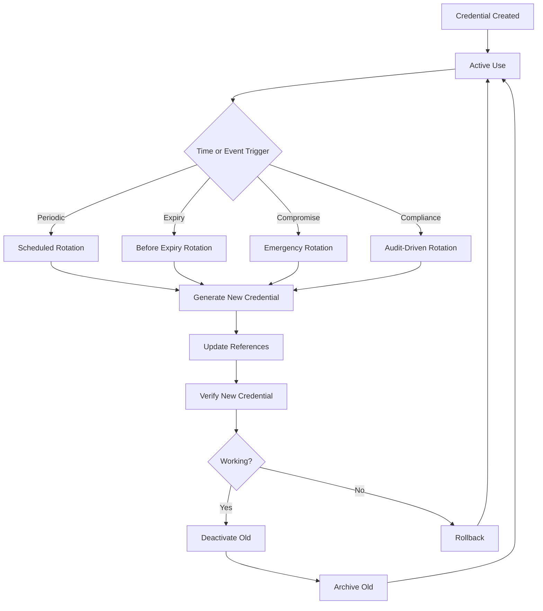

# Rotate Credentials

**Credential rotation** is the practice of periodically replacing credentials (passwords, API keys, tokens, certificates) to minimize the risk of credential compromise. This guide covers rotation strategies, implementation patterns, and best practices for zero-downtime credential rotation in Nebula.

## Why Rotate Credentials?



**Benefits:**
- **Limit exposure window**: Compromised credentials have limited lifetime
- **Compliance**: Meet regulatory requirements (PCI-DSS, SOC2, HIPAA)
- **Security hygiene**: Regular rotation reduces risk accumulation
- **Breach containment**: Automatic rotation can invalidate stolen credentials
- **Audit trail**: Track credential lifecycle for security audits

## Rotation Strategies

### 1. Periodic Rotation

Rotate credentials on a fixed schedule (daily, weekly, monthly).

```rust
use chrono::{DateTime, Utc, Duration};

#[derive(Clone, Debug)]
pub enum RotationPolicy {
    /// Rotate every N days
    Periodic { interval_days: u32 },
    /// Rotate before expiry with buffer
    BeforeExpiry { buffer_days: u32 },
    /// Rotate on specific schedule (cron-like)
    Scheduled { cron_expression: String },
    /// Manual rotation only
    Manual,
}

pub struct CredentialRotationManager {
    credential_manager: Arc<CredentialManager>,
    policy: RotationPolicy,
    scheduler: Arc<RotationScheduler>,
}

impl CredentialRotationManager {
    pub async fn should_rotate(&self, credential: &Credential) -> bool {
        match &self.policy {
            RotationPolicy::Periodic { interval_days } => {
                let age = Utc::now() - credential.created_at();
                age > Duration::days(*interval_days as i64)
            }
            RotationPolicy::BeforeExpiry { buffer_days } => {
                if let Some(expires_at) = credential.expires_at() {
                    let time_until_expiry = expires_at - Utc::now();
                    time_until_expiry < Duration::days(*buffer_days as i64)
                } else {
                    false
                }
            }
            RotationPolicy::Scheduled { cron_expression } => {
                // Check against cron schedule
                self.scheduler.is_due(cron_expression).await
            }
            RotationPolicy::Manual => false,
        }
    }

    /// Check all credentials and rotate if needed
    pub async fn run_rotation_check(&self) -> Result<RotationReport, Error> {
        info!("Running credential rotation check");
        let mut report = RotationReport::default();

        // Get all credentials
        let credentials = self.credential_manager.list_credentials().await?;

        for cred_id in credentials {
            let credential = self.credential_manager
                .get_credential(&cred_id, &Scope::Global)
                .await?;

            if self.should_rotate(&credential).await {
                info!("Credential {} needs rotation", cred_id);
                report.needs_rotation.push(cred_id.clone());

                match self.rotate_credential(&cred_id).await {
                    Ok(_) => {
                        report.rotated.push(cred_id.clone());
                        info!("Successfully rotated credential {}", cred_id);
                    }
                    Err(e) => {
                        report.failed.push((cred_id.clone(), e.to_string()));
                        error!("Failed to rotate credential {}: {}", cred_id, e);
                    }
                }
            }
        }

        Ok(report)
    }
}
```

### 2. Automatic Background Rotation

```rust
impl CredentialRotationManager {
    /// Start background rotation scheduler
    pub async fn start_background_rotation(self: Arc<Self>) -> JoinHandle<()> {
        tokio::spawn(async move {
            let mut interval = tokio::time::interval(Duration::from_hours(1));

            loop {
                interval.tick().await;

                match self.run_rotation_check().await {
                    Ok(report) => {
                        if !report.rotated.is_empty() {
                            info!("Rotation report: {} credentials rotated",
                                  report.rotated.len());
                        }
                        if !report.failed.is_empty() {
                            warn!("Rotation report: {} credentials failed",
                                  report.failed.len());
                        }
                    }
                    Err(e) => {
                        error!("Rotation check failed: {}", e);
                    }
                }
            }
        })
    }
}
```

## Rotation Procedures by Credential Type

### OAuth2 Token Rotation

OAuth2 tokens are automatically refreshed using refresh tokens.

```rust
impl CredentialRotationManager {
    /// Rotate OAuth2 credential by refreshing token
    pub async fn rotate_oauth2(&self, credential_id: &CredentialId)
        -> Result<Credential, Error> {
        info!("Rotating OAuth2 credential {}", credential_id);

        // Get current credential
        let credential = self.credential_manager
            .get_credential(credential_id, &Scope::Global)
            .await?;

        let (config, refresh_token, scopes) = match credential {
            Credential::OAuth2 {
                config,
                refresh_token: Some(ref refresh_token),
                scopes,
                ..
            } => (config, refresh_token, scopes),
            _ => return Err(Error::InvalidCredentialType),
        };

        // Refresh token using OAuth2 provider
        let client = reqwest::Client::new();
        let response = client
            .post(&config.token_url)
            .form(&[
                ("grant_type", "refresh_token"),
                ("refresh_token", refresh_token.expose_secret()),
                ("client_id", &config.client_id),
                ("client_secret", &config.client_secret),
            ])
            .send()
            .await?;

        if !response.status().is_success() {
            let error_text = response.text().await?;
            error!("Token refresh failed: {}", error_text);
            return Err(Error::TokenRefreshFailed(error_text));
        }

        let token_response: TokenResponse = response.json().await?;

        // Create new credential with refreshed tokens
        let new_credential = Credential::OAuth2 {
            config: config.clone(),
            access_token: SecretString::new(token_response.access_token),
            refresh_token: token_response.refresh_token
                .map(SecretString::new)
                .or(Some(refresh_token.clone())),
            expires_at: Some(Utc::now() + Duration::seconds(token_response.expires_in)),
            scopes: scopes.clone(),
        };

        // Update stored credential
        self.credential_manager
            .update_credential(credential_id, new_credential.clone())
            .await?;

        info!("Successfully rotated OAuth2 credential {}", credential_id);
        Ok(new_credential)
    }
}
```

### API Key Rotation (Multi-Stage)

For API keys, use **multi-stage rotation** to avoid downtime:

```rust
/// Multi-stage API key rotation for zero downtime
pub struct ApiKeyRotationOrchestrator {
    credential_manager: Arc<CredentialManager>,
    api_client: Arc<dyn ApiKeyProvider>,
}

impl ApiKeyRotationOrchestrator {
    /// Stage 1: Create new key (both old and new are valid)
    pub async fn create_new_key(&self, credential_id: &CredentialId)
        -> Result<SecretString, Error> {
        info!("Stage 1: Creating new API key for {}", credential_id);

        let credential = self.credential_manager
            .get_credential(credential_id, &Scope::Global)
            .await?;

        let old_api_key = match credential {
            Credential::ApiKey { api_key, .. } => api_key,
            _ => return Err(Error::InvalidCredentialType),
        };

        // Create new key via provider API
        let new_api_key = self.api_client.create_api_key().await?;

        // Store new key with temporary ID
        let temp_credential = Credential::ApiKey {
            api_key: new_api_key.clone(),
            key_id: format!("{}-new", credential_id),
        };

        let temp_id = self.credential_manager
            .store_credential(temp_credential, vec![Scope::Global])
            .await?;

        info!("Created new API key with temp ID: {}", temp_id);
        Ok(new_api_key)
    }

    /// Stage 2: Update application to use new key
    pub async fn update_to_new_key(
        &self,
        credential_id: &CredentialId,
        new_api_key: SecretString,
    ) -> Result<(), Error> {
        info!("Stage 2: Updating to new API key for {}", credential_id);

        // Update credential with new key
        let new_credential = Credential::ApiKey {
            api_key: new_api_key.clone(),
            key_id: credential_id.to_string(),
        };

        self.credential_manager
            .update_credential(credential_id, new_credential)
            .await?;

        // Wait for propagation
        tokio::time::sleep(Duration::from_secs(30)).await;

        // Verify new key works
        self.verify_api_key(&new_api_key).await?;

        info!("Successfully updated to new API key");
        Ok(())
    }

    /// Stage 3: Deactivate old key
    pub async fn deactivate_old_key(&self, old_api_key: &SecretString)
        -> Result<(), Error> {
        info!("Stage 3: Deactivating old API key");

        // Revoke old key via provider API
        self.api_client.revoke_api_key(old_api_key).await?;

        info!("Successfully deactivated old API key");
        Ok(())
    }

    /// Full rotation orchestration
    pub async fn rotate_api_key(&self, credential_id: &CredentialId)
        -> Result<(), Error> {
        info!("Starting multi-stage API key rotation for {}", credential_id);

        // Get old credential for rollback
        let old_credential = self.credential_manager
            .get_credential(credential_id, &Scope::Global)
            .await?;

        // Stage 1: Create new key
        let new_api_key = match self.create_new_key(credential_id).await {
            Ok(key) => key,
            Err(e) => {
                error!("Stage 1 failed: {}", e);
                return Err(e);
            }
        };

        // Stage 2: Update to new key
        if let Err(e) = self.update_to_new_key(credential_id, new_api_key.clone()).await {
            error!("Stage 2 failed: {}, rolling back", e);
            // Rollback: restore old credential
            self.credential_manager
                .update_credential(credential_id, old_credential)
                .await?;
            return Err(e);
        }

        // Stage 3: Deactivate old key
        if let Credential::ApiKey { api_key: old_api_key, .. } = old_credential {
            if let Err(e) = self.deactivate_old_key(&old_api_key).await {
                warn!("Stage 3 failed (non-fatal): {}", e);
                // Non-fatal: new key is already active
            }
        }

        info!("Successfully completed API key rotation for {}", credential_id);
        Ok(())
    }

    async fn verify_api_key(&self, api_key: &SecretString) -> Result<(), Error> {
        // Make test API call to verify key works
        let response = reqwest::Client::new()
            .get("https://api.example.com/verify")
            .header("X-API-Key", api_key.expose_secret())
            .send()
            .await?;

        if response.status().is_success() {
            Ok(())
        } else {
            Err(Error::ApiKeyVerificationFailed(
                response.status().to_string()
            ))
        }
    }
}
```

### Database Credential Rotation

Database credentials require special handling to avoid connection disruption.

```rust
pub struct DatabaseCredentialRotator {
    credential_manager: Arc<CredentialManager>,
    connection_pool: Arc<DatabasePool>,
}

impl DatabaseCredentialRotator {
    /// Rotate database credentials with connection pool refresh
    pub async fn rotate_database_credential(&self, credential_id: &CredentialId)
        -> Result<(), Error> {
        info!("Rotating database credential {}", credential_id);

        let old_credential = self.credential_manager
            .get_credential(credential_id, &Scope::Global)
            .await?;

        let (host, port, database, username, old_password) = match old_credential {
            Credential::Database {
                host,
                port,
                database,
                username,
                password,
                ..
            } => (host, port, database, username, password),
            _ => return Err(Error::InvalidCredentialType),
        };

        // Generate new password
        let new_password = SecretString::new(Self::generate_strong_password());

        // Step 1: Create new user or update password via privileged connection
        self.update_database_password(&username, &new_password).await?;

        // Step 2: Create new credential
        let new_credential = Credential::Database {
            host: host.clone(),
            port,
            database: database.clone(),
            username: username.clone(),
            password: new_password,
            ssl_mode: SSLMode::Require,
        };

        // Step 3: Update credential store
        self.credential_manager
            .update_credential(credential_id, new_credential.clone())
            .await?;

        // Step 4: Refresh connection pool with new credentials
        self.connection_pool.refresh_with_credentials(new_credential).await?;

        // Step 5: Wait for old connections to drain
        tokio::time::sleep(Duration::from_secs(10)).await;

        info!("Successfully rotated database credential {}", credential_id);
        Ok(())
    }

    async fn update_database_password(
        &self,
        username: &str,
        new_password: &SecretString,
    ) -> Result<(), Error> {
        // Use privileged connection to update password
        let query = format!(
            "ALTER USER {} WITH PASSWORD $1",
            username
        );

        self.connection_pool
            .execute(&query, &[new_password.expose_secret()])
            .await?;

        Ok(())
    }

    fn generate_strong_password() -> String {
        use rand::Rng;
        const CHARSET: &[u8] = b"ABCDEFGHIJKLMNOPQRSTUVWXYZ\
                                  abcdefghijklmnopqrstuvwxyz\
                                  0123456789\
                                  !@#$%^&*()-_=+";
        let mut rng = rand::thread_rng();

        (0..32)
            .map(|_| {
                let idx = rng.gen_range(0..CHARSET.len());
                CHARSET[idx] as char
            })
            .collect()
    }
}
```

### AWS Credentials Rotation

```rust
use aws_sdk_iam::{Client as IamClient, Region};

pub struct AwsCredentialRotator {
    credential_manager: Arc<CredentialManager>,
    iam_client: IamClient,
}

impl AwsCredentialRotator {
    pub async fn rotate_aws_credential(&self, credential_id: &CredentialId)
        -> Result<(), Error> {
        info!("Rotating AWS credential {}", credential_id);

        let old_credential = self.credential_manager
            .get_credential(credential_id, &Scope::Global)
            .await?;

        let (username, old_access_key_id) = match old_credential {
            Credential::Aws {
                access_key_id,
                ..
            } => (
                Self::extract_username_from_arn(&access_key_id)?,
                access_key_id,
            ),
            _ => return Err(Error::InvalidCredentialType),
        };

        // Step 1: Create new access key
        let response = self.iam_client
            .create_access_key()
            .user_name(&username)
            .send()
            .await
            .map_err(|e| Error::AwsError(e.to_string()))?;

        let access_key = response.access_key()
            .ok_or(Error::AwsError("No access key in response".to_string()))?;

        let new_access_key_id = access_key.access_key_id().to_string();
        let new_secret_access_key = SecretString::new(
            access_key.secret_access_key().to_string()
        );

        // Step 2: Update credential
        let new_credential = Credential::Aws {
            access_key_id: new_access_key_id.clone(),
            secret_access_key: new_secret_access_key,
            region: Some("us-east-1".to_string()),
            session_token: None,
        };

        self.credential_manager
            .update_credential(credential_id, new_credential)
            .await?;

        // Step 3: Wait for propagation
        tokio::time::sleep(Duration::from_secs(10)).await;

        // Step 4: Verify new credentials work
        self.verify_aws_credentials(&new_access_key_id).await?;

        // Step 5: Deactivate old access key
        self.iam_client
            .update_access_key()
            .user_name(&username)
            .access_key_id(&old_access_key_id)
            .status(aws_sdk_iam::types::StatusType::Inactive)
            .send()
            .await
            .map_err(|e| Error::AwsError(e.to_string()))?;

        // Step 6: Delete old access key after grace period
        tokio::spawn({
            let iam_client = self.iam_client.clone();
            let username = username.clone();
            let old_key = old_access_key_id.clone();
            async move {
                tokio::time::sleep(Duration::from_hours(24)).await;

                if let Err(e) = iam_client
                    .delete_access_key()
                    .user_name(&username)
                    .access_key_id(&old_key)
                    .send()
                    .await
                {
                    error!("Failed to delete old AWS access key: {}", e);
                }
            }
        });

        info!("Successfully rotated AWS credential {}", credential_id);
        Ok(())
    }

    fn extract_username_from_arn(arn: &str) -> Result<String, Error> {
        // Extract username from ARN or access key ID
        // This is simplified; real implementation would use AWS SDK
        Ok("iam-user".to_string())
    }

    async fn verify_aws_credentials(&self, access_key_id: &str) -> Result<(), Error> {
        // Make a test AWS API call
        let result = self.iam_client
            .get_user()
            .send()
            .await;

        match result {
            Ok(_) => Ok(()),
            Err(e) => Err(Error::AwsError(format!("Verification failed: {}", e))),
        }
    }
}
```

## Certificate Rotation

```rust
use x509_parser::prelude::*;

pub struct CertificateRotator {
    credential_manager: Arc<CredentialManager>,
    cert_authority: Arc<dyn CertificateAuthority>,
}

impl CertificateRotator {
    pub async fn rotate_certificate(&self, credential_id: &CredentialId)
        -> Result<(), Error> {
        info!("Rotating certificate {}", credential_id);

        let old_credential = self.credential_manager
            .get_credential(credential_id, &Scope::Global)
            .await?;

        let (cert_pem, key_pem) = match old_credential {
            Credential::Certificate {
                cert_pem,
                key_pem,
                ..
            } => (cert_pem, key_pem),
            _ => return Err(Error::InvalidCredentialType),
        };

        // Parse old certificate to extract subject info
        let old_cert = self.parse_certificate(&cert_pem)?;
        let subject = old_cert.subject();

        // Generate new key pair
        let (new_cert_pem, new_key_pem) = self.cert_authority
            .issue_certificate(subject)
            .await?;

        // Create new credential
        let new_credential = Credential::Certificate {
            cert_pem: SecretString::new(new_cert_pem),
            key_pem: SecretString::new(new_key_pem),
            ca_cert_pem: None,
        };

        // Update credential
        self.credential_manager
            .update_credential(credential_id, new_credential)
            .await?;

        // Reload TLS configurations
        self.reload_tls_config().await?;

        info!("Successfully rotated certificate {}", credential_id);
        Ok(())
    }

    fn parse_certificate(&self, pem: &SecretString) -> Result<X509Certificate, Error> {
        let (_, cert) = parse_x509_certificate(pem.expose_secret().as_bytes())
            .map_err(|e| Error::CertificateParseError(e.to_string()))?;
        Ok(cert)
    }

    async fn reload_tls_config(&self) -> Result<(), Error> {
        // Reload TLS configuration in all services
        // Implementation depends on your TLS setup
        Ok(())
    }
}
```

## Rollback Procedures

```rust
pub struct RotationRollbackManager {
    credential_manager: Arc<CredentialManager>,
    backup_storage: Arc<BackupStorage>,
}

impl RotationRollbackManager {
    /// Backup credential before rotation
    pub async fn backup_credential(&self, credential_id: &CredentialId)
        -> Result<BackupId, Error> {
        let credential = self.credential_manager
            .get_credential(credential_id, &Scope::Global)
            .await?;

        let backup_id = self.backup_storage
            .store_backup(credential_id, credential, Utc::now())
            .await?;

        info!("Backed up credential {} as {}", credential_id, backup_id);
        Ok(backup_id)
    }

    /// Rollback to previous credential
    pub async fn rollback_credential(
        &self,
        credential_id: &CredentialId,
        backup_id: &BackupId,
    ) -> Result<(), Error> {
        warn!("Rolling back credential {} to backup {}",
              credential_id, backup_id);

        let backup = self.backup_storage
            .retrieve_backup(backup_id)
            .await?;

        self.credential_manager
            .update_credential(credential_id, backup.credential)
            .await?;

        info!("Successfully rolled back credential {}", credential_id);
        Ok(())
    }

    /// Automatic rollback on rotation failure
    pub async fn rotate_with_rollback<F, Fut>(
        &self,
        credential_id: &CredentialId,
        rotation_fn: F,
    ) -> Result<(), Error>
    where
        F: FnOnce(&CredentialId) -> Fut,
        Fut: Future<Output = Result<(), Error>>,
    {
        // Backup before rotation
        let backup_id = self.backup_credential(credential_id).await?;

        // Attempt rotation
        match rotation_fn(credential_id).await {
            Ok(_) => {
                info!("Rotation succeeded for {}", credential_id);
                Ok(())
            }
            Err(e) => {
                error!("Rotation failed for {}: {}", credential_id, e);
                warn!("Attempting rollback...");

                match self.rollback_credential(credential_id, &backup_id).await {
                    Ok(_) => {
                        info!("Rollback successful");
                        Err(Error::RotationFailedWithRollback(e.to_string()))
                    }
                    Err(rollback_err) => {
                        error!("Rollback failed: {}", rollback_err);
                        Err(Error::RotationAndRollbackFailed(
                            e.to_string(),
                            rollback_err.to_string(),
                        ))
                    }
                }
            }
        }
    }
}
```

## Monitoring and Alerting

```rust
pub struct RotationMonitor {
    metrics: Arc<MetricsCollector>,
    alerting: Arc<AlertingService>,
}

impl RotationMonitor {
    /// Monitor credential age and alert on expiry
    pub async fn check_expiring_credentials(&self) -> Result<Vec<CredentialId>, Error> {
        let credentials = self.credential_manager.list_credentials().await?;
        let mut expiring = Vec::new();

        for cred_id in credentials {
            let credential = self.credential_manager
                .get_credential(&cred_id, &Scope::Global)
                .await?;

            if let Some(expires_at) = credential.expires_at() {
                let time_until_expiry = expires_at - Utc::now();

                if time_until_expiry < Duration::days(7) {
                    expiring.push(cred_id.clone());

                    self.alerting.send_alert(Alert {
                        severity: if time_until_expiry < Duration::days(1) {
                            Severity::Critical
                        } else {
                            Severity::Warning
                        },
                        title: format!("Credential {} expiring soon", cred_id),
                        message: format!(
                            "Credential expires in {} days",
                            time_until_expiry.num_days()
                        ),
                    }).await?;
                }
            }
        }

        Ok(expiring)
    }

    /// Record rotation metrics
    pub fn record_rotation(&self, credential_id: &CredentialId, success: bool, duration: Duration) {
        self.metrics.increment_counter(
            "credential_rotations_total",
            &[
                ("credential_id", credential_id.to_string()),
                ("success", success.to_string()),
            ],
        );

        self.metrics.record_histogram(
            "credential_rotation_duration_seconds",
            duration.as_secs_f64(),
            &[("credential_id", credential_id.to_string())],
        );
    }
}
```

## Best Practices

### 1. Rotation Frequency

```rust
// Recommended rotation intervals by credential type
pub fn recommended_rotation_interval(credential_type: &str) -> Duration {
    match credential_type {
        "oauth2" => Duration::hours(1),        // Token refresh
        "api_key" => Duration::days(90),       // Quarterly
        "database" => Duration::days(30),      // Monthly
        "aws" => Duration::days(90),           // Quarterly
        "certificate" => Duration::days(365),  // Annually
        _ => Duration::days(90),               // Default: quarterly
    }
}
```

### 2. Zero-Downtime Rotation

Always use multi-stage rotation:
1. Create new credential
2. Deploy new credential
3. Verify new credential works
4. Deactivate old credential
5. Delete old credential after grace period

### 3. Audit Logging

```rust
impl CredentialRotationManager {
    async fn log_rotation_event(&self, event: RotationEvent) {
        let log_entry = AuditLogEntry {
            timestamp: Utc::now(),
            event_type: "credential_rotation",
            credential_id: event.credential_id.clone(),
            user_id: event.initiated_by.clone(),
            success: event.success,
            error: event.error.clone(),
            metadata: json!({
                "old_key_id": event.old_key_id,
                "new_key_id": event.new_key_id,
                "rotation_type": event.rotation_type,
            }),
        };

        self.audit_logger.log(log_entry).await;
    }
}
```

### 4. Test Rotation Procedures

```rust
#[cfg(test)]
mod tests {
    use super::*;

    #[tokio::test]
    async fn test_api_key_rotation() {
        let rotator = setup_test_rotator().await;
        let credential_id = create_test_api_key().await;

        // Perform rotation
        let result = rotator.rotate_api_key(&credential_id).await;
        assert!(result.is_ok());

        // Verify new key works
        let new_credential = rotator.credential_manager
            .get_credential(&credential_id, &Scope::Global)
            .await
            .unwrap();

        assert!(verify_credential(&new_credential).await);
    }

    #[tokio::test]
    async fn test_rotation_rollback() {
        let rotator = setup_test_rotator().await;
        let credential_id = create_test_api_key().await;

        // Backup original
        let backup_id = rotator.backup_credential(&credential_id).await.unwrap();

        // Simulate failed rotation
        // ... perform rotation that fails ...

        // Rollback
        rotator.rollback_credential(&credential_id, &backup_id).await.unwrap();

        // Verify original credential restored
        let restored = rotator.credential_manager
            .get_credential(&credential_id, &Scope::Global)
            .await
            .unwrap();

        // Original should be restored
    }
}
```

## Complete Rotation Example

```rust
use nebula_credential::*;

#[tokio::main]
async fn main() -> Result<(), Box<dyn std::error::Error>> {
    // Initialize credential manager
    let credential_manager = CredentialManager::builder()
        .with_storage(PostgresStorage::new("postgres://...").await?)
        .with_encryption(EncryptionService::new(LocalKeyManager::new("keys.db".into())))
        .build();

    // Create rotation manager with periodic policy (30 days)
    let rotation_manager = Arc::new(CredentialRotationManager::new(
        credential_manager.clone(),
        RotationPolicy::Periodic { interval_days: 30 },
    ));

    // Start background rotation scheduler
    let rotation_handle = rotation_manager.clone().start_background_rotation().await;

    // Manual rotation example
    let credential_id = CredentialId::new("my-api-key");
    rotation_manager.rotate_credential(&credential_id).await?;

    // Monitor for expiring credentials
    let monitor = RotationMonitor::new(credential_manager);
    let expiring = monitor.check_expiring_credentials().await?;
    println!("Credentials expiring soon: {:?}", expiring);

    // Keep running
    rotation_handle.await?;

    Ok(())
}
```

## Links

- [[02-Crates/nebula-credential/Architecture|Credential Architecture]]
- [[02-Crates/nebula-credential/Security/Encryption|Encryption]]
- [[02-Crates/nebula-credential/Examples/OAuth2Flow|OAuth2 Flow]]
- [[04-Development/Security Best Practices]]
