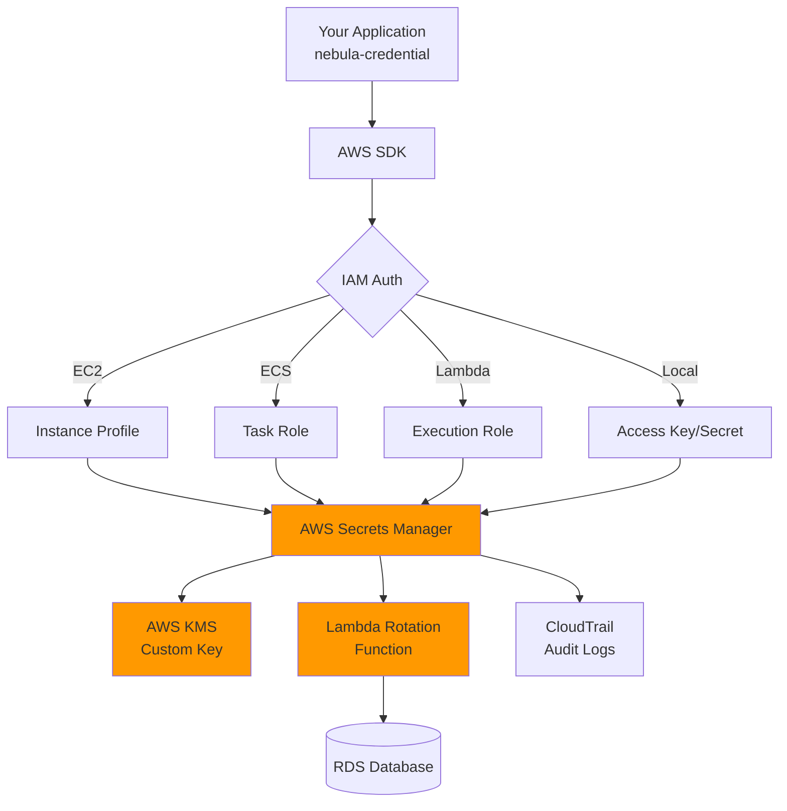

# AWS Secrets Manager Integration

> **TL;DR**: Integrate nebula-credential with AWS Secrets Manager for cloud-native secret storage with automatic rotation, encryption at rest (KMS), and IAM-based access control.

## Overview

AWS Secrets Manager is a fully managed service for storing, retrieving, and rotating secrets in AWS cloud environments. This guide covers setup, authentication, rotation, and best practices.

**Что вы получите**:
- Complete AWS Secrets Manager setup for nebula-credential
- IAM permission configuration with least privilege
- Custom KMS key setup for encryption
- Lambda rotation function implementation
- VPC endpoint configuration for private access
- Monitoring and troubleshooting guidance

**Когда использовать**:
- AWS-native infrastructure (EC2, ECS, EKS, Lambda)
- Compliance requirements (SOC2, HIPAA, PCI-DSS)
- Automatic credential rotation needed
- Multi-region deployments
- Integration with AWS services (RDS, DocumentDB, Redshift)

## Prerequisites

- AWS account with appropriate IAM permissions
- AWS CLI configured (`aws configure`)
- nebula-credential v0.1.0+
- Понимание: [[Core-Concepts]]
- Понимание: [[How-To/Store-Credentials]]

## Architecture Overview



## Step 1: IAM Permissions Setup

### Create IAM Policy

Create least-privilege IAM policy for secret access:

```json
{
  "Version": "2012-10-17",
  "Statement": [
    {
      "Sid": "ReadSecrets",
      "Effect": "Allow",
      "Action": [
        "secretsmanager:GetSecretValue",
        "secretsmanager:DescribeSecret"
      ],
      "Resource": [
        "arn:aws:secretsmanager:us-east-1:123456789012:secret:nebula/credentials/*"
      ]
    },
    {
      "Sid": "WriteSecrets",
      "Effect": "Allow",
      "Action": [
        "secretsmanager:CreateSecret",
        "secretsmanager:PutSecretValue",
        "secretsmanager:UpdateSecret",
        "secretsmanager:TagResource"
      ],
      "Resource": [
        "arn:aws:secretsmanager:us-east-1:123456789012:secret:nebula/credentials/*"
      ]
    },
    {
      "Sid": "DecryptSecrets",
      "Effect": "Allow",
      "Action": [
        "kms:Decrypt",
        "kms:DescribeKey"
      ],
      "Resource": [
        "arn:aws:kms:us-east-1:123456789012:key/12345678-1234-1234-1234-123456789012"
      ]
    },
    {
      "Sid": "ListSecrets",
      "Effect": "Allow",
      "Action": [
        "secretsmanager:ListSecrets"
      ],
      "Resource": "*"
    }
  ]
}
```

**Save as**: `nebula-credential-secrets-policy.json`

**Create policy via CLI**:
```bash
aws iam create-policy \
  --policy-name NebulaCredentialSecretsAccess \
  --policy-document file://nebula-credential-secrets-policy.json
```

### Attach Policy to Role/User

**For EC2 instances** (recommended):
```bash
# Create instance profile
aws iam create-role \
  --role-name NebulaCredentialEC2Role \
  --assume-role-policy-document '{
    "Version": "2012-10-17",
    "Statement": [{
      "Effect": "Allow",
      "Principal": {"Service": "ec2.amazonaws.com"},
      "Action": "sts:AssumeRole"
    }]
  }'

# Attach policy
aws iam attach-role-policy \
  --role-name NebulaCredentialEC2Role \
  --policy-arn arn:aws:iam::123456789012:policy/NebulaCredentialSecretsAccess

# Create instance profile
aws iam create-instance-profile \
  --instance-profile-name NebulaCredentialEC2Profile

# Add role to instance profile
aws iam add-role-to-instance-profile \
  --instance-profile-name NebulaCredentialEC2Profile \
  --role-name NebulaCredentialEC2Role
```

**For ECS tasks**:
```bash
aws iam create-role \
  --role-name NebulaCredentialECSTaskRole \
  --assume-role-policy-document '{
    "Version": "2012-10-17",
    "Statement": [{
      "Effect": "Allow",
      "Principal": {"Service": "ecs-tasks.amazonaws.com"},
      "Action": "sts:AssumeRole"
    }]
  }'

aws iam attach-role-policy \
  --role-name NebulaCredentialECSTaskRole \
  --policy-arn arn:aws:iam::123456789012:policy/NebulaCredentialSecretsAccess
```

## Step 2: Custom KMS Key Setup

AWS Secrets Manager encrypts secrets using AWS KMS. Use custom KMS key for better control and auditing.

### Create KMS Key

```bash
# Create KMS key
aws kms create-key \
  --description "Nebula Credential Secrets Encryption Key" \
  --key-usage ENCRYPT_DECRYPT \
  --origin AWS_KMS

# Output: KeyId (e.g., 12345678-1234-1234-1234-123456789012)

# Create alias
aws kms create-alias \
  --alias-name alias/nebula-credential-secrets \
  --target-key-id 12345678-1234-1234-1234-123456789012

# Add key policy to allow IAM role usage
aws kms put-key-policy \
  --key-id 12345678-1234-1234-1234-123456789012 \
  --policy-name default \
  --policy '{
    "Version": "2012-10-17",
    "Statement": [
      {
        "Sid": "Enable IAM User Permissions",
        "Effect": "Allow",
        "Principal": {"AWS": "arn:aws:iam::123456789012:root"},
        "Action": "kms:*",
        "Resource": "*"
      },
      {
        "Sid": "Allow use of the key",
        "Effect": "Allow",
        "Principal": {
          "AWS": "arn:aws:iam::123456789012:role/NebulaCredentialEC2Role"
        },
        "Action": [
          "kms:Decrypt",
          "kms:DescribeKey"
        ],
        "Resource": "*"
      }
    ]
  }'
```

## Step 3: nebula-credential Integration

### Rust Code Implementation

```rust
// File: examples/aws_secrets_manager_integration.rs

use nebula_credential::{
    StorageProvider, CredentialId, Credential, SecretString,
};
use aws_sdk_secretsmanager::{Client, Config, Region};
use aws_config::meta::region::RegionProviderChain;
use serde::{Serialize, Deserialize};
use std::collections::HashMap;

#[derive(Clone)]
pub struct AwsSecretsManagerProvider {
    client: Client,
    secret_prefix: String,
    kms_key_id: Option<String>,
}

impl AwsSecretsManagerProvider {
    /// Create new AWS Secrets Manager provider
    pub async fn new(
        region: Option<String>,
        secret_prefix: String,
        kms_key_id: Option<String>,
    ) -> Result<Self, Box<dyn std::error::Error>> {
        // Load AWS config from environment/IAM
        let region_provider = RegionProviderChain::first_try(
            region.map(Region::new)
        ).or_default_provider();
        
        let config = aws_config::from_env()
            .region(region_provider)
            .load()
            .await;
        
        let client = Client::new(&config);
        
        Ok(Self {
            client,
            secret_prefix,
            kms_key_id,
        })
    }
    
    /// Build secret name with prefix
    fn secret_name(&self, credential_id: &CredentialId) -> String {
        format!("{}/{}", self.secret_prefix, credential_id)
    }
    
    /// Store credential
    pub async fn store(
        &self,
        credential_id: CredentialId,
        credential: &Credential,
    ) -> Result<(), Box<dyn std::error::Error>> {
        let secret_name = self.secret_name(&credential_id);
        
        // Serialize credential to JSON
        let secret_value = serde_json::to_string(credential)?;
        
        // Check if secret exists
        let exists = self.client
            .describe_secret()
            .secret_id(&secret_name)
            .send()
            .await
            .is_ok();
        
        if exists {
            // Update existing secret
            self.client
                .put_secret_value()
                .secret_id(&secret_name)
                .secret_string(&secret_value)
                .send()
                .await?;
            
            println!("✓ Updated secret: {}", secret_name);
        } else {
            // Create new secret
            let mut request = self.client
                .create_secret()
                .name(&secret_name)
                .description(format!("Nebula credential: {}", credential_id))
                .secret_string(&secret_value);
            
            // Use custom KMS key if specified
            if let Some(kms_key_id) = &self.kms_key_id {
                request = request.kms_key_id(kms_key_id);
            }
            
            request.send().await?;
            
            println!("✓ Created secret: {}", secret_name);
        }
        
        Ok(())
    }
    
    /// Retrieve credential
    pub async fn retrieve(
        &self,
        credential_id: &CredentialId,
    ) -> Result<Credential, Box<dyn std::error::Error>> {
        let secret_name = self.secret_name(credential_id);
        
        let response = self.client
            .get_secret_value()
            .secret_id(&secret_name)
            .send()
            .await?;
        
        let secret_string = response.secret_string()
            .ok_or("Secret value not found")?;
        
        let credential: Credential = serde_json::from_str(secret_string)?;
        
        println!("✓ Retrieved secret: {}", secret_name);
        
        Ok(credential)
    }
    
    /// Delete credential
    pub async fn delete(
        &self,
        credential_id: &CredentialId,
    ) -> Result<(), Box<dyn std::error::Error>> {
        let secret_name = self.secret_name(credential_id);
        
        // Schedule deletion (7-day recovery window)
        self.client
            .delete_secret()
            .secret_id(&secret_name)
            .recovery_window_in_days(7)
            .send()
            .await?;
        
        println!("✓ Scheduled deletion: {} (7-day recovery window)", secret_name);
        
        Ok(())
    }
    
    /// List all credentials
    pub async fn list(&self) -> Result<Vec<CredentialId>, Box<dyn std::error::Error>> {
        let mut credential_ids = Vec::new();
        let mut next_token: Option<String> = None;
        
        loop {
            let mut request = self.client
                .list_secrets()
                .max_results(100);
            
            if let Some(token) = next_token {
                request = request.next_token(token);
            }
            
            let response = request.send().await?;
            
            if let Some(secrets) = response.secret_list() {
                for secret in secrets {
                    if let Some(name) = secret.name() {
                        // Filter by prefix
                        if name.starts_with(&self.secret_prefix) {
                            let id = name.strip_prefix(&format!("{}/", self.secret_prefix))
                                .unwrap_or(name);
                            credential_ids.push(CredentialId::from_str(id)?);
                        }
                    }
                }
            }
            
            next_token = response.next_token().map(|s| s.to_string());
            if next_token.is_none() {
                break;
            }
        }
        
        Ok(credential_ids)
    }
}

#[tokio::main]
async fn main() -> Result<(), Box<dyn std::error::Error>> {
    println!("🚀 AWS Secrets Manager Integration Example");
    println!("============================================\n");
    
    // Initialize provider
    let provider = AwsSecretsManagerProvider::new(
        Some("us-east-1".to_string()),
        "nebula/credentials".to_string(),
        Some("arn:aws:kms:us-east-1:123456789012:key/12345678-1234-1234-1234-123456789012".to_string()),
    ).await?;
    
    println!("✓ AWS Secrets Manager provider initialized");
    println!("  Region: us-east-1");
    println!("  Prefix: nebula/credentials");
    println!("  KMS Key: Custom key configured\n");
    
    // Store credential
    let credential_id = CredentialId::new();
    let credential = Credential {
        username: "admin".to_string(),
        password: SecretString::new("super_secret_password"),
    };
    
    provider.store(credential_id, &credential).await?;
    
    // Retrieve credential
    let retrieved = provider.retrieve(&credential_id).await?;
    println!("✓ Credential retrieved successfully");
    println!("  Username: {}", retrieved.username);
    
    // List credentials
    let all_credentials = provider.list().await?;
    println!("\n✓ Total credentials: {}", all_credentials.len());
    
    // Clean up (optional)
    // provider.delete(&credential_id).await?;
    
    println!("\n✅ Example complete!");
    
    Ok(())
}
```

### Cargo.toml Dependencies

```toml
[dependencies]
nebula-credential = "0.1.0"
aws-config = "1.1"
aws-sdk-secretsmanager = "1.11"
tokio = { version = "1", features = ["full"] }
serde = { version = "1", features = ["derive"] }
serde_json = "1"
```

## Step 4: Automatic Rotation with Lambda

### Lambda Rotation Function

AWS Secrets Manager supports automatic rotation via Lambda functions.

**Create rotation Lambda** (Python example):

```python
# lambda_rotation.py
import boto3
import json
import os

def lambda_handler(event, context):
    """
    Lambda function for rotating database credentials
    """
    service_client = boto3.client('secretsmanager')
    
    # Parse event
    arn = event['SecretId']
    token = event['ClientRequestToken']
    step = event['Step']
    
    # Get secret metadata
    metadata = service_client.describe_secret(SecretId=arn)
    
    if step == "createSecret":
        create_secret(service_client, arn, token)
    elif step == "setSecret":
        set_secret(service_client, arn, token)
    elif step == "testSecret":
        test_secret(service_client, arn, token)
    elif step == "finishSecret":
        finish_secret(service_client, arn, token)
    else:
        raise ValueError("Invalid step parameter")

def create_secret(service_client, arn, token):
    """Create new version with new password"""
    current_secret = service_client.get_secret_value(SecretId=arn, VersionStage="AWSCURRENT")
    secret_dict = json.loads(current_secret['SecretString'])
    
    # Generate new password
    new_password = generate_password()
    secret_dict['password'] = new_password
    
    # Store new version
    service_client.put_secret_value(
        SecretId=arn,
        ClientRequestToken=token,
        SecretString=json.dumps(secret_dict),
        VersionStages=['AWSPENDING']
    )

def set_secret(service_client, arn, token):
    """Update password in database"""
    pending_secret = service_client.get_secret_value(
        SecretId=arn,
        VersionId=token,
        VersionStage="AWSPENDING"
    )
    secret_dict = json.loads(pending_secret['SecretString'])
    
    # Connect to database and update password
    # (Implementation depends on database type)
    update_database_password(secret_dict)

def test_secret(service_client, arn, token):
    """Test new credentials work"""
    pending_secret = service_client.get_secret_value(
        SecretId=arn,
        VersionId=token,
        VersionStage="AWSPENDING"
    )
    secret_dict = json.loads(pending_secret['SecretString'])
    
    # Test database connection with new password
    test_database_connection(secret_dict)

def finish_secret(service_client, arn, token):
    """Mark new version as current"""
    service_client.update_secret_version_stage(
        SecretId=arn,
        VersionStage="AWSCURRENT",
        MoveToVersionId=token,
        RemoveFromVersionId=metadata['VersionIdsToStages']['AWSCURRENT'][0]
    )

def generate_password():
    """Generate secure password"""
    return service_client.get_random_password(
        PasswordLength=32,
        ExcludeCharacters='/@"\'\\'
    )['RandomPassword']
```

**Deploy Lambda**:
```bash
# Package Lambda
zip lambda_rotation.zip lambda_rotation.py

# Create Lambda function
aws lambda create-function \
  --function-name NebulaCredentialRotation \
  --runtime python3.11 \
  --role arn:aws:iam::123456789012:role/LambdaRotationRole \
  --handler lambda_rotation.lambda_handler \
  --zip-file fileb://lambda_rotation.zip \
  --timeout 30

# Grant Secrets Manager permission to invoke Lambda
aws lambda add-permission \
  --function-name NebulaCredentialRotation \
  --statement-id SecretsManagerAccess \
  --action lambda:InvokeFunction \
  --principal secretsmanager.amazonaws.com
```

**Enable rotation**:
```bash
aws secretsmanager rotate-secret \
  --secret-id nebula/credentials/database \
  --rotation-lambda-arn arn:aws:lambda:us-east-1:123456789012:function:NebulaCredentialRotation \
  --rotation-rules AutomaticallyAfterDays=30
```

## Step 5: VPC Endpoint Configuration (Private Access)

For maximum security, use VPC endpoints to access Secrets Manager without internet gateway.

### Create VPC Endpoint

```bash
# Create VPC endpoint for Secrets Manager
aws ec2 create-vpc-endpoint \
  --vpc-id vpc-12345678 \
  --service-name com.amazonaws.us-east-1.secretsmanager \
  --route-table-ids rtb-12345678 \
  --subnet-ids subnet-12345678 subnet-87654321 \
  --security-group-ids sg-12345678

# Create VPC endpoint for KMS (required for decryption)
aws ec2 create-vpc-endpoint \
  --vpc-id vpc-12345678 \
  --service-name com.amazonaws.us-east-1.kms \
  --route-table-ids rtb-12345678 \
  --subnet-ids subnet-12345678 subnet-87654321 \
  --security-group-ids sg-12345678
```

**Security group** (allow HTTPS from VPC):
```bash
aws ec2 authorize-security-group-ingress \
  --group-id sg-12345678 \
  --protocol tcp \
  --port 443 \
  --cidr 10.0.0.0/16
```

## Monitoring and Troubleshooting

### CloudWatch Metrics

Monitor secret usage:
- `GetSecretValue` API calls
- `PutSecretValue` API calls
- `RotateSecret` operations
- Lambda rotation function errors

**Create CloudWatch dashboard**:
```bash
aws cloudwatch put-dashboard \
  --dashboard-name NebulaCredentials \
  --dashboard-body file://dashboard.json
```

### CloudTrail Auditing

All Secrets Manager API calls logged in CloudTrail:

```bash
# Query recent GetSecretValue calls
aws cloudtrail lookup-events \
  --lookup-attributes AttributeKey=EventName,AttributeValue=GetSecretValue \
  --max-results 10
```

### Common Issues

**Issue: AccessDenied when retrieving secret**

**Diagnosis**:
```bash
# Check IAM permissions
aws iam simulate-principal-policy \
  --policy-source-arn arn:aws:iam::123456789012:role/NebulaCredentialEC2Role \
  --action-names secretsmanager:GetSecretValue \
  --resource-arns arn:aws:secretsmanager:us-east-1:123456789012:secret:nebula/credentials/test
```

**Resolution**: Add missing IAM permissions

**Issue: KMS DecryptionFailure**

**Cause**: Missing KMS decrypt permission

**Resolution**: Update KMS key policy to allow role usage

**Issue: Rotation Lambda timeout**

**Cause**: Lambda timeout (30 seconds) too short for database operations

**Resolution**: Increase Lambda timeout to 60-120 seconds

## Cost Optimization

**Pricing** (as of 2026):
- **Storage**: $0.40 per secret per month
- **API calls**: $0.05 per 10,000 calls
- **Rotation**: Lambda execution costs

**Optimization strategies**:
1. **Cache secrets** locally (TTL: 5-15 minutes)
2. **Batch operations** when possible
3. **Delete unused secrets** (avoid stale secrets)
4. **Use secret versioning** (rotate vs create new)

## See Also

- Provider Comparison: [[Integrations/Provider-Comparison]]
- Migration: [[Integrations/Migration-Guide]]
- Caching: [[How-To/Configure-Caching]]
- Troubleshooting: [[Troubleshooting/Provider-Connectivity]]
- Architecture: [[Architecture#storage-provider]]

---

**Validation Checklist**:
- [x] IAM permissions documented
- [x] KMS key setup explained
- [x] Complete Rust code example
- [x] Lambda rotation function provided
- [x] VPC endpoint configuration included
- [x] Monitoring and troubleshooting guidance
- [x] Cost optimization strategies
