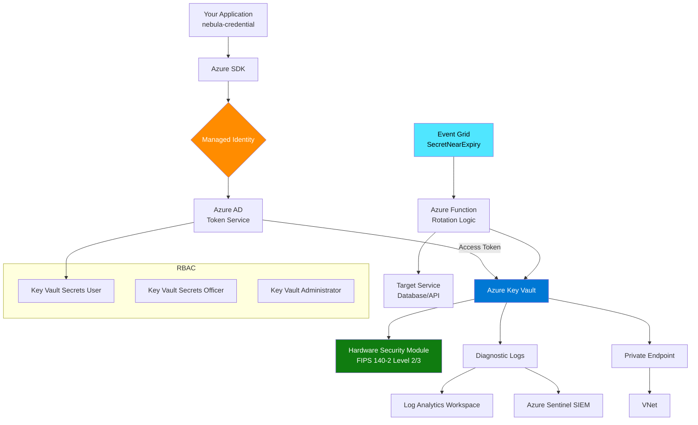

# Azure Key Vault Integration

> **TL;DR**: Integrate nebula-credential with Azure Key Vault for enterprise-grade secret management with managed identities, RBAC, encryption at rest, and Event Grid-based rotation.

## Overview

Azure Key Vault is Microsoft's cloud-native secrets management service with deep Azure integration. This guide covers managed identity authentication, RBAC configuration, private endpoints, and automatic rotation using Event Grid + Azure Functions.

**Что вы получите**:
- Complete Azure Key Vault setup for nebula-credential
- Managed Identity configuration (system and user-assigned)
- RBAC permissions with Privileged Identity Management (PIM)
- Private endpoint setup for network isolation
- Event Grid + Function App rotation automation
- Soft-delete and purge protection configuration
- Monitoring with Azure Monitor and Application Insights

**Когда использовать**:
- Azure-native infrastructure (VMs, AKS, App Service, Functions)
- Compliance requirements (SOC2, ISO 27001, HIPAA)
- Managed identities for passwordless authentication
- Multi-region deployments with geo-replication
- Integration with Azure services (SQL Database, Cosmos DB, Storage)
- Enterprise security with Azure AD integration

## Prerequisites

- Azure subscription with appropriate permissions
- Azure CLI configured (`az login`)
- nebula-credential v0.1.0+
- Понимание: [[Core-Concepts]]
- Понимание: [[How-To/Store-Credentials]]

## Architecture Overview



**Архитектурные компоненты**:
- **Managed Identity**: Passwordless authentication via Azure AD
- **RBAC**: Fine-grained access control with built-in roles
- **HSM**: Hardware-backed encryption (FIPS 140-2 Level 2/3)
- **Private Endpoints**: Network isolation via VNet
- **Event Grid**: Event-driven rotation triggers
- **Soft-delete**: 90-day retention for deleted secrets
- **Purge Protection**: Prevents permanent deletion during retention

## Step 1: Create Azure Key Vault

### 1.1 Create Resource Group and Key Vault

```bash
# Variables
RESOURCE_GROUP="nebula-prod-rg"
LOCATION="eastus"
KEY_VAULT_NAME="nebula-kv-prod"  # Must be globally unique
APP_NAME="nebula-app"

# Create resource group
az group create \
  --name $RESOURCE_GROUP \
  --location $LOCATION

# Create Key Vault with soft-delete and purge protection
az keyvault create \
  --name $KEY_VAULT_NAME \
  --resource-group $RESOURCE_GROUP \
  --location $LOCATION \
  --enable-soft-delete true \
  --soft-delete-retention-days 90 \
  --enable-purge-protection true \
  --enable-rbac-authorization true \
  --sku Premium  # Premium for HSM-backed keys

# Get Key Vault resource ID
KV_ID=$(az keyvault show \
  --name $KEY_VAULT_NAME \
  --resource-group $RESOURCE_GROUP \
  --query id -o tsv)

echo "Key Vault ID: $KV_ID"
```

**Configuration Options**:
- `--sku Standard`: Software-protected keys (cheaper)
- `--sku Premium`: HSM-protected keys (recommended for production)
- `--enable-rbac-authorization`: Use RBAC instead of access policies
- `--enable-soft-delete`: Recoverable deletion (mandatory after 2025)
- `--enable-purge-protection`: Prevent permanent deletion during retention

### 1.2 Configure Diagnostic Logging

```bash
# Create Log Analytics Workspace
LOG_WORKSPACE_NAME="nebula-logs"
az monitor log-analytics workspace create \
  --resource-group $RESOURCE_GROUP \
  --workspace-name $LOG_WORKSPACE_NAME \
  --location $LOCATION

WORKSPACE_ID=$(az monitor log-analytics workspace show \
  --resource-group $RESOURCE_GROUP \
  --workspace-name $LOG_WORKSPACE_NAME \
  --query id -o tsv)

# Enable diagnostic logging
az monitor diagnostic-settings create \
  --name "nebula-kv-diagnostics" \
  --resource $KV_ID \
  --workspace $WORKSPACE_ID \
  --logs '[
    {
      "category": "AuditEvent",
      "enabled": true,
      "retentionPolicy": {
        "enabled": true,
        "days": 365
      }
    }
  ]' \
  --metrics '[
    {
      "category": "AllMetrics",
      "enabled": true,
      "retentionPolicy": {
        "enabled": true,
        "days": 90
      }
    }
  ]'
```

## Step 2: Managed Identity Setup

### 2.1 System-Assigned Managed Identity (Recommended)

For Azure VMs, AKS, App Service, Functions:

```bash
# Example: Enable system-assigned identity on Azure VM
VM_NAME="nebula-app-vm"
az vm identity assign \
  --name $VM_NAME \
  --resource-group $RESOURCE_GROUP

# Get principal ID
PRINCIPAL_ID=$(az vm show \
  --name $VM_NAME \
  --resource-group $RESOURCE_GROUP \
  --query identity.principalId -o tsv)

echo "Managed Identity Principal ID: $PRINCIPAL_ID"
```

**For AKS (Azure Kubernetes Service)**:

```bash
# Enable pod identity
az aks update \
  --resource-group $RESOURCE_GROUP \
  --name nebula-aks-cluster \
  --enable-pod-identity

# Create identity
az identity create \
  --name nebula-pod-identity \
  --resource-group $RESOURCE_GROUP

IDENTITY_CLIENT_ID=$(az identity show \
  --name nebula-pod-identity \
  --resource-group $RESOURCE_GROUP \
  --query clientId -o tsv)

IDENTITY_RESOURCE_ID=$(az identity show \
  --name nebula-pod-identity \
  --resource-group $RESOURCE_GROUP \
  --query id -o tsv)

# Create pod identity binding
az aks pod-identity add \
  --resource-group $RESOURCE_GROUP \
  --cluster-name nebula-aks-cluster \
  --namespace nebula \
  --name nebula-pod-identity \
  --identity-resource-id $IDENTITY_RESOURCE_ID
```

### 2.2 User-Assigned Managed Identity

For multi-resource scenarios:

```bash
# Create user-assigned identity
az identity create \
  --name nebula-user-identity \
  --resource-group $RESOURCE_GROUP

USER_IDENTITY_ID=$(az identity show \
  --name nebula-user-identity \
  --resource-group $RESOURCE_GROUP \
  --query id -o tsv)

USER_IDENTITY_CLIENT_ID=$(az identity show \
  --name nebula-user-identity \
  --resource-group $RESOURCE_GROUP \
  --query clientId -o tsv)

USER_PRINCIPAL_ID=$(az identity show \
  --name nebula-user-identity \
  --resource-group $RESOURCE_GROUP \
  --query principalId -o tsv)

# Assign to VM
az vm identity assign \
  --name $VM_NAME \
  --resource-group $RESOURCE_GROUP \
  --identities $USER_IDENTITY_ID
```

## Step 3: RBAC Configuration

### 3.1 Assign RBAC Roles

Azure Key Vault has built-in RBAC roles:

| Role | Permissions | Use Case |
|------|-------------|----------|
| `Key Vault Secrets User` | Read secrets | Application read access |
| `Key Vault Secrets Officer` | Create, read, update, delete secrets | Rotation functions |
| `Key Vault Administrator` | Full access including RBAC | Admin operations |
| `Key Vault Reader` | Read metadata (not secret values) | Monitoring/auditing |

```bash
# Assign "Key Vault Secrets User" to application identity
az role assignment create \
  --role "Key Vault Secrets User" \
  --assignee $PRINCIPAL_ID \
  --scope $KV_ID

# Assign "Key Vault Secrets Officer" to rotation function
ROTATION_FUNC_PRINCIPAL_ID="..."  # From rotation function setup
az role assignment create \
  --role "Key Vault Secrets Officer" \
  --assignee $ROTATION_FUNC_PRINCIPAL_ID \
  --scope $KV_ID
```

### 3.2 Privileged Identity Management (PIM)

For time-limited admin access (Enterprise E5 required):

```bash
# Create eligible assignment (requires Azure AD PowerShell)
az rest \
  --method POST \
  --uri "https://graph.microsoft.com/v1.0/roleManagement/directory/roleEligibilityScheduleRequests" \
  --body '{
    "principalId": "'$ADMIN_PRINCIPAL_ID'",
    "roleDefinitionId": "Key Vault Administrator",
    "directoryScopeId": "'$KV_ID'",
    "action": "adminAssign",
    "scheduleInfo": {
      "expiration": {
        "type": "afterDuration",
        "duration": "PT8H"
      }
    },
    "justification": "Emergency rotation"
  }'
```

## Step 4: Rust Implementation

### 4.1 Add Dependencies

```toml
[dependencies]
azure_security_keyvault = "0.20"
azure_identity = "0.20"
azure_core = "0.20"
tokio = { version = "1", features = ["full"] }
serde = { version = "1", features = ["derive"] }
serde_json = "1"
thiserror = "1"
tracing = "0.1"
```

### 4.2 Implement AzureKeyVaultProvider

```rust
use azure_identity::DefaultAzureCredential;
use azure_security_keyvault::KeyvaultClient;
use serde::{Deserialize, Serialize};
use std::sync::Arc;
use thiserror::Error;

#[derive(Debug, Error)]
pub enum AzureKeyVaultError {
    #[error("Azure Key Vault client error: {0}")]
    ClientError(String),
    
    #[error("Secret not found: {0}")]
    SecretNotFound(String),
    
    #[error("Serialization error: {0}")]
    SerializationError(#[from] serde_json::Error),
    
    #[error("Authentication error: {0}")]
    AuthError(String),
}

pub struct AzureKeyVaultProvider {
    client: Arc<KeyvaultClient>,
    vault_url: String,
    secret_prefix: String,
}

impl AzureKeyVaultProvider {
    /// Create new Azure Key Vault provider with managed identity
    pub async fn new(
        vault_name: &str,
        secret_prefix: String,
    ) -> Result<Self, AzureKeyVaultError> {
        let vault_url = format!("https://{}.vault.azure.net", vault_name);
        
        // Use DefaultAzureCredential (tries managed identity first)
        let credential = Arc::new(DefaultAzureCredential::default());
        let client = KeyvaultClient::new(&vault_url, credential)
            .map_err(|e| AzureKeyVaultError::ClientError(e.to_string()))?;
        
        Ok(Self {
            client: Arc::new(client),
            vault_url,
            secret_prefix,
        })
    }
    
    /// Create provider with specific client ID (for user-assigned identity)
    pub async fn new_with_client_id(
        vault_name: &str,
        secret_prefix: String,
        client_id: &str,
    ) -> Result<Self, AzureKeyVaultError> {
        let vault_url = format!("https://{}.vault.azure.net", vault_name);
        
        // Use specific client ID for user-assigned identity
        std::env::set_var("AZURE_CLIENT_ID", client_id);
        
        let credential = Arc::new(DefaultAzureCredential::default());
        let client = KeyvaultClient::new(&vault_url, credential)
            .map_err(|e| AzureKeyVaultError::ClientError(e.to_string()))?;
        
        Ok(Self {
            client: Arc::new(client),
            vault_url,
            secret_prefix,
        })
    }
    
    fn secret_name(&self, credential_id: &CredentialId) -> String {
        format!("{}-{}", self.secret_prefix, credential_id.as_str())
            .replace('/', "-")  // Key Vault doesn't allow '/' in names
            .replace('_', "-")  // Normalize to hyphens
    }
    
    /// Store credential in Azure Key Vault
    pub async fn store(
        &self,
        credential_id: CredentialId,
        credential: &Credential,
    ) -> Result<(), AzureKeyVaultError> {
        let secret_name = self.secret_name(&credential_id);
        let secret_value = serde_json::to_string(credential)?;
        
        // Set secret with metadata
        self.client
            .set_secret(&secret_name, &secret_value)
            .content_type("application/json")
            .tags(vec![
                ("credential_type", credential.credential_type()),
                ("owner_id", credential.owner_id().as_str()),
                ("scope", credential.scope().to_string().as_str()),
                ("created_by", "nebula-credential"),
            ])
            .await
            .map_err(|e| AzureKeyVaultError::ClientError(e.to_string()))?;
        
        tracing::info!(
            vault_url = %self.vault_url,
            secret_name = %secret_name,
            "Stored credential in Azure Key Vault"
        );
        
        Ok(())
    }
    
    /// Retrieve credential from Azure Key Vault
    pub async fn retrieve(
        &self,
        credential_id: &CredentialId,
    ) -> Result<Option<Credential>, AzureKeyVaultError> {
        let secret_name = self.secret_name(credential_id);
        
        match self.client.get_secret(&secret_name).await {
            Ok(secret) => {
                let credential: Credential = serde_json::from_str(&secret.value)?;
                
                tracing::debug!(
                    vault_url = %self.vault_url,
                    secret_name = %secret_name,
                    version = ?secret.attributes.version,
                    "Retrieved credential from Azure Key Vault"
                );
                
                Ok(Some(credential))
            }
            Err(e) => {
                // Check if secret not found
                if e.to_string().contains("404") {
                    Ok(None)
                } else {
                    Err(AzureKeyVaultError::ClientError(e.to_string()))
                }
            }
        }
    }
    
    /// Delete credential from Azure Key Vault (soft-delete)
    pub async fn delete(
        &self,
        credential_id: &CredentialId,
    ) -> Result<(), AzureKeyVaultError> {
        let secret_name = self.secret_name(credential_id);
        
        self.client
            .delete_secret(&secret_name)
            .await
            .map_err(|e| AzureKeyVaultError::ClientError(e.to_string()))?;
        
        tracing::info!(
            vault_url = %self.vault_url,
            secret_name = %secret_name,
            "Soft-deleted credential from Azure Key Vault"
        );
        
        Ok(())
    }
    
    /// Permanently delete soft-deleted secret (requires purge permission)
    pub async fn purge(
        &self,
        credential_id: &CredentialId,
    ) -> Result<(), AzureKeyVaultError> {
        let secret_name = self.secret_name(credential_id);
        
        self.client
            .purge_deleted_secret(&secret_name)
            .await
            .map_err(|e| AzureKeyVaultError::ClientError(e.to_string()))?;
        
        tracing::warn!(
            vault_url = %self.vault_url,
            secret_name = %secret_name,
            "Permanently purged credential from Azure Key Vault"
        );
        
        Ok(())
    }
    
    /// List all credentials by scope
    pub async fn list_by_scope(
        &self,
        scope: &CredentialScope,
    ) -> Result<Vec<CredentialId>, AzureKeyVaultError> {
        let mut credential_ids = Vec::new();
        let scope_str = scope.to_string();
        
        // List all secrets with pagination
        let mut secrets = self.client
            .list_secrets()
            .maxresults(25)
            .into_stream();
        
        while let Some(result) = secrets.next().await {
            let secret_properties = result
                .map_err(|e| AzureKeyVaultError::ClientError(e.to_string()))?;
            
            // Filter by scope tag
            if let Some(tags) = secret_properties.attributes.tags {
                if tags.get("scope") == Some(&scope_str) {
                    // Extract credential ID from secret name
                    let secret_name = secret_properties.id.split('/').last().unwrap();
                    if let Some(cred_id) = secret_name.strip_prefix(&format!("{}-", self.secret_prefix)) {
                        let credential_id = CredentialId::from_str(cred_id)
                            .map_err(|e| AzureKeyVaultError::ClientError(e.to_string()))?;
                        credential_ids.push(credential_id);
                    }
                }
            }
        }
        
        Ok(credential_ids)
    }
    
    /// Get secret version history
    pub async fn list_versions(
        &self,
        credential_id: &CredentialId,
    ) -> Result<Vec<SecretVersion>, AzureKeyVaultError> {
        let secret_name = self.secret_name(credential_id);
        let mut versions = Vec::new();
        
        let mut version_stream = self.client
            .list_secret_versions(&secret_name)
            .into_stream();
        
        while let Some(result) = version_stream.next().await {
            let version_props = result
                .map_err(|e| AzureKeyVaultError::ClientError(e.to_string()))?;
            
            versions.push(SecretVersion {
                version: version_props.attributes.version,
                created: version_props.attributes.created,
                updated: version_props.attributes.updated,
                enabled: version_props.attributes.enabled,
            });
        }
        
        Ok(versions)
    }
}

#[derive(Debug, Clone, Serialize, Deserialize)]
pub struct SecretVersion {
    pub version: String,
    pub created: Option<chrono::DateTime<chrono::Utc>>,
    pub updated: Option<chrono::DateTime<chrono::Utc>>,
    pub enabled: bool,
}

// Implement StorageProvider trait
#[async_trait::async_trait]
impl StorageProvider for AzureKeyVaultProvider {
    async fn store(
        &self,
        id: CredentialId,
        credential: &Credential,
    ) -> Result<(), StorageError> {
        self.store(id, credential)
            .await
            .map_err(|e| StorageError::ProviderError(e.to_string()))
    }
    
    async fn retrieve(
        &self,
        id: &CredentialId,
    ) -> Result<Option<Credential>, StorageError> {
        self.retrieve(id)
            .await
            .map_err(|e| StorageError::ProviderError(e.to_string()))
    }
    
    async fn delete(&self, id: &CredentialId) -> Result<(), StorageError> {
        self.delete(id)
            .await
            .map_err(|e| StorageError::ProviderError(e.to_string()))
    }
    
    async fn list_by_scope(
        &self,
        scope: &CredentialScope,
    ) -> Result<Vec<CredentialId>, StorageError> {
        self.list_by_scope(scope)
            .await
            .map_err(|e| StorageError::ProviderError(e.to_string()))
    }
}
```

### 4.3 Usage Example

```rust
use nebula_credential::{
    Credential, CredentialId, CredentialScope,
    providers::azure::AzureKeyVaultProvider,
};

#[tokio::main]
async fn main() -> Result<(), Box<dyn std::error::Error>> {
    // Initialize provider (uses system-assigned managed identity)
    let provider = AzureKeyVaultProvider::new(
        "nebula-kv-prod",  // Vault name
        "nebula-creds".to_string(),  // Secret prefix
    ).await?;
    
    // Create and store credential
    let credential = Credential::oauth2(
        "github-oauth",
        CredentialScope::User("alice".into()),
        oauth2_config,
    )?;
    
    let credential_id = CredentialId::new();
    provider.store(credential_id.clone(), &credential).await?;
    
    // Retrieve credential
    if let Some(retrieved) = provider.retrieve(&credential_id).await? {
        println!("Retrieved credential: {:?}", retrieved);
    }
    
    // List credentials by scope
    let scope = CredentialScope::User("alice".into());
    let ids = provider.list_by_scope(&scope).await?;
    println!("Found {} credentials for scope", ids.len());
    
    // Delete credential (soft-delete)
    provider.delete(&credential_id).await?;
    
    Ok(())
}
```

## Step 5: Private Endpoint Setup

### 5.1 Create VNet and Subnet

```bash
VNET_NAME="nebula-vnet"
SUBNET_NAME="nebula-subnet"

# Create VNet
az network vnet create \
  --resource-group $RESOURCE_GROUP \
  --name $VNET_NAME \
  --address-prefix 10.0.0.0/16 \
  --subnet-name $SUBNET_NAME \
  --subnet-prefix 10.0.1.0/24

# Disable private endpoint network policies
az network vnet subnet update \
  --resource-group $RESOURCE_GROUP \
  --vnet-name $VNET_NAME \
  --name $SUBNET_NAME \
  --disable-private-endpoint-network-policies true
```

### 5.2 Create Private Endpoint

```bash
PRIVATE_ENDPOINT_NAME="nebula-kv-pe"
CONNECTION_NAME="nebula-kv-pe-connection"

# Get subnet ID
SUBNET_ID=$(az network vnet subnet show \
  --resource-group $RESOURCE_GROUP \
  --vnet-name $VNET_NAME \
  --name $SUBNET_NAME \
  --query id -o tsv)

# Create private endpoint
az network private-endpoint create \
  --resource-group $RESOURCE_GROUP \
  --name $PRIVATE_ENDPOINT_NAME \
  --vnet-name $VNET_NAME \
  --subnet $SUBNET_NAME \
  --private-connection-resource-id $KV_ID \
  --group-id vault \
  --connection-name $CONNECTION_NAME

# Get private endpoint IP
PE_IP=$(az network private-endpoint show \
  --resource-group $RESOURCE_GROUP \
  --name $PRIVATE_ENDPOINT_NAME \
  --query 'customDnsConfigs[0].ipAddresses[0]' -o tsv)

echo "Private Endpoint IP: $PE_IP"
```

### 5.3 Configure Private DNS Zone

```bash
PRIVATE_DNS_ZONE="privatelink.vaultcore.azure.net"

# Create private DNS zone
az network private-dns zone create \
  --resource-group $RESOURCE_GROUP \
  --name $PRIVATE_DNS_ZONE

# Link DNS zone to VNet
az network private-dns link vnet create \
  --resource-group $RESOURCE_GROUP \
  --zone-name $PRIVATE_DNS_ZONE \
  --name "nebula-dns-link" \
  --virtual-network $VNET_NAME \
  --registration-enabled false

# Create DNS record
az network private-dns record-set a create \
  --resource-group $RESOURCE_GROUP \
  --zone-name $PRIVATE_DNS_ZONE \
  --name $KEY_VAULT_NAME

az network private-dns record-set a add-record \
  --resource-group $RESOURCE_GROUP \
  --zone-name $PRIVATE_DNS_ZONE \
  --record-set-name $KEY_VAULT_NAME \
  --ipv4-address $PE_IP
```

### 5.4 Disable Public Network Access

```bash
# Optional: Disable public access (requires private endpoint)
az keyvault update \
  --name $KEY_VAULT_NAME \
  --resource-group $RESOURCE_GROUP \
  --public-network-access Disabled
```

## Step 6: Automatic Rotation with Event Grid

### 6.1 Create Azure Function for Rotation

**function.json**:
```json
{
  "bindings": [
    {
      "type": "eventGridTrigger",
      "name": "eventGridEvent",
      "direction": "in"
    }
  ]
}
```

**rotation_function.py**:
```python
import json
import logging
import azure.functions as func
from azure.identity import DefaultAzureCredential
from azure.keyvault.secrets import SecretClient
from datetime import datetime, timedelta

def main(event: func.EventGridEvent):
    logging.info('Secret rotation triggered')
    
    # Parse event
    event_data = event.get_json()
    secret_name = event_data['ObjectName']
    vault_url = event_data['VaultName']
    
    # Initialize Key Vault client
    credential = DefaultAzureCredential()
    client = SecretClient(vault_url=vault_url, credential=credential)
    
    # Get current secret
    current_secret = client.get_secret(secret_name)
    current_value = json.loads(current_secret.value)
    
    # Rotate credential (example: OAuth2 refresh token)
    if current_value['type'] == 'oauth2':
        new_value = rotate_oauth2(current_value)
    elif current_value['type'] == 'api_key':
        new_value = rotate_api_key(current_value)
    else:
        logging.warning(f'Unknown credential type: {current_value["type"]}')
        return
    
    # Store new version
    client.set_secret(
        secret_name,
        json.dumps(new_value),
        content_type='application/json',
        tags=current_secret.properties.tags
    )
    
    logging.info(f'Successfully rotated secret: {secret_name}')

def rotate_oauth2(current_value):
    """Rotate OAuth2 credential using refresh token"""
    # Implementation specific to OAuth2 provider
    pass

def rotate_api_key(current_value):
    """Rotate API key credential"""
    # Implementation specific to service
    pass
```

### 6.2 Deploy Function App

```bash
FUNCTION_APP_NAME="nebula-rotation-func"
STORAGE_ACCOUNT="nebularotationstorage"

# Create storage account for function app
az storage account create \
  --name $STORAGE_ACCOUNT \
  --resource-group $RESOURCE_GROUP \
  --location $LOCATION \
  --sku Standard_LRS

# Create function app
az functionapp create \
  --resource-group $RESOURCE_GROUP \
  --name $FUNCTION_APP_NAME \
  --storage-account $STORAGE_ACCOUNT \
  --consumption-plan-location $LOCATION \
  --runtime python \
  --runtime-version 3.9 \
  --functions-version 4

# Enable managed identity
az functionapp identity assign \
  --name $FUNCTION_APP_NAME \
  --resource-group $RESOURCE_GROUP

FUNC_PRINCIPAL_ID=$(az functionapp identity show \
  --name $FUNCTION_APP_NAME \
  --resource-group $RESOURCE_GROUP \
  --query principalId -o tsv)

# Grant Key Vault Secrets Officer role
az role assignment create \
  --role "Key Vault Secrets Officer" \
  --assignee $FUNC_PRINCIPAL_ID \
  --scope $KV_ID

# Deploy function code
func azure functionapp publish $FUNCTION_APP_NAME
```

### 6.3 Create Event Grid Subscription

```bash
FUNCTION_APP_ID=$(az functionapp show \
  --name $FUNCTION_APP_NAME \
  --resource-group $RESOURCE_GROUP \
  --query id -o tsv)

# Create Event Grid subscription for SecretNearExpiry
az eventgrid event-subscription create \
  --name nebula-rotation-subscription \
  --source-resource-id $KV_ID \
  --endpoint-type azurefunction \
  --endpoint "${FUNCTION_APP_ID}/functions/rotation_function" \
  --included-event-types "Microsoft.KeyVault.SecretNearExpiry" \
  --advanced-filter data.ObjectType StringIn Secret
```

### 6.4 Configure Secret Expiration

```rust
use chrono::{Duration, Utc};

// Set secret with expiration (triggers event 30 days before)
let expiration = Utc::now() + Duration::days(90);

self.client
    .set_secret(&secret_name, &secret_value)
    .expires_on(expiration)
    .await?;
```

## Step 7: Monitoring and Alerts

### 7.1 Azure Monitor Queries

```kusto
// Failed authentication attempts
AzureDiagnostics
| where ResourceProvider == "MICROSOFT.KEYVAULT"
| where OperationName == "Authentication"
| where ResultType == "Unauthorized"
| summarize count() by CallerIPAddress, bin(TimeGenerated, 5m)
| order by count_ desc

// Secret access frequency
AzureDiagnostics
| where ResourceProvider == "MICROSOFT.KEYVAULT"
| where OperationName == "SecretGet"
| summarize count() by properties_secretName_s, bin(TimeGenerated, 1h)

// Slow operations (>1s latency)
AzureDiagnostics
| where ResourceProvider == "MICROSOFT.KEYVAULT"
| where DurationMs > 1000
| project TimeGenerated, OperationName, DurationMs, ResultType
| order by DurationMs desc
```

### 7.2 Create Alerts

```bash
# Alert on failed authentication
az monitor metrics alert create \
  --name "nebula-kv-auth-failures" \
  --resource-group $RESOURCE_GROUP \
  --scopes $KV_ID \
  --condition "count ServiceApiResult where ResultType == Unauthorized > 10" \
  --window-size 5m \
  --evaluation-frequency 1m \
  --description "High number of authentication failures" \
  --severity 2

# Alert on high latency
az monitor metrics alert create \
  --name "nebula-kv-high-latency" \
  --resource-group $RESOURCE_GROUP \
  --scopes $KV_ID \
  --condition "avg ServiceApiLatency > 1000" \
  --window-size 5m \
  --evaluation-frequency 1m \
  --description "Key Vault latency above 1 second" \
  --severity 3
```

### 7.3 Application Insights Integration

```rust
use tracing_subscriber::{layer::SubscriberExt, util::SubscriberInitExt};

// Configure Application Insights export
tracing_subscriber::registry()
    .with(tracing_subscriber::EnvFilter::new(
        std::env::var("RUST_LOG").unwrap_or_else(|_| "info".into()),
    ))
    .with(azure_core::tracing::ApplicationInsights::new(
        std::env::var("APPLICATIONINSIGHTS_CONNECTION_STRING")?,
    ))
    .init();
```

## Best Practices

### Security

1. **Use Managed Identities**: Never use service principals with secrets
2. **Enable Soft-Delete**: Mandatory for production (90-day retention)
3. **Enable Purge Protection**: Prevent accidental permanent deletion
4. **Use Private Endpoints**: Isolate Key Vault from public internet
5. **Rotate Secrets**: Set expiration dates and automate rotation
6. **Principle of Least Privilege**: Use "Secrets User" role for read-only access
7. **Enable Diagnostic Logging**: Forward to Log Analytics or Sentinel

### Performance

```rust
// Use connection pooling (built into Azure SDK)
let provider = Arc::new(AzureKeyVaultProvider::new(...).await?);

// Cache frequently accessed secrets
use moka::future::Cache;
let cache = Cache::builder()
    .max_capacity(1000)
    .time_to_live(Duration::from_secs(300))
    .build();

async fn get_cached_secret(
    provider: &AzureKeyVaultProvider,
    cache: &Cache<CredentialId, Credential>,
    id: &CredentialId,
) -> Result<Option<Credential>, Error> {
    if let Some(cached) = cache.get(id).await {
        return Ok(Some(cached));
    }
    
    if let Some(credential) = provider.retrieve(id).await? {
        cache.insert(id.clone(), credential.clone()).await;
        Ok(Some(credential))
    } else {
        Ok(None)
    }
}
```

### Cost Optimization

| Tier | Operations Cost | Storage Cost | Use Case |
|------|----------------|--------------|----------|
| Standard | $0.03 per 10K ops | Included | Development/test |
| Premium | $0.03 per 10K ops | Included | Production (HSM) |

**Cost Reduction Strategies**:
1. **Batch Operations**: Group secret retrievals
2. **Local Caching**: Cache with 5-minute TTL
3. **Use Standard Tier**: For non-HSM requirements
4. **Monitor Unused Secrets**: Delete unused secrets
5. **Optimize Event Grid**: Use filtered subscriptions

## Troubleshooting

### Issue: "Authentication failed"

```bash
# Check managed identity status
az vm identity show \
  --name $VM_NAME \
  --resource-group $RESOURCE_GROUP

# Verify RBAC assignment
az role assignment list \
  --assignee $PRINCIPAL_ID \
  --scope $KV_ID

# Test access from VM
curl -H "Metadata: true" \
  "http://169.254.169.254/metadata/identity/oauth2/token?api-version=2018-02-01&resource=https://vault.azure.net"
```

### Issue: "Secret not found"

```bash
# Check soft-deleted secrets
az keyvault secret list-deleted \
  --vault-name $KEY_VAULT_NAME

# Recover soft-deleted secret
az keyvault secret recover \
  --vault-name $KEY_VAULT_NAME \
  --name $SECRET_NAME
```

### Issue: "Private endpoint DNS resolution"

```bash
# Test DNS resolution from VNet VM
nslookup $KEY_VAULT_NAME.vault.azure.net

# Should resolve to private IP (10.0.x.x), not public IP

# Check private DNS zone link
az network private-dns link vnet list \
  --resource-group $RESOURCE_GROUP \
  --zone-name $PRIVATE_DNS_ZONE
```

### Issue: High latency

```rust
// Enable retry policy
use azure_core::RetryOptions;

let retry_options = RetryOptions::exponential()
    .max_retries(3)
    .retry_delay(Duration::from_millis(100));

let client = KeyvaultClient::new(&vault_url, credential)
    .retry(retry_options);
```

### Debug Logging

```rust
// Enable Azure SDK debug logging
std::env::set_var("AZURE_LOG", "azure_core=debug");

// Trace Key Vault operations
tracing::info!(
    vault_url = %self.vault_url,
    secret_name = %secret_name,
    operation = "store",
    "Key Vault operation"
);
```

## Migration from Other Providers

### From AWS Secrets Manager

```rust
async fn migrate_from_aws_to_azure(
    aws_provider: &AwsSecretsManagerProvider,
    azure_provider: &AzureKeyVaultProvider,
    credential_ids: Vec<CredentialId>,
) -> Result<(), Box<dyn std::error::Error>> {
    for id in credential_ids {
        if let Some(credential) = aws_provider.retrieve(&id).await? {
            azure_provider.store(id.clone(), &credential).await?;
            tracing::info!(credential_id = ?id, "Migrated credential from AWS to Azure");
        }
    }
    Ok(())
}
```

### From HashiCorp Vault

```rust
async fn migrate_from_vault_to_azure(
    vault_provider: &VaultProvider,
    azure_provider: &AzureKeyVaultProvider,
    credential_ids: Vec<CredentialId>,
) -> Result<(), Box<dyn std::error::Error>> {
    for id in credential_ids {
        if let Some(credential) = vault_provider.retrieve(&id).await? {
            azure_provider.store(id.clone(), &credential).await?;
            tracing::info!(credential_id = ?id, "Migrated credential from Vault to Azure");
        }
    }
    Ok(())
}
```

## Multi-Region Setup

### Geo-Replication with Backup Vault

```bash
# Create backup vault in secondary region
BACKUP_REGION="westus"
BACKUP_VAULT_NAME="nebula-kv-backup"

az keyvault create \
  --name $BACKUP_VAULT_NAME \
  --resource-group $RESOURCE_GROUP \
  --location $BACKUP_REGION \
  --enable-soft-delete true \
  --enable-purge-protection true \
  --enable-rbac-authorization true
```

**Replication Script**:
```rust
async fn replicate_to_backup_vault(
    primary: &AzureKeyVaultProvider,
    backup: &AzureKeyVaultProvider,
    credential_id: &CredentialId,
) -> Result<(), Box<dyn std::error::Error>> {
    if let Some(credential) = primary.retrieve(credential_id).await? {
        backup.store(credential_id.clone(), &credential).await?;
    }
    Ok(())
}
```

## Integration with Azure Services

### Azure Functions Example

```rust
use azure_functions::{bindings::HttpRequest, func, Context};

#[func]
pub async fn get_credential(req: HttpRequest, ctx: Context) -> HttpResponse {
    let provider = AzureKeyVaultProvider::new(
        &std::env::var("KEY_VAULT_NAME")?,
        "nebula-creds".to_string(),
    ).await?;
    
    let credential_id = req.query_params().get("id").unwrap();
    let credential_id = CredentialId::from_str(credential_id)?;
    
    match provider.retrieve(&credential_id).await {
        Ok(Some(cred)) => HttpResponse::ok().json(&cred),
        Ok(None) => HttpResponse::not_found(),
        Err(e) => HttpResponse::internal_server_error().body(e.to_string()),
    }
}
```

### AKS Pod Example

```yaml
apiVersion: v1
kind: Pod
metadata:
  name: nebula-app
  namespace: nebula
  labels:
    aadpodidbinding: nebula-pod-identity
spec:
  containers:
  - name: app
    image: nebula-app:latest
    env:
    - name: AZURE_CLIENT_ID
      value: "YOUR_IDENTITY_CLIENT_ID"
    - name: KEY_VAULT_NAME
      value: "nebula-kv-prod"
```

## See Also

- [[AWS-Secrets-Manager]]: AWS cloud integration
- [[HashiCorp-Vault]]: Multi-cloud alternative
- [[Kubernetes-Secrets]]: K8s-native storage
- [[Provider-Comparison]]: Feature comparison matrix
- [[Migration-Guide]]: Provider-to-provider migration
- [[Architecture]]: Overall system architecture
- [[Configure-Caching]]: Caching strategies

## References

- [Azure Key Vault Documentation](https://learn.microsoft.com/azure/key-vault/)
- [Azure Identity SDK for Rust](https://docs.rs/azure_identity/)
- [Managed Identities Best Practices](https://learn.microsoft.com/azure/active-directory/managed-identities-azure-resources/managed-identities-best-practice-recommendations)
- [Azure RBAC for Key Vault](https://learn.microsoft.com/azure/key-vault/general/rbac-guide)
