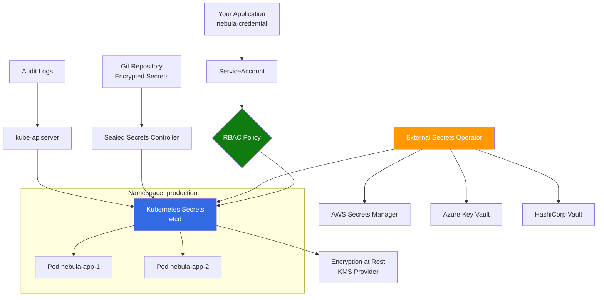

# Kubernetes Secrets Integration

> **TL;DR**: Integrate nebula-credential with Kubernetes Secrets for cloud-native secret management with RBAC, namespace isolation, and External Secrets Operator for external provider synchronization.

## Overview

Kubernetes Secrets provides built-in secret management for containerized workloads. This guide covers native Kubernetes Secrets, External Secrets Operator integration, RBAC configuration, and encryption at rest with KMS providers.

**Что вы получите**:
- Native Kubernetes Secrets setup for nebula-credential
- External Secrets Operator for AWS/Azure/Vault synchronization
- RBAC configuration with namespace isolation
- Encryption at rest with KMS provider
- ServiceAccount token projection for pod access
- Sealed Secrets for GitOps workflows
- Monitoring with kubectl and Prometheus

**Когда использовать**:
- Kubernetes-native applications (microservices, cloud-native)
- Multi-tenant environments with namespace isolation
- GitOps workflows (ArgoCD, FluxCD)
- Hybrid cloud with External Secrets Operator
- Development and testing environments
- Temporary credentials with TTL automation

## Prerequisites

- Kubernetes cluster v1.24+ (kubectl configured)
- nebula-credential v0.1.0+
- Helm v3+ (for External Secrets Operator)
- Понимание: [[Core-Concepts]]
- Понимание: [[How-To/Store-Credentials]]

## Architecture Overview



**Архитектурные компоненты**:
- **Native Secrets**: Base64-encoded data in etcd
- **RBAC**: Role-Based Access Control for secrets access
- **External Secrets Operator**: Sync from external providers (AWS, Azure, Vault)
- **Sealed Secrets**: GitOps-friendly encrypted secrets
- **KMS Provider**: Encryption at rest with cloud KMS (AWS, Azure, GCP)
- **ServiceAccount**: Pod identity for secrets access
- **Namespace Isolation**: Multi-tenancy with namespace boundaries

## Step 1: Native Kubernetes Secrets Setup

### 1.1 Create Namespace and ServiceAccount

```bash
# Create namespace
kubectl create namespace nebula-prod

# Create ServiceAccount
kubectl create serviceaccount nebula-app -n nebula-prod
```

### 1.2 Create RBAC Roles

**secret-reader-role.yaml**:
```yaml
apiVersion: rbac.authorization.k8s.io/v1
kind: Role
metadata:
  name: secret-reader
  namespace: nebula-prod
rules:
- apiGroups: [""]
  resources: ["secrets"]
  verbs: ["get", "list", "watch"]
  resourceNames:
  - nebula-credentials-*  # Restrict to specific secret prefix
```

**secret-writer-role.yaml** (for rotation):
```yaml
apiVersion: rbac.authorization.k8s.io/v1
kind: Role
metadata:
  name: secret-writer
  namespace: nebula-prod
rules:
- apiGroups: [""]
  resources: ["secrets"]
  verbs: ["get", "list", "watch", "create", "update", "patch", "delete"]
  resourceNames:
  - nebula-credentials-*
```

**RoleBinding**:
```yaml
apiVersion: rbac.authorization.k8s.io/v1
kind: RoleBinding
metadata:
  name: nebula-app-secret-reader
  namespace: nebula-prod
subjects:
- kind: ServiceAccount
  name: nebula-app
  namespace: nebula-prod
roleRef:
  kind: Role
  name: secret-reader
  apiGroup: rbac.authorization.k8s.io
```

Apply RBAC configuration:
```bash
kubectl apply -f secret-reader-role.yaml
kubectl apply -f secret-writer-role.yaml
kubectl apply -f rolebinding.yaml
```

### 1.3 Create Secret Manually

```bash
# Create secret from literal values
kubectl create secret generic nebula-credentials-oauth2 \
  --from-literal=credential_id=cred_123 \
  --from-literal=credential_type=oauth2 \
  --from-literal=access_token=eyJhbGciOi... \
  --from-literal=refresh_token=1//0eXhY... \
  --namespace nebula-prod

# Create secret from JSON file
kubectl create secret generic nebula-credentials-api-key \
  --from-file=credential.json=./credential.json \
  --namespace nebula-prod

# Label secrets for easy filtering
kubectl label secret nebula-credentials-oauth2 \
  app=nebula-credential \
  credential-type=oauth2 \
  -n nebula-prod
```

## Step 2: Rust Implementation

### 2.1 Add Dependencies

```toml
[dependencies]
kube = { version = "0.88", features = ["runtime", "derive"] }
k8s-openapi = { version = "0.21", features = ["v1_28"] }
tokio = { version = "1", features = ["full"] }
serde = { version = "1", features = ["derive"] }
serde_json = "1"
base64 = "0.21"
thiserror = "1"
tracing = "0.1"
```

### 2.2 Implement KubernetesSecretsProvider

```rust
use kube::{
    api::{Api, DeleteParams, ListParams, ObjectMeta, Patch, PatchParams, PostParams},
    Client, Config,
};
use k8s_openapi::api::core::v1::Secret;
use serde::{Deserialize, Serialize};
use std::collections::BTreeMap;
use std::sync::Arc;
use thiserror::Error;

#[derive(Debug, Error)]
pub enum KubernetesSecretsError {
    #[error("Kubernetes API error: {0}")]
    ApiError(#[from] kube::Error),
    
    #[error("Secret not found: {0}")]
    SecretNotFound(String),
    
    #[error("Serialization error: {0}")]
    SerializationError(#[from] serde_json::Error),
    
    #[error("Base64 decode error: {0}")]
    Base64Error(#[from] base64::DecodeError),
    
    #[error("Configuration error: {0}")]
    ConfigError(String),
}

pub struct KubernetesSecretsProvider {
    client: Client,
    namespace: String,
    secret_prefix: String,
}

impl KubernetesSecretsProvider {
    /// Create new Kubernetes Secrets provider
    pub async fn new(
        namespace: String,
        secret_prefix: String,
    ) -> Result<Self, KubernetesSecretsError> {
        // Load in-cluster config (for pods) or kubeconfig (for local dev)
        let config = Config::infer().await
            .map_err(|e| KubernetesSecretsError::ConfigError(e.to_string()))?;
        
        let client = Client::try_from(config)
            .map_err(|e| KubernetesSecretsError::ConfigError(e.to_string()))?;
        
        Ok(Self {
            client,
            namespace,
            secret_prefix,
        })
    }
    
    /// Create provider with custom client (for testing)
    pub fn with_client(
        client: Client,
        namespace: String,
        secret_prefix: String,
    ) -> Self {
        Self {
            client,
            namespace,
            secret_prefix,
        }
    }
    
    fn secret_name(&self, credential_id: &CredentialId) -> String {
        format!("{}-{}", self.secret_prefix, credential_id.as_str())
            .to_lowercase()
            .replace('_', "-")  // K8s requires lowercase and hyphens
    }
    
    /// Store credential in Kubernetes Secret
    pub async fn store(
        &self,
        credential_id: CredentialId,
        credential: &Credential,
    ) -> Result<(), KubernetesSecretsError> {
        let secret_name = self.secret_name(&credential_id);
        let secrets_api: Api<Secret> = Api::namespaced(self.client.clone(), &self.namespace);
        
        // Serialize credential to JSON
        let credential_json = serde_json::to_string(credential)?;
        
        // Create data map (Kubernetes requires base64 encoding)
        let mut data = BTreeMap::new();
        data.insert(
            "credential.json".to_string(),
            k8s_openapi::ByteString(credential_json.into_bytes()),
        );
        
        // Create labels
        let mut labels = BTreeMap::new();
        labels.insert("app".to_string(), "nebula-credential".to_string());
        labels.insert("credential-type".to_string(), credential.credential_type().to_string());
        labels.insert("owner-id".to_string(), credential.owner_id().as_str().to_string());
        labels.insert("managed-by".to_string(), "nebula-credential".to_string());
        
        // Create or update secret
        let secret = Secret {
            metadata: ObjectMeta {
                name: Some(secret_name.clone()),
                namespace: Some(self.namespace.clone()),
                labels: Some(labels),
                ..Default::default()
            },
            data: Some(data),
            type_: Some("Opaque".to_string()),
            ..Default::default()
        };
        
        // Try to create, if exists then update
        match secrets_api.create(&PostParams::default(), &secret).await {
            Ok(_) => {
                tracing::info!(
                    namespace = %self.namespace,
                    secret_name = %secret_name,
                    "Created Kubernetes secret"
                );
                Ok(())
            }
            Err(kube::Error::Api(ae)) if ae.code == 409 => {
                // Already exists, update instead
                secrets_api.replace(&secret_name, &PostParams::default(), &secret).await?;
                
                tracing::info!(
                    namespace = %self.namespace,
                    secret_name = %secret_name,
                    "Updated Kubernetes secret"
                );
                Ok(())
            }
            Err(e) => Err(e.into()),
        }
    }
    
    /// Retrieve credential from Kubernetes Secret
    pub async fn retrieve(
        &self,
        credential_id: &CredentialId,
    ) -> Result<Option<Credential>, KubernetesSecretsError> {
        let secret_name = self.secret_name(credential_id);
        let secrets_api: Api<Secret> = Api::namespaced(self.client.clone(), &self.namespace);
        
        match secrets_api.get(&secret_name).await {
            Ok(secret) => {
                let data = secret.data.ok_or_else(|| {
                    KubernetesSecretsError::SecretNotFound(secret_name.clone())
                })?;
                
                let credential_bytes = data.get("credential.json").ok_or_else(|| {
                    KubernetesSecretsError::SecretNotFound(secret_name.clone())
                })?;
                
                let credential_json = String::from_utf8(credential_bytes.0.clone())
                    .map_err(|e| KubernetesSecretsError::ConfigError(e.to_string()))?;
                
                let credential: Credential = serde_json::from_str(&credential_json)?;
                
                tracing::debug!(
                    namespace = %self.namespace,
                    secret_name = %secret_name,
                    "Retrieved credential from Kubernetes"
                );
                
                Ok(Some(credential))
            }
            Err(kube::Error::Api(ae)) if ae.code == 404 => Ok(None),
            Err(e) => Err(e.into()),
        }
    }
    
    /// Delete credential from Kubernetes Secret
    pub async fn delete(
        &self,
        credential_id: &CredentialId,
    ) -> Result<(), KubernetesSecretsError> {
        let secret_name = self.secret_name(credential_id);
        let secrets_api: Api<Secret> = Api::namespaced(self.client.clone(), &self.namespace);
        
        secrets_api.delete(&secret_name, &DeleteParams::default()).await?;
        
        tracing::info!(
            namespace = %self.namespace,
            secret_name = %secret_name,
            "Deleted Kubernetes secret"
        );
        
        Ok(())
    }
    
    /// List credentials by scope
    pub async fn list_by_scope(
        &self,
        scope: &CredentialScope,
    ) -> Result<Vec<CredentialId>, KubernetesSecretsError> {
        let secrets_api: Api<Secret> = Api::namespaced(self.client.clone(), &self.namespace);
        
        // List secrets with label selector
        let list_params = ListParams::default()
            .labels(&format!("app=nebula-credential,scope={}", scope));
        
        let secrets = secrets_api.list(&list_params).await?;
        
        let mut credential_ids = Vec::new();
        for secret in secrets.items {
            if let Some(name) = secret.metadata.name {
                // Extract credential ID from secret name
                if let Some(id_str) = name.strip_prefix(&format!("{}-", self.secret_prefix)) {
                    let credential_id = CredentialId::from_str(id_str)
                        .map_err(|e| KubernetesSecretsError::ConfigError(e.to_string()))?;
                    credential_ids.push(credential_id);
                }
            }
        }
        
        Ok(credential_ids)
    }
    
    /// List all secrets in namespace (for admin)
    pub async fn list_all(&self) -> Result<Vec<String>, KubernetesSecretsError> {
        let secrets_api: Api<Secret> = Api::namespaced(self.client.clone(), &self.namespace);
        
        let list_params = ListParams::default()
            .labels("app=nebula-credential");
        
        let secrets = secrets_api.list(&list_params).await?;
        
        Ok(secrets.items.iter()
            .filter_map(|s| s.metadata.name.clone())
            .collect())
    }
}

// Implement StorageProvider trait
#[async_trait::async_trait]
impl StorageProvider for KubernetesSecretsProvider {
    async fn store(
        &self,
        id: CredentialId,
        credential: &Credential,
    ) -> Result<(), StorageError> {
        self.store(id, credential)
            .await
            .map_err(|e| StorageError::ProviderError(e.to_string()))
    }
    
    async fn retrieve(
        &self,
        id: &CredentialId,
    ) -> Result<Option<Credential>, StorageError> {
        self.retrieve(id)
            .await
            .map_err(|e| StorageError::ProviderError(e.to_string()))
    }
    
    async fn delete(&self, id: &CredentialId) -> Result<(), StorageError> {
        self.delete(id)
            .await
            .map_err(|e| StorageError::ProviderError(e.to_string()))
    }
    
    async fn list_by_scope(
        &self,
        scope: &CredentialScope,
    ) -> Result<Vec<CredentialId>, StorageError> {
        self.list_by_scope(scope)
            .await
            .map_err(|e| StorageError::ProviderError(e.to_string()))
    }
}
```

### 2.3 Usage Example

```rust
use nebula_credential::{
    Credential, CredentialId, CredentialScope,
    providers::kubernetes::KubernetesSecretsProvider,
};

#[tokio::main]
async fn main() -> Result<(), Box<dyn std::error::Error>> {
    // Initialize provider (uses in-cluster config or kubeconfig)
    let provider = KubernetesSecretsProvider::new(
        "nebula-prod".to_string(),  // Namespace
        "nebula-credentials".to_string(),  // Secret prefix
    ).await?;
    
    // Create and store credential
    let credential = Credential::oauth2(
        "github-oauth",
        CredentialScope::User("alice".into()),
        oauth2_config,
    )?;
    
    let credential_id = CredentialId::new();
    provider.store(credential_id.clone(), &credential).await?;
    
    // Retrieve credential
    if let Some(retrieved) = provider.retrieve(&credential_id).await? {
        println!("Retrieved credential: {:?}", retrieved);
    }
    
    // List credentials by scope
    let scope = CredentialScope::User("alice".into());
    let ids = provider.list_by_scope(&scope).await?;
    println!("Found {} credentials for scope", ids.len());
    
    // Delete credential
    provider.delete(&credential_id).await?;
    
    Ok(())
}
```

## Step 3: Pod Configuration

### 3.1 Mount Secrets as Environment Variables

**deployment-env.yaml**:
```yaml
apiVersion: apps/v1
kind: Deployment
metadata:
  name: nebula-app
  namespace: nebula-prod
spec:
  replicas: 3
  selector:
    matchLabels:
      app: nebula-app
  template:
    metadata:
      labels:
        app: nebula-app
    spec:
      serviceAccountName: nebula-app
      containers:
      - name: app
        image: nebula-app:latest
        env:
        - name: OAUTH2_ACCESS_TOKEN
          valueFrom:
            secretKeyRef:
              name: nebula-credentials-oauth2
              key: access_token
        - name: OAUTH2_REFRESH_TOKEN
          valueFrom:
            secretKeyRef:
              name: nebula-credentials-oauth2
              key: refresh_token
        - name: KUBERNETES_NAMESPACE
          valueFrom:
            fieldRef:
              fieldPath: metadata.namespace
```

### 3.2 Mount Secrets as Files

**deployment-volume.yaml**:
```yaml
apiVersion: apps/v1
kind: Deployment
metadata:
  name: nebula-app
  namespace: nebula-prod
spec:
  replicas: 3
  selector:
    matchLabels:
      app: nebula-app
  template:
    metadata:
      labels:
        app: nebula-app
    spec:
      serviceAccountName: nebula-app
      containers:
      - name: app
        image: nebula-app:latest
        volumeMounts:
        - name: credentials
          mountPath: /etc/nebula/credentials
          readOnly: true
        env:
        - name: CREDENTIALS_PATH
          value: /etc/nebula/credentials
      volumes:
      - name: credentials
        secret:
          secretName: nebula-credentials-oauth2
          defaultMode: 0400  # Read-only for owner
```

**Read secret from file**:
```rust
use std::fs;

let credentials_path = std::env::var("CREDENTIALS_PATH")?;
let credential_json = fs::read_to_string(
    format!("{}/credential.json", credentials_path)
)?;
let credential: Credential = serde_json::from_str(&credential_json)?;
```

## Step 4: External Secrets Operator

### 4.1 Install External Secrets Operator

```bash
# Add Helm repository
helm repo add external-secrets https://charts.external-secrets.io
helm repo update

# Install ESO
helm install external-secrets \
  external-secrets/external-secrets \
  --namespace external-secrets-system \
  --create-namespace \
  --set installCRDs=true

# Verify installation
kubectl get pods -n external-secrets-system
```

### 4.2 Configure SecretStore (AWS)

**aws-secret-store.yaml**:
```yaml
apiVersion: external-secrets.io/v1beta1
kind: SecretStore
metadata:
  name: aws-secrets-manager
  namespace: nebula-prod
spec:
  provider:
    aws:
      service: SecretsManager
      region: us-east-1
      auth:
        jwt:
          serviceAccountRef:
            name: external-secrets-sa
---
apiVersion: v1
kind: ServiceAccount
metadata:
  name: external-secrets-sa
  namespace: nebula-prod
  annotations:
    eks.amazonaws.com/role-arn: arn:aws:iam::123456789012:role/external-secrets-role
```

### 4.3 Create ExternalSecret

**external-secret.yaml**:
```yaml
apiVersion: external-secrets.io/v1beta1
kind: ExternalSecret
metadata:
  name: nebula-oauth2-external
  namespace: nebula-prod
spec:
  refreshInterval: 1h  # Sync every hour
  secretStoreRef:
    name: aws-secrets-manager
    kind: SecretStore
  target:
    name: nebula-credentials-oauth2  # K8s Secret name
    creationPolicy: Owner
  data:
  - secretKey: access_token
    remoteRef:
      key: nebula/credentials/oauth2
      property: access_token
  - secretKey: refresh_token
    remoteRef:
      key: nebula/credentials/oauth2
      property: refresh_token
```

Apply configuration:
```bash
kubectl apply -f aws-secret-store.yaml
kubectl apply -f external-secret.yaml

# Verify synchronization
kubectl get externalsecret -n nebula-prod
kubectl describe externalsecret nebula-oauth2-external -n nebula-prod
```

### 4.4 Configure SecretStore (Azure)

**azure-secret-store.yaml**:
```yaml
apiVersion: external-secrets.io/v1beta1
kind: SecretStore
metadata:
  name: azure-key-vault
  namespace: nebula-prod
spec:
  provider:
    azurekv:
      vaultUrl: https://nebula-kv-prod.vault.azure.net
      authType: WorkloadIdentity
      serviceAccountRef:
        name: external-secrets-sa
```

## Step 5: Sealed Secrets (GitOps)

### 5.1 Install Sealed Secrets Controller

```bash
# Install controller
kubectl apply -f https://github.com/bitnami-labs/sealed-secrets/releases/download/v0.24.0/controller.yaml

# Install kubeseal CLI
wget https://github.com/bitnami-labs/sealed-secrets/releases/download/v0.24.0/kubeseal-linux-amd64 -O kubeseal
chmod +x kubeseal
sudo mv kubeseal /usr/local/bin/
```

### 5.2 Create Sealed Secret

```bash
# Create regular secret (don't commit to Git!)
kubectl create secret generic nebula-credentials-oauth2 \
  --from-literal=access_token=secret123 \
  --from-literal=refresh_token=refresh456 \
  --namespace nebula-prod \
  --dry-run=client -o yaml > secret.yaml

# Seal the secret (encrypted, safe for Git)
kubeseal -f secret.yaml -w sealed-secret.yaml \
  --controller-name=sealed-secrets-controller \
  --controller-namespace=kube-system

# Commit sealed-secret.yaml to Git
git add sealed-secret.yaml
git commit -m "Add sealed secret for OAuth2 credentials"
```

**sealed-secret.yaml** (safe to commit):
```yaml
apiVersion: bitnami.com/v1alpha1
kind: SealedSecret
metadata:
  name: nebula-credentials-oauth2
  namespace: nebula-prod
spec:
  encryptedData:
    access_token: AgA7...encrypted...
    refresh_token: AgB9...encrypted...
  template:
    metadata:
      labels:
        app: nebula-credential
    type: Opaque
```

### 5.3 Apply Sealed Secret

```bash
# Apply to cluster (controller decrypts automatically)
kubectl apply -f sealed-secret.yaml

# Verify decrypted secret exists
kubectl get secret nebula-credentials-oauth2 -n nebula-prod
```

## Step 6: Encryption at Rest

### 6.1 Configure KMS Provider (AWS)

**encryption-config.yaml**:
```yaml
apiVersion: apiserver.config.k8s.io/v1
kind: EncryptionConfiguration
resources:
- resources:
  - secrets
  providers:
  - kms:
      name: aws-encryption-provider
      endpoint: unix:///var/run/kmsplugin/socket.sock
      cachesize: 1000
      timeout: 3s
  - identity: {}  # Fallback to plaintext for emergency
```

**For EKS**:
```bash
# Enable envelope encryption with KMS
aws eks update-cluster-config \
  --region us-east-1 \
  --name nebula-cluster \
  --encryption-config resources=secrets,provider=kms,kmsKeyId=arn:aws:kms:us-east-1:123456789012:key/12345678-1234-1234-1234-123456789012

# Verify encryption
aws eks describe-cluster \
  --name nebula-cluster \
  --region us-east-1 \
  --query 'cluster.encryptionConfig'
```

### 6.2 Configure KMS Provider (Azure)

**For AKS**:
```bash
# Create Key Vault for encryption keys
az keyvault create \
  --name nebula-aks-encryption \
  --resource-group nebula-rg \
  --location eastus \
  --enable-purge-protection true

# Create encryption key
az keyvault key create \
  --vault-name nebula-aks-encryption \
  --name aks-encryption-key \
  --protection software

KEY_ID=$(az keyvault key show \
  --vault-name nebula-aks-encryption \
  --name aks-encryption-key \
  --query key.kid -o tsv)

# Enable encryption on AKS
az aks update \
  --resource-group nebula-rg \
  --name nebula-cluster \
  --enable-azure-keyvault-kms \
  --azure-keyvault-kms-key-id $KEY_ID
```

## Step 7: Monitoring and Auditing

### 7.1 Enable Audit Logging

**audit-policy.yaml**:
```yaml
apiVersion: audit.k8s.io/v1
kind: Policy
rules:
- level: RequestResponse
  verbs: ["get", "list", "create", "update", "patch", "delete"]
  resources:
  - group: ""
    resources: ["secrets"]
  namespaces: ["nebula-prod"]
```

Apply to kube-apiserver:
```bash
# For kubeadm clusters
sudo vi /etc/kubernetes/manifests/kube-apiserver.yaml

# Add flags:
# --audit-policy-file=/etc/kubernetes/audit-policy.yaml
# --audit-log-path=/var/log/kubernetes/audit.log
# --audit-log-maxage=30
# --audit-log-maxbackup=10
# --audit-log-maxsize=100
```

### 7.2 Query Audit Logs

```bash
# Filter secret access events
kubectl logs -n kube-system kube-apiserver-master-1 | \
  jq 'select(.objectRef.resource=="secrets" and .objectRef.namespace=="nebula-prod")'

# Count secret access by user
kubectl logs -n kube-system kube-apiserver-master-1 | \
  jq -r 'select(.objectRef.resource=="secrets") | .user.username' | \
  sort | uniq -c | sort -rn
```

### 7.3 Prometheus Metrics

```rust
use prometheus::{IntCounterVec, HistogramVec, Registry};

lazy_static! {
    static ref SECRET_OPS: IntCounterVec = IntCounterVec::new(
        prometheus::opts!("nebula_k8s_secret_operations_total", "Total K8s secret operations"),
        &["operation", "status"]
    ).unwrap();
    
    static ref SECRET_LATENCY: HistogramVec = HistogramVec::new(
        prometheus::histogram_opts!("nebula_k8s_secret_duration_seconds", "K8s secret operation latency"),
        &["operation"]
    ).unwrap();
}

// Track metrics
SECRET_OPS.with_label_values(&["store", "success"]).inc();
let timer = SECRET_LATENCY.with_label_values(&["retrieve"]).start_timer();
// ... perform operation ...
timer.observe_duration();
```

## Best Practices

### Security

1. **Use RBAC**: Restrict secret access with fine-grained roles
2. **Enable Encryption at Rest**: Use KMS provider for etcd encryption
3. **Rotate Secrets Regularly**: Automate rotation with CronJobs
4. **Avoid Environment Variables**: Mount secrets as files (less exposure in `kubectl describe`)
5. **Use ServiceAccounts**: Never use personal credentials in pods
6. **Enable Audit Logging**: Track all secret access
7. **Namespace Isolation**: Use NetworkPolicies to enforce boundaries

### Performance

```rust
// Use connection pooling (built into kube client)
let client = Client::try_default().await?;
let provider = Arc::new(KubernetesSecretsProvider::with_client(
    client,
    "nebula-prod".into(),
    "nebula-credentials".into(),
));

// Cache frequently accessed secrets
use moka::future::Cache;
let cache = Cache::builder()
    .max_capacity(1000)
    .time_to_live(Duration::from_secs(300))
    .build();
```

### High Availability

```yaml
# Deploy with PodDisruptionBudget
apiVersion: policy/v1
kind: PodDisruptionBudget
metadata:
  name: nebula-app-pdb
  namespace: nebula-prod
spec:
  minAvailable: 2
  selector:
    matchLabels:
      app: nebula-app
```

## Troubleshooting

### Issue: "Permission denied" accessing secrets

```bash
# Check ServiceAccount
kubectl get serviceaccount nebula-app -n nebula-prod

# Check RoleBinding
kubectl get rolebinding nebula-app-secret-reader -n nebula-prod -o yaml

# Verify RBAC permissions
kubectl auth can-i get secrets --as=system:serviceaccount:nebula-prod:nebula-app -n nebula-prod
```

### Issue: Secret not syncing from External Secrets Operator

```bash
# Check ExternalSecret status
kubectl describe externalsecret nebula-oauth2-external -n nebula-prod

# Check SecretStore
kubectl get secretstore -n nebula-prod

# Check controller logs
kubectl logs -n external-secrets-system deployment/external-secrets -f
```

### Issue: Sealed Secret not decrypting

```bash
# Check controller status
kubectl get pods -n kube-system -l name=sealed-secrets-controller

# Check controller logs
kubectl logs -n kube-system -l name=sealed-secrets-controller

# Verify certificate
kubeseal --fetch-cert \
  --controller-name=sealed-secrets-controller \
  --controller-namespace=kube-system
```

### Debug Logging

```rust
// Enable kube client debug logging
std::env::set_var("RUST_LOG", "kube=debug,nebula_credential=trace");
tracing_subscriber::fmt::init();

// Log secret operations
tracing::debug!(
    namespace = %self.namespace,
    secret_name = %secret_name,
    operation = "retrieve",
    "Kubernetes secret operation"
);
```

## Migration Patterns

### From Local Storage to Kubernetes

```rust
async fn migrate_to_kubernetes(
    local_provider: &LocalStorageProvider,
    k8s_provider: &KubernetesSecretsProvider,
) -> Result<(), Box<dyn std::error::Error>> {
    let credential_ids = local_provider.list_all().await?;
    
    for id in credential_ids {
        if let Some(credential) = local_provider.retrieve(&id).await? {
            k8s_provider.store(id.clone(), &credential).await?;
            tracing::info!(credential_id = ?id, "Migrated to Kubernetes");
        }
    }
    
    Ok(())
}
```

### From Kubernetes to External Provider

```rust
async fn migrate_to_external(
    k8s_provider: &KubernetesSecretsProvider,
    external_provider: &dyn StorageProvider,
    namespace: &str,
) -> Result<(), Box<dyn std::error::Error>> {
    let secret_names = k8s_provider.list_all().await?;
    
    for secret_name in secret_names {
        // Parse credential ID from secret name
        if let Some(id_str) = secret_name.strip_prefix("nebula-credentials-") {
            let credential_id = CredentialId::from_str(id_str)?;
            
            if let Some(credential) = k8s_provider.retrieve(&credential_id).await? {
                external_provider.store(credential_id.clone(), &credential).await?;
                tracing::info!(credential_id = ?credential_id, "Migrated to external provider");
            }
        }
    }
    
    Ok(())
}
```

## Advanced Patterns

### Automatic Secret Rotation with CronJob

**rotation-cronjob.yaml**:
```yaml
apiVersion: batch/v1
kind: CronJob
metadata:
  name: nebula-credential-rotation
  namespace: nebula-prod
spec:
  schedule: "0 2 * * *"  # Daily at 2 AM
  jobTemplate:
    spec:
      template:
        spec:
          serviceAccountName: nebula-rotation-sa
          containers:
          - name: rotation
            image: nebula-rotation:latest
            env:
            - name: KUBERNETES_NAMESPACE
              valueFrom:
                fieldRef:
                  fieldPath: metadata.namespace
          restartPolicy: OnFailure
```

### Multi-Cluster Secret Replication

```rust
use futures::stream::{FuturesUnordered, StreamExt};

async fn replicate_across_clusters(
    source_provider: &KubernetesSecretsProvider,
    target_providers: Vec<&KubernetesSecretsProvider>,
    credential_id: &CredentialId,
) -> Result<(), Box<dyn std::error::Error>> {
    let credential = source_provider.retrieve(credential_id).await?
        .ok_or("Credential not found")?;
    
    let mut futures = FuturesUnordered::new();
    for target in target_providers {
        futures.push(target.store(credential_id.clone(), &credential));
    }
    
    while let Some(result) = futures.next().await {
        result?;
    }
    
    Ok(())
}
```

## See Also

- [[AWS-Secrets-Manager]]: AWS cloud integration
- [[Azure-Key-Vault]]: Azure cloud integration
- [[HashiCorp-Vault]]: Multi-cloud provider
- [[Local-Storage]]: Development storage
- [[External-Secrets-Operator]]: External provider sync
- [[Provider-Comparison]]: Feature comparison
- [[Migration-Guide]]: Provider migration patterns

## References

- [Kubernetes Secrets Documentation](https://kubernetes.io/docs/concepts/configuration/secret/)
- [External Secrets Operator](https://external-secrets.io/)
- [Sealed Secrets](https://github.com/bitnami-labs/sealed-secrets)
- [Kubernetes RBAC](https://kubernetes.io/docs/reference/access-authn-authz/rbac/)
- [kube-rs Documentation](https://docs.rs/kube/)
