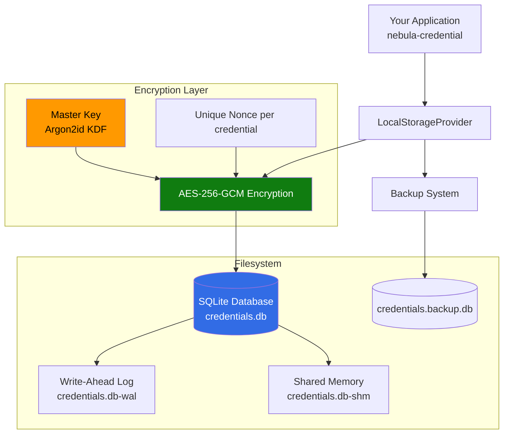

# Local Storage Integration

> **TL;DR**: Use nebula-credential with local SQLite storage for development, testing, and single-machine deployments. Fast, simple, and requires no external dependencies.

## Overview

Local Storage provides a lightweight SQLite-based backend for nebula-credential. Perfect for development, testing, CI/CD, and single-machine deployments where cloud providers are unnecessary.

**Что вы получите**:
- SQLite database setup for credential storage
- Encrypted storage with application-level encryption
- File-based persistence for easy backup
- Zero external dependencies
- Perfect for development and testing
- Simple migration path to production providers

**Когда использовать**:
- Local development environments
- Unit and integration testing
- CI/CD pipelines
- Single-machine deployments (edge devices, IoT)
- Prototyping and proof-of-concept
- Offline-first applications
- When cloud providers are overkill

**Когда НЕ использовать**:
- Production distributed systems (use AWS/Azure/Vault)
- Multi-instance applications requiring shared state
- High-availability requirements
- Compliance requiring cloud HSM (use AWS KMS/Azure Key Vault)

## Prerequisites

- Rust 1.70+ with Cargo
- nebula-credential v0.1.0+
- Понимание: [[Core-Concepts]]
- Понимание: [[How-To/Store-Credentials]]

## Architecture Overview



**Архитектурные компоненты**:
- **SQLite Database**: Single-file relational database
- **AES-256-GCM**: Authenticated encryption for credential data
- **Argon2id KDF**: Key derivation from master password
- **WAL Mode**: Write-Ahead Logging for better concurrency
- **File-based**: Easy backup, version control (with care)
- **Zero Dependencies**: No external services required

## Step 1: Add Dependencies

```toml
[dependencies]
nebula-credential = "0.1"
sqlx = { version = "0.7", features = ["runtime-tokio-rustls", "sqlite"] }
tokio = { version = "1", features = ["full"] }
aes-gcm = "0.10"
argon2 = "0.5"
rand = "0.8"
serde = { version = "1", features = ["derive"] }
serde_json = "1"
thiserror = "1"
tracing = "0.1"
zeroize = "1"
```

## Step 2: Rust Implementation

### 2.1 Define LocalStorageProvider

```rust
use aes_gcm::{
    aead::{Aead, KeyInit, OsRng},
    Aes256Gcm, Nonce,
};
use argon2::{Argon2, PasswordHasher};
use argon2::password_hash::{PasswordHash, SaltString};
use rand::RngCore;
use serde::{Deserialize, Serialize};
use sqlx::{SqlitePool, sqlite::SqliteConnectOptions};
use std::path::{Path, PathBuf};
use std::str::FromStr;
use thiserror::Error;
use zeroize::Zeroizing;

#[derive(Debug, Error)]
pub enum LocalStorageError {
    #[error("Database error: {0}")]
    DatabaseError(#[from] sqlx::Error),
    
    #[error("Encryption error: {0}")]
    EncryptionError(String),
    
    #[error("Serialization error: {0}")]
    SerializationError(#[from] serde_json::Error),
    
    #[error("Credential not found: {0}")]
    CredentialNotFound(String),
    
    #[error("Invalid master key")]
    InvalidMasterKey,
}

pub struct LocalStorageProvider {
    pool: SqlitePool,
    cipher: Aes256Gcm,
}

impl LocalStorageProvider {
    /// Create new local storage provider with database at specified path
    pub async fn new(
        db_path: impl AsRef<Path>,
        master_password: &str,
    ) -> Result<Self, LocalStorageError> {
        let db_path = db_path.as_ref();
        
        // Ensure parent directory exists
        if let Some(parent) = db_path.parent() {
            std::fs::create_dir_all(parent)
                .map_err(|e| LocalStorageError::DatabaseError(sqlx::Error::Io(e.into())))?;
        }
        
        // Configure SQLite with WAL mode for better concurrency
        let options = SqliteConnectOptions::from_str(
            &format!("sqlite://{}?mode=rwc", db_path.display())
        )?
        .journal_mode(sqlx::sqlite::SqliteJournalMode::Wal)
        .create_if_missing(true);
        
        let pool = SqlitePool::connect_with(options).await?;
        
        // Initialize schema
        Self::init_schema(&pool).await?;
        
        // Derive encryption key from master password
        let cipher = Self::derive_cipher(master_password)?;
        
        Ok(Self { pool, cipher })
    }
    
    /// Create provider for testing (in-memory database)
    pub async fn new_in_memory(
        master_password: &str,
    ) -> Result<Self, LocalStorageError> {
        let options = SqliteConnectOptions::from_str("sqlite::memory:")?
            .journal_mode(sqlx::sqlite::SqliteJournalMode::Wal);
        
        let pool = SqlitePool::connect_with(options).await?;
        Self::init_schema(&pool).await?;
        
        let cipher = Self::derive_cipher(master_password)?;
        
        Ok(Self { pool, cipher })
    }
    
    /// Initialize database schema
    async fn init_schema(pool: &SqlitePool) -> Result<(), LocalStorageError> {
        sqlx::query(
            r#"
            CREATE TABLE IF NOT EXISTS credentials (
                id TEXT PRIMARY KEY,
                owner_id TEXT NOT NULL,
                scope TEXT NOT NULL,
                credential_type TEXT NOT NULL,
                encrypted_data BLOB NOT NULL,
                nonce BLOB NOT NULL,
                created_at INTEGER NOT NULL,
                updated_at INTEGER NOT NULL,
                expires_at INTEGER,
                metadata TEXT
            );
            
            CREATE INDEX IF NOT EXISTS idx_owner_id ON credentials(owner_id);
            CREATE INDEX IF NOT EXISTS idx_scope ON credentials(scope);
            CREATE INDEX IF NOT EXISTS idx_credential_type ON credentials(credential_type);
            CREATE INDEX IF NOT EXISTS idx_expires_at ON credentials(expires_at);
            "#
        )
        .execute(pool)
        .await?;
        
        Ok(())
    }
    
    /// Derive AES cipher from master password using Argon2id
    fn derive_cipher(master_password: &str) -> Result<Aes256Gcm, LocalStorageError> {
        let salt = SaltString::from_b64("nebula-credential-v1-salt")
            .map_err(|e| LocalStorageError::EncryptionError(e.to_string()))?;
        
        let argon2 = Argon2::default();
        let password_hash = argon2
            .hash_password(master_password.as_bytes(), &salt)
            .map_err(|e| LocalStorageError::EncryptionError(e.to_string()))?;
        
        // Extract 32-byte key from hash
        let key_bytes = password_hash.hash
            .ok_or(LocalStorageError::InvalidMasterKey)?
            .as_bytes();
        
        if key_bytes.len() < 32 {
            return Err(LocalStorageError::InvalidMasterKey);
        }
        
        let key = Zeroizing::new(key_bytes[..32].to_vec());
        let cipher = Aes256Gcm::new_from_slice(&key)
            .map_err(|e| LocalStorageError::EncryptionError(e.to_string()))?;
        
        Ok(cipher)
    }
    
    /// Encrypt credential data
    fn encrypt(&self, plaintext: &[u8]) -> Result<(Vec<u8>, Vec<u8>), LocalStorageError> {
        // Generate random nonce (96 bits for GCM)
        let mut nonce_bytes = [0u8; 12];
        OsRng.fill_bytes(&mut nonce_bytes);
        let nonce = Nonce::from_slice(&nonce_bytes);
        
        let ciphertext = self.cipher
            .encrypt(nonce, plaintext)
            .map_err(|e| LocalStorageError::EncryptionError(e.to_string()))?;
        
        Ok((ciphertext, nonce_bytes.to_vec()))
    }
    
    /// Decrypt credential data
    fn decrypt(&self, ciphertext: &[u8], nonce_bytes: &[u8]) -> Result<Vec<u8>, LocalStorageError> {
        let nonce = Nonce::from_slice(nonce_bytes);
        
        let plaintext = self.cipher
            .decrypt(nonce, ciphertext)
            .map_err(|e| LocalStorageError::EncryptionError(e.to_string()))?;
        
        Ok(plaintext)
    }
    
    /// Store credential in local database
    pub async fn store(
        &self,
        credential_id: CredentialId,
        credential: &Credential,
    ) -> Result<(), LocalStorageError> {
        let credential_json = serde_json::to_vec(credential)?;
        let (encrypted_data, nonce) = self.encrypt(&credential_json)?;
        
        let now = chrono::Utc::now().timestamp();
        
        sqlx::query(
            r#"
            INSERT INTO credentials (
                id, owner_id, scope, credential_type,
                encrypted_data, nonce,
                created_at, updated_at, expires_at, metadata
            )
            VALUES (?, ?, ?, ?, ?, ?, ?, ?, ?, ?)
            ON CONFLICT(id) DO UPDATE SET
                encrypted_data = excluded.encrypted_data,
                nonce = excluded.nonce,
                updated_at = excluded.updated_at,
                expires_at = excluded.expires_at
            "#
        )
        .bind(credential_id.as_str())
        .bind(credential.owner_id().as_str())
        .bind(credential.scope().to_string())
        .bind(credential.credential_type())
        .bind(encrypted_data)
        .bind(nonce)
        .bind(now)
        .bind(now)
        .bind(credential.expires_at().map(|dt| dt.timestamp()))
        .bind(serde_json::json!({}).to_string())
        .execute(&self.pool)
        .await?;
        
        tracing::info!(
            credential_id = %credential_id,
            credential_type = %credential.credential_type(),
            "Stored credential in local storage"
        );
        
        Ok(())
    }
    
    /// Retrieve credential from local database
    pub async fn retrieve(
        &self,
        credential_id: &CredentialId,
    ) -> Result<Option<Credential>, LocalStorageError> {
        let row = sqlx::query_as::<_, (Vec<u8>, Vec<u8>)>(
            "SELECT encrypted_data, nonce FROM credentials WHERE id = ?"
        )
        .bind(credential_id.as_str())
        .fetch_optional(&self.pool)
        .await?;
        
        match row {
            Some((encrypted_data, nonce)) => {
                let plaintext = self.decrypt(&encrypted_data, &nonce)?;
                let credential: Credential = serde_json::from_slice(&plaintext)?;
                
                tracing::debug!(
                    credential_id = %credential_id,
                    "Retrieved credential from local storage"
                );
                
                Ok(Some(credential))
            }
            None => Ok(None),
        }
    }
    
    /// Delete credential from local database
    pub async fn delete(
        &self,
        credential_id: &CredentialId,
    ) -> Result<(), LocalStorageError> {
        sqlx::query("DELETE FROM credentials WHERE id = ?")
            .bind(credential_id.as_str())
            .execute(&self.pool)
            .await?;
        
        tracing::info!(
            credential_id = %credential_id,
            "Deleted credential from local storage"
        );
        
        Ok(())
    }
    
    /// List credentials by scope
    pub async fn list_by_scope(
        &self,
        scope: &CredentialScope,
    ) -> Result<Vec<CredentialId>, LocalStorageError> {
        let rows = sqlx::query_as::<_, (String,)>(
            "SELECT id FROM credentials WHERE scope = ? ORDER BY created_at DESC"
        )
        .bind(scope.to_string())
        .fetch_all(&self.pool)
        .await?;
        
        Ok(rows
            .into_iter()
            .filter_map(|(id,)| CredentialId::from_str(&id).ok())
            .collect())
    }
    
    /// List all credentials (for admin/migration)
    pub async fn list_all(&self) -> Result<Vec<CredentialId>, LocalStorageError> {
        let rows = sqlx::query_as::<_, (String,)>(
            "SELECT id FROM credentials ORDER BY created_at DESC"
        )
        .fetch_all(&self.pool)
        .await?;
        
        Ok(rows
            .into_iter()
            .filter_map(|(id,)| CredentialId::from_str(&id).ok())
            .collect())
    }
    
    /// Delete expired credentials
    pub async fn purge_expired(&self) -> Result<usize, LocalStorageError> {
        let now = chrono::Utc::now().timestamp();
        
        let result = sqlx::query(
            "DELETE FROM credentials WHERE expires_at IS NOT NULL AND expires_at < ?"
        )
        .bind(now)
        .execute(&self.pool)
        .await?;
        
        let count = result.rows_affected() as usize;
        
        tracing::info!(count = count, "Purged expired credentials");
        
        Ok(count)
    }
    
    /// Get database statistics
    pub async fn stats(&self) -> Result<StorageStats, LocalStorageError> {
        let row = sqlx::query_as::<_, (i64, i64, i64)>(
            r#"
            SELECT 
                COUNT(*) as total,
                SUM(CASE WHEN expires_at IS NULL OR expires_at > ? THEN 1 ELSE 0 END) as active,
                SUM(CASE WHEN expires_at IS NOT NULL AND expires_at <= ? THEN 1 ELSE 0 END) as expired
            FROM credentials
            "#
        )
        .bind(chrono::Utc::now().timestamp())
        .bind(chrono::Utc::now().timestamp())
        .fetch_one(&self.pool)
        .await?;
        
        Ok(StorageStats {
            total_credentials: row.0 as usize,
            active_credentials: row.1 as usize,
            expired_credentials: row.2 as usize,
        })
    }
    
    /// Backup database to file
    pub async fn backup(&self, backup_path: impl AsRef<Path>) -> Result<(), LocalStorageError> {
        sqlx::query(&format!("VACUUM INTO '{}'", backup_path.as_ref().display()))
            .execute(&self.pool)
            .await?;
        
        tracing::info!(
            backup_path = %backup_path.as_ref().display(),
            "Created database backup"
        );
        
        Ok(())
    }
}

#[derive(Debug, Clone, Serialize, Deserialize)]
pub struct StorageStats {
    pub total_credentials: usize,
    pub active_credentials: usize,
    pub expired_credentials: usize,
}

// Implement StorageProvider trait
#[async_trait::async_trait]
impl StorageProvider for LocalStorageProvider {
    async fn store(
        &self,
        id: CredentialId,
        credential: &Credential,
    ) -> Result<(), StorageError> {
        self.store(id, credential)
            .await
            .map_err(|e| StorageError::ProviderError(e.to_string()))
    }
    
    async fn retrieve(
        &self,
        id: &CredentialId,
    ) -> Result<Option<Credential>, StorageError> {
        self.retrieve(id)
            .await
            .map_err(|e| StorageError::ProviderError(e.to_string()))
    }
    
    async fn delete(&self, id: &CredentialId) -> Result<(), StorageError> {
        self.delete(id)
            .await
            .map_err(|e| StorageError::ProviderError(e.to_string()))
    }
    
    async fn list_by_scope(
        &self,
        scope: &CredentialScope,
    ) -> Result<Vec<CredentialId>, StorageError> {
        self.list_by_scope(scope)
            .await
            .map_err(|e| StorageError::ProviderError(e.to_string()))
    }
}
```

### 2.2 Usage Example

```rust
use nebula_credential::{
    Credential, CredentialId, CredentialScope,
    providers::local::LocalStorageProvider,
};

#[tokio::main]
async fn main() -> Result<(), Box<dyn std::error::Error>> {
    // Initialize provider with database file
    let provider = LocalStorageProvider::new(
        "./data/credentials.db",
        "super-secret-master-password",  // Store securely!
    ).await?;
    
    // Create and store credential
    let credential = Credential::oauth2(
        "github-oauth",
        CredentialScope::User("alice".into()),
        oauth2_config,
    )?;
    
    let credential_id = CredentialId::new();
    provider.store(credential_id.clone(), &credential).await?;
    
    // Retrieve credential
    if let Some(retrieved) = provider.retrieve(&credential_id).await? {
        println!("Retrieved credential: {:?}", retrieved);
    }
    
    // List credentials by scope
    let scope = CredentialScope::User("alice".into());
    let ids = provider.list_by_scope(&scope).await?;
    println!("Found {} credentials for scope", ids.len());
    
    // Get statistics
    let stats = provider.stats().await?;
    println!("Storage stats: {:?}", stats);
    
    // Purge expired credentials
    let purged = provider.purge_expired().await?;
    println!("Purged {} expired credentials", purged);
    
    // Backup database
    provider.backup("./backups/credentials-2026-02-03.db").await?;
    
    // Delete credential
    provider.delete(&credential_id).await?;
    
    Ok(())
}
```

## Step 3: Master Password Management

### 3.1 Environment Variable

```bash
# Set master password via environment
export NEBULA_MASTER_PASSWORD="your-secure-password"
```

```rust
let master_password = std::env::var("NEBULA_MASTER_PASSWORD")
    .expect("NEBULA_MASTER_PASSWORD not set");

let provider = LocalStorageProvider::new(
    "./data/credentials.db",
    &master_password,
).await?;
```

### 3.2 Config File (with secure permissions)

```toml
# config.toml (chmod 600)
[storage]
type = "local"
database_path = "./data/credentials.db"
master_password = "your-secure-password"  # Or use keyring
```

```rust
use config::Config;

let settings = Config::builder()
    .add_source(config::File::with_name("config"))
    .build()?;

let master_password = settings.get_string("storage.master_password")?;
let db_path = settings.get_string("storage.database_path")?;

let provider = LocalStorageProvider::new(&db_path, &master_password).await?;
```

### 3.3 System Keyring (Recommended)

```toml
[dependencies]
keyring = "2"
```

```rust
use keyring::Entry;

// Store password in system keyring (one-time)
let entry = Entry::new("nebula-credential", "master-password")?;
entry.set_password("your-secure-password")?;

// Retrieve password from keyring
let entry = Entry::new("nebula-credential", "master-password")?;
let master_password = entry.get_password()?;

let provider = LocalStorageProvider::new(
    "./data/credentials.db",
    &master_password,
).await?;
```

## Step 4: Testing Configuration

### 4.1 Unit Tests with In-Memory Database

```rust
#[cfg(test)]
mod tests {
    use super::*;
    
    #[tokio::test]
    async fn test_store_and_retrieve() {
        let provider = LocalStorageProvider::new_in_memory("test-password")
            .await
            .unwrap();
        
        let credential = Credential::api_key(
            "test-api-key",
            CredentialScope::Global,
            SecretString::from("secret123"),
        ).unwrap();
        
        let id = CredentialId::new();
        provider.store(id.clone(), &credential).await.unwrap();
        
        let retrieved = provider.retrieve(&id).await.unwrap();
        assert!(retrieved.is_some());
    }
    
    #[tokio::test]
    async fn test_list_by_scope() {
        let provider = LocalStorageProvider::new_in_memory("test-password")
            .await
            .unwrap();
        
        let scope = CredentialScope::User("alice".into());
        
        // Store multiple credentials
        for i in 0..5 {
            let credential = Credential::api_key(
                &format!("key-{}", i),
                scope.clone(),
                SecretString::from(format!("secret{}", i)),
            ).unwrap();
            
            provider.store(CredentialId::new(), &credential).await.unwrap();
        }
        
        let ids = provider.list_by_scope(&scope).await.unwrap();
        assert_eq!(ids.len(), 5);
    }
    
    #[tokio::test]
    async fn test_purge_expired() {
        let provider = LocalStorageProvider::new_in_memory("test-password")
            .await
            .unwrap();
        
        // Store expired credential
        let mut credential = Credential::api_key(
            "expired-key",
            CredentialScope::Global,
            SecretString::from("secret"),
        ).unwrap();
        
        credential.set_expires_at(chrono::Utc::now() - chrono::Duration::hours(1));
        provider.store(CredentialId::new(), &credential).await.unwrap();
        
        let purged = provider.purge_expired().await.unwrap();
        assert_eq!(purged, 1);
    }
}
```

### 4.2 Integration Tests

```rust
#[tokio::test]
async fn test_persistence() {
    let temp_dir = tempfile::tempdir().unwrap();
    let db_path = temp_dir.path().join("test.db");
    
    let credential_id = CredentialId::new();
    
    // Store credential
    {
        let provider = LocalStorageProvider::new(&db_path, "test-password")
            .await
            .unwrap();
        
        let credential = Credential::api_key(
            "persistent-key",
            CredentialScope::Global,
            SecretString::from("secret"),
        ).unwrap();
        
        provider.store(credential_id.clone(), &credential).await.unwrap();
    }
    
    // Retrieve after provider drop
    {
        let provider = LocalStorageProvider::new(&db_path, "test-password")
            .await
            .unwrap();
        
        let retrieved = provider.retrieve(&credential_id).await.unwrap();
        assert!(retrieved.is_some());
    }
}
```

## Step 5: Backup and Recovery

### 5.1 Automated Backup Script

```rust
use tokio_cron_scheduler::{JobScheduler, Job};

async fn setup_automatic_backup(
    provider: Arc<LocalStorageProvider>,
) -> Result<(), Box<dyn std::error::Error>> {
    let scheduler = JobScheduler::new().await?;
    
    // Backup daily at 2 AM
    scheduler.add(
        Job::new_async("0 0 2 * * *", move |_uuid, _l| {
            let provider = provider.clone();
            Box::pin(async move {
                let backup_path = format!(
                    "./backups/credentials-{}.db",
                    chrono::Utc::now().format("%Y-%m-%d")
                );
                
                if let Err(e) = provider.backup(&backup_path).await {
                    tracing::error!(error = ?e, "Backup failed");
                } else {
                    tracing::info!(path = %backup_path, "Backup successful");
                }
            })
        })?
    ).await?;
    
    scheduler.start().await?;
    
    Ok(())
}
```

### 5.2 Manual Backup

```bash
# Backup database file
cp ./data/credentials.db ./backups/credentials-$(date +%Y-%m-%d).db

# Verify backup
sqlite3 ./backups/credentials-2026-02-03.db "SELECT COUNT(*) FROM credentials;"
```

### 5.3 Restore from Backup

```bash
# Stop application
systemctl stop nebula-app

# Restore database
cp ./backups/credentials-2026-02-03.db ./data/credentials.db

# Start application
systemctl start nebula-app
```

## Best Practices

### Security

1. **Secure Master Password**: Use keyring or secure config
2. **File Permissions**: `chmod 600 credentials.db`
3. **Regular Backups**: Automate with cron/scheduled tasks
4. **Encryption at Rest**: Always enable (built-in)
5. **Audit Logging**: Track all credential access
6. **Expire Old Credentials**: Use `purge_expired()` regularly

### Performance

```rust
// Connection pooling (built into sqlx)
let pool = SqlitePool::connect_with(
    options.max_connections(5)  // Adjust based on load
).await?;

// Batch operations
async fn store_batch(
    provider: &LocalStorageProvider,
    credentials: Vec<(CredentialId, Credential)>,
) -> Result<(), LocalStorageError> {
    let mut tx = provider.pool.begin().await?;
    
    for (id, credential) in credentials {
        provider.store(id, &credential).await?;
    }
    
    tx.commit().await?;
    Ok(())
}
```

### Maintenance

```rust
// Regular maintenance tasks
async fn maintenance(provider: &LocalStorageProvider) -> Result<(), Box<dyn std::error::Error>> {
    // Purge expired credentials
    let purged = provider.purge_expired().await?;
    tracing::info!(purged = purged, "Maintenance: purged expired");
    
    // Optimize database
    sqlx::query("VACUUM").execute(&provider.pool).await?;
    tracing::info!("Maintenance: database vacuumed");
    
    // Get statistics
    let stats = provider.stats().await?;
    tracing::info!(stats = ?stats, "Maintenance: statistics");
    
    Ok(())
}
```

## Migration to Production Providers

### To AWS Secrets Manager

```rust
async fn migrate_to_aws(
    local_provider: &LocalStorageProvider,
    aws_provider: &AwsSecretsManagerProvider,
) -> Result<(), Box<dyn std::error::Error>> {
    let credential_ids = local_provider.list_all().await?;
    
    for id in credential_ids {
        if let Some(credential) = local_provider.retrieve(&id).await? {
            aws_provider.store(id.clone(), &credential).await?;
            tracing::info!(credential_id = ?id, "Migrated to AWS");
        }
    }
    
    Ok(())
}
```

### To Azure Key Vault

```rust
async fn migrate_to_azure(
    local_provider: &LocalStorageProvider,
    azure_provider: &AzureKeyVaultProvider,
) -> Result<(), Box<dyn std::error::Error>> {
    let credential_ids = local_provider.list_all().await?;
    
    for id in credential_ids {
        if let Some(credential) = local_provider.retrieve(&id).await? {
            azure_provider.store(id.clone(), &credential).await?;
            tracing::info!(credential_id = ?id, "Migrated to Azure");
        }
    }
    
    Ok(())
}
```

## Troubleshooting

### Issue: "Database is locked"

```rust
// Increase busy timeout
let options = SqliteConnectOptions::from_str(&db_url)?
    .busy_timeout(std::time::Duration::from_secs(30));

// Or use WAL mode (already default)
let options = options.journal_mode(SqliteJournalMode::Wal);
```

### Issue: "Encryption error: authentication failed"

```rust
// Wrong master password - ensure consistency
let master_password = std::env::var("NEBULA_MASTER_PASSWORD")?;

// Or master password changed - you'll need to decrypt with old and re-encrypt with new
```

### Issue: Database corruption

```bash
# Check database integrity
sqlite3 credentials.db "PRAGMA integrity_check;"

# Recover from backup
cp ./backups/credentials-latest.db ./data/credentials.db

# Or export and reimport
sqlite3 credentials.db ".dump" > backup.sql
rm credentials.db
sqlite3 credentials.db < backup.sql
```

### Debug Logging

```rust
// Enable SQLite query logging
std::env::set_var("RUST_LOG", "sqlx=debug,nebula_credential=trace");
tracing_subscriber::fmt::init();
```

## Advanced Patterns

### Read-Only Mode

```rust
let options = SqliteConnectOptions::from_str(&format!("sqlite://{}?mode=ro", db_path))?;
let pool = SqlitePool::connect_with(options).await?;
```

### Custom Encryption

```rust
impl LocalStorageProvider {
    /// Create with custom cipher (e.g., ChaCha20Poly1305)
    pub async fn new_with_cipher(
        db_path: impl AsRef<Path>,
        cipher: Aes256Gcm,
    ) -> Result<Self, LocalStorageError> {
        // ... implementation
    }
}
```

### Multi-Tenant Support

```rust
// Separate database per tenant
async fn create_tenant_provider(
    tenant_id: &str,
    master_password: &str,
) -> Result<LocalStorageProvider, LocalStorageError> {
    let db_path = format!("./data/credentials-{}.db", tenant_id);
    LocalStorageProvider::new(&db_path, master_password).await
}
```

## See Also

- [[AWS-Secrets-Manager]]: Production AWS deployment
- [[Azure-Key-Vault]]: Production Azure deployment
- [[Kubernetes-Secrets]]: K8s-native storage
- [[Migration-Guide]]: Provider migration patterns
- [[Provider-Comparison]]: Feature comparison
- [[Configure-Caching]]: Caching strategies

## References

- [SQLx Documentation](https://docs.rs/sqlx/)
- [SQLite Documentation](https://www.sqlite.org/docs.html)
- [AES-GCM Encryption](https://docs.rs/aes-gcm/)
- [Argon2 Key Derivation](https://docs.rs/argon2/)
