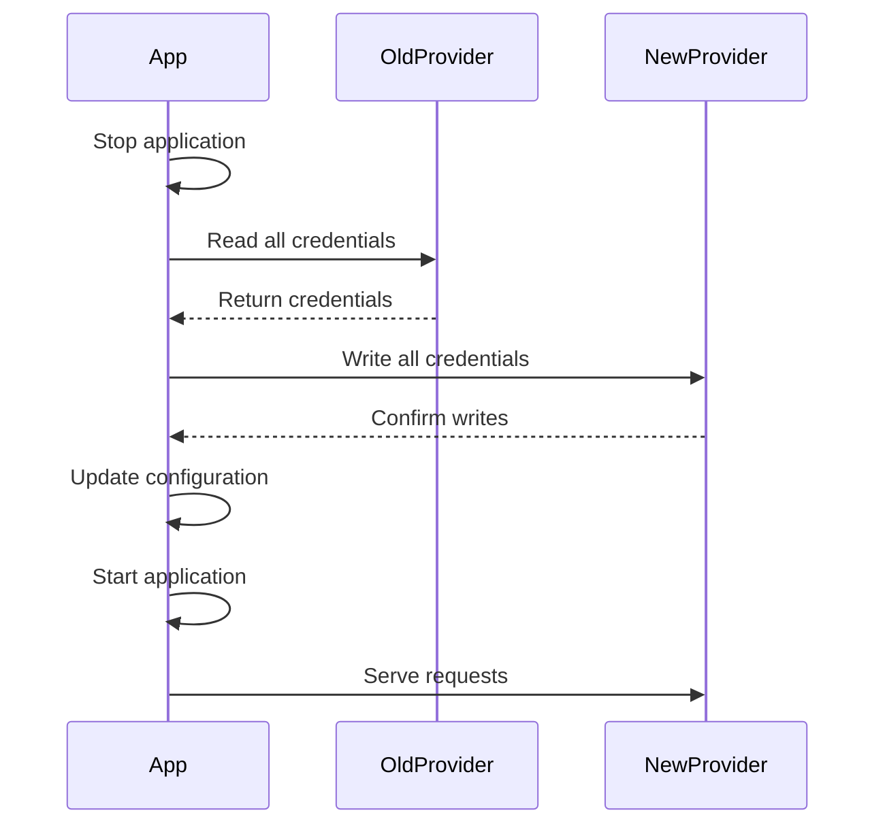
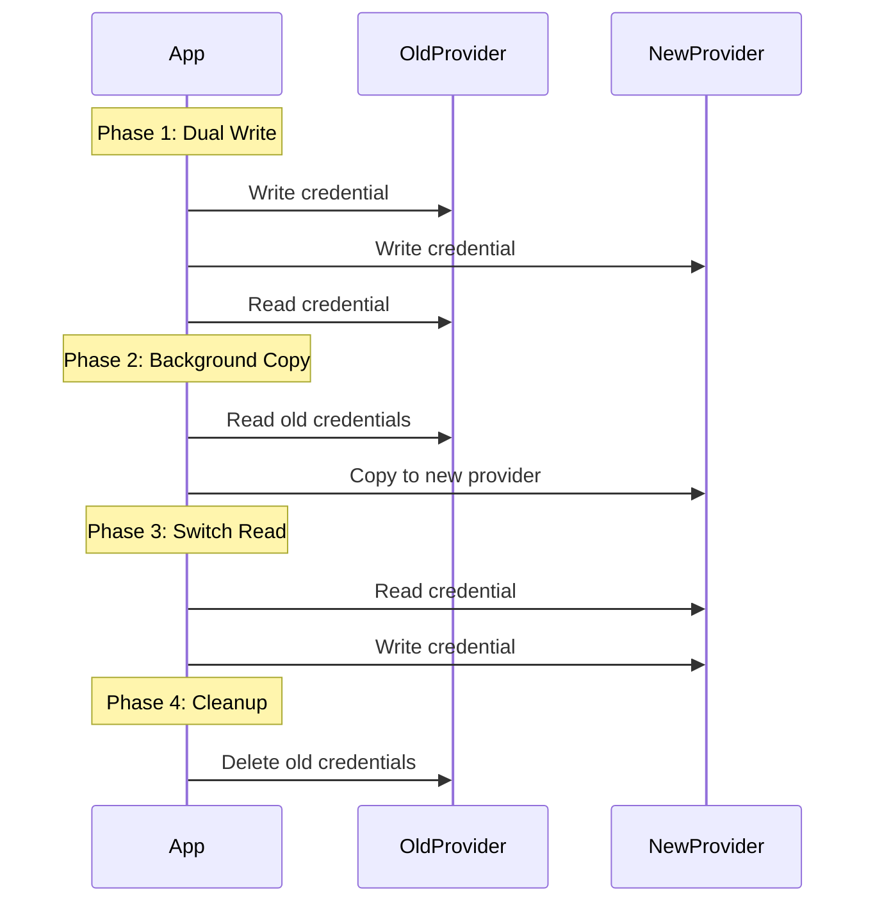
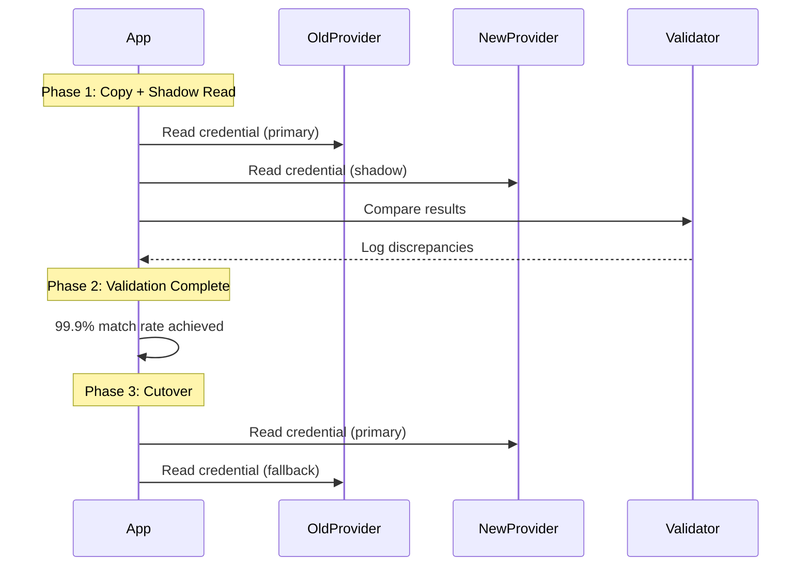

# Provider Migration Guide

> **TL;DR**: Migrate credentials between storage providers (Local → AWS, Kubernetes → Azure, etc.) with zero downtime, validation, and rollback strategies.

## Overview

This guide covers migrating credentials between nebula-credential storage providers: Local Storage, AWS Secrets Manager, Azure Key Vault, HashiCorp Vault, and Kubernetes Secrets. Learn strategies for zero-downtime migration, validation, and rollback.

**Что вы получите**:
- Complete migration patterns for all provider combinations
- Zero-downtime migration strategies
- Data validation and integrity checking
- Rollback procedures for failed migrations
- Performance optimization for large-scale migrations
- Testing and verification steps

**Типичные сценарии миграции**:
- **Development → Production**: Local Storage → AWS/Azure/Vault
- **Cloud Migration**: AWS → Azure or Azure → AWS
- **Kubernetes Adoption**: Local/Cloud → Kubernetes Secrets
- **Multi-Cloud Strategy**: Single provider → Multiple providers
- **Security Upgrade**: Native K8s → External Secrets Operator + Vault

## Migration Strategies

### Strategy 1: Stop-and-Copy (Downtime Required)

**Use When**:
- Downtime acceptable (< 30 minutes)
- Small dataset (< 1000 credentials)
- Simple migration path

**Pros**: Simple, low risk of data inconsistency
**Cons**: Service downtime required



### Strategy 2: Dual-Write (Zero Downtime)

**Use When**:
- Zero downtime required
- Medium dataset (< 10,000 credentials)
- Can tolerate temporary dual-write overhead

**Pros**: Zero downtime, gradual migration
**Cons**: Temporary complexity, dual-write overhead



### Strategy 3: Shadow-Read (Zero Downtime + Validation)

**Use When**:
- Zero downtime critical
- Large dataset (> 10,000 credentials)
- Need production validation before cutover

**Pros**: Safest option, validates in production
**Cons**: Most complex, longest migration time



## Migration Implementations

### Local Storage → AWS Secrets Manager

#### Prerequisites

```bash
# AWS credentials configured
aws sts get-caller-identity

# Verify IAM permissions
aws secretsmanager describe-secret --secret-id test-secret || true
```

#### Implementation

```rust
use nebula_credential::{
    Credential, CredentialId,
    providers::{
        local::LocalStorageProvider,
        aws::AwsSecretsManagerProvider,
    },
};
use std::sync::Arc;
use tokio::time::{sleep, Duration};

pub struct LocalToAwsMigration {
    local: Arc<LocalStorageProvider>,
    aws: Arc<AwsSecretsManagerProvider>,
}

impl LocalToAwsMigration {
    pub async fn new(
        local_db_path: &str,
        master_password: &str,
        aws_region: &str,
        aws_secret_prefix: String,
    ) -> Result<Self, Box<dyn std::error::Error>> {
        let local = Arc::new(
            LocalStorageProvider::new(local_db_path, master_password).await?
        );
        
        let aws = Arc::new(
            AwsSecretsManagerProvider::new(
                Some(aws_region.to_string()),
                aws_secret_prefix,
                None, // No KMS key initially
            ).await?
        );
        
        Ok(Self { local, aws })
    }
    
    /// Stop-and-copy migration (requires downtime)
    pub async fn migrate_stop_and_copy(
        &self,
    ) -> Result<MigrationReport, Box<dyn std::error::Error>> {
        let mut report = MigrationReport::default();
        let start = std::time::Instant::now();
        
        tracing::info!("Starting stop-and-copy migration from Local to AWS");
        
        // 1. Get all credential IDs
        let credential_ids = self.local.list_all().await?;
        report.total_credentials = credential_ids.len();
        
        tracing::info!(count = credential_ids.len(), "Found credentials to migrate");
        
        // 2. Migrate each credential
        for credential_id in credential_ids {
            match self.migrate_single_credential(&credential_id).await {
                Ok(()) => {
                    report.migrated += 1;
                    if report.migrated % 100 == 0 {
                        tracing::info!(
                            migrated = report.migrated,
                            total = report.total_credentials,
                            "Migration progress"
                        );
                    }
                }
                Err(e) => {
                    report.failed += 1;
                    report.errors.push(format!("{}: {}", credential_id, e));
                    tracing::error!(
                        credential_id = ?credential_id,
                        error = ?e,
                        "Failed to migrate credential"
                    );
                }
            }
        }
        
        report.duration = start.elapsed();
        report.success = report.failed == 0;
        
        tracing::info!(
            migrated = report.migrated,
            failed = report.failed,
            duration = ?report.duration,
            "Migration complete"
        );
        
        Ok(report)
    }
    
    async fn migrate_single_credential(
        &self,
        credential_id: &CredentialId,
    ) -> Result<(), Box<dyn std::error::Error>> {
        // Read from local
        let credential = self.local.retrieve(credential_id).await?
            .ok_or("Credential not found")?;
        
        // Write to AWS
        self.aws.store(credential_id.clone(), &credential).await?;
        
        // Verify write
        let verified = self.aws.retrieve(credential_id).await?
            .ok_or("Verification failed: credential not in AWS")?;
        
        // Basic integrity check
        if credential.credential_type() != verified.credential_type() {
            return Err("Verification failed: credential type mismatch".into());
        }
        
        Ok(())
    }
    
    /// Dual-write migration (zero downtime)
    pub async fn migrate_dual_write(
        &self,
        batch_size: usize,
    ) -> Result<MigrationReport, Box<dyn std::error::Error>> {
        let mut report = MigrationReport::default();
        let start = std::time::Instant::now();
        
        tracing::info!("Starting dual-write migration from Local to AWS");
        
        // Phase 1: Background copy of existing credentials
        let credential_ids = self.local.list_all().await?;
        report.total_credentials = credential_ids.len();
        
        for chunk in credential_ids.chunks(batch_size) {
            let mut tasks = Vec::new();
            
            for credential_id in chunk {
                let local = self.local.clone();
                let aws = self.aws.clone();
                let id = credential_id.clone();
                
                tasks.push(tokio::spawn(async move {
                    let credential = local.retrieve(&id).await?.ok_or("Not found")?;
                    aws.store(id.clone(), &credential).await?;
                    Ok::<_, Box<dyn std::error::Error>>(id)
                }));
            }
            
            // Wait for batch
            for task in tasks {
                match task.await? {
                    Ok(_id) => report.migrated += 1,
                    Err(e) => {
                        report.failed += 1;
                        report.errors.push(e.to_string());
                    }
                }
            }
            
            tracing::info!(
                migrated = report.migrated,
                total = report.total_credentials,
                "Background copy progress"
            );
            
            // Rate limiting
            sleep(Duration::from_millis(100)).await;
        }
        
        report.duration = start.elapsed();
        report.success = report.failed == 0;
        
        tracing::info!(report = ?report, "Dual-write migration complete");
        
        Ok(report)
    }
}

#[derive(Debug, Default)]
pub struct MigrationReport {
    pub total_credentials: usize,
    pub migrated: usize,
    pub failed: usize,
    pub success: bool,
    pub duration: std::time::Duration,
    pub errors: Vec<String>,
}

impl MigrationReport {
    pub fn print_summary(&self) {
        println!("\n=== Migration Report ===");
        println!("Total credentials: {}", self.total_credentials);
        println!("Successfully migrated: {}", self.migrated);
        println!("Failed: {}", self.failed);
        println!("Success rate: {:.2}%", 
            (self.migrated as f64 / self.total_credentials as f64) * 100.0
        );
        println!("Duration: {:?}", self.duration);
        println!("Status: {}", if self.success { "✓ SUCCESS" } else { "✗ FAILED" });
        
        if !self.errors.is_empty() {
            println!("\nErrors:");
            for (i, error) in self.errors.iter().take(10).enumerate() {
                println!("  {}. {}", i + 1, error);
            }
            if self.errors.len() > 10 {
                println!("  ... and {} more errors", self.errors.len() - 10);
            }
        }
        println!("========================\n");
    }
}
```

#### Usage

```rust
#[tokio::main]
async fn main() -> Result<(), Box<dyn std::error::Error>> {
    // Initialize migration
    let migration = LocalToAwsMigration::new(
        "./data/credentials.db",
        &std::env::var("NEBULA_MASTER_PASSWORD")?,
        "us-east-1",
        "nebula/credentials".to_string(),
    ).await?;
    
    // Choose migration strategy
    let report = migration.migrate_dual_write(50).await?;
    report.print_summary();
    
    if report.success {
        println!("✓ Migration successful! Update app config to use AWS provider.");
    } else {
        println!("✗ Migration had errors. Review and retry failed credentials.");
    }
    
    Ok(())
}
```

### AWS Secrets Manager → Azure Key Vault

```rust
pub struct AwsToAzureMigration {
    aws: Arc<AwsSecretsManagerProvider>,
    azure: Arc<AzureKeyVaultProvider>,
}

impl AwsToAzureMigration {
    pub async fn migrate_with_validation(
        &self,
    ) -> Result<MigrationReport, Box<dyn std::error::Error>> {
        let mut report = MigrationReport::default();
        
        // List all AWS secrets
        let credential_ids = self.aws.list_all().await?;
        report.total_credentials = credential_ids.len();
        
        for credential_id in credential_ids {
            // Read from AWS
            let credential = match self.aws.retrieve(&credential_id).await? {
                Some(c) => c,
                None => {
                    report.failed += 1;
                    report.errors.push(format!("{}: not found in AWS", credential_id));
                    continue;
                }
            };
            
            // Write to Azure
            if let Err(e) = self.azure.store(credential_id.clone(), &credential).await {
                report.failed += 1;
                report.errors.push(format!("{}: write failed - {}", credential_id, e));
                continue;
            }
            
            // Validate
            match self.validate_migration(&credential_id, &credential).await {
                Ok(true) => report.migrated += 1,
                Ok(false) => {
                    report.failed += 1;
                    report.errors.push(format!("{}: validation failed", credential_id));
                }
                Err(e) => {
                    report.failed += 1;
                    report.errors.push(format!("{}: validation error - {}", credential_id, e));
                }
            }
        }
        
        report.success = report.failed == 0;
        Ok(report)
    }
    
    async fn validate_migration(
        &self,
        credential_id: &CredentialId,
        original: &Credential,
    ) -> Result<bool, Box<dyn std::error::Error>> {
        let migrated = self.azure.retrieve(credential_id).await?
            .ok_or("Credential not found in Azure")?;
        
        // Validate key fields
        Ok(
            original.credential_type() == migrated.credential_type() &&
            original.owner_id() == migrated.owner_id() &&
            original.scope() == migrated.scope()
        )
    }
}
```

### HashiCorp Vault → Kubernetes Secrets

```rust
pub struct VaultToKubernetesMigration {
    vault: Arc<VaultProvider>,
    k8s: Arc<KubernetesSecretsProvider>,
}

impl VaultToKubernetesMigration {
    pub async fn migrate_with_transformation(
        &self,
    ) -> Result<MigrationReport, Box<dyn std::error::Error>> {
        let mut report = MigrationReport::default();
        
        let credential_ids = self.vault.list_all().await?;
        report.total_credentials = credential_ids.len();
        
        for credential_id in credential_ids {
            // Read from Vault
            let mut credential = match self.vault.retrieve(&credential_id).await? {
                Some(c) => c,
                None => continue,
            };
            
            // Transform if needed (e.g., adjust TTL for K8s)
            if credential.ttl_seconds().unwrap_or(0) > 86400 {
                // K8s secrets with TTL > 24h should use ExternalSecret instead
                tracing::warn!(
                    credential_id = ?credential_id,
                    ttl = credential.ttl_seconds(),
                    "Credential has long TTL, consider using External Secrets Operator"
                );
            }
            
            // Write to Kubernetes
            match self.k8s.store(credential_id.clone(), &credential).await {
                Ok(()) => report.migrated += 1,
                Err(e) => {
                    report.failed += 1;
                    report.errors.push(format!("{}: {}", credential_id, e));
                }
            }
        }
        
        report.success = report.failed == 0;
        Ok(report)
    }
}
```

## Validation and Testing

### Pre-Migration Checklist

```rust
pub struct PreMigrationValidator {
    source: Arc<dyn StorageProvider>,
    target: Arc<dyn StorageProvider>,
}

impl PreMigrationValidator {
    pub async fn validate(&self) -> Result<ValidationReport, Box<dyn std::error::Error>> {
        let mut report = ValidationReport::default();
        
        // 1. Check source connectivity
        report.source_reachable = self.check_connectivity(&self.source).await;
        
        // 2. Check target connectivity
        report.target_reachable = self.check_connectivity(&self.target).await;
        
        // 3. Check target has sufficient space (for local/disk-based)
        report.sufficient_space = true; // TODO: implement disk space check
        
        // 4. Count credentials to migrate
        if let Ok(ids) = self.source.list_all().await {
            report.credential_count = ids.len();
        }
        
        // 5. Test write permissions on target
        report.target_writable = self.test_write_permission(&self.target).await;
        
        report.ready = 
            report.source_reachable &&
            report.target_reachable &&
            report.sufficient_space &&
            report.target_writable;
        
        Ok(report)
    }
    
    async fn check_connectivity(&self, provider: &Arc<dyn StorageProvider>) -> bool {
        // Try to list (even if empty)
        provider.list_all().await.is_ok()
    }
    
    async fn test_write_permission(&self, provider: &Arc<dyn StorageProvider>) -> bool {
        let test_id = CredentialId::new();
        let test_credential = Credential::api_key(
            "migration-test",
            CredentialScope::Global,
            SecretString::from("test"),
        ).ok();
        
        if let Some(cred) = test_credential {
            if provider.store(test_id.clone(), &cred).await.is_ok() {
                let _ = provider.delete(&test_id).await;
                return true;
            }
        }
        
        false
    }
}

#[derive(Debug, Default)]
pub struct ValidationReport {
    pub source_reachable: bool,
    pub target_reachable: bool,
    pub sufficient_space: bool,
    pub target_writable: bool,
    pub credential_count: usize,
    pub ready: bool,
}
```

### Post-Migration Verification

```rust
pub struct PostMigrationVerifier {
    source: Arc<dyn StorageProvider>,
    target: Arc<dyn StorageProvider>,
}

impl PostMigrationVerifier {
    pub async fn verify(&self) -> Result<VerificationReport, Box<dyn std::error::Error>> {
        let mut report = VerificationReport::default();
        
        // Get all credential IDs from both providers
        let source_ids = self.source.list_all().await?;
        let target_ids = self.target.list_all().await?;
        
        report.source_count = source_ids.len();
        report.target_count = target_ids.len();
        
        // Check for missing credentials
        for id in &source_ids {
            if !target_ids.contains(id) {
                report.missing_credentials.push(id.clone());
            }
        }
        
        // Sample verification (10% of credentials)
        let sample_size = (source_ids.len() / 10).max(10).min(100);
        let mut rng = rand::thread_rng();
        let sample: Vec<_> = source_ids
            .choose_multiple(&mut rng, sample_size)
            .cloned()
            .collect();
        
        for id in sample {
            match self.verify_single_credential(&id).await {
                Ok(true) => report.verified_count += 1,
                Ok(false) => report.mismatch_credentials.push(id),
                Err(e) => report.verification_errors.push(format!("{}: {}", id, e)),
            }
        }
        
        report.success = 
            report.missing_credentials.is_empty() &&
            report.mismatch_credentials.is_empty() &&
            report.source_count == report.target_count;
        
        Ok(report)
    }
    
    async fn verify_single_credential(
        &self,
        id: &CredentialId,
    ) -> Result<bool, Box<dyn std::error::Error>> {
        let source_cred = self.source.retrieve(id).await?.ok_or("Not found in source")?;
        let target_cred = self.target.retrieve(id).await?.ok_or("Not found in target")?;
        
        Ok(
            source_cred.credential_type() == target_cred.credential_type() &&
            source_cred.owner_id() == target_cred.owner_id() &&
            source_cred.scope() == target_cred.scope()
        )
    }
}

#[derive(Debug, Default)]
pub struct VerificationReport {
    pub source_count: usize,
    pub target_count: usize,
    pub verified_count: usize,
    pub missing_credentials: Vec<CredentialId>,
    pub mismatch_credentials: Vec<CredentialId>,
    pub verification_errors: Vec<String>,
    pub success: bool,
}
```

## Rollback Procedures

### Rollback Strategy 1: Configuration Rollback

```rust
// Immediately switch back to old provider
pub async fn rollback_configuration() -> Result<(), Box<dyn std::error::Error>> {
    // 1. Stop application
    tracing::warn!("Initiating configuration rollback");
    
    // 2. Update configuration to use old provider
    std::fs::write(
        "./config/provider.toml",
        r#"
        [storage]
        provider = "local"  # or "aws", "azure", etc.
        "#
    )?;
    
    // 3. Restart application
    tracing::info!("Configuration rolled back. Restart application.");
    
    Ok(())
}
```

### Rollback Strategy 2: Data Rollback

```rust
pub struct MigrationRollback {
    source: Arc<dyn StorageProvider>,
    target: Arc<dyn StorageProvider>,
    backup_ids: Vec<CredentialId>,
}

impl MigrationRollback {
    pub async fn rollback_migration(
        &self,
    ) -> Result<(), Box<dyn std::error::Error>> {
        tracing::warn!("Starting migration rollback");
        
        // Delete all credentials from target
        for id in &self.backup_ids {
            if let Err(e) = self.target.delete(id).await {
                tracing::error!(
                    credential_id = ?id,
                    error = ?e,
                    "Failed to delete credential during rollback"
                );
            }
        }
        
        tracing::info!("Rollback complete. Source provider unchanged.");
        
        Ok(())
    }
}
```

## Best Practices

### 1. Always Test First

```rust
// Use test credentials first
async fn test_migration_path() -> Result<(), Box<dyn std::error::Error>> {
    let test_credential = Credential::api_key(
        "migration-test",
        CredentialScope::Global,
        SecretString::from("test-value"),
    )?;
    
    let test_id = CredentialId::new();
    
    // Test full migration path
    source_provider.store(test_id.clone(), &test_credential).await?;
    let retrieved = source_provider.retrieve(&test_id).await?;
    target_provider.store(test_id.clone(), &retrieved.unwrap()).await?;
    let final_retrieved = target_provider.retrieve(&test_id).await?;
    
    assert!(final_retrieved.is_some());
    
    Ok(())
}
```

### 2. Monitor During Migration

```rust
use prometheus::{IntGauge, IntCounter, Registry};

lazy_static! {
    static ref MIGRATION_PROGRESS: IntGauge = IntGauge::new(
        "nebula_migration_progress_total",
        "Number of credentials migrated"
    ).unwrap();
    
    static ref MIGRATION_ERRORS: IntCounter = IntCounter::new(
        "nebula_migration_errors_total",
        "Number of migration errors"
    ).unwrap();
}

// Update metrics during migration
MIGRATION_PROGRESS.set(migrated_count as i64);
MIGRATION_ERRORS.inc();
```

### 3. Maintain Audit Trail

```rust
#[derive(Serialize)]
struct MigrationAuditLog {
    timestamp: chrono::DateTime<chrono::Utc>,
    source_provider: String,
    target_provider: String,
    credential_id: String,
    status: String,
    error: Option<String>,
}

async fn log_migration_event(
    credential_id: &CredentialId,
    status: &str,
    error: Option<String>,
) -> Result<(), Box<dyn std::error::Error>> {
    let log = MigrationAuditLog {
        timestamp: chrono::Utc::now(),
        source_provider: "local".to_string(),
        target_provider: "aws".to_string(),
        credential_id: credential_id.to_string(),
        status: status.to_string(),
        error,
    };
    
    // Write to audit log file
    let mut file = OpenOptions::new()
        .create(true)
        .append(true)
        .open("migration-audit.jsonl")?;
    
    writeln!(file, "{}", serde_json::to_string(&log)?)?;
    
    Ok(())
}
```

## Troubleshooting

### Issue: Migration stalled midway

```bash
# Check migration progress
tail -f migration-audit.jsonl | jq '.status' | sort | uniq -c

# Resume from last successful credential
grep '"status":"success"' migration-audit.jsonl | tail -1
```

### Issue: Validation failures after migration

```rust
// Run detailed comparison
for credential_id in failed_ids {
    let source = source_provider.retrieve(&credential_id).await?;
    let target = target_provider.retrieve(&credential_id).await?;
    
    println!("Source: {:?}", source);
    println!("Target: {:?}", target);
    println!("Match: {}", source == target);
}
```

### Issue: Out of memory during large migration

```rust
// Use smaller batches and streaming
async fn migrate_in_batches(
    source: &dyn StorageProvider,
    target: &dyn StorageProvider,
    batch_size: usize,
) -> Result<(), Box<dyn std::error::Error>> {
    let ids = source.list_all().await?;
    
    for chunk in ids.chunks(batch_size) {
        // Process batch
        for id in chunk {
            let credential = source.retrieve(id).await?;
            if let Some(cred) = credential {
                target.store(id.clone(), &cred).await?;
            }
        }
        
        // Allow garbage collection
        tokio::task::yield_now().await;
    }
    
    Ok(())
}
```

## See Also

- [[AWS-Secrets-Manager]]: AWS provider details
- [[Azure-Key-Vault]]: Azure provider details
- [[HashiCorp-Vault]]: Vault provider details
- [[Kubernetes-Secrets]]: Kubernetes provider details
- [[Local-Storage]]: Local provider details
- [[Provider-Comparison]]: Feature comparison

## References

- [AWS Secrets Manager Migration](https://docs.aws.amazon.com/secretsmanager/latest/userguide/manage_secret-versions.html)
- [Azure Key Vault Backup/Restore](https://learn.microsoft.com/azure/key-vault/general/backup)
- [HashiCorp Vault Migration](https://developer.hashicorp.com/vault/tutorials/operations/migration)
- [Kubernetes Secrets Management](https://kubernetes.io/docs/concepts/configuration/secret/)
