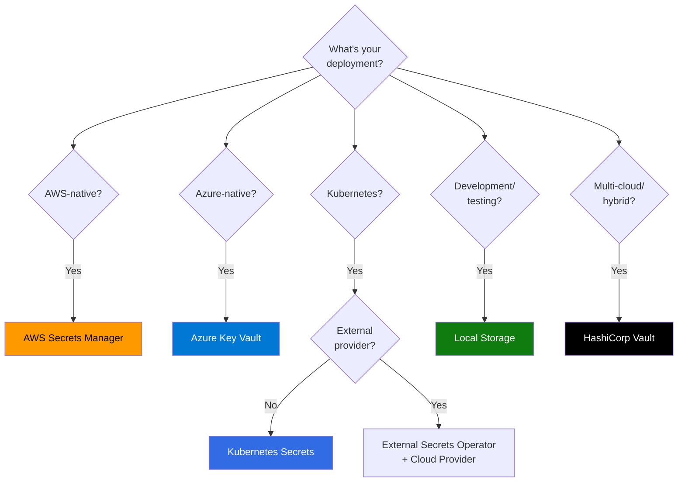
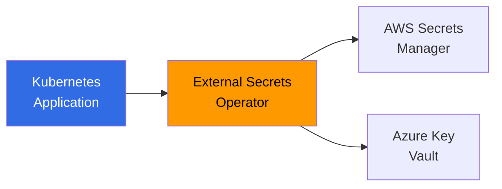
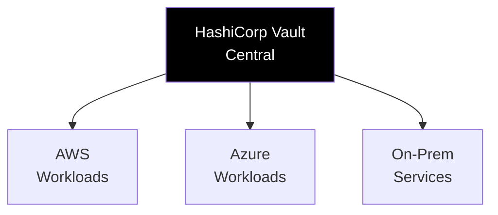
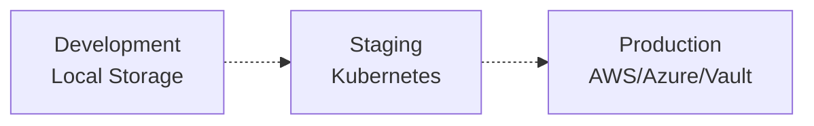

# Storage Provider Comparison

> **TL;DR**: Compare all 5 nebula-credential storage providers (AWS, Azure, Vault, Kubernetes, Local) across features, security, performance, and cost to choose the right provider for your deployment.

## Quick Decision Guide



## Feature Comparison Matrix

| Feature | AWS Secrets Manager | Azure Key Vault | HashiCorp Vault | Kubernetes Secrets | Local Storage |
|---------|---------------------|-----------------|-----------------|-------------------|---------------|
| **Deployment** |
| Cloud-Native | ✅ AWS | ✅ Azure | ✅ Multi-cloud | ✅ K8s clusters | ✅ Any |
| Self-Hosted | ❌ | ❌ | ✅ | ✅ | ✅ |
| Edge/IoT | ❌ | ❌ | ✅ | ⚠️ K3s only | ✅ |
| **Security** |
| Encryption at Rest | ✅ KMS | ✅ HSM (Premium) | ✅ Transit/KMS | ✅ KMS provider | ✅ AES-256-GCM |
| Hardware Security Module | ✅ (with KMS) | ✅ (Premium tier) | ⚠️ Enterprise | ❌ | ❌ |
| Secrets Versioning | ✅ | ✅ | ✅ | ❌ | ❌ |
| Automatic Rotation | ✅ Lambda | ✅ Event Grid | ✅ Built-in | ⚠️ Manual/CronJob | ⚠️ Manual |
| Audit Logging | ✅ CloudTrail | ✅ Monitor | ✅ Built-in | ✅ kube-apiserver | ⚠️ Application-level |
| Fine-Grained Access Control | ✅ IAM | ✅ RBAC | ✅ Policies | ✅ RBAC | ❌ |
| **Authentication** |
| Managed Identity | ✅ IAM roles | ✅ Managed Identity | ⚠️ AWS/Azure auth | ✅ ServiceAccount | ❌ |
| API Keys | ⚠️ IAM access keys | ⚠️ Not recommended | ✅ Tokens | ✅ Token | ✅ Master password |
| Certificate-based | ✅ | ✅ | ✅ | ✅ | ❌ |
| **Operations** |
| Automatic Backups | ✅ | ✅ Soft-delete | ⚠️ Manual snapshots | ⚠️ etcd backups | ✅ File copy |
| Multi-Region Replication | ✅ | ✅ (Premium) | ✅ (Enterprise) | ⚠️ Federation | ❌ |
| High Availability | ✅ Built-in | ✅ Built-in | ✅ Raft clustering | ✅ etcd | ❌ |
| Disaster Recovery | ✅ Cross-region | ✅ Geo-redundant | ✅ Snapshots | ✅ etcd DR | ⚠️ Manual backups |
| **Performance** |
| Latency (p50) | 50-100ms | 30-80ms | 10-50ms | 5-15ms | <1ms |
| Latency (p99) | 200-500ms | 150-300ms | 100-200ms | 30-100ms | <5ms |
| Throughput (RPS) | 5,000+ | 2,000+ | 10,000+ | 50,000+ | 100,000+ |
| **Cost** |
| Per 10K Operations | $0.40 | $0.03 | Free (OSS) | Free | Free |
| Storage Cost | Included | Included | Free (OSS) | Included | Free |
| HSM Cost | Included in KMS | +$1.00/key/mo | Enterprise only | N/A | N/A |
| Minimum Monthly | ~$0.40 | ~$0.03 | $0 (OSS) | $0 | $0 |
| **Integrations** |
| Native Cloud Services | ✅ RDS, Lambda | ✅ SQL, Functions | ⚠️ Via plugins | ✅ K8s workloads | ❌ |
| External Secrets Operator | ✅ | ✅ | ✅ | N/A | ❌ |
| CI/CD Integration | ✅ | ✅ | ✅ | ✅ | ✅ |
| **Developer Experience** |
| Setup Complexity | ⭐⭐⭐ (Medium) | ⭐⭐⭐ (Medium) | ⭐⭐⭐⭐ (High) | ⭐⭐ (Low) | ⭐ (Very Low) |
| Learning Curve | ⭐⭐ (Low) | ⭐⭐ (Low) | ⭐⭐⭐⭐ (High) | ⭐⭐⭐ (Medium) | ⭐ (Very Low) |
| Local Development | ⚠️ Requires AWS creds | ⚠️ Requires Azure | ✅ Dev mode | ✅ | ✅ |
| **Compliance** |
| SOC 2 | ✅ | ✅ | ✅ (Enterprise) | ⚠️ Cluster-dependent | ❌ |
| ISO 27001 | ✅ | ✅ | ✅ (Enterprise) | ⚠️ Cluster-dependent | ❌ |
| HIPAA | ✅ | ✅ | ✅ (Enterprise) | ⚠️ Cluster-dependent | ❌ |
| GDPR | ✅ | ✅ | ✅ | ✅ | ✅ |
| FedRAMP | ✅ GovCloud | ✅ Gov | ✅ (Enterprise) | ⚠️ Cluster-dependent | ❌ |

**Legend**:
- ✅ Fully supported
- ⚠️ Partially supported or requires configuration
- ❌ Not supported
- OSS = Open Source Software
- Enterprise = Commercial Vault Enterprise license required

## Detailed Provider Analysis

### AWS Secrets Manager

**Best for**: AWS-native applications, Lambda functions, RDS/DocumentDB integration

**Strengths**:
- Seamless AWS service integration (RDS, Lambda, ECS)
- Automatic rotation with Lambda
- IAM-based access control (familiar to AWS users)
- CloudTrail audit logging
- Encryption with AWS KMS (including CloudHSM)
- Cross-region replication
- VPC endpoints for private access

**Weaknesses**:
- AWS-only (vendor lock-in)
- Higher cost compared to alternatives
- Requires AWS credentials for local development
- 50-100ms latency (network overhead)

**Typical Use Cases**:
- AWS Lambda credential injection
- RDS automatic password rotation
- Multi-account AWS deployments
- Compliance requirements (SOC 2, HIPAA)

**Cost Example** (us-east-1, 2024):
```
Base operations: 100,000 API calls/month = $4.00
Storage: 500 secrets = Included
KMS encryption: 10,000 encrypt/decrypt = $0.03
Total: ~$4.03/month
```

### Azure Key Vault

**Best for**: Azure-native applications, AKS workloads, managed identity authentication

**Strengths**:
- Azure AD integration with Managed Identities
- HSM-backed secrets (Premium tier)
- RBAC with Privileged Identity Management
- Private endpoints with VNet integration
- Event Grid integration for rotation
- Lower cost than AWS
- Soft-delete and purge protection

**Weaknesses**:
- Azure-only (vendor lock-in)
- 30-80ms latency
- Premium tier required for HSM
- Managed identity setup can be complex

**Typical Use Cases**:
- AKS pod identity credentials
- Azure Functions with managed identity
- Azure SQL/Cosmos DB connection strings
- Multi-region Azure deployments

**Cost Example** (East US, 2024):
```
Standard tier:
- Operations: 100,000 = $0.30
- Storage: 500 secrets = Included
Premium tier (HSM):
- Operations: 100,000 = $0.30
- HSM keys: 5 keys = $5.00
Total Standard: ~$0.30/month
Total Premium: ~$5.30/month
```

### HashiCorp Vault

**Best for**: Multi-cloud, hybrid cloud, dynamic secrets, zero-trust architectures

**Strengths**:
- Cloud-agnostic (AWS, Azure, GCP, on-prem)
- Dynamic secrets generation (DB, AWS, etc.)
- Transit encryption-as-a-service
- Lease-based credential lifecycle
- Comprehensive audit logging
- Open source with free Community edition
- Flexible authentication (AppRole, K8s, AWS, Azure)
- Low latency (10-50ms for nearby deployments)

**Weaknesses**:
- Most complex setup and operations
- Steep learning curve
- High availability requires Raft clustering
- Enterprise features costly ($100K+/year)
- Requires dedicated infrastructure

**Typical Use Cases**:
- Multi-cloud environments
- Dynamic database credentials
- Centralized secrets management across infrastructure
- Zero-trust security architectures
- Organizations already using HashiCorp stack

**Cost Example**:
```
Community (OSS): $0/month (self-hosted)
Enterprise: $100,000+/year (varies by features/scale)
Infrastructure: ~$200-500/month (3-5 node HA cluster)
```

### Kubernetes Secrets

**Best for**: Kubernetes-native applications, cloud-agnostic K8s deployments

**Strengths**:
- Native K8s integration
- Zero additional cost
- RBAC with namespace isolation
- Very low latency (5-15ms)
- High throughput (50K+ RPS)
- ServiceAccount-based authentication
- Works with External Secrets Operator for hybrid approach
- Supports Sealed Secrets for GitOps

**Weaknesses**:
- Base64 encoding (not encryption) by default
- Requires KMS provider for encryption at rest
- No built-in secret versioning
- Limited to single cluster (without federation)
- Rotation requires manual implementation
- etcd storage limits (1.5MB per secret)

**Typical Use Cases**:
- Kubernetes-native microservices
- Development and testing environments
- Cloud-agnostic deployments
- GitOps workflows (with Sealed Secrets)
- Integration with cloud providers via ESO

**Cost Example**:
```
Kubernetes Secrets: $0 (included with cluster)
Encryption at rest: Included (with cloud KMS)
External Secrets Operator: $0 (OSS)
Total: $0/month
```

### Local Storage (SQLite)

**Best for**: Development, testing, CI/CD, single-machine deployments, edge devices

**Strengths**:
- Zero dependencies
- Sub-millisecond latency (<1ms)
- Highest throughput (100K+ RPS)
- Zero cost
- Simple setup and operation
- Perfect for local development
- Easy backup (file copy)
- No network overhead

**Weaknesses**:
- Single-machine only (no distribution)
- No built-in high availability
- Application-level encryption only
- Manual backup and rotation
- Not suitable for production clusters
- No audit logging (application-level only)

**Typical Use Cases**:
- Local development environments
- Unit and integration testing
- CI/CD pipeline secrets
- Single-machine deployments (edge, IoT)
- Proof-of-concept and prototyping
- Offline-first applications

**Cost Example**:
```
Storage: $0 (local filesystem)
Operations: $0 (no API calls)
Total: $0/month
```

## Migration Complexity Matrix

| From ↓ / To → | AWS | Azure | Vault | Kubernetes | Local |
|---------------|-----|-------|-------|------------|-------|
| **AWS** | - | ⭐⭐⭐ | ⭐⭐⭐ | ⭐⭐ | ⭐ |
| **Azure** | ⭐⭐⭐ | - | ⭐⭐⭐ | ⭐⭐ | ⭐ |
| **Vault** | ⭐⭐ | ⭐⭐ | - | ⭐⭐ | ⭐ |
| **Kubernetes** | ⭐⭐ | ⭐⭐ | ⭐⭐ | - | ⭐ |
| **Local** | ⭐⭐ | ⭐⭐ | ⭐⭐ | ⭐⭐ | - |

**Legend**: ⭐ Easy, ⭐⭐⭐⭐ Complex

## Performance Comparison

### Latency (ms)

```
Operation: Read single credential

Local Storage:     ▏ <1ms
Kubernetes:        ▎▎▎▎ 5-15ms
Vault (nearby):    ▎▎▎▎▎▎▎▎▎ 10-50ms
Azure Key Vault:   ▎▎▎▎▎▎▎▎▎▎▎▎▎▎▎ 30-80ms
AWS Secrets Mgr:   ▎▎▎▎▎▎▎▎▎▎▎▎▎▎▎▎▎▎▎▎ 50-100ms
```

### Throughput (Requests/Second)

```
Single instance, cached credentials

Local Storage:     ████████████████████ 100,000+ RPS
Kubernetes:        ██████████ 50,000+ RPS
Vault (cluster):   ████ 10,000+ RPS
AWS Secrets Mgr:   ██ 5,000+ RPS
Azure Key Vault:   █ 2,000+ RPS
```

## Cost Comparison

**Monthly cost for 100,000 operations + 500 secrets**:

| Provider | Cost/Month | Notes |
|----------|-----------|-------|
| Local Storage | $0 | Free |
| Kubernetes | $0 | Included with cluster |
| Vault (OSS) | $0 + infra | ~$200-500 for HA cluster |
| Azure Key Vault | $0.30 | Standard tier |
| AWS Secrets Manager | $4.00 | Plus KMS costs |

**Annual cost at scale (1M operations/month)**:

| Provider | Cost/Year | Notes |
|----------|-----------|-------|
| Kubernetes | $0 | Included |
| Vault (OSS) | ~$3,600 | Infrastructure only |
| Azure Key Vault | $36 | Standard tier |
| AWS Secrets Manager | $480 | Plus KMS |
| Vault Enterprise | $100,000+ | License + infra |

## Hybrid Deployment Patterns

### Pattern 1: Kubernetes + External Secrets Operator + Cloud Provider



**Best for**: Cloud-agnostic K8s applications with cloud provider secrets

### Pattern 2: Multi-Cloud with Vault



**Best for**: Multi-cloud and hybrid deployments

### Pattern 3: Dev/Prod Split



**Best for**: Different environments with appropriate security/cost trade-offs

## Decision Framework

### Choose AWS Secrets Manager if:
- ✅ Running 100% on AWS
- ✅ Need RDS/Lambda integration
- ✅ IAM familiarity important
- ✅ Compliance requirements (HIPAA, SOC 2)
- ❌ Multi-cloud required
- ❌ Cost-sensitive

### Choose Azure Key Vault if:
- ✅ Running 100% on Azure
- ✅ Need managed identities
- ✅ Lower cost priority
- ✅ HSM requirement (Premium tier)
- ❌ Multi-cloud required
- ❌ Very high throughput needed

### Choose HashiCorp Vault if:
- ✅ Multi-cloud or hybrid deployment
- ✅ Dynamic secrets needed
- ✅ Centralized secrets management
- ✅ Have HashiCorp expertise
- ❌ Simple deployment preferred
- ❌ Limited operational resources

### Choose Kubernetes Secrets if:
- ✅ Kubernetes-native applications
- ✅ Cloud-agnostic K8s
- ✅ Zero additional cost
- ✅ Low latency critical
- ❌ Multi-cluster secrets sharing
- ❌ Need automatic rotation

### Choose Local Storage if:
- ✅ Development and testing
- ✅ Single-machine deployment
- ✅ Edge/IoT devices
- ✅ Offline-first applications
- ❌ Production distributed systems
- ❌ Compliance requirements

## See Also

- [[AWS-Secrets-Manager]]: AWS provider guide
- [[Azure-Key-Vault]]: Azure provider guide
- [[HashiCorp-Vault]]: Vault provider guide
- [[Kubernetes-Secrets]]: Kubernetes provider guide
- [[Local-Storage]]: Local provider guide
- [[Migration-Guide]]: Provider migration patterns

## References

- [AWS Secrets Manager Pricing](https://aws.amazon.com/secrets-manager/pricing/)
- [Azure Key Vault Pricing](https://azure.microsoft.com/pricing/details/key-vault/)
- [HashiCorp Vault Pricing](https://www.hashicorp.com/products/vault/pricing)
- [Kubernetes Secrets Documentation](https://kubernetes.io/docs/concepts/configuration/secret/)
