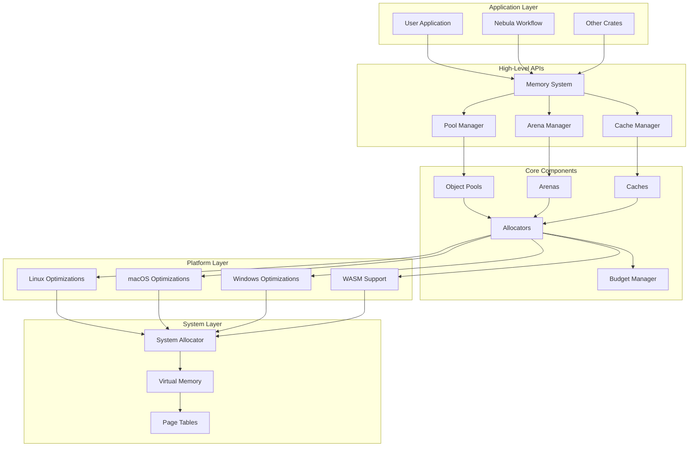
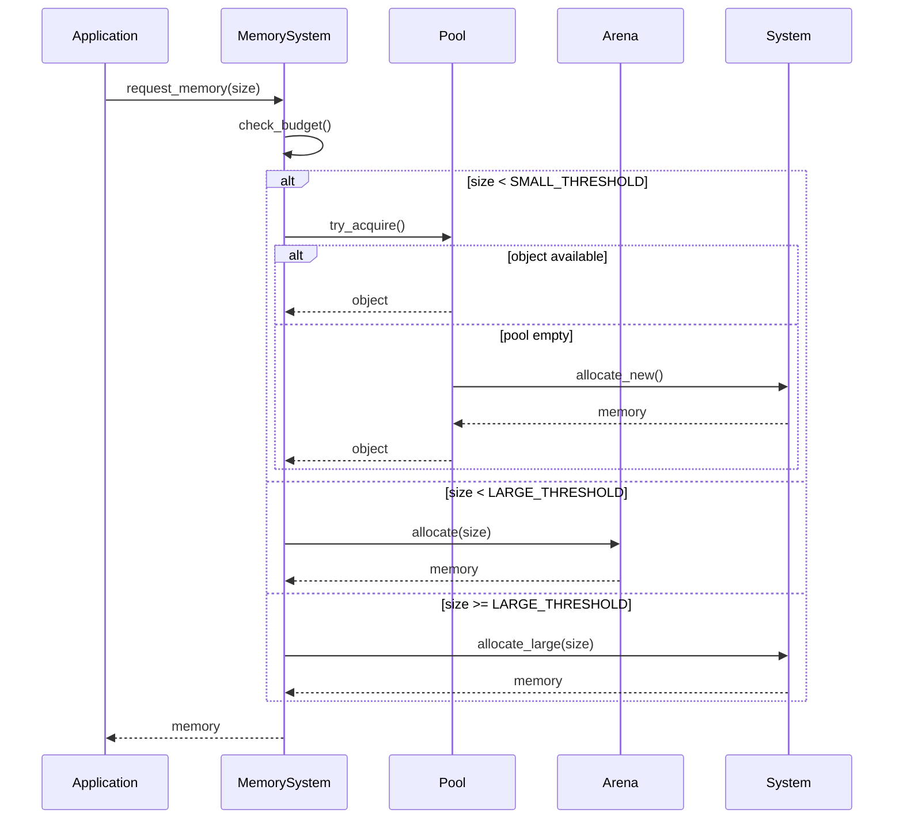

## Overview

`nebula-memory` is designed as a foundational memory management library with zero dependencies on other Nebula components. It provides composable, efficient, and platform-aware memory abstractions.

## Design Principles

### 1. **Zero-Cost Abstractions**

All abstractions compile to optimal machine code with no runtime overhead.

```rust
// This abstraction...
let value = pool.acquire()?;

// Compiles to the same code as...
let value = if !pool.available.is_empty() {
    pool.available.pop()
} else {
    T::default()
};
```

### 2. **Independence First**

No dependencies on other nebula components - can be used in any Rust project.

```toml
# Core has zero dependencies
[dependencies]
nebula-memory = { version = "0.1", default-features = false }
```

### 3. **Composability**

Components can be combined to create complex memory management systems.

```rust
// Combine multiple strategies
let system = MemorySystem::new()
    .with_pool(ObjectPool::new(100))
    .with_arena(Arena::new(1024 * 1024))
    .with_cache(LruCache::new(1000))
    .with_budget(MemoryBudget::new(100_000_000));
```

### 4. **Platform Awareness**

Optimizations for specific platforms without sacrificing portability.

```rust
#[cfg(target_os = "linux")]
use huge_pages::HugePageAllocator;

#[cfg(not(target_os = "linux"))]
use standard::SystemAllocator;
```

## System Architecture



## Component Architecture

### Core Traits System

```rust
// Base traits that all components implement
pub trait MemoryComponent: Send + Sync {
    fn allocate(&self, size: usize) -> Result<*mut u8>;
    fn deallocate(&self, ptr: *mut u8, size: usize);
    fn stats(&self) -> MemoryStats;
}

pub trait Poolable: Sized {
    fn reset(&mut self);
    fn validate(&self) -> bool { true }
}

pub trait Cacheable: Clone {
    type Key: Hash + Eq;
    fn cache_key(&self) -> Self::Key;
    fn size_hint(&self) -> usize;
}
```

### Memory Hierarchy

```
┌─────────────────────────────────────────┐
│            L1: Thread-Local             │ <- Fastest
│         (Stack allocator, 1KB)          │
├─────────────────────────────────────────┤
│            L2: Object Pools             │ <- Fast
│      (Pre-allocated objects, 10MB)      │
├─────────────────────────────────────────┤
│              L3: Arenas                 │ <- Medium
│        (Bulk allocation, 100MB)         │
├─────────────────────────────────────────┤
│           L4: System Heap               │ <- Slow
│         (malloc/free, unlimited)        │
└─────────────────────────────────────────┘
```

### Allocation Flow



## Memory Management Strategies

### 1. Object Pooling Strategy

```rust
pub struct PoolStrategy {
    // Configuration
    min_size: usize,
    max_size: usize,
    growth_factor: f32,
    
    // Policies
    eviction_policy: EvictionPolicy,
    validation_policy: ValidationPolicy,
    
    // Statistics
    stats: PoolStats,
}
```

**When to use:**

- Frequent allocation/deallocation of same-sized objects
- Need predictable latency
- Want to avoid heap fragmentation

### 2. Arena Allocation Strategy

```rust
pub struct ArenaStrategy {
    // Configuration
    initial_size: usize,
    growth_size: usize,
    max_size: Option<usize>,
    
    // Current state
    current_arena: Arena,
    overflow_arenas: Vec<Arena>,
}
```

**When to use:**

- Batch processing with clear boundaries
- Temporary allocations with same lifetime
- Need maximum allocation speed

### 3. Cache Strategy

```rust
pub struct CacheStrategy {
    // Configuration
    capacity: usize,
    ttl: Option<Duration>,
    
    // Eviction
    eviction: EvictionPolicy,
    
    // Computation
    compute_fn: Box<dyn Fn(&Key) -> Value>,
}
```

**When to use:**

- Expensive computations
- Repeated access patterns
- Read-heavy workloads

## Integration Points

### Extension Traits

```rust
// Logging integration
pub trait MemoryLogger {
    fn log_allocation(&self, event: AllocationEvent);
    fn log_deallocation(&self, event: DeallocationEvent);
}

// Metrics integration
pub trait MemoryMetrics {
    fn record_allocation(&self, size: usize, duration: Duration);
    fn record_pool_hit_rate(&self, rate: f64);
}

// Serialization support
pub trait MemorySerializable {
    fn serialize_state(&self) -> Vec<u8>;
    fn deserialize_state(data: &[u8]) -> Self;
}
```

### Plugin System

```rust
pub trait MemoryPlugin: Send + Sync {
    fn name(&self) -> &str;
    fn on_init(&mut self, system: &MemorySystem);
    fn on_allocation(&self, event: &AllocationEvent);
    fn on_deallocation(&self, event: &DeallocationEvent);
    fn on_pressure(&self, level: PressureLevel);
}
```

## Performance Characteristics

|Component|Allocation|Deallocation|Overhead|Use Case|
|---|---|---|---|---|
|Stack Allocator|O(1)|O(1)*|Minimal|Temporary data|
|Object Pool|O(1)|O(1)|Low|Reusable objects|
|Arena|O(1)|O(1)**|Very Low|Batch processing|
|LRU Cache|O(1)|O(1)|Medium|Computed values|
|System Heap|O(log n)|O(log n)|High|Fallback|

* Stack allocator only supports LIFO deallocation ** Arena deallocates all objects at once

## Thread Safety

### Thread-Local Components

Fast, no synchronization needed:

- `LocalPool<T>`
- `LocalArena`
- `ThreadLocalCache<K, V>`

### Thread-Safe Components

Safe for concurrent access:

- `ThreadSafePool<T>` - Uses parking_lot::Mutex
- `LockFreePool<T>` - Lock-free implementation
- `ConcurrentArena` - Segmented for parallelism
- `DashCache<K, V>` - Sharded cache

### Synchronization Strategies

```rust
// 1. Lock-based (simple, fair)
let pool = ThreadSafePool::new(100);

// 2. Lock-free (fast, complex)
let pool = LockFreePool::new(100);

// 3. Thread-local with stealing (balanced)
let pool = WorkStealingPool::new(100);

// 4. Sharded (scalable)
let cache = ShardedCache::new(16, 1000);
```

## Error Handling

All operations that can fail return `Result<T, MemoryError>`:

```rust
pub enum MemoryError {
    // Allocation failures
    OutOfMemory { requested: usize, available: usize },
    AllocationTooLarge { requested: usize, max: usize },
    
    // Pool errors
    PoolExhausted,
    InvalidObject,
    
    // Budget errors
    BudgetExceeded { requested: usize, remaining: usize },
    
    // System errors
    SystemError(std::io::Error),
    
    // Platform errors
    #[cfg(target_os = "linux")]
    HugePagesUnavailable,
}
```

## Configuration

### Static Configuration

```rust
const CONFIG: MemoryConfig = MemoryConfig {
    default_pool_size: 100,
    default_arena_size: 1024 * 1024,
    enable_profiling: cfg!(debug_assertions),
    max_memory: 1024 * 1024 * 1024, // 1GB
};
```

### Dynamic Configuration

```rust
let config = MemoryConfig::from_env()
    .or_else(|| MemoryConfig::from_file("memory.toml"))
    .unwrap_or_default();
```

## Future Directions

### Planned Features

- **Persistent Memory** - Support for Intel Optane
- **GPU Memory** - Unified memory management
- **Distributed Memory** - Cluster-wide memory pool
- **Memory Compression** - Transparent compression
- **Smart Pointers** - Custom smart pointer types

### Research Areas

- Machine learning for allocation patterns
- Quantum memory management
- Neuromorphic computing support