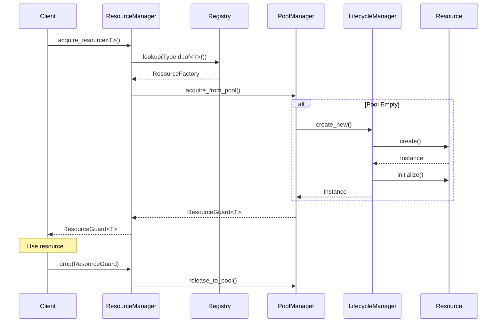

# Architecture

> Deep dive into nebula-resource internal architecture and design decisions

## Overview

`nebula-resource` следует модульной архитектуре с четким разделением ответственности между компонентами. Система построена на основе trait-based design, что обеспечивает гибкость и расширяемость.

## Core Modules

### 1. Core Module (`core/`)

Базовые трейты и типы, определяющие контракты системы.

```rust
pub mod core {
    pub trait Resource: Send + Sync + 'static {
        type Config: ResourceConfig;
        type Instance: Send + Sync;
        
        async fn create(&self, config: &Self::Config, context: &ResourceContext) 
            -> Result<Self::Instance, ResourceError>;
    }
    
    pub trait ResourceConfig: Serialize + DeserializeOwned + Validate {
        fn validate(&self) -> Result<(), ValidationError>;
        fn merge(&mut self, other: Self);
    }
}
```

**Ключевые решения:**

- Использование associated types вместо generics для упрощения API
- Async trait для поддержки асинхронных операций
- Send + Sync для безопасной многопоточности

### 2. Manager Module (`manager/`)

Центральный компонент управления ресурсами.

```rust
pub struct ResourceManager {
    registry: Arc<RwLock<ResourceRegistry>>,      // Реестр типов ресурсов
    pool_manager: Arc<PoolManager>,               // Управление пулами
    lifecycle_manager: Arc<LifecycleManager>,     // Управление жизненным циклом
    metrics_collector: Arc<MetricsCollector>,     // Сбор метрик
    dependency_graph: Arc<RwLock<DependencyGraph>>, // Граф зависимостей
}
```

**Архитектурные решения:**

- Arc<RwLock<>> для безопасного конкурентного доступа
- Разделение на подсистемы для модульности
- Event-driven архитектура для слабой связанности

### 3. Pool Module (`pool/`)

Система пулинга ресурсов с различными стратегиями.

```
┌──────────────────────────────────────┐
│          PoolManager                  │
├──────────────────────────────────────┤
│  Strategies:                         │
│  • FIFO (First In First Out)         │
│  • LIFO (Last In First Out)          │
│  • LRU (Least Recently Used)         │
│  • Weighted Round Robin               │
│  • Adaptive (ML-based)                │
└──────────────────────────────────────┘
```

**Оптимизации:**

- Lock-free структуры где возможно (crossbeam)
- Предварительное создание ресурсов (warm-up)
- Адаптивное масштабирование на основе метрик

### 4. Stateful Module (`stateful/`)

Управление состоянием ресурсов с версионированием.

```rust
pub struct StateManager<S: State> {
    current: Arc<RwLock<S>>,
    history: Arc<RwLock<StateHistory<S>>>,
    persistence: Option<Arc<dyn StatePersistence<S>>>,
    version: Arc<AtomicU64>,
}
```

**Возможности:**

- Снапшоты состояния
- Миграция между версиями
- Персистентность (опционально)
- Event sourcing паттерн

### 5. Observability Module (`observability/`)

Комплексная система наблюдаемости.

```
Metrics (Prometheus)
├── Counters
│   ├── resource.acquisitions.total
│   ├── resource.errors.total
│   └── resource.health_checks.total
├── Gauges
│   ├── resource.active.count
│   ├── resource.pool.size
│   └── resource.unhealthy.duration
└── Histograms
    ├── resource.acquisition.duration
    ├── resource.initialization.duration
    └── resource.cleanup.duration

Tracing (OpenTelemetry)
├── Spans
│   ├── resource.acquire
│   ├── resource.initialize
│   └── resource.cleanup
└── Context Propagation
    ├── trace_id
    ├── span_id
    └── baggage

Logging (structured)
└── Fields
    ├── resource_id
    ├── resource_type
    ├── workflow_id
    └── tenant_id
```

### 6. Plugins Module (`plugins/`)

Система плагинов для расширения функциональности.

```rust
pub trait ResourcePlugin: Send + Sync {
    fn name(&self) -> &str;
    fn on_register(&self, manager: &ResourceManager) -> Result<()>;
    fn on_resource_created(&self, resource: &dyn Resource) -> Result<()>;
    fn on_resource_acquired(&self, context: &ResourceContext) -> Result<()>;
}
```

**Встроенные плагины:**

- MetricsPlugin - автоматический сбор метрик
- TracingPlugin - распределенная трассировка
- CachingPlugin - кэширование ресурсов
- RetryPlugin - повторные попытки при ошибках

### 7. Testing Module (`testing/`)

Утилиты для тестирования.

```rust
pub struct TestResourceManager {
    mocks: HashMap<TypeId, Box<dyn Any>>,
    expectations: Vec<Expectation>,
    call_history: Vec<CallRecord>,
}
```

## Data Flow



## Design Patterns

### 1. Type-State Pattern

Используется для гарантии корректности состояний на уровне типов:

```rust
pub struct Uninitialized;
pub struct Initialized;
pub struct Ready;

pub struct Resource<S> {
    state: PhantomData<S>,
    // ...
}

impl Resource<Uninitialized> {
    pub async fn initialize(self) -> Result<Resource<Initialized>> {
        // Инициализация
    }
}

impl Resource<Initialized> {
    pub async fn validate(self) -> Result<Resource<Ready>> {
        // Валидация
    }
}

// Только Ready ресурсы можно использовать
impl Resource<Ready> {
    pub async fn use_resource(&self) -> Result<()> {
        // Использование
    }
}
```

### 2. RAII Pattern

Автоматическое управление ресурсами через guards:

```rust
pub struct ResourceGuard<T> {
    resource: Option<Arc<T>>,
    pool: Arc<Pool<T>>,
    metrics: Arc<Metrics>,
    acquired_at: Instant,
}

impl<T> Drop for ResourceGuard<T> {
    fn drop(&mut self) {
        if let Some(resource) = self.resource.take() {
            self.metrics.record_usage(self.acquired_at.elapsed());
            self.pool.release(resource);
        }
    }
}
```

### 3. Strategy Pattern

Для различных стратегий пулинга и балансировки:

```rust
pub trait PoolStrategy: Send + Sync {
    fn select(&self, pool: &[Resource]) -> Option<usize>;
    fn return_to_pool(&self, pool: &mut Vec<Resource>, resource: Resource);
}

pub struct FifoStrategy;
pub struct LifoStrategy;
pub struct LruStrategy;
pub struct WeightedRoundRobinStrategy;
```

## Performance Considerations

### Memory Management

- **Object Pooling**: Переиспользование ресурсов вместо создания новых
- **Arc для sharing**: Минимизация копирования через подсчет ссылок
- **Lazy initialization**: Ресурсы создаются только при необходимости
- **Small string optimization**: Использование CompactString для малых строк

### Concurrency

- **Lock-free structures**: Где возможно (atomic counters, crossbeam channels)
- **RwLock vs Mutex**: RwLock для read-heavy операций
- **Sharding**: Разделение пулов для уменьшения contention
- **Async/await**: Неблокирующие операции

### Caching

- **Type cache**: Кэширование метаданных типов
- **Configuration cache**: Кэширование парсенных конфигураций
- **Connection warming**: Предварительное создание соединений
- **Metric aggregation**: Батчинг метрик

## Security Considerations

### Credential Management

- Интеграция с `nebula-credential` для безопасного хранения
- Автоматическая ротация credentials
- Аудит доступа к credentials
- Encryption at rest и in transit

### Resource Isolation

- Tenant-level изоляция ресурсов
- RBAC для доступа к ресурсам
- Квоты и лимиты на использование
- Защита от resource exhaustion

### Audit Trail

```rust
pub struct AuditEntry {
    timestamp: DateTime<Utc>,
    user_id: String,
    action: ResourceAction,
    resource_id: ResourceId,
    result: Result<(), String>,
    metadata: HashMap<String, Value>,
}
```

## Monitoring & Alerting

### Key Metrics

**Здоровье системы:**

- Pool utilization (> 80% - warning, > 95% - critical)
- Failed acquisitions rate
- Average acquisition time
- Resource health check failures

**Производительность:**

- P50/P95/P99 latencies
- Throughput (acquisitions/sec)
- Queue depth
- Connection churn rate

### Operational Dashboards

```yaml
dashboards:
  - name: Resource Health
    panels:
      - Pool utilization by resource type
      - Failed health checks
      - Resource lifecycle state distribution
      - Error rate by resource
      
  - name: Performance
    panels:
      - Acquisition latency histogram
      - Pool size over time
      - Cache hit rate
      - Context enrichment overhead
```

## Common Pitfalls & Solutions

### 1. Resource Leaks

**Проблема**: Ресурсы не возвращаются в пул

**Решение**:

- RAII guards с автоматическим возвратом
- Таймауты на использование
- Leak detection в debug builds

### 2. Deadlocks

**Проблема**: Циклические зависимости между ресурсами

**Решение**:

- Автоматическое обнаружение циклов
- Topological sorting для инициализации
- Timeout на acquire операции

### 3. Thundering Herd

**Проблема**: Массовая инициализация при старте

**Решение**:

- Lazy loading
- Staggered initialization
- Connection warming с jitter

### 4. Configuration Drift

**Проблема**: Несоответствие конфигурации между средами

**Решение**:

- Schema validation
- Configuration versioning
- Automatic migration

## Future Improvements

### Planned Features

1. **Machine Learning Integration**
    
    - Predictive scaling
    - Anomaly detection
    - Smart routing
2. **Advanced Pooling**
    
    - Multi-region pools
    - Cross-datacenter replication
    - Geo-aware routing
3. **Enhanced Observability**
    
    - Custom metrics DSL
    - Real-time profiling
    - Distributed tracing v2
4. **Resource Federation**
    
    - Cross-cluster resource sharing
    - Global resource registry
    - Federated authentication

### Research Areas

- WebAssembly plugins for sandboxed extensions
- eBPF integration for kernel-level metrics
- Quantum-resistant encryption for credentials
- GraphQL API for resource management