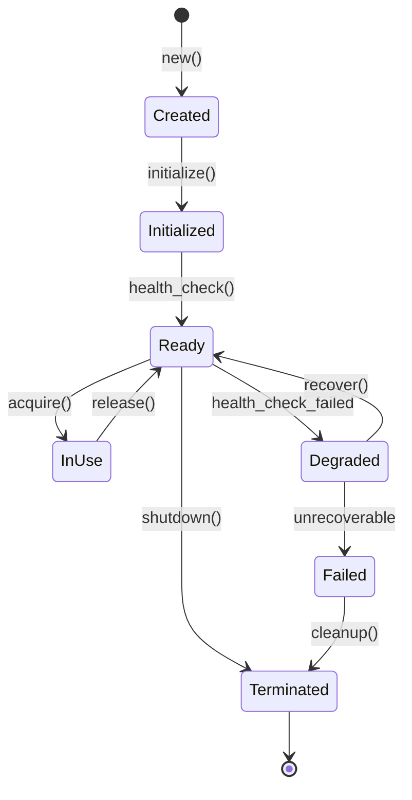
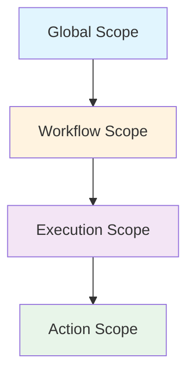
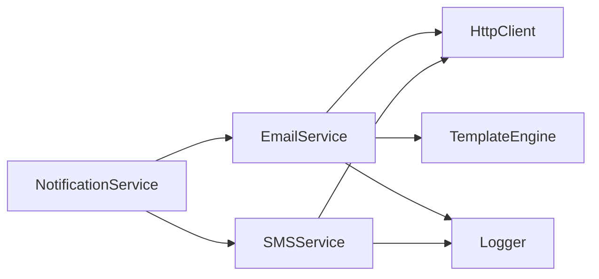

# Basic Concepts

## What is a Resource?

**Resource** - это управляемый внешний сервис или компонент, который используется в workflow для выполнения действий.

### Core Characteristics

1. **Managed Lifecycle** - Автоматическое создание, инициализация и очистка
2. **Reusable** - Переиспользование между actions и workflows
3. **Configurable** - Централизованная конфигурация
4. **Observable** - Встроенный мониторинг и метрики
5. **Resilient** - Обработка ошибок и восстановление

### Examples of Resources

|Type|Examples|Use Cases|
|---|---|---|
|**Databases**|PostgreSQL, MySQL, MongoDB|Data persistence|
|**Caches**|Redis, Memcached|Performance optimization|
|**Message Queues**|Kafka, RabbitMQ, SQS|Async communication|
|**HTTP Clients**|REST, GraphQL, gRPC|External APIs|
|**Storage**|S3, MinIO, GCS|File storage|
|**Observability**|Loggers, Metrics, Tracers|Monitoring|

## Resource Lifecycle



### Lifecycle Phases

#### 1. Creation Phase

```rust
// Resource создаётся с конфигурацией
let resource = DatabaseResource::new(config);
```

- Валидация конфигурации
- Получение credentials
- Выделение памяти

#### 2. Initialization Phase

```rust
// Инициализация соединений, пулов, etc.
resource.initialize().await?;
```

- Установка соединений
- Создание пулов
- Загрузка начального состояния

#### 3. Ready Phase

```rust
// Resource готов к использованию
assert!(resource.is_ready());
```

- Health check пройден
- Все зависимости доступны
- Готов принимать запросы

#### 4. Usage Phase

```rust
// Resource используется в actions
let conn = resource.acquire().await?;
// ... use connection ...
resource.release(conn).await?;
```

- Активное использование
- Сбор метрик
- Обработка ошибок

#### 5. Cleanup Phase

```rust
// Graceful shutdown
resource.shutdown().await?;
```

- Завершение активных операций
- Освобождение ресурсов
- Сохранение состояния

## Resource Scoping

Scoping определяет область видимости и время жизни ресурса.

### Scope Levels



#### Global Scope

```rust
#[resource(lifecycle = "global")]
pub struct HttpClientResource;
```

|Aspect|Description|
|---|---|
|**Lifetime**|Всё приложение|
|**Sharing**|Между всеми workflows|
|**Creation**|При старте приложения|
|**Cleanup**|При shutdown приложения|
|**Examples**|HTTP clients, DB pools|
|**Memory**|Постоянное использование|

#### Workflow Scope

```rust
#[resource(lifecycle = "workflow")]
pub struct WorkflowMetricsResource;
```

|Aspect|Description|
|---|---|
|**Lifetime**|Один workflow|
|**Sharing**|Между executions workflow|
|**Creation**|При первом execution|
|**Cleanup**|При удалении workflow|
|**Examples**|Workflow логгеры, метрики|
|**Memory**|На время workflow|

#### Execution Scope

```rust
#[resource(lifecycle = "execution")]
pub struct ExecutionTracerResource;
```

|Aspect|Description|
|---|---|
|**Lifetime**|Одно выполнение|
|**Sharing**|Между actions в execution|
|**Creation**|При старте execution|
|**Cleanup**|После execution|
|**Examples**|Execution tracers|
|**Memory**|Временное использование|

#### Action Scope

```rust
#[resource(lifecycle = "action")]
pub struct TempStorageResource;
```

|Aspect|Description|
|---|---|
|**Lifetime**|Один action|
|**Sharing**|Не переиспользуется|
|**Creation**|При старте action|
|**Cleanup**|После action|
|**Examples**|Temp файлы, буферы|
|**Memory**|Минимальное|

## Resource Configuration

### Configuration Hierarchy

```
1. Code Defaults
   ↓ (lowest priority)
2. Configuration Files
   ↓
3. Environment Variables
   ↓
4. Runtime Overrides
   (highest priority)
```

### Configuration Example

```rust
// 1. Code defaults
#[derive(ResourceConfig, Default)]
pub struct DatabaseConfig {
    #[default = "localhost"]
    pub host: String,
    
    #[default = 5432]
    pub port: u16,
    
    #[default = 10]
    pub pool_size: usize,
}
```

```toml
# 2. Configuration file (database.toml)
[database]
host = "db.example.com"
port = 5432
pool_size = 20
```

```bash
# 3. Environment variables
DATABASE_HOST=prod-db.example.com
DATABASE_POOL_SIZE=50
```

```rust
// 4. Runtime override
let config = DatabaseConfig {
    host: "override.example.com".into(),
    ..Default::default()
};
```

### Configuration Validation

```rust
#[derive(ResourceConfig)]
pub struct ApiConfig {
    #[validate(url)]
    pub endpoint: String,
    
    #[validate(range = "1..=1000")]
    pub rate_limit: u32,
    
    #[validate(regex = r"^[A-Z][A-Z0-9_]*$")]
    pub api_key: String,
    
    #[validate(one_of = ["json", "xml", "protobuf"])]
    pub format: String,
}
```

## Resource Dependencies

Resources могут зависеть друг от друга, создавая граф зависимостей.

### Dependency Declaration

```rust
#[derive(Resource)]
#[resource(
    id = "email_service",
    depends_on = ["http_client", "template_engine", "logger"]
)]
pub struct EmailServiceResource;
```

### Dependency Resolution



### Circular Dependency Detection

```rust
// Система автоматически обнаруживает циклические зависимости
#[resource(depends_on = ["resource_b"])]
struct ResourceA;

#[resource(depends_on = ["resource_a"])]  // ❌ Error: Circular dependency
struct ResourceB;
```

### Dependency Injection

```rust
impl EmailServiceResource {
    async fn create(context: &ResourceContext) -> Result<Self> {
        // Автоматическое получение зависимостей
        let http = context.get_dependency::<HttpClient>().await?;
        let template = context.get_dependency::<TemplateEngine>().await?;
        let logger = context.get_dependency::<Logger>().await?;
        
        Ok(Self {
            http,
            template,
            logger,
        })
    }
}
```

## Health Monitoring

### Health States

```rust
pub enum HealthStatus {
    /// Полностью работоспособен
    Healthy,
    
    /// Частично работоспособен
    Degraded {
        reason: String,
        performance_impact: f64, // 0.0 - 1.0
    },
    
    /// Не работоспособен
    Unhealthy {
        reason: String,
        recoverable: bool,
    },
    
    /// Состояние неизвестно
    Unknown,
}
```

### Health Check Pipeline

```rust
// Многоуровневая проверка здоровья
pub struct HealthCheckPipeline {
    stages: Vec<Box<dyn HealthCheckStage>>,
}

// Примеры stages
ConnectivityCheck    // Проверка соединения
PerformanceCheck    // Проверка производительности  
CapacityCheck       // Проверка ёмкости
DependencyCheck     // Проверка зависимостей
```

### Health Check Configuration

```rust
#[derive(Clone)]
pub struct HealthCheckConfig {
    /// Интервал проверок
    pub interval: Duration,
    
    /// Timeout для проверки
    pub timeout: Duration,
    
    /// Количество неудач для перехода в unhealthy
    pub failure_threshold: u32,
    
    /// Количество успехов для восстановления
    pub success_threshold: u32,
    
    /// Включить детальные проверки
    pub detailed_checks: bool,
}
```

## Resource Pooling

### Pool Management

```rust
pub struct ResourcePool<T> {
    min_size: usize,
    max_size: usize,
    available: Vec<T>,
    in_use: HashMap<Uuid, T>,
    waiters: VecDeque<Waiter>,
}
```

### Pooling Strategies

#### FIFO (First In, First Out)

```rust
PoolStrategy::Fifo
```

- ✅ Равномерное использование
- ✅ Простая реализация
- ❌ Холодные соединения

#### LIFO (Last In, First Out)

```rust
PoolStrategy::Lifo
```

- ✅ Тёплые соединения
- ✅ Меньше idle соединений
- ❌ Неравномерное использование

#### LRU (Least Recently Used)

```rust
PoolStrategy::Lru
```

- ✅ Баланс между FIFO и LIFO
- ✅ Оптимально для кэшей
- ❌ Сложнее реализация

#### Adaptive

```rust
PoolStrategy::Adaptive
```

- ✅ Динамическая адаптация
- ✅ Оптимальная производительность
- ❌ Требует метрики

### Pool Configuration

```rust
#[derive(Clone)]
pub struct PoolConfig {
    /// Минимальный размер пула
    pub min_size: usize,
    
    /// Максимальный размер пула
    pub max_size: usize,
    
    /// Timeout ожидания ресурса
    pub acquire_timeout: Duration,
    
    /// Время жизни idle ресурса
    pub idle_timeout: Duration,
    
    /// Максимальное время жизни ресурса
    pub max_lifetime: Duration,
    
    /// Стратегия выбора ресурса
    pub strategy: PoolStrategy,
}
```

## Context Awareness

Resources автоматически получают контекст выполнения.

### Execution Context

```rust
pub struct ResourceContext {
    // Workflow context
    pub workflow_id: String,
    pub workflow_name: String,
    pub workflow_version: Version,
    
    // Execution context
    pub execution_id: String,
    pub parent_execution_id: Option<String>,
    pub attempt_number: u32,
    
    // Action context
    pub action_id: String,
    pub action_name: String,
    pub action_path: Vec<String>,
    
    // Tracing context
    pub trace_id: String,
    pub span_id: String,
    pub parent_span_id: Option<String>,
    
    // User context
    pub user_id: Option<String>,
    pub tenant_id: Option<String>,
    pub account_id: Option<String>,
    
    // Environment
    pub environment: String,
    pub region: String,
    pub deployment_tier: DeploymentTier,
}
```

### Context Injection

```rust
// Автоматическая инъекция контекста
impl ContextAware for LoggerResource {
    fn inject_context(&mut self, context: ResourceContext) {
        self.fields.insert("workflow_id", context.workflow_id);
        self.fields.insert("execution_id", context.execution_id);
        self.fields.insert("trace_id", context.trace_id);
        self.fields.insert("user_id", context.user_id);
    }
}
```

### Context Usage

```rust
// Логгер автоматически включает контекст
logger.info("Processing started");
// Output: [workflow_id=wf_123, execution_id=ex_456] Processing started

// Метрики с контекстом
metrics.increment_with_context("orders.processed");
// Tags: workflow_id, execution_id, user_id, environment
```

## Error Handling

### Error Types

```rust
#[derive(Error, Debug)]
pub enum ResourceError {
    #[error("Configuration invalid: {0}")]
    ConfigurationError(String),
    
    #[error("Initialization failed: {0}")]
    InitializationError(String),
    
    #[error("Resource unavailable: {0}")]
    UnavailableError(String),
    
    #[error("Health check failed: {0}")]
    HealthCheckError(String),
    
    #[error("Credential missing: {0}")]
    MissingCredential(String),
    
    #[error("Cleanup failed: {0}")]
    CleanupError(String),
    
    #[error("Timeout: operation took longer than {0:?}")]
    TimeoutError(Duration),
    
    #[error("Circuit breaker open")]
    CircuitBreakerOpen,
}
```

### Recovery Strategies

```rust
pub enum RecoveryStrategy {
    /// Повторить операцию
    Retry {
        max_attempts: u32,
        backoff: BackoffStrategy,
    },
    
    /// Использовать fallback
    Fallback {
        fallback_resource: String,
    },
    
    /// Перевести в карантин
    Quarantine {
        duration: Duration,
    },
    
    /// Перезапустить ресурс
    Restart,
    
    /// Игнорировать ошибку
    Ignore,
}
```

### Error Recovery Example

```rust
impl ResourceInstance for ApiClient {
    async fn handle_error(&self, error: ResourceError) -> RecoveryAction {
        match error {
            ResourceError::TimeoutError(_) => RecoveryAction::Retry {
                max_attempts: 3,
                backoff: BackoffStrategy::Exponential,
            },
            ResourceError::CircuitBreakerOpen => RecoveryAction::Fallback {
                resource: "backup_api",
            },
            ResourceError::HealthCheckError(_) => RecoveryAction::Quarantine {
                duration: Duration::from_secs(300),
            },
            _ => RecoveryAction::Fail,
        }
    }
}
```

## Stateful Resources

Some resources maintain state across workflow steps.

### State Management

```rust
#[async_trait]
pub trait StatefulResource {
    type State: Serialize + DeserializeOwned;
    
    /// Save current state
    async fn save_state(&self) -> Result<Self::State>;
    
    /// Restore from saved state
    async fn restore_state(&mut self, state: Self::State) -> Result<()>;
    
    /// State version for migration
    fn state_version() -> Version;
    
    /// Migrate state between versions
    async fn migrate_state(
        old_state: Value,
        from_version: Version,
        to_version: Version,
    ) -> Result<Self::State>;
}
```

### State Versioning

```rust
// Version 1 state
#[derive(Serialize, Deserialize)]
pub struct StateV1 {
    data: String,
}

// Version 2 state with new field
#[derive(Serialize, Deserialize)]
pub struct StateV2 {
    data: String,
    metadata: HashMap<String, Value>,
}

// Migration from V1 to V2
impl Migrate for StateV1 {
    type To = StateV2;
    
    fn migrate(self) -> Self::To {
        StateV2 {
            data: self.data,
            metadata: HashMap::new(), // Default for new field
        }
    }
}
```

## Credentials Integration

### Credential Management

```rust
// Integration with nebula-credential
#[derive(ResourceConfig)]
pub struct ApiConfig {
    pub endpoint: String,
    
    #[credential(id = "api_key")]
    pub api_key: SecretString,
    
    #[credential(id = "api_secret", optional = true)]
    pub api_secret: Option<SecretString>,
}
```

### Credential Rotation

```rust
// Автоматическая ротация credentials
impl CredentialRotationAware for ApiResource {
    async fn on_credential_rotated(
        &mut self, 
        credential_id: &str,
        new_credential: &Credential,
    ) -> Result<()> {
        if credential_id == "api_key" {
            self.client.update_auth(new_credential).await?;
            self.last_rotation = Utc::now();
        }
        Ok(())
    }
}
```

## Observability

### Built-in Metrics

```rust
pub struct ResourceMetrics {
    // Usage metrics
    pub total_acquisitions: Counter,
    pub active_instances: Gauge,
    pub acquisition_duration: Histogram,
    
    // Health metrics
    pub health_checks_total: Counter,
    pub health_check_duration: Histogram,
    pub unhealthy_duration: Gauge,
    
    // Error metrics
    pub errors_total: Counter,
    pub error_rate: Gauge,
    pub last_error: Option<Instant>,
}
```

### Tracing Integration

```rust
// Автоматическая интеграция с OpenTelemetry
#[instrument(skip(self))]
async fn acquire(&self) -> Result<ResourceGuard<T>> {
    let span = tracing::info_span!("resource.acquire");
    let _guard = span.enter();
    
    // ... acquisition logic ...
}
```

### Logging

```rust
// Structured logging с контекстом
logger.info_with_fields(
    "Resource acquired",
    json!({
        "resource_id": self.id,
        "resource_type": "database",
        "pool_size": self.pool.size(),
        "acquisition_time_ms": duration.as_millis(),
    })
);
```

## Best Practices

### 1. Resource Design

- **Single Responsibility** - Один ресурс = один сервис
- **Idempotent Operations** - Безопасные повторы
- **Graceful Degradation** - Работа при частичных сбоях

### 2. Configuration

- **Environment-Specific** - Разные настройки для dev/prod
- **Validation** - Проверка конфигурации при старте
- **Defaults** - Разумные значения по умолчанию

### 3. Error Handling

- **Specific Errors** - Точные типы ошибок
- **Recovery Plans** - Стратегии восстановления
- **Circuit Breakers** - Защита от каскадных сбоев

### 4. Monitoring

- **Health Checks** - Регулярные проверки
- **Metrics** - Сбор метрик использования
- **Alerting** - Уведомления о проблемах

### 5. Testing

- **Mock Resources** - Изоляция в тестах
- **Integration Tests** - Проверка с реальными сервисами
- **Chaos Testing** - Проверка устойчивости

## Next Steps

- [[FirstResource|Create Your First Resource]] - Пошаговое руководство
- [[How-To/CreateResource|Advanced Resource Creation]] - Продвинутые техники
- [[Patterns/ResourceLifecycle|Lifecycle Patterns]] - Паттерны управления
- [[Reference/API|API Reference]] - Полная документация API