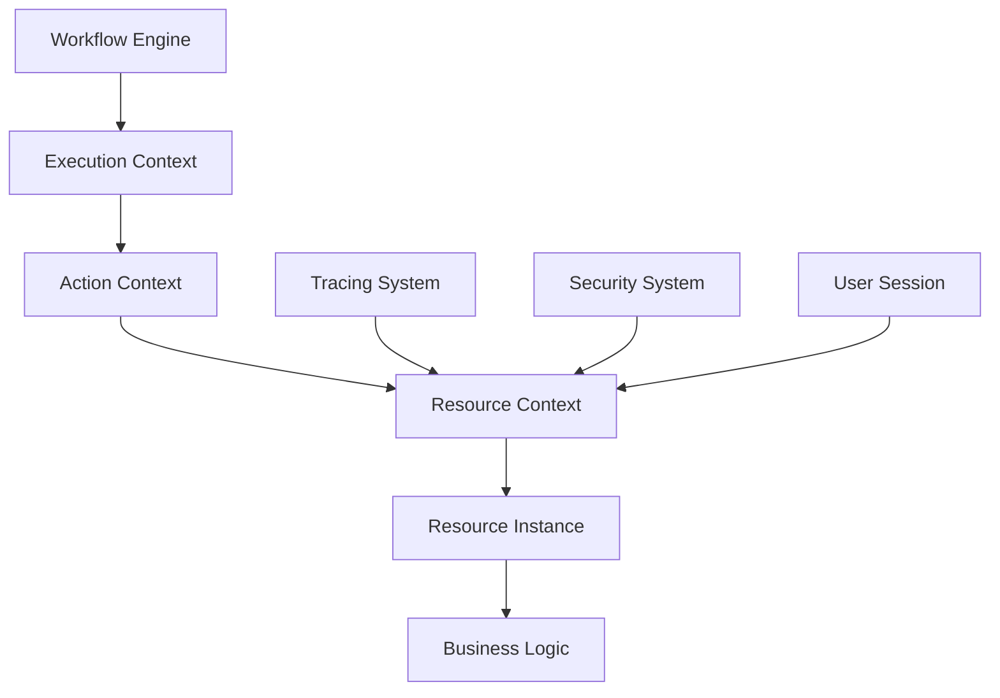

---

title: Context-Aware Resource
tags: [nebula-resource, how-to, context, observability]
status: stable
created: 2025-08-17
---

# Context-Aware Resources

> Ресурсы, автоматически адаптирующиеся к контексту выполнения

## Overview

Context-aware ресурсы автоматически получают и используют информацию о текущем workflow, execution, action для обогащения функциональности и улучшения observability.

## Understanding Context

### What is Resource Context?

```rust
#[derive(Clone, Debug)]
pub struct ResourceContext {
    // Workflow information
    pub workflow_id: String,
    pub workflow_name: String,
    pub workflow_version: Version,
    pub workflow_tags: HashMap<String, String>,
    
    // Execution information
    pub execution_id: String,
    pub parent_execution_id: Option<String>,
    pub execution_attempt: u32,
    pub execution_started_at: DateTime<Utc>,
    
    // Action information
    pub action_id: String,
    pub action_name: String,
    pub action_path: Vec<String>,
    pub action_index: usize,
    
    // Tracing information
    pub trace_id: String,
    pub span_id: String,
    pub parent_span_id: Option<String>,
    pub baggage: HashMap<String, String>,
    
    // User information
    pub user_id: Option<String>,
    pub tenant_id: Option<String>,
    pub account_id: Option<String>,
    pub session_id: Option<String>,
    
    // Environment information
    pub environment: String,
    pub region: String,
    pub availability_zone: Option<String>,
    pub deployment_id: String,
    
    // Security context
    pub auth_token: Option<SecretString>,
    pub permissions: Vec<String>,
    pub roles: Vec<String>,
    
    // Custom metadata
    pub metadata: HashMap<String, Value>,
}
```

### Context Flow



## Implementing Context Awareness

### Basic Implementation

```rust
use nebula_resource::prelude::*;

#[derive(Resource)]
#[resource(
    id = "context_logger",
    context_aware = true
)]
pub struct ContextLoggerResource;

pub struct ContextLoggerInstance {
    logger: slog::Logger,
    context: Option<ResourceContext>,
}

#[async_trait]
impl ContextAware for ContextLoggerInstance {
    fn inject_context(&mut self, context: ResourceContext) {
        // Store context
        self.context = Some(context.clone());
        
        // Enrich logger with context
        self.logger = self.logger.new(o!(
            "workflow_id" => context.workflow_id.clone(),
            "execution_id" => context.execution_id.clone(),
            "action_id" => context.action_id.clone(),
            "trace_id" => context.trace_id.clone(),
            "user_id" => context.user_id.clone(),
            "environment" => context.environment.clone(),
        ));
    }
    
    fn get_context(&self) -> Option<&ResourceContext> {
        self.context.as_ref()
    }
    
    fn clear_context(&mut self) {
        self.context = None;
        self.logger = slog::Logger::root(slog::Discard, o!());
    }
}
```

### Advanced Context Usage

```rust
pub struct AdvancedContextResource {
    client: HttpClient,
    context: Option<ResourceContext>,
    context_headers: HeaderMap,
    context_tags: HashMap<String, String>,
}

#[async_trait]
impl ContextAware for AdvancedContextResource {
    fn inject_context(&mut self, context: ResourceContext) {
        self.context = Some(context.clone());
        
        // Prepare HTTP headers for tracing
        self.context_headers = HeaderMap::new();
        self.context_headers.insert(
            "X-Trace-Id",
            context.trace_id.parse().unwrap()
        );
        self.context_headers.insert(
            "X-Span-Id",
            context.span_id.parse().unwrap()
        );
        self.context_headers.insert(
            "X-Workflow-Id",
            context.workflow_id.parse().unwrap()
        );
        self.context_headers.insert(
            "X-User-Id",
            context.user_id.unwrap_or_default().parse().unwrap()
        );
        
        // Prepare tags for metrics
        self.context_tags = HashMap::new();
        self.context_tags.insert("workflow".into(), context.workflow_name.clone());
        self.context_tags.insert("environment".into(), context.environment.clone());
        self.context_tags.insert("region".into(), context.region.clone());
        
        if let Some(tenant) = &context.tenant_id {
            self.context_tags.insert("tenant".into(), tenant.clone());
        }
    }
}

impl AdvancedContextResource {
    pub async fn make_request(&self, url: &str) -> Result<Response> {
        let mut request = self.client.get(url);
        
        // Add context headers
        for (key, value) in &self.context_headers {
            request = request.header(key, value);
        }
        
        // Add baggage
        if let Some(context) = &self.context {
            for (key, value) in &context.baggage {
                request = request.header(
                    format!("X-Baggage-{}", key),
                    value
                );
            }
        }
        
        let response = request.send().await?;
        
        // Record metrics with context
        self.record_metrics(&response);
        
        Ok(response)
    }
    
    fn record_metrics(&self, response: &Response) {
        metrics::histogram!(
            "http.request.duration",
            response.elapsed().as_millis() as f64,
            &self.context_tags
        );
        
        metrics::increment!(
            "http.request.count",
            &self.context_tags
        );
        
        if !response.status().is_success() {
            metrics::increment!(
                "http.request.errors",
                &self.context_tags
            );
        }
    }
}
```

## Context Propagation

### Automatic Propagation

```rust
pub struct ContextPropagator {
    extractors: Vec<Box<dyn ContextExtractor>>,
    injectors: Vec<Box<dyn ContextInjector>>,
}

impl ContextPropagator {
    pub async fn propagate<T: ContextAware>(
        &self,
        source: &ExecutionContext,
        target: &mut T,
    ) -> Result<()> {
        // Extract context from multiple sources
        let mut context = ResourceContext::default();
        
        for extractor in &self.extractors {
            extractor.extract(source, &mut context).await?;
        }
        
        // Inject into target
        target.inject_context(context.clone());
        
        // Run injectors for side effects
        for injector in &self.injectors {
            injector.inject(&context).await?;
        }
        
        Ok(())
    }
}

// OpenTelemetry context extractor
pub struct OpenTelemetryExtractor;

#[async_trait]
impl ContextExtractor for OpenTelemetryExtractor {
    async fn extract(
        &self,
        source: &ExecutionContext,
        context: &mut ResourceContext,
    ) -> Result<()> {
        let span = tracing::Span::current();
        
        context.trace_id = span.id()
            .map(|id| format!("{:x}", id))
            .unwrap_or_else(|| Uuid::new_v4().to_string());
        
        context.span_id = Uuid::new_v4().to_string();
        
        // Extract baggage
        if let Some(baggage) = source.get_baggage() {
            context.baggage = baggage.items().collect();
        }
        
        Ok(())
    }
}
```

### Cross-Service Propagation

```rust
pub struct CrossServicePropagator {
    format: PropagationFormat,
}

pub enum PropagationFormat {
    W3CTraceContext,
    B3,
    Jaeger,
    Custom(Box<dyn Propagator>),
}

impl CrossServicePropagator {
    pub fn inject_headers(&self, context: &ResourceContext) -> HeaderMap {
        match &self.format {
            PropagationFormat::W3CTraceContext => {
                let mut headers = HeaderMap::new();
                
                // W3C Trace Context format
                let traceparent = format!(
                    "00-{}-{}-01",
                    context.trace_id,
                    context.span_id
                );
                headers.insert("traceparent", traceparent.parse().unwrap());
                
                // Add tracestate if needed
                if !context.baggage.is_empty() {
                    let tracestate = context.baggage.iter()
                        .map(|(k, v)| format!("{}={}", k, v))
                        .collect::<Vec<_>>()
                        .join(",");
                    headers.insert("tracestate", tracestate.parse().unwrap());
                }
                
                headers
            }
            PropagationFormat::B3 => {
                let mut headers = HeaderMap::new();
                
                // B3 format (Zipkin)
                headers.insert("X-B3-TraceId", context.trace_id.parse().unwrap());
                headers.insert("X-B3-SpanId", context.span_id.parse().unwrap());
                
                if let Some(parent) = &context.parent_span_id {
                    headers.insert("X-B3-ParentSpanId", parent.parse().unwrap());
                }
                
                headers.insert("X-B3-Sampled", "1".parse().unwrap());
                
                headers
            }
            PropagationFormat::Jaeger => {
                let mut headers = HeaderMap::new();
                
                // Jaeger format
                let uber_trace_id = format!(
                    "{}:{}:{}:1",
                    context.trace_id,
                    context.span_id,
                    context.parent_span_id.as_ref().unwrap_or(&"0".to_string())
                );
                headers.insert("uber-trace-id", uber_trace_id.parse().unwrap());
                
                // Add baggage
                for (key, value) in &context.baggage {
                    headers.insert(
                        format!("uberctx-{}", key),
                        value.parse().unwrap()
                    );
                }
                
                headers
            }
            PropagationFormat::Custom(propagator) => {
                propagator.inject(context)
            }
        }
    }
    
    pub fn extract_context(&self, headers: &HeaderMap) -> ResourceContext {
        match &self.format {
            PropagationFormat::W3CTraceContext => {
                self.extract_w3c_context(headers)
            }
            PropagationFormat::B3 => {
                self.extract_b3_context(headers)
            }
            PropagationFormat::Jaeger => {
                self.extract_jaeger_context(headers)
            }
            PropagationFormat::Custom(propagator) => {
                propagator.extract(headers)
            }
        }
    }
}
```

## Context Enrichment

### Dynamic Context Enrichment

```rust
pub struct ContextEnricher {
    enrichers: Vec<Box<dyn Enricher>>,
}

#[async_trait]
pub trait Enricher: Send + Sync {
    async fn enrich(&self, context: &mut ResourceContext) -> Result<()>;
}

// User information enricher
pub struct UserEnricher {
    user_service: Arc<UserService>,
}

#[async_trait]
impl Enricher for UserEnricher {
    async fn enrich(&self, context: &mut ResourceContext) -> Result<()> {
        if let Some(user_id) = &context.user_id {
            let user_info = self.user_service.get_user(user_id).await?;
            
            context.metadata.insert(
                "user_email".into(),
                json!(user_info.email)
            );
            context.metadata.insert(
                "user_tier".into(),
                json!(user_info.tier)
            );
            context.roles = user_info.roles;
            context.permissions = user_info.permissions;
        }
        
        Ok(())
    }
}

// Geographic enricher
pub struct GeoEnricher {
    geo_service: Arc<GeoService>,
}

#[async_trait]
impl Enricher for GeoEnricher {
    async fn enrich(&self, context: &mut ResourceContext) -> Result<()> {
        // Get IP from execution context
        if let Some(ip) = context.metadata.get("client_ip") {
            let location = self.geo_service.lookup(ip.as_str().unwrap()).await?;
            
            context.metadata.insert(
                "country".into(),
                json!(location.country)
            );
            context.metadata.insert(
                "city".into(),
                json!(location.city)
            );
            context.metadata.insert(
                "coordinates".into(),
                json!({
                    "lat": location.latitude,
                    "lon": location.longitude
                })
            );
        }
        
        Ok(())
    }
}
```

### Conditional Context

```rust
pub struct ConditionalContext {
    base_context: ResourceContext,
    conditions: Vec<ContextCondition>,
}

pub struct ContextCondition {
    predicate: Box<dyn Fn(&ResourceContext) -> bool>,
    modifier: Box<dyn Fn(&mut ResourceContext)>,
}

impl ConditionalContext {
    pub fn evaluate(&self) -> ResourceContext {
        let mut context = self.base_context.clone();
        
        for condition in &self.conditions {
            if (condition.predicate)(&context) {
                (condition.modifier)(&mut context);
            }
        }
        
        context
    }
    
    pub fn with_condition<P, M>(mut self, predicate: P, modifier: M) -> Self
    where
        P: Fn(&ResourceContext) -> bool + 'static,
        M: Fn(&mut ResourceContext) + 'static,
    {
        self.conditions.push(ContextCondition {
            predicate: Box::new(predicate),
            modifier: Box::new(modifier),
        });
        self
    }
}

// Usage
let context = ConditionalContext::new(base_context)
    .with_condition(
        |ctx| ctx.environment == "production",
        |ctx| {
            ctx.metadata.insert("strict_mode".into(), json!(true));
            ctx.metadata.insert("sampling_rate".into(), json!(0.1));
        }
    )
    .with_condition(
        |ctx| ctx.user_id.is_some(),
        |ctx| {
            ctx.metadata.insert("personalized".into(), json!(true));
        }
    )
    .evaluate();
```

## Use Cases

### 1. Distributed Tracing

```rust
pub struct TracedHttpClient {
    client: reqwest::Client,
    context: Option<ResourceContext>,
}

impl TracedHttpClient {
    pub async fn request(&self, method: Method, url: &str) -> Result<Response> {
        let span = if let Some(ctx) = &self.context {
            tracing::info_span!(
                "http.request",
                trace_id = %ctx.trace_id,
                span_id = %ctx.span_id,
                workflow_id = %ctx.workflow_id,
                user_id = ?ctx.user_id,
            )
        } else {
            tracing::info_span!("http.request")
        };
        
        let _guard = span.enter();
        
        let mut request = self.client.request(method, url);
        
        // Add tracing headers
        if let Some(ctx) = &self.context {
            request = request
                .header("X-Trace-Id", &ctx.trace_id)
                .header("X-Span-Id", &ctx.span_id);
        }
        
        let response = request.send().await?;
        
        tracing::info!(
            status = response.status().as_u16(),
            "Request completed"
        );
        
        Ok(response)
    }
}
```

### 2. Audit Logging

```rust
pub struct AuditLogger {
    context: Option<ResourceContext>,
    writer: Arc<dyn AuditWriter>,
}

impl AuditLogger {
    pub async fn log_action(&self, action: &str, details: Value) -> Result<()> {
        let entry = AuditEntry {
            timestamp: Utc::now(),
            action: action.to_string(),
            details,
            // Context information
            workflow_id: self.context.as_ref().map(|c| c.workflow_id.clone()),
            execution_id: self.context.as_ref().map(|c| c.execution_id.clone()),
            user_id: self.context.as_ref().and_then(|c| c.user_id.clone()),
            tenant_id: self.context.as_ref().and_then(|c| c.tenant_id.clone()),
            trace_id: self.context.as_ref().map(|c| c.trace_id.clone()),
            // Security context
            roles: self.context.as_ref().map(|c| c.roles.clone()).unwrap_or_default(),
            permissions: self.context.as_ref().map(|c| c.permissions.clone()).unwrap_or_default(),
            // Environment
            environment: self.context.as_ref().map(|c| c.environment.clone()),
            region: self.context.as_ref().map(|c| c.region.clone()),
            // Custom metadata
            metadata: self.context.as_ref().map(|c| c.metadata.clone()).unwrap_or_default(),
        };
        
        self.writer.write(entry).await
    }
}
```

### 3. Personalized Caching

```rust
pub struct ContextualCache {
    cache: Arc<dyn CacheBackend>,
    context: Option<ResourceContext>,
}

impl ContextualCache {
    pub async fn get<T: DeserializeOwned>(&self, key: &str) -> Option<T> {
        let contextual_key = self.build_contextual_key(key);
        self.cache.get(&contextual_key).await
    }
    
    pub async fn set<T: Serialize>(&self, key: &str, value: &T, ttl: Duration) -> Result<()> {
        let contextual_key = self.build_contextual_key(key);
        
        // Adjust TTL based on context
        let adjusted_ttl = self.adjust_ttl(ttl);
        
        self.cache.set(&contextual_key, value, adjusted_ttl).await
    }
    
    fn build_contextual_key(&self, base_key: &str) -> String {
        if let Some(ctx) = &self.context {
            let mut key_parts = vec![base_key.to_string()];
            
            // Add user-specific prefix for personalized caching
            if let Some(user_id) = &ctx.user_id {
                key_parts.push(format!("user:{}", user_id));
            }
            
            // Add tenant for multi-tenancy
            if let Some(tenant_id) = &ctx.tenant_id {
                key_parts.push(format!("tenant:{}", tenant_id));
            }
            
            // Add environment to prevent cache pollution
            key_parts.push(format!("env:{}", ctx.environment));
            
            key_parts.join(":")
        } else {
            base_key.to_string()
        }
    }
    
    fn adjust_ttl(&self, base_ttl: Duration) -> Duration {
        if let Some(ctx) = &self.context {
            // Shorter TTL in development
            if ctx.environment == "development" {
                return Duration::from_secs(60);
            }
            
            // Longer TTL for authenticated users
            if ctx.user_id.is_some() {
                return base_ttl * 2;
            }
        }
        
        base_ttl
    }
}
```

### 4. Multi-Tenant Database

```rust
pub struct TenantAwareDatabase {
    pool: PgPool,
    context: Option<ResourceContext>,
}

impl TenantAwareDatabase {
    pub async fn query<T>(&self, sql: &str) -> Result<Vec<T>> 
    where
        T: for<'r> FromRow<'r, PgRow>,
    {
        let tenant_id = self.context
            .as_ref()
            .and_then(|c| c.tenant_id.as_ref())
            .ok_or_else(|| anyhow!("Tenant ID required"))?;
        
        // Add tenant filter to query
        let tenant_sql = self.add_tenant_filter(sql, tenant_id);
        
        // Set session variable for row-level security
        let mut conn = self.pool.acquire().await?;
        sqlx::query(&format!("SET app.tenant_id = '{}'", tenant_id))
            .execute(&mut conn)
            .await?;
        
        // Execute query
        let rows = sqlx::query_as::<_, T>(&tenant_sql)
            .fetch_all(&mut conn)
            .await?;
        
        Ok(rows)
    }
    
    fn add_tenant_filter(&self, sql: &str, tenant_id: &str) -> String {
        // Simple implementation - in production use proper SQL parser
        if sql.contains("WHERE") {
            format!("{} AND tenant_id = '{}'", sql, tenant_id)
        } else {
            format!("{} WHERE tenant_id = '{}'", sql, tenant_id)
        }
    }
}
```

## Best Practices

### 1. Context Design

```rust
// DO: Keep context immutable after injection
pub struct GoodResource {
    context: Arc<ResourceContext>, // Immutable reference
}

// DON'T: Allow context mutation
pub struct BadResource {
    context: ResourceContext, // Mutable, can lead to inconsistencies
}
```

### 2. Context Propagation

```rust
// DO: Propagate only necessary context
pub fn filter_context(context: &ResourceContext) -> ResourceContext {
    ResourceContext {
        trace_id: context.trace_id.clone(),
        span_id: Uuid::new_v4().to_string(), // New span
        parent_span_id: Some(context.span_id.clone()),
        workflow_id: context.workflow_id.clone(),
        user_id: context.user_id.clone(),
        // Don't propagate sensitive data
        auth_token: None,
        ..Default::default()
    }
}

// DON'T: Blindly propagate everything
pub fn bad_propagation(context: &ResourceContext) -> ResourceContext {
    context.clone() // May leak sensitive data
}
```

### 3. Performance Considerations

```rust
// DO: Lazy context evaluation
pub struct LazyContextResource {
    context_provider: Arc<dyn Fn() -> ResourceContext>,
}

impl LazyContextResource {
    fn get_context(&self) -> ResourceContext {
        (self.context_provider)() // Evaluate only when needed
    }
}

// DON'T: Eager context loading
pub struct EagerContextResource {
    context: ResourceContext, // Loaded even if not used
}
```

### 4. Testing Context-Aware Resources

```rust
#[cfg(test)]
mod tests {
    use super::*;
    
    #[tokio::test]
    async fn test_context_injection() {
        let mut resource = create_resource();
        
        let context = ResourceContext {
            workflow_id: "test_workflow".into(),
            execution_id: "test_execution".into(),
            trace_id: "test_trace".into(),
            ..Default::default()
        };
        
        resource.inject_context(context.clone());
        
        assert_eq!(
            resource.get_context().unwrap().workflow_id,
            "test_workflow"
        );
    }
    
    #[tokio::test]
    async fn test_context_propagation() {
        let propagator = ContextPropagator::new();
        
        let context = create_test_context();
        let headers = propagator.inject_headers(&context);
        
        assert!(headers.contains_key("traceparent"));
        
        let extracted = propagator.extract_context(&headers);
        assert_eq!(extracted.trace_id, context.trace_id);
    }
}
```

## Complete Example

```rust
use nebula_resource::prelude::*;

// Context-aware metrics collector
#[derive(Resource)]
#[resource(
    id = "contextual_metrics",
    context_aware = true
)]
pub struct ContextualMetricsResource;

pub struct ContextualMetricsInstance {
    client: MetricsClient,
    context: Option<ResourceContext>,
    base_tags: HashMap<String, String>,
}

#[async_trait]
impl ContextAware for ContextualMetricsInstance {
    fn inject_context(&mut self, context: ResourceContext) {
        self.context = Some(context.clone());
        
        // Build base tags from context
        self.base_tags.clear();
        self.base_tags.insert("workflow".into(), context.workflow_name);
        self.base_tags.insert("environment".into(), context.environment);
        self.base_tags.insert("region".into(), context.region);
        
        if let Some(tenant) = context.tenant_id {
            self.base_tags.insert("tenant".into(), tenant);
        }
        
        if let Some(user) = context.user_id {
            // Hash user ID for privacy
            let hashed = hash_user_id(&user);
            self.base_tags.insert("user_hash".into(), hashed);
        }
    }
}

impl ContextualMetricsInstance {
    pub fn record_metric(
        &self,
        name: &str,
        value: f64,
        additional_tags: Option<HashMap<String, String>>,
    ) {
        let mut tags = self.base_tags.clone();
        
        // Add execution context
        if let Some(ctx) = &self.context {
            tags.insert("execution_id".into(), ctx.execution_id.clone());
            tags.insert("action".into(), ctx.action_name.clone());
        }
        
        // Merge additional tags
        if let Some(additional) = additional_tags {
            tags.extend(additional);
        }
        
        self.client.record(name, value, tags);
    }
    
    pub fn increment(&self, name: &str) {
        self.record_metric(name, 1.0, None);
    }
    
    pub fn histogram(&self, name: &str, value: f64) {
        self.record_metric(name, value, None);
    }
    
    pub fn gauge(&self, name: &str, value: f64) {
        self.record_metric(name, value, None);
    }
}

// Usage in action
#[derive(Action)]
struct ProcessOrderAction {
    order_id: String,
}

#[async_trait]
impl ActionHandler for ProcessOrderAction {
    type Output = OrderResult;
    
    async fn execute(&self, ctx: &ExecutionContext) -> Result<Self::Output> {
        let metrics = ctx.resource::<ContextualMetricsInstance>("metrics").await?;
        
        // Metrics automatically include all context
        metrics.increment("order.processing.started");
        
        let start = Instant::now();
        let result = process_order(&self.order_id).await?;
        
        metrics.histogram(
            "order.processing.duration",
            start.elapsed().as_millis() as f64,
        );
        
        metrics.record_metric(
            "order.value",
            result.total_amount,
            Some(HashMap::from([
                ("currency".into(), result.currency.clone()),
                ("payment_method".into(), result.payment_method.clone()),
            ])),
        );
        
        Ok(result)
    }
}
```

## Next Steps

- [[ResourceScoping|Resource Scoping Strategies]]
- [[HealthChecks|Health Monitoring with Context]]
- [[Examples/ContextAwareLogger|Context Logger Example]]
- [[Patterns/StateManagement|State Management Patterns]]