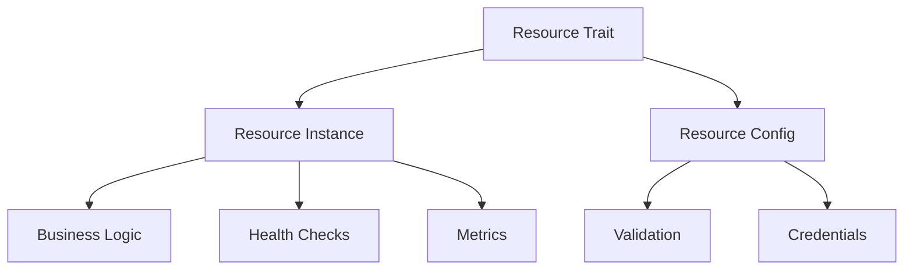

---

title: Create Custom Resource
tags: [nebula-resource, how-to, custom, guide]
status: stable
created: 2025-08-17
---


## Resource Architecture

### Resource Components



### Design Principles

1. **Single Responsibility** - Один ресурс = один сервис
2. **Dependency Injection** - Явные зависимости
3. **Configuration as Code** - Версионируемая конфигурация
4. **Observability First** - Встроенные метрики и логирование
5. **Failure Resilience** - Graceful degradation

## Using Derive Macros

### Basic Derive

```rust
use nebula_resource::prelude::*;

#[derive(Resource)]
#[resource(
    id = "my_service",
    name = "My Custom Service",
    lifecycle = "global"
)]
pub struct MyServiceResource;
```

### Advanced Derive Options

```rust
#[derive(Resource)]
#[resource(
    // Metadata
    id = "advanced_service",
    name = "Advanced Service",
    description = "Service with advanced features",
    version = "2.0.0",
    
    // Lifecycle
    lifecycle = "workflow",
    pooled = true,
    pool_size = "min:5,max:20",
    
    // Capabilities
    capabilities = ["read", "write", "stream"],
    tags = ["database", "critical"],
    
    // Dependencies
    depends_on = ["logger", "metrics"],
    credentials = ["api_key", "api_secret"],
    
    // Health checks
    health_check_interval = "30s",
    health_check_timeout = "5s",
    
    // Circuit breaker
    circuit_breaker = true,
    failure_threshold = 5,
    recovery_timeout = "60s",
    
    // Observability
    metrics = true,
    tracing = true,
    
    // Auto-generation
    auto_mock = true,
    auto_builder = true
)]
pub struct AdvancedServiceResource;
```

### Generated Code

Макрос генерирует:

```rust
// Auto-generated implementation
impl Resource for AdvancedServiceResource {
    type Config = AdvancedServiceConfig;
    type Instance = AdvancedServiceInstance;
    
    fn metadata() -> ResourceMetadata {
        ResourceMetadata {
            id: "advanced_service".into(),
            name: "Advanced Service".into(),
            // ... other fields
        }
    }
    
    // ... other methods
}

// Auto-generated builder
pub struct AdvancedServiceBuilder {
    config: AdvancedServiceConfig,
}

impl AdvancedServiceBuilder {
    pub fn new() -> Self { /* ... */ }
    pub fn with_endpoint(mut self, endpoint: String) -> Self { /* ... */ }
    pub fn with_timeout(mut self, timeout: Duration) -> Self { /* ... */ }
    pub fn build(self) -> AdvancedServiceResource { /* ... */ }
}

// Auto-generated mock
#[cfg(test)]
pub struct MockAdvancedServiceResource {
    // ... mock implementation
}
```

## Advanced Configuration

### Multi-tier Configuration

```rust
#[derive(ResourceConfig)]
pub struct ServiceConfig {
    // Basic configuration
    #[validate(url)]
    pub endpoint: String,
    
    // Tier-specific configuration
    #[tier(personal = "10", professional = "100", enterprise = "1000")]
    pub rate_limit: u32,
    
    #[tier(personal = "disabled", professional = "optional", enterprise = "required")]
    pub advanced_features: FeatureSet,
    
    // Environment-specific
    #[env(development = "http://localhost:8080", production = "${SERVICE_URL}")]
    pub service_url: String,
    
    // Secret management
    #[credential(id = "service_api_key", rotation = "30d")]
    pub api_key: SecretString,
    
    // Complex validation
    #[validate(custom = "validate_connection_string")]
    pub connection_string: String,
    
    // Default with factory
    #[default_factory = "default_retry_policy")]
    pub retry_policy: RetryPolicy,
}

// Custom validation
fn validate_connection_string(value: &str) -> Result<(), ValidationError> {
    if !value.starts_with("postgres://") && !value.starts_with("mysql://") {
        return Err(ValidationError::new("Invalid connection string format"));
    }
    Ok(())
}

// Default factory
fn default_retry_policy() -> RetryPolicy {
    RetryPolicy {
        max_attempts: 3,
        initial_delay: Duration::from_millis(100),
        max_delay: Duration::from_secs(10),
        multiplier: 2.0,
        jitter: true,
    }
}
```

### Configuration Loading

```rust
// Load from multiple sources
let config = ServiceConfig::load()
    .from_file("config/service.toml")      // 1. File
    .from_env_prefix("SERVICE_")           // 2. Environment
    .from_consul("service/config")         // 3. Consul
    .from_vault("secret/service")          // 4. Vault
    .with_overrides(overrides)             // 5. Runtime overrides
    .validate()                             // 6. Validation
    .await?;
```

### Dynamic Configuration

```rust
pub struct DynamicConfig {
    base: ServiceConfig,
    watcher: ConfigWatcher,
}

impl DynamicConfig {
    pub async fn watch_for_changes(&mut self) -> Result<()> {
        let mut stream = self.watcher.changes().await?;
        
        while let Some(change) = stream.next().await {
            match change {
                ConfigChange::Updated(new_config) => {
                    self.apply_update(new_config).await?;
                }
                ConfigChange::Deleted(key) => {
                    self.apply_default(key).await?;
                }
            }
        }
        
        Ok(())
    }
    
    async fn apply_update(&mut self, new_config: Value) -> Result<()> {
        // Validate new configuration
        let validated = ServiceConfig::from_value(new_config)?;
        
        // Apply without service interruption
        self.base = validated;
        
        // Notify resource instances
        self.notify_instances().await?;
        
        Ok(())
    }
}
```

## Error Handling

### Custom Error Types

```rust
#[derive(Debug, thiserror::Error)]
pub enum ServiceError {
    #[error("Connection failed: {0}")]
    ConnectionError(String),
    
    #[error("Authentication failed")]
    AuthError(#[from] AuthError),
    
    #[error("Rate limit exceeded: retry after {retry_after:?}")]
    RateLimitError { retry_after: Duration },
    
    #[error("Service unavailable: {reason}")]
    ServiceUnavailable { reason: String },
    
    #[error("Invalid request: {details}")]
    InvalidRequest { details: String },
    
    #[error(transparent)]
    Other(#[from] anyhow::Error),
}

impl ServiceError {
    pub fn is_retriable(&self) -> bool {
        matches!(self, 
            ServiceError::ConnectionError(_) | 
            ServiceError::RateLimitError { .. } |
            ServiceError::ServiceUnavailable { .. }
        )
    }
    
    pub fn retry_after(&self) -> Option<Duration> {
        match self {
            ServiceError::RateLimitError { retry_after } => Some(*retry_after),
            _ => None,
        }
    }
}
```

### Error Recovery

```rust
pub struct ErrorRecovery {
    strategy: RecoveryStrategy,
    circuit_breaker: CircuitBreaker,
}

impl ErrorRecovery {
    pub async fn execute_with_recovery<F, T>(
        &self,
        operation: F,
    ) -> Result<T, ServiceError>
    where
        F: Fn() -> Future<Output = Result<T, ServiceError>>,
    {
        let mut attempts = 0;
        let mut last_error = None;
        
        loop {
            // Check circuit breaker
            if self.circuit_breaker.is_open() {
                return Err(ServiceError::ServiceUnavailable {
                    reason: "Circuit breaker is open".into(),
                });
            }
            
            // Try operation
            match operation().await {
                Ok(result) => {
                    self.circuit_breaker.record_success();
                    return Ok(result);
                }
                Err(error) => {
                    self.circuit_breaker.record_failure();
                    
                    if !error.is_retriable() || attempts >= self.strategy.max_attempts {
                        return Err(error);
                    }
                    
                    // Calculate backoff
                    let delay = self.strategy.calculate_backoff(attempts);
                    
                    // Apply jitter if configured
                    let delay = if self.strategy.jitter {
                        self.add_jitter(delay)
                    } else {
                        delay
                    };
                    
                    tokio::time::sleep(delay).await;
                    
                    attempts += 1;
                    last_error = Some(error);
                }
            }
        }
    }
}
```

## Performance Optimization

### Connection Pooling

```rust
pub struct OptimizedPool<T> {
    // Sharded pools for reduced contention
    shards: Vec<Arc<Mutex<PoolShard<T>>>>,
    
    // Adaptive sizing
    sizing_strategy: AdaptiveSizing,
    
    // Warm connections
    warmer: ConnectionWarmer<T>,
    
    // Metrics
    metrics: PoolMetrics,
}

impl<T: PoolableResource> OptimizedPool<T> {
    pub async fn acquire(&self) -> Result<PooledConnection<T>> {
        // Select shard based on thread ID for cache locality
        let shard_id = thread_id() % self.shards.len();
        let shard = &self.shards[shard_id];
        
        // Try fast path (no lock)
        if let Some(conn) = shard.try_acquire_fast() {
            self.metrics.record_fast_acquisition();
            return Ok(conn);
        }
        
        // Slow path with lock
        let mut shard = shard.lock().await;
        
        // Check if we need to grow
        if shard.should_grow() {
            self.grow_shard(&mut shard).await?;
        }
        
        // Acquire connection
        match shard.acquire_with_timeout(Duration::from_secs(5)).await {
            Ok(conn) => {
                self.metrics.record_acquisition();
                Ok(conn)
            }
            Err(_) => {
                self.metrics.record_timeout();
                Err(PoolError::Timeout)
            }
        }
    }
    
    async fn grow_shard(&self, shard: &mut PoolShard<T>) -> Result<()> {
        let target_size = self.sizing_strategy.calculate_target_size(
            shard.current_size(),
            shard.pending_requests(),
            self.metrics.recent_load(),
        );
        
        for _ in shard.current_size()..target_size {
            let conn = T::create().await?;
            shard.add(conn);
        }
        
        Ok(())
    }
}
```

### Caching Strategy

```rust
pub struct SmartCache<K, V> {
    // Multi-layer cache
    l1_cache: Arc<DashMap<K, CachedValue<V>>>,  // In-memory
    l2_cache: Arc<RedisCache>,                   // Redis
    l3_cache: Arc<S3Cache>,                      // S3 for large objects
    
    // Cache strategy
    strategy: CacheStrategy,
    
    // Metrics
    metrics: CacheMetrics,
}

impl<K: CacheKey, V: CacheValue> SmartCache<K, V> {
    pub async fn get(&self, key: &K) -> Option<V> {
        // Check L1 cache
        if let Some(value) = self.l1_cache.get(key) {
            if !value.is_expired() {
                self.metrics.record_l1_hit();
                return Some(value.clone());
            }
        }
        
        // Check L2 cache
        if let Some(value) = self.l2_cache.get(key).await {
            self.metrics.record_l2_hit();
            
            // Promote to L1
            self.l1_cache.insert(key.clone(), value.clone());
            
            return Some(value);
        }
        
        // Check L3 cache for large objects
        if V::size_hint() > LARGE_OBJECT_THRESHOLD {
            if let Some(value) = self.l3_cache.get(key).await {
                self.metrics.record_l3_hit();
                
                // Promote to L2 and L1
                self.l2_cache.set(key, &value).await;
                self.l1_cache.insert(key.clone(), value.clone());
                
                return Some(value);
            }
        }
        
        self.metrics.record_miss();
        None
    }
    
    pub async fn set(&self, key: K, value: V) {
        let cached = CachedValue::new(value, self.strategy.ttl());
        
        // Always set in L1
        self.l1_cache.insert(key.clone(), cached.clone());
        
        // Set in L2 based on access patterns
        if self.strategy.should_cache_l2(&key) {
            self.l2_cache.set(&key, &cached).await;
        }
        
        // Set in L3 for large objects
        if V::size_hint() > LARGE_OBJECT_THRESHOLD {
            self.l3_cache.set(&key, &cached).await;
        }
    }
}
```

### Batch Processing

```rust
pub struct BatchProcessor<T> {
    batch_size: usize,
    batch_timeout: Duration,
    pending: Arc<Mutex<Vec<T>>>,
    processor: Arc<dyn BatchHandler<T>>,
}

impl<T: Send + 'static> BatchProcessor<T> {
    pub async fn add(&self, item: T) -> Result<()> {
        let mut pending = self.pending.lock().await;
        pending.push(item);
        
        if pending.len() >= self.batch_size {
            let batch = std::mem::take(&mut *pending);
            drop(pending); // Release lock before processing
            
            self.process_batch(batch).await?;
        }
        
        Ok(())
    }
    
    pub async fn start_background_processor(&self) {
        let pending = Arc::clone(&self.pending);
        let processor = Arc::clone(&self.processor);
        let timeout = self.batch_timeout;
        
        tokio::spawn(async move {
            let mut interval = tokio::time::interval(timeout);
            
            loop {
                interval.tick().await;
                
                let mut pending = pending.lock().await;
                if !pending.is_empty() {
                    let batch = std::mem::take(&mut *pending);
                    drop(pending);
                    
                    if let Err(e) = processor.process(batch).await {
                        log::error!("Batch processing failed: {}", e);
                    }
                }
            }
        });
    }
    
    async fn process_batch(&self, batch: Vec<T>) -> Result<()> {
        self.processor.process(batch).await
    }
}
```

## Testing Strategies

### Property-Based Testing

```rust
#[cfg(test)]
mod tests {
    use proptest::prelude::*;
    
    proptest! {
        #[test]
        fn test_config_validation(
            endpoint in "https?://[a-z]+\\.[a-z]+",
            timeout in 1u64..3600u64,
            rate_limit in 1u32..10000u32,
        ) {
            let config = ServiceConfig {
                endpoint,
                timeout_secs: timeout,
                rate_limit,
                ..Default::default()
            };
            
            assert!(config.validate().is_ok());
        }
        
        #[test]
        fn test_pool_consistency(
            operations in prop::collection::vec(pool_operation_strategy(), 0..100)
        ) {
            let pool = OptimizedPool::new();
            
            for op in operations {
                match op {
                    PoolOp::Acquire => {
                        let _ = pool.acquire();
                    }
                    PoolOp::Release(conn) => {
                        pool.release(conn);
                    }
                }
            }
            
            assert!(pool.is_consistent());
        }
    }
}
```

### Chaos Testing

```rust
#[cfg(test)]
mod chaos_tests {
    use chaos::prelude::*;
    
    #[tokio::test]
    async fn test_resource_resilience() {
        let chaos = ChaosEngine::new()
            .with_failure_rate(0.1)  // 10% failure rate
            .with_latency(Duration::from_millis(100)..Duration::from_secs(5))
            .with_network_partition(0.05);  // 5% network partition
        
        let resource = create_resource_with_chaos(chaos);
        
        // Run 1000 operations
        let mut success = 0;
        let mut failure = 0;
        
        for _ in 0..1000 {
            match resource.operation().await {
                Ok(_) => success += 1,
                Err(_) => failure += 1,
            }
        }
        
        // Should handle at least 90% of requests despite chaos
        assert!(success > 900);
        
        // Should not crash
        assert!(resource.health_check().await.is_ok());
    }
}
```

### Benchmark Tests

```rust
#[cfg(test)]
mod benches {
    use criterion::{black_box, criterion_group, criterion_main, Criterion};
    
    fn benchmark_pool_acquisition(c: &mut Criterion) {
        let runtime = tokio::runtime::Runtime::new().unwrap();
        let pool = runtime.block_on(create_pool());
        
        c.bench_function("pool_acquire", |b| {
            b.to_async(&runtime).iter(|| async {
                let conn = pool.acquire().await.unwrap();
                black_box(conn);
            });
        });
    }
    
    fn benchmark_cache_operations(c: &mut Criterion) {
        let runtime = tokio::runtime::Runtime::new().unwrap();
        let cache = runtime.block_on(create_cache());
        
        let mut group = c.benchmark_group("cache");
        
        group.bench_function("get_hit", |b| {
            b.to_async(&runtime).iter(|| async {
                let value = cache.get(&"existing_key").await;
                black_box(value);
            });
        });
        
        group.bench_function("get_miss", |b| {
            b.to_async(&runtime).iter(|| async {
                let value = cache.get(&"missing_key").await;
                black_box(value);
            });
        });
        
        group.finish();
    }
    
    criterion_group!(benches, benchmark_pool_acquisition, benchmark_cache_operations);
    criterion_main!(benches);
}
```

## Complete Example

### Advanced Database Resource

```rust
use nebula_resource::prelude::*;

#[derive(Resource)]
#[resource(
    id = "optimized_database",
    name = "Optimized Database Connection",
    lifecycle = "global",
    pooled = true,
    health_check_interval = "30s",
    circuit_breaker = true,
    auto_mock = true
)]
pub struct OptimizedDatabaseResource;

#[derive(ResourceConfig)]
pub struct OptimizedDatabaseConfig {
    #[validate(custom = "validate_connection_url")]
    pub connection_url: String,
    
    #[validate(range = "1..=1000")]
    pub pool_size: usize,
    
    #[tier(personal = "10", professional = "50", enterprise = "200")]
    pub max_connections: usize,
    
    #[default = "30s"]
    pub connection_timeout: Duration,
    
    #[default = "true"]
    pub enable_ssl: bool,
    
    #[credential(id = "database_password")]
    pub password: SecretString,
}

pub struct OptimizedDatabaseInstance {
    pool: OptimizedPool<PgConnection>,
    query_cache: SmartCache<QueryKey, QueryResult>,
    metrics: DatabaseMetrics,
    health_monitor: HealthMonitor,
}

#[async_trait]
impl ResourceInstance for OptimizedDatabaseInstance {
    async fn health_check(&self) -> Result<HealthStatus> {
        // Multi-level health check
        let checks = vec![
            self.check_connectivity().await,
            self.check_pool_health().await,
            self.check_query_performance().await,
            self.check_replication_lag().await,
        ];
        
        self.health_monitor.evaluate(checks).await
    }
    
    // ... other methods
}

impl OptimizedDatabaseInstance {
    pub async fn query<T>(&self, sql: &str, params: &[&dyn ToSql]) -> Result<Vec<T>> 
    where
        T: FromRow,
    {
        let key = QueryKey::new(sql, params);
        
        // Check cache first
        if let Some(cached) = self.query_cache.get(&key).await {
            self.metrics.record_cache_hit();
            return Ok(cached);
        }
        
        // Get connection from pool
        let conn = self.pool.acquire().await?;
        
        // Execute query with timeout
        let result = tokio::time::timeout(
            Duration::from_secs(30),
            conn.query(sql, params)
        ).await??;
        
        // Cache result
        self.query_cache.set(key, result.clone()).await;
        
        // Record metrics
        self.metrics.record_query(sql, start.elapsed());
        
        Ok(result)
    }
    
    pub async fn transaction<F, R>(&self, f: F) -> Result<R>
    where
        F: FnOnce(&mut Transaction) -> Future<Output = Result<R>>,
    {
        let mut conn = self.pool.acquire().await?;
        let mut tx = conn.begin().await?;
        
        match f(&mut tx).await {
            Ok(result) => {
                tx.commit().await?;
                Ok(result)
            }
            Err(e) => {
                tx.rollback().await?;
                Err(e)
            }
        }
    }
}
```

## Best Practices

1. **Always validate configuration** at compile time when possible
2. **Use circuit breakers** for external services
3. **Implement proper health checks** with multiple levels
4. **Cache aggressively** but with proper invalidation
5. **Pool connections** to reduce overhead
6. **Monitor everything** - metrics, logs, traces
7. **Test chaos scenarios** to ensure resilience
8. **Document configuration options** thoroughly
9. **Version your state** for backward compatibility
10. **Handle errors gracefully** with proper recovery

## Next Steps

- [[StatefulResource|Creating Stateful Resources]]
- [[PooledResource|Advanced Pooling Techniques]]
- [[HealthChecks|Implementing Health Checks]]
- [[Examples/|More Examples]]