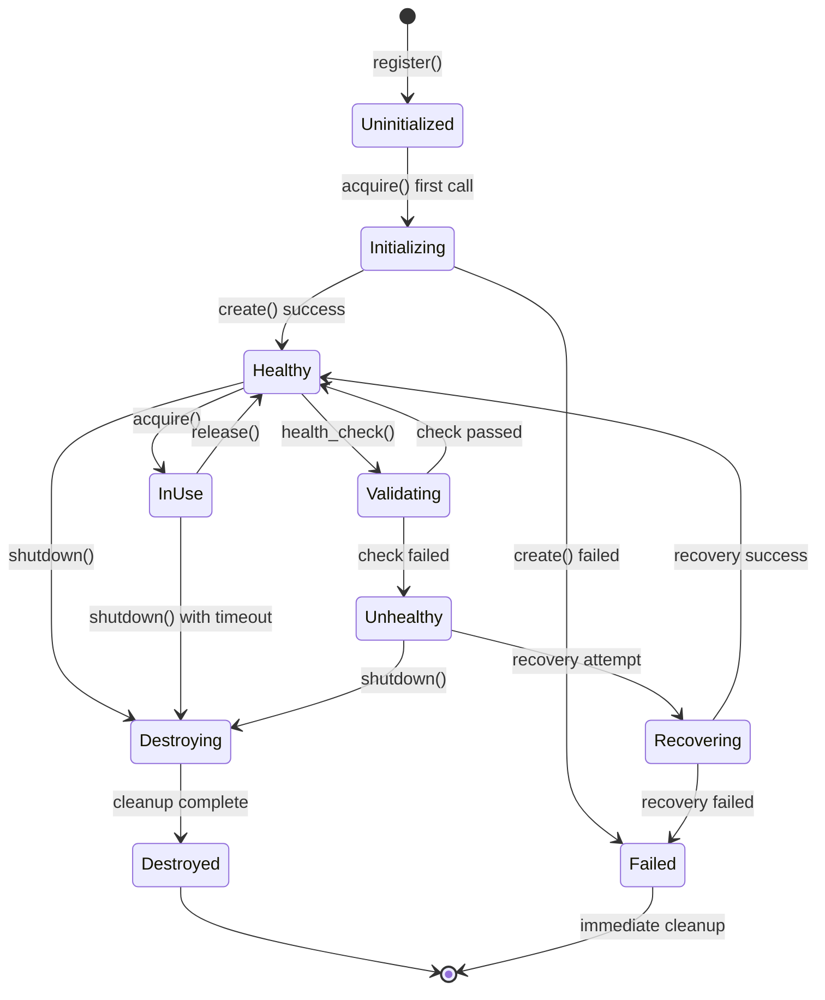

# Resource Lifecycle

**Resource lifecycle** определяет полный путь ресурса от создания до уничтожения. Понимание жизненного цикла критично для правильного управления ресурсами, предотвращения утечек памяти и обеспечения надежности системы.

## Обзор жизненного цикла



## Фазы жизненного цикла

### 1. Registration (Регистрация)

**Что происходит**: Тип ресурса регистрируется в ResourceManager, но сам ресурс еще не создан.

```rust
use nebula_resource::{ResourceManager, Resource};

async fn registration_phase() -> Result<()> {
    let manager = ResourceManager::builder()
        .build();

    // Регистрация типа ресурса (ресурс НЕ создается)
    manager.register::<PostgresPool>().await?;

    // ✅ В этот момент:
    // - TypeId сохранен в реестре
    // - Конфигурация загружена (если есть)
    // - Зависимости проверены
    // - Factory function зарегистрирована
    //
    // ❌ НЕ произошло:
    // - Соединения с БД НЕ открыты
    // - Память НЕ аллоцирована
    // - Сеть НЕ использована

    Ok(())
}
```

**Важно учитывать:**
- Регистрация должна быть до первого использования
- Регистрация дешевая (O(1)), можно делать при старте приложения
- Можно зарегистрировать ресурс, который будет использован позже

**Типичные ошибки:**
```rust
// ❌ НЕПРАВИЛЬНО: попытка acquire до register
let postgres = manager.acquire::<PostgresPool>().await?; // Error: ResourceNotRegistered

// ✅ ПРАВИЛЬНО: сначала register
manager.register::<PostgresPool>().await?;
let postgres = manager.acquire::<PostgresPool>().await?; // OK
```

### 2. Initialization (Инициализация)

**Что происходит**: При первом вызове `acquire()` ресурс создается и инициализируется.

```rust
#[async_trait]
impl Resource for PostgresPool {
    type Config = PostgresPoolConfig;
    type Instance = PostgresConnection;

    async fn create(config: &Self::Config, context: &ResourceContext)
        -> Result<Self, ResourceError> {
        info!("Initializing PostgresPool");

        // ШАГ 1: Валидация конфигурации
        config.validate()?;

        // ШАГ 2: Создание connection pool
        let pool = deadpool_postgres::Config {
            host: Some(config.host.clone()),
            port: Some(config.port),
            dbname: Some(config.database.clone()),
            user: Some(config.username.clone()),
            password: Some(config.password.expose_secret().to_string()),
            manager: Some(ManagerConfig {
                recycling_method: RecyclingMethod::Fast,
            }),
        }
        .create_pool(Some(Runtime::Tokio1), NoTls)?;

        // ШАГ 3: Проверка соединения
        let conn = pool.get().await
            .map_err(|e| ResourceError::InitializationFailed(e.to_string()))?;

        conn.execute("SELECT 1", &[]).await
            .map_err(|e| ResourceError::InitializationFailed(
                format!("Database connection test failed: {}", e)
            ))?;

        // ШАГ 4: Создание min_connections
        if config.min_connections > 1 {
            info!("Pre-warming pool with {} connections", config.min_connections);
            for _ in 0..config.min_connections - 1 {
                let _ = pool.get().await?; // Connections auto-return to pool
            }
        }

        info!("PostgresPool initialized successfully");

        Ok(Self {
            pool: Arc::new(pool),
            metrics: context.metrics().clone(),
        })
    }
}
```

**Важно учитывать:**

1. **Инициализация происходит только один раз** (lazy initialization):
```rust
// Первый acquire - создает ресурс (медленно)
let postgres1 = manager.acquire::<PostgresPool>().await?; // ~100ms

// Последующие acquire - берут из пула (быстро)
let postgres2 = manager.acquire::<PostgresPool>().await?; // ~1ms
```

2. **Обработка ошибок инициализации**:
```rust
impl ResourceManager {
    pub async fn acquire<R: Resource>(&self) -> Result<ResourceGuard<R>, ResourceError> {
        match self.try_initialize::<R>().await {
            Ok(_) => self.acquire_from_pool().await,
            Err(e) => {
                error!("Resource initialization failed: {}", e);
                // Ресурс НЕ сохраняется в failed state
                // Следующий acquire попытается инициализировать снова
                Err(e)
            }
        }
    }
}
```

3. **Таймауты инициализации**:
```rust
let manager = ResourceManager::builder()
    .with_initialization_timeout(Duration::from_secs(30))
    .build();

// Если инициализация > 30 секунд -> ошибка
manager.register::<SlowResource>().await?;
```

**Типичные ошибки:**

```rust
// ❌ НЕПРАВИЛЬНО: длительные операции в конструкторе
impl PostgresPool {
    pub fn new(config: Config) -> Self {
        // Это синхронный конструктор - НЕ делайте здесь I/O!
        let pool = create_pool_sync(); // Блокирует поток!
        Self { pool }
    }
}

// ✅ ПРАВИЛЬНО: I/O в async create()
#[async_trait]
impl Resource for PostgresPool {
    async fn create(config: &Self::Config, context: &ResourceContext) -> Result<Self> {
        // Async I/O - не блокирует
        let pool = create_pool_async().await?;
        Ok(Self { pool })
    }
}
```

### 3. Active Use (Активное использование)

**Что происходит**: Ресурс находится в пуле и может быть взят для использования.

```rust
async fn active_use_phase(manager: &ResourceManager) -> Result<()> {
    // Взять ресурс из пула
    let postgres = manager.acquire::<PostgresPool>().await?;

    // ✅ В этот момент:
    // - ResourceGuard создан
    // - Счетчик активных ресурсов увеличен
    // - Метрики записаны (acquisition_time, pool_size)
    // - on_acquire() хук вызван

    // Использовать ресурс
    let users = postgres.query("SELECT * FROM users", &[]).await?;

    // ResourceGuard автоматически возвращает ресурс в пул при drop
    drop(postgres);

    // ✅ После drop:
    // - Ресурс вернулся в пул
    // - Счетчик активных ресурсов уменьшен
    // - on_release() хук вызван
    // - Метрики обновлены

    Ok(())
}
```

**ResourceGuard и RAII pattern**:

```rust
pub struct ResourceGuard<T> {
    resource: Option<Arc<T>>,
    pool: Arc<ResourcePool<T>>,
    acquired_at: Instant,
    metrics: Arc<MetricsCollector>,
}

impl<T> Drop for ResourceGuard<T> {
    fn drop(&mut self) {
        if let Some(resource) = self.resource.take() {
            // Записать метрики использования
            let duration = self.acquired_at.elapsed();
            self.metrics.record_histogram(
                "resource.usage.duration",
                duration.as_secs_f64(),
                &[("resource_type", std::any::type_name::<T>())],
            );

            // Вернуть в пул
            self.pool.release(resource);
        }
    }
}
```

**Важно учитывать:**

1. **Время жизни guard'а**:
```rust
// ❌ НЕПРАВИЛЬНО: guard живет слишком долго
async fn bad_example(manager: &ResourceManager) -> Result<()> {
    let postgres = manager.acquire::<PostgresPool>().await?;

    // Долгая операция НЕ использующая БД
    tokio::time::sleep(Duration::from_secs(60)).await;

    // Ресурс был заблокирован 60 секунд зря!
    Ok(())
}

// ✅ ПРАВИЛЬНО: guard живет минимально
async fn good_example(manager: &ResourceManager) -> Result<()> {
    let result = {
        let postgres = manager.acquire::<PostgresPool>().await?;
        postgres.query("SELECT * FROM users", &[]).await?
    }; // postgres drop здесь - ресурс вернулся в пул

    // Долгая операция без удержания ресурса
    process_results(result).await?;

    Ok(())
}
```

2. **Ошибки при использовании НЕ влияют на пул**:
```rust
async fn error_handling(manager: &ResourceManager) -> Result<()> {
    let postgres = manager.acquire::<PostgresPool>().await?;

    // Запрос упал с ошибкой
    let result = postgres.query("INVALID SQL", &[]).await;

    match result {
        Err(e) => {
            error!("Query failed: {}", e);
            // ✅ Ресурс ВСЕ РАВНО вернется в пул при drop
            // Connection pool сам решит, переиспользовать или пересоздать соединение
        }
        Ok(rows) => { /* ... */ }
    }

    Ok(())
}
```

3. **Максимальное количество активных ресурсов**:
```rust
let manager = ResourceManager::builder()
    .with_max_active_resources(10) // Максимум 10 одновременных acquire
    .build();

// 11-й вызов будет ждать, пока один из 10 не вернется
let futures: Vec<_> = (0..20)
    .map(|_| manager.acquire::<PostgresPool>())
    .collect();

// Только 10 выполняются одновременно, остальные ждут
let results = futures::future::try_join_all(futures).await?;
```

### 4. Health Checking (Проверка здоровья)

**Что происходит**: Периодически система проверяет, что ресурс работает корректно.

```rust
#[async_trait]
impl Resource for PostgresPool {
    async fn health_check(&self) -> HealthStatus {
        let start = Instant::now();

        // Попытка получить соединение
        let conn = match self.pool.get().await {
            Ok(c) => c,
            Err(e) => {
                error!("Health check failed: cannot acquire connection: {}", e);
                return HealthStatus::Unhealthy(format!(
                    "Connection pool exhausted: {}", e
                ));
            }
        };

        // Проверка, что соединение работает
        match conn.execute("SELECT 1", &[]).await {
            Ok(_) => {
                let latency = start.elapsed();

                // Проверка latency
                if latency > Duration::from_millis(100) {
                    warn!("Database latency high: {:?}", latency);
                    HealthStatus::Degraded(format!(
                        "High latency: {:?}", latency
                    ))
                } else {
                    HealthStatus::Healthy
                }
            }
            Err(e) => {
                error!("Health check failed: query execution failed: {}", e);
                HealthStatus::Unhealthy(format!("Query failed: {}", e))
            }
        }
    }
}
```

**Конфигурация health checks**:

```rust
let manager = ResourceManager::builder()
    .with_health_check_config(HealthCheckConfig {
        // Как часто проверять
        interval: Duration::from_secs(30),

        // Таймаут на проверку
        timeout: Duration::from_secs(5),

        // Сколько подряд неудачных проверок = Unhealthy
        unhealthy_threshold: 3,

        // Сколько подряд успешных проверок = восстановление
        healthy_threshold: 2,

        // Что делать с Unhealthy ресурсом
        on_unhealthy: UnhealthyAction::RemoveAndRecreate,
    })
    .build();
```

**Health Status типы**:

```rust
pub enum HealthStatus {
    /// Ресурс полностью работает
    Healthy,

    /// Ресурс работает, но с проблемами (высокая latency, etc)
    Degraded(String),

    /// Ресурс не работает
    Unhealthy(String),
}

// Использование в коде
match manager.check_health::<PostgresPool>().await? {
    HealthStatus::Healthy => {
        info!("Database is healthy");
    }
    HealthStatus::Degraded(msg) => {
        warn!("Database is degraded: {}", msg);
        // Продолжаем использовать, но следим
    }
    HealthStatus::Unhealthy(msg) => {
        error!("Database is unhealthy: {}", msg);
        // Останавливаем использование, пытаемся восстановить
    }
}
```

**Важно учитывать:**

1. **Health checks НЕ блокируют использование**:
```rust
// Health check выполняется в фоне
tokio::spawn(async move {
    manager.start_health_monitor().await;
});

// Пока health check идет, ресурсы доступны
let postgres = manager.acquire::<PostgresPool>().await?; // Не блокируется
```

2. **Стратегии восстановления**:
```rust
pub enum UnhealthyAction {
    /// Ничего не делать, просто логировать
    Log,

    /// Убрать из пула, но не пересоздавать
    Remove,

    /// Убрать из пула и создать новый
    RemoveAndRecreate,

    /// Попытаться восстановить (переподключиться)
    AttemptRecovery,
}
```

3. **Метрики health checks**:
```rust
// Записываются автоматически
metrics.increment_counter("resource.health_checks.total", &[
    ("resource_type", "PostgresPool"),
    ("status", "healthy"),
]);

metrics.record_histogram("resource.health_check.duration", duration.as_secs_f64(), &[
    ("resource_type", "PostgresPool"),
]);
```

### 5. Recovery (Восстановление)

**Что происходит**: При обнаружении проблем система пытается восстановить ресурс.

```rust
#[async_trait]
impl Resource for PostgresPool {
    /// Попытка восстановления после сбоя
    async fn recover(&self) -> Result<(), ResourceError> {
        info!("Attempting to recover PostgresPool");

        // ШАГ 1: Закрыть все существующие соединения
        self.pool.close();

        // ШАГ 2: Подождать, пока соединения закроются
        tokio::time::sleep(Duration::from_secs(1)).await;

        // ШАГ 3: Создать новые соединения
        for _ in 0..self.config.min_connections {
            let conn = self.pool.get().await
                .map_err(|e| ResourceError::RecoveryFailed(e.to_string()))?;

            // Проверить, что соединение работает
            conn.execute("SELECT 1", &[]).await
                .map_err(|e| ResourceError::RecoveryFailed(
                    format!("Recovery test query failed: {}", e)
                ))?;
        }

        info!("PostgresPool recovered successfully");
        Ok(())
    }
}
```

**Автоматическое восстановление**:

```rust
impl ResourceManager {
    async fn handle_unhealthy_resource<R: Resource>(&self, resource_id: &ResourceId) {
        let mut attempts = 0;
        let max_attempts = 3;

        while attempts < max_attempts {
            attempts += 1;

            info!("Recovery attempt {}/{} for {}",
                  attempts, max_attempts, resource_id);

            match self.recover_resource::<R>(resource_id).await {
                Ok(_) => {
                    info!("Resource recovered successfully");

                    // Проверить здоровье после восстановления
                    match self.health_check_resource::<R>(resource_id).await {
                        Ok(HealthStatus::Healthy) => {
                            info!("Resource is healthy after recovery");
                            return;
                        }
                        _ => {
                            warn!("Resource still unhealthy after recovery");
                        }
                    }
                }
                Err(e) => {
                    error!("Recovery attempt {} failed: {}", attempts, e);
                }
            }

            // Exponential backoff
            let delay = Duration::from_secs(2_u64.pow(attempts));
            tokio::time::sleep(delay).await;
        }

        error!("Failed to recover resource after {} attempts", max_attempts);

        // Пересоздать ресурс
        self.recreate_resource::<R>(resource_id).await;
    }
}
```

**Важно учитывать:**

1. **Circuit breaker pattern**:
```rust
pub struct ResourceCircuitBreaker {
    state: Arc<RwLock<CircuitState>>,
    failure_threshold: usize,
    success_threshold: usize,
    timeout: Duration,
}

enum CircuitState {
    Closed,  // Нормальная работа
    Open,    // Слишком много ошибок, блокируем запросы
    HalfOpen, // Пробуем восстановиться
}

impl ResourceCircuitBreaker {
    async fn call<F, T>(&self, f: F) -> Result<T, ResourceError>
    where
        F: Future<Output = Result<T, ResourceError>>,
    {
        let state = self.state.read().await.clone();

        match state {
            CircuitState::Open => {
                // Проверить, истек ли timeout
                if self.should_attempt_reset() {
                    *self.state.write().await = CircuitState::HalfOpen;
                } else {
                    return Err(ResourceError::CircuitBreakerOpen);
                }
            }
            _ => {}
        }

        match f.await {
            Ok(result) => {
                self.record_success().await;
                Ok(result)
            }
            Err(e) => {
                self.record_failure().await;
                Err(e)
            }
        }
    }
}
```

2. **Graceful degradation**:
```rust
async fn query_with_fallback(manager: &ResourceManager) -> Result<Vec<User>> {
    // Попытка 1: Первичная БД
    match manager.acquire::<PrimaryDb>().await {
        Ok(db) => {
            match db.query("SELECT * FROM users", &[]).await {
                Ok(users) => return Ok(users),
                Err(e) => warn!("Primary DB query failed: {}", e),
            }
        }
        Err(e) => warn!("Cannot acquire primary DB: {}", e),
    }

    // Попытка 2: Read replica
    match manager.acquire::<ReadReplicaDb>().await {
        Ok(db) => {
            match db.query("SELECT * FROM users", &[]).await {
                Ok(users) => return Ok(users),
                Err(e) => warn!("Read replica query failed: {}", e),
            }
        }
        Err(e) => warn!("Cannot acquire read replica: {}", e),
    }

    // Попытка 3: Кэш
    match manager.acquire::<Redis>().await {
        Ok(redis) => {
            if let Ok(cached) = redis.get("users:all").await {
                warn!("Using stale cache data");
                return Ok(cached);
            }
        }
        Err(e) => warn!("Cannot acquire Redis: {}", e),
    }

    // Все варианты провалились
    Err(Error::AllDataSourcesUnavailable)
}
```

### 6. Shutdown (Завершение)

**Что происходит**: При остановке приложения ресурсы корректно освобождаются.

```rust
#[async_trait]
impl Resource for PostgresPool {
    async fn shutdown(&self) -> Result<(), ResourceError> {
        info!("Shutting down PostgresPool");

        // ШАГ 1: Остановить прием новых запросов
        self.accepting_new.store(false, Ordering::SeqCst);

        // ШАГ 2: Подождать, пока активные запросы завершатся
        let timeout = Duration::from_secs(30);
        let start = Instant::now();

        while self.active_count.load(Ordering::SeqCst) > 0 {
            if start.elapsed() > timeout {
                warn!("Shutdown timeout: {} active connections remaining",
                      self.active_count.load(Ordering::SeqCst));
                break;
            }
            tokio::time::sleep(Duration::from_millis(100)).await;
        }

        // ШАГ 3: Закрыть все соединения
        self.pool.close();

        // ШАГ 4: Дождаться закрытия
        tokio::time::sleep(Duration::from_secs(1)).await;

        info!("PostgresPool shutdown complete");
        Ok(())
    }
}
```

**Graceful shutdown приложения**:

```rust
#[tokio::main]
async fn main() -> Result<()> {
    let manager = Arc::new(ResourceManager::builder().build());

    // Регистрация ресурсов
    manager.register::<PostgresPool>().await?;
    manager.register::<Redis>().await?;
    manager.register::<KafkaClient>().await?;

    // Запуск приложения
    let app_manager = manager.clone();
    let app_handle = tokio::spawn(async move {
        run_application(app_manager).await
    });

    // Обработка сигнала остановки
    tokio::select! {
        _ = tokio::signal::ctrl_c() => {
            info!("Received shutdown signal");
        }
        _ = app_handle => {
            info!("Application stopped");
        }
    }

    // Graceful shutdown
    info!("Starting graceful shutdown...");

    // ШАГ 1: Остановить health checks
    manager.stop_health_monitor().await;

    // ШАГ 2: Остановить прием новых запросов
    manager.stop_accepting_requests().await;

    // ШАГ 3: Дождаться завершения активных запросов (с таймаутом)
    let shutdown_timeout = Duration::from_secs(30);
    tokio::time::timeout(
        shutdown_timeout,
        manager.wait_for_active_requests()
    ).await.ok();

    // ШАГ 4: Закрыть все ресурсы
    manager.shutdown_all().await?;

    info!("Graceful shutdown complete");
    Ok(())
}
```

**Важно учитывать:**

1. **Порядок shutdown важен**:
```rust
async fn shutdown_in_correct_order(manager: &ResourceManager) -> Result<()> {
    // 1. Сначала останавливаем ресурсы, которые используют другие
    manager.shutdown_resource::<HttpClient>().await?;
    manager.shutdown_resource::<KafkaClient>().await?;

    // 2. Потом останавливаем ресурсы данных
    manager.shutdown_resource::<Redis>().await?;
    manager.shutdown_resource::<PostgresPool>().await?;

    // 3. В последнюю очередь - observability
    manager.shutdown_resource::<MetricsCollector>().await?;
    manager.shutdown_resource::<Logger>().await?;

    Ok(())
}
```

2. **Forced shutdown при таймауте**:
```rust
async fn shutdown_with_force(manager: &ResourceManager) -> Result<()> {
    let graceful_timeout = Duration::from_secs(30);

    match tokio::time::timeout(graceful_timeout, manager.shutdown_all()).await {
        Ok(Ok(_)) => {
            info!("Graceful shutdown successful");
        }
        Ok(Err(e)) => {
            error!("Graceful shutdown failed: {}", e);
        }
        Err(_) => {
            warn!("Graceful shutdown timeout, forcing shutdown");
            manager.force_shutdown_all().await?;
        }
    }

    Ok(())
}
```

## Lifecycle Hooks

Ресурсы могут реагировать на события жизненного цикла:

```rust
#[async_trait]
impl Resource for PostgresPool {
    // Вызывается при создании ресурса
    async fn on_create(&self, context: &ResourceContext) -> Result<()> {
        info!("PostgresPool created for workflow: {}", context.workflow_id());

        // Записать метрику
        context.metrics().increment_counter(
            "resource.created",
            &[("type", "PostgresPool")],
        );

        Ok(())
    }

    // Вызывается каждый раз при acquire
    async fn on_acquire(&self, context: &ResourceContext) -> Result<()> {
        debug!("PostgresPool acquired");

        // Проверить квоту пользователя
        if !self.check_user_quota(context.user_id()).await? {
            return Err(ResourceError::QuotaExceeded);
        }

        Ok(())
    }

    // Вызывается каждый раз при release
    async fn on_release(&self, context: &ResourceContext) -> Result<()> {
        debug!("PostgresPool released");
        Ok(())
    }

    // Вызывается при уничтожении ресурса
    async fn on_destroy(&self, context: &ResourceContext) -> Result<()> {
        info!("PostgresPool destroyed");

        // Очистить временные таблицы
        self.cleanup_temp_tables().await?;

        Ok(())
    }
}
```

## Мониторинг жизненного цикла

```rust
// Метрики для каждой фазы
pub struct LifecycleMetrics {
    // Инициализация
    pub initialization_duration: Histogram,
    pub initialization_failures: Counter,

    // Использование
    pub active_resources: Gauge,
    pub acquisition_duration: Histogram,
    pub acquisition_failures: Counter,

    // Health checks
    pub health_check_duration: Histogram,
    pub health_check_failures: Counter,
    pub unhealthy_resources: Gauge,

    // Восстановление
    pub recovery_attempts: Counter,
    pub recovery_successes: Counter,

    // Shutdown
    pub shutdown_duration: Histogram,
    pub forced_shutdowns: Counter,
}

// Использование
async fn monitor_lifecycle(manager: &ResourceManager) {
    let metrics = manager.lifecycle_metrics();

    // Dashboard панели
    println!("Active resources: {}", metrics.active_resources.get());
    println!("Unhealthy resources: {}", metrics.unhealthy_resources.get());
    println!("P95 acquisition time: {:?}",
             metrics.acquisition_duration.percentile(0.95));
}
```

## Best Practices

### 1. Всегда используйте RAII

```rust
// ✅ ПРАВИЛЬНО
async fn with_raii(manager: &ResourceManager) -> Result<()> {
    let postgres = manager.acquire::<PostgresPool>().await?;
    let result = postgres.query("SELECT * FROM users", &[]).await?;
    // postgres автоматически вернется в пул при drop
    Ok(())
}

// ❌ НЕПРАВИЛЬНО
async fn without_raii(manager: &ResourceManager) -> Result<()> {
    let postgres = manager.acquire::<PostgresPool>().await?;
    let result = postgres.query("SELECT * FROM users", &[]).await?;
    std::mem::forget(postgres); // УТЕЧКА РЕСУРСА!
    Ok(())
}
```

### 2. Обрабатывайте ошибки инициализации

```rust
async fn handle_init_errors(manager: &ResourceManager) -> Result<()> {
    match manager.acquire::<PostgresPool>().await {
        Ok(postgres) => {
            // Все ок
        }
        Err(ResourceError::InitializationFailed(msg)) => {
            error!("Database initialization failed: {}", msg);

            // Опции восстановления:
            // 1. Retry с backoff
            // 2. Use fallback resource
            // 3. Fail fast и alert

            return Err(Error::DatabaseUnavailable);
        }
        Err(e) => return Err(e.into()),
    }

    Ok(())
}
```

### 3. Настройте таймауты правильно

```rust
let manager = ResourceManager::builder()
    // Инициализация
    .with_initialization_timeout(Duration::from_secs(30))

    // Acquisition
    .with_acquisition_timeout(Duration::from_secs(5))

    // Health checks
    .with_health_check_timeout(Duration::from_secs(3))

    // Shutdown
    .with_shutdown_timeout(Duration::from_secs(30))

    .build();
```

### 4. Тестируйте все фазы жизненного цикла

```rust
#[cfg(test)]
mod tests {
    #[tokio::test]
    async fn test_full_lifecycle() {
        let manager = ResourceManager::builder().build();

        // 1. Registration
        manager.register::<TestResource>().await.unwrap();

        // 2. Initialization
        let resource = manager.acquire::<TestResource>().await.unwrap();

        // 3. Use
        assert!(resource.is_healthy());

        // 4. Release
        drop(resource);

        // 5. Re-acquisition (from pool)
        let resource2 = manager.acquire::<TestResource>().await.unwrap();

        // 6. Shutdown
        manager.shutdown_all().await.unwrap();
    }
}
```

## Диагностика проблем

### Resource leaks (утечки ресурсов)

```rust
// Включить leak detection в debug builds
#[cfg(debug_assertions)]
let manager = ResourceManager::builder()
    .with_leak_detection(true)
    .with_leak_detection_interval(Duration::from_secs(60))
    .build();

// Проверить утечки
if let Some(leaks) = manager.detect_leaks().await {
    for leak in leaks {
        error!("Resource leak detected: {:?}", leak);
        error!("  Acquired at: {}", leak.acquired_at);
        error!("  Stack trace: {}", leak.stack_trace);
    }
}
```

### Deadlocks

```rust
// Включить deadlock detection
let manager = ResourceManager::builder()
    .with_deadlock_detection(true)
    .build();

// При deadlock получите детальный отчет
// ResourceError::DeadlockDetected {
//     resource_chain: ["PostgresPool", "Redis", "PostgresPool"],
//     holder_info: [...]
// }
```

## Links

- [[02-Crates/nebula-resource/Architecture|Resource Architecture]]
- [[02-Crates/nebula-resource/Built-in Resources|Built-in Resources]]
- [[02-Crates/nebula-resource/Examples|Usage Examples]]
- [[02-Crates/nebula-resource/Scoped Resources|Scoped Resources]]
- [[04-Development/Testing Resources]]
