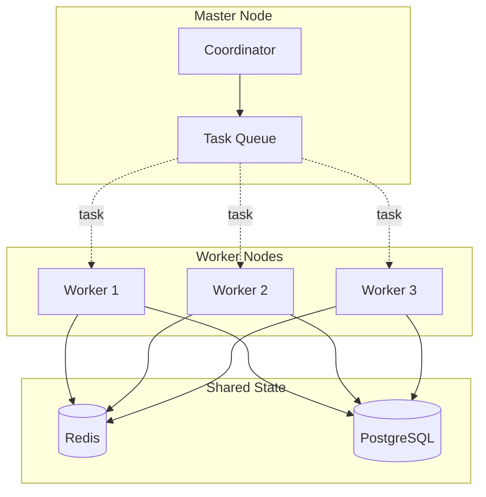

# Workflow Architecture

This document provides a comprehensive overview of the **nebula-workflow** crate architecture, which implements a DAG-based workflow execution engine with support for complex control flow, state management, and distributed execution.

## Table of Contents

1. [High-Level Overview](#high-level-overview)
2. [Core Components](#core-components)
3. [DAG Execution Engine](#dag-execution-engine)
4. [Control Flow](#control-flow)
5. [State Management](#state-management)
6. [Error Recovery](#error-recovery)
7. [Distributed Execution](#distributed-execution)
8. [Observability](#observability)

## High-Level Overview

The `nebula-workflow` crate provides the foundation for orchestrating complex workflows composed of actions arranged in a Directed Acyclic Graph (DAG). It handles execution scheduling, state persistence, error recovery, and distributed coordination.


### Design Principles

1. **DAG-Based Execution**: Workflows are directed acyclic graphs ensuring no circular dependencies
2. **Parallel Execution**: Independent nodes execute concurrently for maximum throughput
3. **State Persistence**: All workflow state is persisted for recovery and replay
4. **Distributed Ready**: Designed for multi-node, distributed execution
5. **Type Safety**: Strong compile-time guarantees for workflow correctness
6. **Observability**: Comprehensive metrics, logging, and tracing built-in

## Core Components

### 1. Workflow Definition

A workflow is defined as a graph of nodes connected by edges:

```rust
pub struct WorkflowDefinition {
    /// Unique workflow ID
    pub id: WorkflowId,

    /// Human-readable name
    pub name: String,

    /// Workflow version for schema evolution
    pub version: u32,

    /// Nodes in the workflow
    pub nodes: HashMap<NodeId, Node>,

    /// Edges defining dependencies
    pub edges: Vec<Edge>,

    /// Workflow-level variables
    pub variables: HashMap<String, Value>,

    /// Configuration
    pub config: WorkflowConfig,

    /// Tags for categorization
    pub tags: Vec<String>,
}

pub struct Node {
    pub id: NodeId,
    pub action_id: ActionId,
    pub config: NodeConfig,
    pub retry_policy: Option<RetryPolicy>,
    pub timeout: Option<Duration>,
}

pub struct Edge {
    pub from: NodeId,
    pub to: NodeId,
    pub condition: Option<EdgeCondition>,
}

pub enum EdgeCondition {
    /// Always follow this edge
    Always,

    /// Follow if expression evaluates to true
    Expression(String),

    /// Follow on specific action result
    OnResult(ActionResultMatcher),

    /// Follow on error
    OnError(ErrorMatcher),
}
```

**Design Rationale:**
- **Immutable After Creation**: Workflow definitions are immutable once created
- **Versioning**: Schema evolution support via version number
- **Declarative**: Workflows defined declaratively, not imperatively
- **Conditional Edges**: Support for branching and conditional execution

### 2. Workflow Executor

The executor manages workflow lifecycle and coordinates execution:

```rust
pub struct WorkflowExecutor {
    /// Workflow definition
    definition: Arc<WorkflowDefinition>,

    /// Execution state
    state: Arc<RwLock<ExecutionState>>,

    /// Task scheduler for node execution
    scheduler: Arc<Scheduler>,

    /// State manager for persistence
    state_manager: Arc<StateManager>,

    /// Action registry
    action_registry: Arc<ActionRegistry>,

    /// Event bus
    events: Arc<EventBus>,

    /// Metrics client
    metrics: Arc<MetricsClient>,
}

impl WorkflowExecutor {
    /// Start workflow execution
    pub async fn execute(
        &self,
        input: WorkflowInput,
    ) -> Result<WorkflowExecution, WorkflowError> {
        // Create execution context
        let execution_id = ExecutionId::new();
        let execution = WorkflowExecution::new(execution_id, &self.definition, input);

        // Initialize state
        let mut state = ExecutionState::new(execution_id, &self.definition);
        state.status = ExecutionStatus::Running;

        // Persist initial state
        self.state_manager.save_state(&state).await?;

        // Find entry nodes (nodes with no dependencies)
        let entry_nodes = self.find_entry_nodes();

        // Schedule entry nodes for execution
        for node_id in entry_nodes {
            self.schedule_node(node_id, &state).await?;
        }

        // Start execution loop
        self.execution_loop(execution_id).await?;

        Ok(execution)
    }

    async fn execution_loop(&self, execution_id: ExecutionId) -> Result<(), WorkflowError> {
        loop {
            let state = self.state.read().await;

            match state.status {
                ExecutionStatus::Running => {
                    // Check for completed nodes
                    let completed = self.check_completed_nodes(&state).await?;

                    if !completed.is_empty() {
                        drop(state); // Release read lock

                        // Process completed nodes
                        for node_id in completed {
                            self.on_node_completed(node_id).await?;
                        }
                    } else if state.all_nodes_final() {
                        // All nodes reached final state
                        self.finalize_execution(execution_id).await?;
                        break;
                    } else {
                        // Wait for node completion
                        tokio::time::sleep(Duration::from_millis(100)).await;
                    }
                }
                ExecutionStatus::Completed | ExecutionStatus::Failed | ExecutionStatus::Cancelled => {
                    break;
                }
                _ => {
                    tokio::time::sleep(Duration::from_millis(100)).await;
                }
            }
        }

        Ok(())
    }
}
```

### 3. Task Scheduler

Manages parallel execution of independent nodes:

```rust
pub struct Scheduler {
    /// Task queue
    queue: Arc<Mutex<VecDeque<Task>>>,

    /// Worker pool
    workers: Arc<WorkerPool>,

    /// Max concurrent tasks
    max_concurrency: usize,

    /// Currently running tasks
    running: Arc<RwLock<HashMap<TaskId, TaskHandle>>>,
}

pub struct Task {
    pub id: TaskId,
    pub node_id: NodeId,
    pub action_id: ActionId,
    pub input: Value,
    pub context: ExecutionContext,
    pub priority: TaskPriority,
}

impl Scheduler {
    pub async fn schedule(&self, task: Task) -> Result<TaskHandle, SchedulerError> {
        // Check concurrency limit
        let running_count = self.running.read().await.len();
        if running_count >= self.max_concurrency {
            // Queue for later
            self.queue.lock().await.push_back(task);
            return Ok(TaskHandle::queued(task.id));
        }

        // Execute immediately
        self.execute_task(task).await
    }

    async fn execute_task(&self, task: Task) -> Result<TaskHandle, SchedulerError> {
        let task_id = task.id.clone();

        // Get action from registry
        let action = self.action_registry.get(&task.action_id)?;

        // Create task future
        let future = async move {
            action.execute(task.input, &task.context).await
        };

        // Spawn on worker pool
        let handle = self.workers.spawn(future).await?;

        // Track running task
        self.running.write().await.insert(task_id.clone(), handle.clone());

        Ok(handle)
    }

    async fn on_task_completed(&self, task_id: TaskId) {
        // Remove from running
        self.running.write().await.remove(&task_id);

        // Try to schedule queued tasks
        if let Some(task) = self.queue.lock().await.pop_front() {
            let _ = self.execute_task(task).await;
        }
    }
}
```

## DAG Execution Engine

### Topological Execution

The DAG execution engine uses topological sorting to determine execution order:

```rust
pub struct DagExecutor {
    definition: Arc<WorkflowDefinition>,
    state: Arc<RwLock<DagState>>,
}

pub struct DagState {
    /// Execution status per node
    pub node_states: HashMap<NodeId, NodeState>,

    /// Execution results per node
    pub node_results: HashMap<NodeId, ActionResult>,

    /// Pending edges
    pub pending_edges: HashMap<NodeId, Vec<Edge>>,

    /// Topological levels
    pub levels: Vec<Vec<NodeId>>,
}

impl DagExecutor {
    /// Compute topological levels for parallel execution
    fn compute_levels(&self) -> Vec<Vec<NodeId>> {
        let mut levels = Vec::new();
        let mut in_degree: HashMap<NodeId, usize> = HashMap::new();

        // Calculate in-degree for each node
        for edge in &self.definition.edges {
            *in_degree.entry(edge.to.clone()).or_insert(0) += 1;
        }

        // Find entry nodes (in-degree = 0)
        let mut current_level: Vec<NodeId> = self.definition.nodes
            .keys()
            .filter(|node_id| in_degree.get(node_id).copied().unwrap_or(0) == 0)
            .cloned()
            .collect();

        while !current_level.is_empty() {
            levels.push(current_level.clone());

            let mut next_level = Vec::new();

            // Process nodes in current level
            for node_id in &current_level {
                // Find outgoing edges
                for edge in &self.definition.edges {
                    if &edge.from == node_id {
                        let count = in_degree.get_mut(&edge.to).unwrap();
                        *count -= 1;

                        if *count == 0 {
                            next_level.push(edge.to.clone());
                        }
                    }
                }
            }

            current_level = next_level;
        }

        levels
    }

    /// Execute nodes level by level
    pub async fn execute_dag(&self) -> Result<WorkflowResult, WorkflowError> {
        let levels = self.compute_levels();

        for (level_num, level_nodes) in levels.iter().enumerate() {
            info!("Executing level {}: {} nodes", level_num, level_nodes.len());

            // Execute all nodes in this level concurrently
            let futures: Vec<_> = level_nodes.iter()
                .map(|node_id| self.execute_node(node_id))
                .collect();

            // Wait for all nodes in level to complete
            let results = futures::future::join_all(futures).await;

            // Check for errors
            for (node_id, result) in level_nodes.iter().zip(results) {
                match result {
                    Ok(action_result) => {
                        self.state.write().await.node_results.insert(node_id.clone(), action_result);
                    }
                    Err(e) => {
                        return Err(WorkflowError::NodeFailed {
                            node_id: node_id.clone(),
                            error: e,
                        });
                    }
                }
            }
        }

        Ok(WorkflowResult::Success)
    }
}
```

### Execution Modes


## Control Flow

### Conditional Branching

```rust
pub enum BranchCondition {
    /// Expression-based branching
    Expression {
        expression: String,
        branches: HashMap<String, NodeId>,
        default: Option<NodeId>,
    },

    /// Pattern matching on action result
    ResultMatch {
        patterns: Vec<ResultPattern>,
        default: Option<NodeId>,
    },

    /// Error handling branches
    ErrorMatch {
        error_types: HashMap<ErrorType, NodeId>,
        default: Option<NodeId>,
    },
}

// Example: Expression-based branching
let branch = BranchCondition::Expression {
    expression: "$.order.total > 1000".to_string(),
    branches: hashmap! {
        "true" => high_value_node,
        "false" => normal_node,
    },
    default: Some(fallback_node),
};
```

### Loop Patterns

```rust
pub enum LoopPattern {
    /// While condition is true
    While {
        condition: String,
        body: Vec<NodeId>,
        max_iterations: Option<usize>,
    },

    /// For each item in collection
    ForEach {
        collection: String, // JSONPath expression
        body: Vec<NodeId>,
        parallel: bool,
        max_concurrency: Option<usize>,
    },

    /// Retry until success
    RetryUntil {
        body: Vec<NodeId>,
        max_attempts: usize,
        backoff: BackoffStrategy,
    },
}

// Example: ForEach parallel processing
let loop_pattern = LoopPattern::ForEach {
    collection: "$.items".to_string(),
    body: vec![process_item_node],
    parallel: true,
    max_concurrency: Some(10),
};
```

### Subworkflows

```rust
pub struct SubworkflowNode {
    pub workflow_id: WorkflowId,
    pub input_mapping: HashMap<String, String>, // JSONPath mappings
    pub output_mapping: HashMap<String, String>,
    pub isolation: IsolationLevel,
}

pub enum IsolationLevel {
    /// Shared variables and resources
    Shared,

    /// Isolated execution context
    Isolated,

    /// New transaction boundary
    Transactional,
}
```

## State Management

### Execution State

```rust
pub struct ExecutionState {
    /// Execution ID
    pub execution_id: ExecutionId,

    /// Workflow definition version
    pub workflow_version: u32,

    /// Overall status
    pub status: ExecutionStatus,

    /// Per-node state
    pub node_states: HashMap<NodeId, NodeExecutionState>,

    /// Workflow variables
    pub variables: HashMap<String, Value>,

    /// Execution timeline
    pub timeline: Vec<ExecutionEvent>,

    /// Created timestamp
    pub created_at: DateTime<Utc>,

    /// Updated timestamp
    pub updated_at: DateTime<Utc>,
}

pub struct NodeExecutionState {
    pub status: NodeStatus,
    pub input: Option<Value>,
    pub output: Option<Value>,
    pub error: Option<ActionError>,
    pub attempts: u32,
    pub started_at: Option<DateTime<Utc>>,
    pub completed_at: Option<DateTime<Utc>>,
    pub duration: Option<Duration>,
}

pub enum NodeStatus {
    Pending,
    Queued,
    Running,
    Completed,
    Failed,
    Skipped,
    Cancelled,
}
```

### State Persistence


## Error Recovery

### Retry Strategies

```rust
pub enum RetryPolicy {
    /// Fixed delay between retries
    Fixed {
        delay: Duration,
        max_attempts: u32,
    },

    /// Exponential backoff
    Exponential {
        initial_delay: Duration,
        max_delay: Duration,
        multiplier: f64,
        max_attempts: u32,
    },

    /// Jittered exponential backoff
    ExponentialJitter {
        base_delay: Duration,
        max_delay: Duration,
        max_attempts: u32,
    },

    /// Custom retry logic
    Custom(Arc<dyn RetryStrategy>),
}

impl RetryPolicy {
    pub fn next_delay(&self, attempt: u32) -> Option<Duration> {
        match self {
            Self::Fixed { delay, max_attempts } => {
                if attempt < *max_attempts {
                    Some(*delay)
                } else {
                    None
                }
            }
            Self::Exponential { initial_delay, max_delay, multiplier, max_attempts } => {
                if attempt < *max_attempts {
                    let delay = initial_delay.mul_f64(multiplier.powi(attempt as i32));
                    Some(delay.min(*max_delay))
                } else {
                    None
                }
            }
            Self::ExponentialJitter { base_delay, max_delay, max_attempts } => {
                if attempt < *max_attempts {
                    let exp_delay = base_delay.mul_f64(2_f64.powi(attempt as i32));
                    let jitter = rand::random::<f64>();
                    Some((exp_delay.mul_f64(jitter)).min(*max_delay))
                } else {
                    None
                }
            }
            Self::Custom(strategy) => strategy.next_delay(attempt),
        }
    }
}
```

### Compensation (Saga Pattern)

```rust
pub struct SagaCoordinator {
    executed_steps: Vec<(NodeId, CompensationData)>,
}

impl SagaCoordinator {
    pub async fn execute_with_compensation(
        &mut self,
        nodes: Vec<NodeId>,
    ) -> Result<(), WorkflowError> {
        for node_id in nodes {
            match self.execute_node(node_id).await {
                Ok(compensation_data) => {
                    self.executed_steps.push((node_id.clone(), compensation_data));
                }
                Err(e) => {
                    // Failure: compensate all executed steps in reverse order
                    warn!("Node {} failed, starting compensation", node_id);
                    self.compensate_all().await?;
                    return Err(e);
                }
            }
        }

        Ok(())
    }

    async fn compensate_all(&self) -> Result<(), WorkflowError> {
        // Compensate in reverse order
        for (node_id, compensation_data) in self.executed_steps.iter().rev() {
            info!("Compensating node {}", node_id);
            self.compensate_node(node_id, compensation_data).await?;
        }

        Ok(())
    }
}
```

## Distributed Execution

### Work Distribution



### Leader Election

```rust
pub struct LeaderElection {
    etcd_client: Arc<EtcdClient>,
    lease_ttl: Duration,
    current_leader: Arc<RwLock<Option<NodeId>>>,
}

impl LeaderElection {
    pub async fn campaign(&self, node_id: NodeId) -> Result<LeaderHandle, ElectionError> {
        // Create lease
        let lease = self.etcd_client.lease_grant(self.lease_ttl.as_secs()).await?;

        // Try to acquire leadership
        loop {
            let txn = self.etcd_client
                .txn()
                .when(vec![Compare::create_revision("leader", CompareOp::Equal, 0)])
                .and_then(vec![TxnOp::put("leader", node_id.to_string(), Some(lease.id()))])
                .or_else(vec![TxnOp::get("leader", None)])
                .commit()
                .await?;

            if txn.succeeded {
                // Won election
                info!("Node {} became leader", node_id);
                return Ok(LeaderHandle::new(lease, node_id));
            } else {
                // Lost election, watch for leader change
                self.watch_leader().await?;
            }
        }
    }
}
```

## Observability

### Metrics

```rust
pub mod metrics {
    pub const WORKFLOW_STARTED: &str = "workflow.started";
    pub const WORKFLOW_COMPLETED: &str = "workflow.completed";
    pub const WORKFLOW_FAILED: &str = "workflow.failed";
    pub const WORKFLOW_DURATION: &str = "workflow.duration_ms";

    pub const NODE_EXECUTED: &str = "workflow.node.executed";
    pub const NODE_FAILED: &str = "workflow.node.failed";
    pub const NODE_RETRIED: &str = "workflow.node.retried";
    pub const NODE_DURATION: &str = "workflow.node.duration_ms";

    pub const DAG_LEVEL_EXECUTED: &str = "workflow.dag.level_executed";
    pub const PARALLEL_TASKS: &str = "workflow.parallel_tasks";
}
```

### Execution Timeline

```rust
pub struct ExecutionTimeline {
    pub events: Vec<TimelineEvent>,
}

pub struct TimelineEvent {
    pub timestamp: DateTime<Utc>,
    pub event_type: EventType,
    pub node_id: Option<NodeId>,
    pub details: Value,
}

pub enum EventType {
    WorkflowStarted,
    WorkflowCompleted,
    WorkflowFailed,
    NodeStarted,
    NodeCompleted,
    NodeFailed,
    NodeRetried,
    StateCheckpointed,
    CompensationStarted,
    CompensationCompleted,
}
```

## Related Documentation

- [[02-Crates/nebula-workflow/README|nebula-workflow]] - Crate overview
- [[02-Crates/nebula-workflow/Examples|Examples]] - Complete workflow examples
- [[02-Crates/nebula-workflow/API Reference|API Reference]] - API documentation
- [[02-Crates/nebula-action/README|nebula-action]] - Action system
- [[03-Concepts/Workflows|Workflows]] - Conceptual overview
