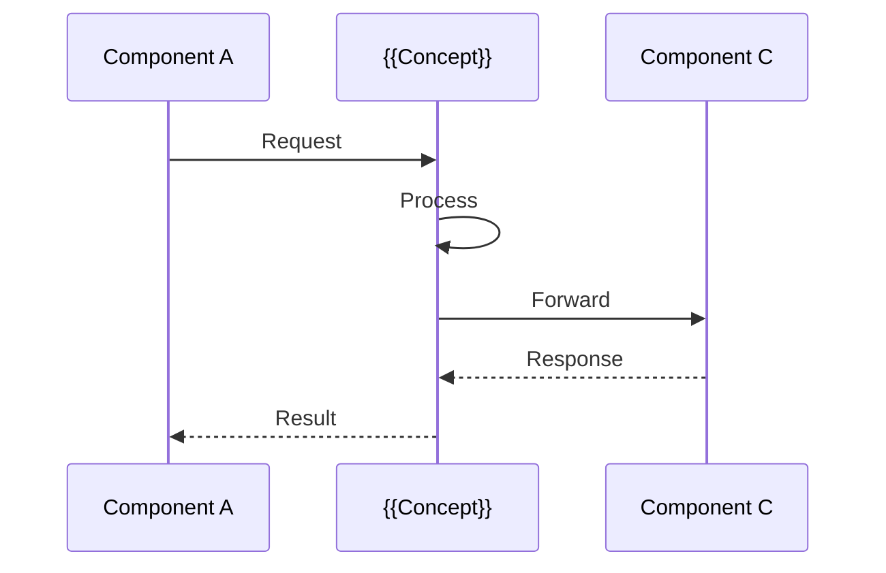

# {{concept-name}}

**TL;DR**: {{Объяснение концепции в одном предложении}}

---

## 🎯 Зачем это нужно

{{2-3 параграфа о проблеме, которую решает эта концепция}}

### Без {{concept-name}}

```rust
// Пример "плохого" подхода без использования концепции
// Показывает проблему
```

❌ **Проблемы**:
- {{Проблема 1}}
- {{Проблема 2}}
- {{Проблема 3}}

### С {{concept-name}}

```rust
// Пример "хорошего" подхода с использованием концепции
// Показывает решение
```

✅ **Преимущества**:
- {{Преимущество 1}}
- {{Преимущество 2}}
- {{Преимущество 3}}

---

## 💡 Как это работает

{{Техническое объяснение концепции}}

### Внутренняя механика



### Ключевые принципы

1. **{{Принцип 1}}**: {{объяснение}}
2. **{{Принцип 2}}**: {{объяснение}}
3. **{{Принцип 3}}**: {{объяснение}}

---

## 📖 Простой пример

{{Минимальный рабочий пример для понимания концепции}}

```rust
// Пошаговый простой пример
// Шаг 1: {{описание}}
{{код шага 1}}

// Шаг 2: {{описание}}
{{код шага 2}}

// Шаг 3: {{описание}}
{{код шага 3}}
```

**Что происходит**:
1. {{Объяснение шага 1}}
2. {{Объяснение шага 2}}
3. {{Объяснение шага 3}}

---

## 🚀 Практическое применение

### Use Case 1: {{Сценарий использования}}

**Задача**: {{описание задачи}}

**Решение**:
```rust
// Реалистичный пример применения
```

**Результат**: {{что получаем}}

---

### Use Case 2: {{Другой сценарий}}

{{повторить структуру}}

---

## 🔧 Продвинутые паттерны

> [!TIP] Эта секция для опытных пользователей
> Если вы только начинаете, можете пропустить и вернуться позже

### Паттерн 1: {{Название}}

{{Когда использовать}}

```rust
// Продвинутый код
```

### Паттерн 2: {{Название}}

{{Когда использовать}}

---

## ⚠️ Частые ошибки и как их избежать

### Ошибка 1: {{Типичная ошибка}}

> [!WARNING] {{Что делают неправильно}}

**Неправильно**:
```rust
// Код с ошибкой
```

**Правильно**:
```rust
// Исправленный код
```

**Почему**: {{объяснение}}

---

### Ошибка 2: {{Другая ошибка}}

{{повторить структуру}}

---

## 🔍 Детали реализации

{{Подробности о том, как это реализовано в Nebula}}

### В каких crates используется

- **[[nebula-action]]**: {{как используется}}
- **[[nebula-workflow]]**: {{как используется}}
- **[[nebula-resource]]**: {{как используется}}

### Связь с другими концепциями

```mermaid
graph LR
    A[{{Concept 1}}] --> B[{{This Concept}}]
    B --> C[{{Concept 2}}]
    B --> D[{{Concept 3}}]
```

---

## 📚 Дальнейшее изучение

### Следующие шаги

1. Прочитайте [[Related Concept 1]] для углубления понимания
2. Изучите [[Advanced Topic]] для продвинутого использования
3. Посмотрите [[Examples]] для практических применений

### Связанные концепции

- [[Concept A]] - {{связь и отличия}}
- [[Concept B]] - {{как они работают вместе}}
- [[Concept C]] - {{альтернативный подход}}

---

## 🔗 См. также

- [[Getting Started]] - если вы новичок
- [[API Reference]] - полная документация API
- [[Best Practices]] - рекомендации по использованию

---

## 📖 Внешние ресурсы

- [{{External Resource 1}}](https://example.com) - {{описание}}
- [{{External Resource 2}}](https://example.com) - {{описание}}

---

*Последнее обновление: {{date:YYYY-MM-DD}}*
*Estimated reading time: {{время}} minutes*
