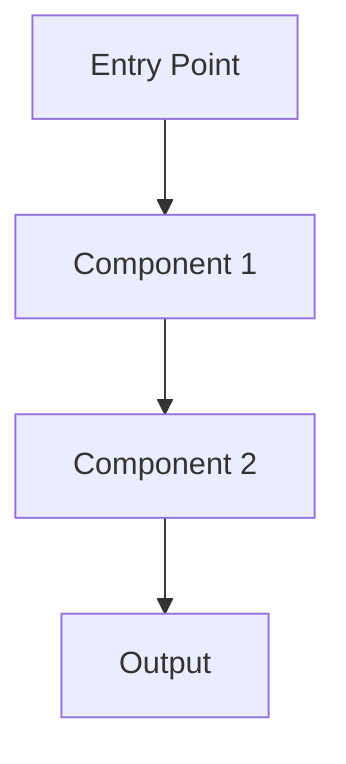

# nebula-{{crate-name}}

**TL;DR**: {{Краткое описание в одном предложении}}

## 📌 Назначение

{{Зачем нужен этот crate? Какую проблему он решает?}}

## 🚀 Установка

```toml
[dependencies]
nebula-{{crate-name}} = "0.1.0"
```

## ⚡ Quick Example

```rust
use nebula_{{crate-name}}::*;

fn main() {
    // TODO: Добавьте минимальный рабочий пример
}
```

**Что делает этот пример**: {{объяснение}}

## 🏗️ Архитектура

{{Описание внутренней структуры crate}}

### Основные компоненты

- **{{Component 1}}**: {{описание}}
- **{{Component 2}}**: {{описание}}
- **{{Component 3}}**: {{описание}}

### Диаграмма



## 📚 Основные API

### {{Function/Trait 1}}

```rust
pub fn {{function_name}}({{params}}) -> Result<{{Output}}, {{Error}}> {
    // ...
}
```

**Параметры**:
- `{{param1}}`: {{описание}}
- `{{param2}}`: {{описание}}

**Возвращает**: {{описание результата}}

**Ошибки**: {{возможные ошибки}}

**Пример**:
```rust
// Пример использования
```

---

### {{Function/Trait 2}}

{{повторить структуру}}

---

## 🔧 Продвинутое использование

### {{Advanced Topic 1}}

{{Объяснение}}

```rust
// Продвинутый пример
```

### {{Advanced Topic 2}}

{{Объяснение}}

---

## ⚠️ Частые ошибки

> [!WARNING] {{Распространённая ошибка 1}}
> **Проблема**: {{что происходит}}
> **Решение**: {{как исправить}}

> [!WARNING] {{Распространённая ошибка 2}}
> **Проблема**: {{что происходит}}
> **Решение**: {{как исправить}}

---

## 🔗 См. также

- [[Related Crate 1]] - {{связь}}
- [[Related Concept]] - {{связь}}
- [[Example Usage]] - {{практический пример}}

---

## 📖 Дополнительные ресурсы

- [Docs.rs Documentation](https://docs.rs/nebula-{{crate-name}})
- [GitHub Repository](https://github.com/your-org/nebula)
- [[API Reference]] - полная документация API

---

*Последнее обновление: {{date:YYYY-MM-DD}}*
