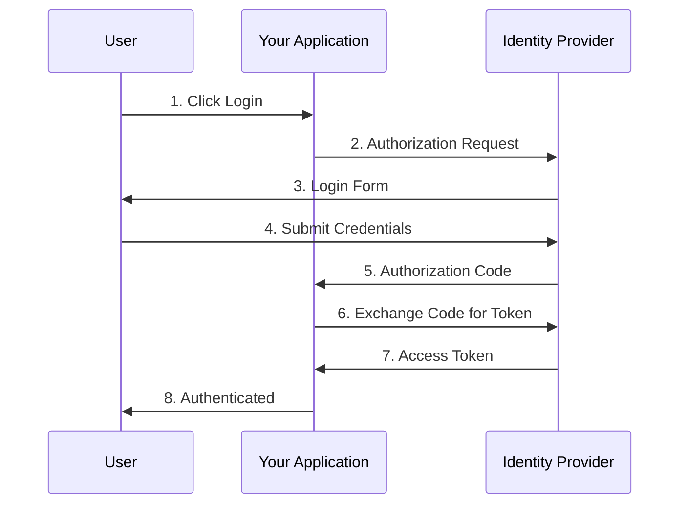
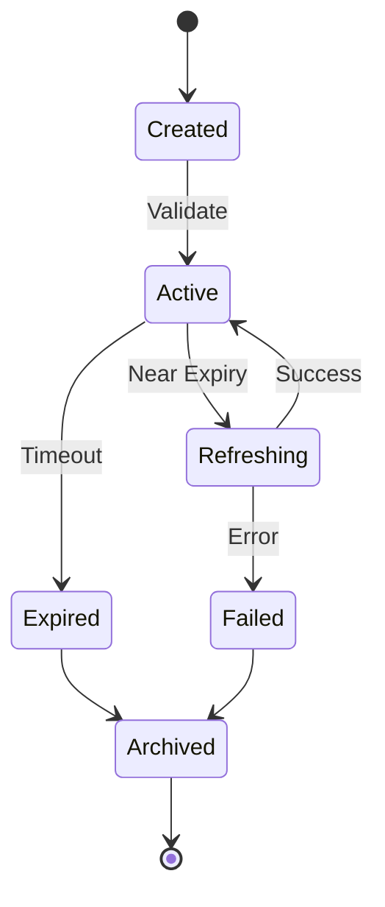
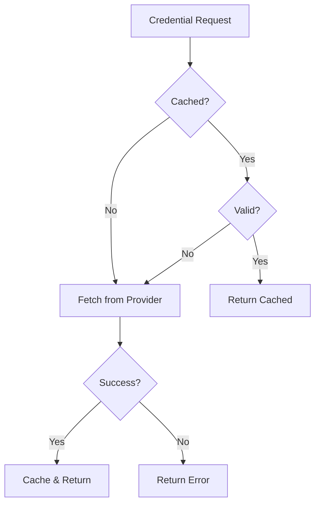

# Data Model: Documentation Page Structure

**Date**: 2026-02-03  
**Feature**: [[spec.md|Improve nebula-credential Documentation]]  
**Purpose**: Define the structure, frontmatter schema, and organization patterns for all documentation pages in the nebula-credential system.

---

## Overview

This document defines the canonical data model for all documentation pages in the Nebula credential system. It ensures consistency, enables automated tooling (Dataview queries), and supports the progressive disclosure principle.

---

## Frontmatter Schema

All documentation pages MUST include YAML frontmatter with the following fields:

### Required Fields

```yaml
---
title: "Page Title"
tags: [credential, oauth2, getting-started]
status: published  # draft | in-progress | published | outdated
lang: ru  # ru | en
created: 2026-02-03
last_updated: 2026-02-03
---
```

**Field Definitions**:

- **title** (string): Human-readable page title (used in navigation, search results)
- **tags** (array of strings): Categorization tags from controlled vocabulary (see below)
- **status** (enum): Publication status
  - `draft`: Work in progress, not ready for review
  - `in-progress`: Under active development, reviewable
  - `published`: Completed, approved for public consumption
  - `outdated`: Needs updating due to code/spec changes
- **lang** (enum): Primary language of content
  - `ru`: Russian (primary)
  - `en`: English (secondary)
- **created** (date): Page creation date (YYYY-MM-DD)
- **last_updated** (date): Last modification date (YYYY-MM-DD)

### Optional Fields

```yaml
---
# ... required fields ...
audience: [beginner, intermediate, advanced]
estimated_reading: 10  # minutes
priority: P1  # P1 | P2 | P3 (from spec)
related_spec: "[[specs/001-credential-docs/spec.md]]"
author: "Team Member Name"
reviewers: ["Reviewer 1", "Reviewer 2"]
version: "0.1.0"  # nebula-credential version this applies to
---
```

**Optional Field Definitions**:

- **audience** (array of enums): Target audience skill level
  - `beginner`: New to Nebula/credentials
  - `intermediate`: Familiar with basics, exploring advanced usage
  - `advanced`: Expert users, contributors, security specialists
- **estimated_reading** (integer): Estimated reading time in minutes
- **priority** (enum): Implementation priority from spec (P1, P2, P3)
- **related_spec** (wikilink): Link to specification that requested this page
- **author** (string): Primary author name
- **reviewers** (array of strings): List of reviewers
- **version** (string): Target nebula-credential version (semantic versioning)

---

## Controlled Tag Vocabulary

Tags MUST be selected from the following controlled vocabulary to ensure consistency and enable effective filtering.

### Primary Categories

**Credential Types**:
- `credential` (generic credential concept)
- `oauth2` (OAuth 2.0 credentials)
- `saml` (SAML assertions)
- `ldap` (LDAP/Active Directory)
- `api-key` (API keys)
- `certificate` (X.509 certificates, mTLS)
- `database` (Database credentials)
- `aws` (AWS credentials)
- `kerberos` (Kerberos tickets)
- `jwt` (JSON Web Tokens)

**Content Types**:
- `getting-started` (Introductory content)
- `concept` (Conceptual explanation)
- `how-to` (Step-by-step guide)
- `example` (Code example)
- `reference` (API/configuration reference)
- `troubleshooting` (Problem-solving guide)
- `architecture` (System design/architecture)
- `security` (Security-focused content)

**Topics**:
- `encryption` (Encryption/decryption)
- `rotation` (Credential rotation)
- `storage` (Credential storage)
- `authentication` (Authentication flows)
- `authorization` (Authorization/permissions)
- `provider` (Provider integration)
- `caching` (Caching strategies)
- `audit` (Audit logging)
- `compliance` (Compliance requirements)
- `real-time` (Real-time notifications, SSE)

**Providers**:
- `aws-secrets-manager`
- `hashicorp-vault`
- `azure-key-vault`
- `kubernetes-secrets`
- `auth0`
- `okta`
- `azure-ad`

**Skill Level**:
- `beginner`
- `intermediate`
- `advanced`

**Special Tags**:
- `critical` (Critical security information)
- `deprecated` (Deprecated features)
- `new` (New features in latest version)
- `experimental` (Experimental features)

### Tag Usage Guidelines

**Minimum Tags**: Every page MUST have at least 2 tags (1 primary category + 1 content type)

**Maximum Tags**: No more than 7 tags per page to maintain specificity

**Examples**:
```yaml
# Good: Specific and actionable
tags: [oauth2, how-to, rotation, intermediate]

# Good: Security-focused concept
tags: [encryption, concept, security, critical]

# Bad: Too generic
tags: [credential]

# Bad: Too many tags
tags: [oauth2, getting-started, concept, how-to, example, aws, auth0, beginner, intermediate]
```

---

## Page Structure Template

All pages SHOULD follow this general structure for consistency:

```markdown
---
# Frontmatter (as defined above)
---

# Page Title

> **TL;DR**: One-sentence summary of what this page covers.

## Overview

Brief introduction (2-3 paragraphs):
- What is this about?
- Why does it matter?
- Who should read this?

## Prerequisites

- Link to prerequisite concept: [[Prerequisite Page]]
- Required knowledge: Basic understanding of OAuth2
- Required setup: [[Installation Guide]]

## Main Content

### Section 1: Core Concept

Explanation with code example...

```rust
// Complete, runnable code example
use nebula_credential::oauth2::OAuth2Credential;

fn main() {
    // ... example code ...
}
```

**Expected Output**:
```
Success: Token acquired
```

### Section 2: Step-by-Step Guide

1. **Step 1: Do something**
   - Detailed explanation
   - Code snippet
   
2. **Step 2: Do something else**
   - Detailed explanation
   - Code snippet

### Section 3: Advanced Topics

> [!note] Advanced Content
> This section covers advanced use cases. Skip if you're just getting started.

Details of advanced usage...

## Common Pitfalls

> [!warning] Security Warning
> Never store credentials in plaintext.

- **Pitfall 1**: Description and how to avoid
- **Pitfall 2**: Description and how to avoid

## Troubleshooting

**Problem**: Error message or symptom

**Cause**: Why this happens

**Solution**: How to fix it

```rust
// Fixed code example
```

## See Also

- Related concept: [[Related Page 1]]
- Advanced guide: [[Advanced Guide]]
- API reference: [[API Reference]]
- Provider integration: [[AWS Secrets Manager]]
- Troubleshooting: [[Common OAuth2 Errors]]

## Sources

*For research-heavy pages*:

- [OAuth 2.0 RFC 6749](https://datatracker.ietf.org/doc/html/rfc6749)
- [Auth0 Documentation](https://auth0.com/docs)
```

---

## Page Type Specifications

### Getting Started Pages

**Location**: `02-Crates/nebula-credential/Getting-Started/`

**Frontmatter**:
```yaml
tags: [getting-started, <credential-type>, beginner]
audience: [beginner]
estimated_reading: 5-10
priority: P1
```

**Structure**:
- TL;DR
- What You'll Learn (bullet points)
- Prerequisites (minimal)
- 5-Minute Quick Start (complete working example)
- What's Next (links to intermediate topics)

**Constraints**:
- MUST be completable in <10 minutes
- Code examples MUST be copy-paste runnable
- No advanced concepts
- Maximum 500 lines of content

---

### Concept Pages

**Location**: `03-Concepts/`

**Frontmatter**:
```yaml
tags: [concept, <topic>, <skill-level>]
audience: [beginner, intermediate]
estimated_reading: 5-15
```

**Structure**:
- TL;DR
- Overview (What & Why)
- Core Concepts (3-5 key ideas)
- Visual Diagram (Mermaid preferred)
- Simple Example
- Common Misconceptions
- See Also (5-7 related links)

**Constraints**:
- Explain ONE concept thoroughly
- Use analogies for complex topics
- Include at least one diagram
- Link to how-to guides for practical application

---

### How-To Guides

**Location**: `02-Crates/nebula-credential/How-To/`

**Frontmatter**:
```yaml
tags: [how-to, <credential-type>, <topic>]
audience: [intermediate]
estimated_reading: 10-20
priority: P2
```

**Structure**:
- TL;DR
- Prerequisites (explicit list with links)
- Step-by-Step Instructions (numbered)
- Complete Code Example
- Verification Steps
- Troubleshooting
- Next Steps

**Constraints**:
- MUST be step-by-step (numbered list)
- Each step MUST be actionable
- Include expected output for each step
- Code examples MUST be complete

---

### Example Pages

**Location**: `02-Crates/nebula-credential/Examples/`

**Frontmatter**:
```yaml
tags: [example, <credential-type>, <use-case>]
audience: [beginner, intermediate]
estimated_reading: 5-10
```

**Structure**:
- TL;DR
- Use Case Description
- Prerequisites
- Complete Code Example (with comments)
- Explanation of Key Parts
- Expected Output
- Variations (optional)
- Related Examples

**Constraints**:
- Code MUST be complete and runnable
- Include Cargo.toml dependencies
- Explain non-obvious parts with comments
- Show expected output/behavior
- One example = one concept

---

### Troubleshooting Pages

**Location**: `02-Crates/nebula-credential/Troubleshooting/`

**Frontmatter**:
```yaml
tags: [troubleshooting, <credential-type>, <topic>]
audience: [intermediate, advanced]
```

**Structure**:
- TL;DR
- Common Issues (table format)
- Issue 1:
  - Symptoms
  - Diagnosis Steps
  - Causes
  - Solutions (prioritized)
  - Prevention
- Issue 2: ...
- When to Seek Help

**Constraints**:
- Use consistent format for all issues
- Include diagnostic commands
- Prioritize solutions (most likely first)
- Link to related documentation

---

### Reference Pages

**Location**: `02-Crates/nebula-credential/Reference/`

**Frontmatter**:
```yaml
tags: [reference, api, <credential-type>]
audience: [intermediate, advanced]
```

**Structure**:
- TL;DR
- API Overview (table of methods/functions)
- Detailed API Documentation:
  - Function signature
  - Parameters (with types)
  - Return values
  - Errors
  - Example usage
  - Notes
- Configuration Reference (if applicable)
- Glossary

**Constraints**:
- MUST be comprehensive
- MUST include types/signatures
- Use tables for parameter lists
- Include minimal but complete examples

---

### Integration Guides (Provider-Specific)

**Location**: `02-Crates/nebula-credential/Integrations/`

**Frontmatter**:
```yaml
tags: [provider, integration, <provider-name>, how-to]
audience: [intermediate]
estimated_reading: 15-30
priority: P2
```

**Structure**:
- TL;DR
- Overview (What & Why this provider)
- Prerequisites
- Provider Setup (external configuration)
- Nebula Configuration
- Complete Example
- Provider-Specific Considerations
- Troubleshooting
- Migration Guide (if applicable)
- See Also

**Constraints**:
- MUST cover external provider setup
- MUST show Nebula integration code
- Include provider-specific quirks
- Provide migration path from other providers

---

## Cross-Reference Requirements

### Minimum Links Per Page Type

| Page Type | Minimum Outbound Links | See Also Section Links |
|-----------|------------------------|------------------------|
| Getting Started | 3 | 3-5 |
| Concept | 5 | 5-7 |
| How-To | 3 | 3-5 |
| Example | 2 | 3-5 |
| Troubleshooting | 5 | 3-5 |
| Reference | 3 | 3-5 |
| Integration | 5 | 5-7 |

### Link Types

**Prerequisite Links** (in Prerequisites section):
- Concepts that must be understood first
- Setup guides that must be completed

**Inline Links** (in body content):
- First mention of technical term → concept page
- API/function reference → reference page
- Error mention → troubleshooting page

**See Also Links** (in See Also section):
- Related concepts (same level)
- Next steps (progression to advanced)
- Alternative approaches
- Provider integrations
- Troubleshooting guides

### Orphan Page Prevention

**Rule**: No page should exist without incoming links (except entry points)

**Entry Points** (allowed to have no incoming links):
- `02-Crates/nebula-credential/README.md`
- `00-Home/README.md`
- `03-Concepts/README.md`

**Validation**: Use Dataview query to detect orphans:
```dataview
TABLE status, tags
FROM "02-Crates/nebula-credential"
WHERE length(file.inlinks) = 0 AND file.name != "README"
```

---

## Mermaid Diagram Guidelines

### When to Use Diagrams

**MUST use diagrams for**:
- Authentication flows (sequence diagrams)
- Credential lifecycle (state diagrams)
- System architecture (component diagrams)
- Decision trees (flowcharts)

**SHOULD use diagrams for**:
- Multi-step processes
- Complex relationships
- Data flow

### Diagram Types

#### Sequence Diagrams (Authentication Flows)



#### State Diagrams (Credential Lifecycle)



#### Flowcharts (Decision Logic)



### Diagram Best Practices

- **Participants**: Use clear, consistent names
- **Labels**: Number steps for clarity
- **Colors**: Use sparingly, only for emphasis
- **Size**: Keep diagrams under 10 nodes for readability
- **Alt text**: Provide text description for accessibility

---

## Code Example Guidelines

### Complete Example Structure

```rust
// File: examples/oauth2_basic.rs
// Description: Basic OAuth2 credential flow
// Dependencies: see Cargo.toml below

use nebula_credential::oauth2::{OAuth2Credential, OAuth2Config};
use tokio;

#[tokio::main]
async fn main() -> Result<(), Box<dyn std::error::Error>> {
    // 1. Configure OAuth2 client
    let config = OAuth2Config::new(
        "client_id",
        "client_secret",
        "https://auth.example.com/token",
    );
    
    // 2. Create credential
    let credential = OAuth2Credential::from_config(config).await?;
    
    // 3. Use credential
    let access_token = credential.get_access_token().await?;
    println!("Access token: {}", access_token);
    
    Ok(())
}
```

**Cargo.toml**:
```toml
[dependencies]
nebula-credential = "0.1.0"
tokio = { version = "1", features = ["full"] }
```

### Code Block Requirements

**MUST include**:
- Language specifier (` ```rust `)
- Complete, runnable code (not pseudocode)
- Inline comments for non-obvious parts
- Error handling (no unwrap() in production examples)
- Dependencies (Cargo.toml or imports)

**SHOULD include**:
- File path as comment (`// File: ...`)
- Brief description comment
- Expected output in separate block

**Example Output Block**:
```plaintext
✓ Success: Access token acquired
Token: eyJhbGciOiJSUzI1NiIsInR5cCI6IkpXVCJ9...
Expires in: 3600 seconds
```

---

## Special Callout Blocks

Obsidian supports callout blocks for emphasis. Use consistently:

### Warning (Security/Critical)

```markdown
> [!warning] Security Warning
> Never store credentials in plaintext configuration files.
```

**Use for**: Security issues, data loss risks, irreversible actions

### Note (Important Information)

```markdown
> [!note] Important
> This feature requires nebula-credential v0.2.0 or higher.
```

**Use for**: Version requirements, prerequisites, limitations

### Tip (Best Practice)

```markdown
> [!tip] Best Practice
> Use connection pooling to reduce latency.
```

**Use for**: Performance optimizations, recommended patterns

### Example (Code Snippet)

```markdown
> [!example] Quick Example
> ```rust
> let credential = OAuth2Credential::new(config);
> ```
```

**Use for**: Short inline examples, alternative approaches

### Caution (Common Mistake)

```markdown
> [!caution] Common Mistake
> Don't forget to refresh tokens before expiration.
```

**Use for**: Common pitfalls, frequent errors

---

## Bilingual Content Strategy

### Primary Language: Russian

All P1 (critical) pages MUST be written in Russian first:
- Getting Started guides
- Core concept pages
- Common examples

### Secondary Language: English

P1 pages SHOULD have English translations:
- Create separate file with `-en` suffix
- Example: `Quick-Start.md` → `Quick-Start-en.md`
- Link between versions in frontmatter

```yaml
# Quick-Start.md (Russian)
---
title: "Быстрый Старт"
lang: ru
translations:
  en: "[[Quick-Start-en]]"
---
```

```yaml
# Quick-Start-en.md (English)
---
title: "Quick Start"
lang: en
translations:
  ru: "[[Quick-Start]]"
---
```

### Translation Priority

**P1 (Must Translate)**:
- Getting Started guides
- README files
- Critical security warnings

**P2 (Should Translate)**:
- How-To guides
- Common examples
- Troubleshooting guides

**P3 (Optional)**:
- Advanced topics
- Reference documentation
- Provider-specific guides

### Technical Terms

**Keep in English**:
- Code examples
- Function/method names
- API endpoints
- Configuration keys
- Error messages

**Translate**:
- Explanatory text
- Concept descriptions
- Step-by-step instructions

**Example** (Russian with English terms):
```markdown
Создайте конфигурацию `OAuth2Config` с вашим `client_id` и `client_secret`:

```rust
let config = OAuth2Config::new(client_id, client_secret, token_url);
```
```

---

## Validation Checklist

Before marking a page as `published`, verify:

**Frontmatter**:
- [ ] All required fields present
- [ ] Tags from controlled vocabulary
- [ ] Status set correctly
- [ ] Date fields accurate

**Structure**:
- [ ] Follows page type template
- [ ] TL;DR present and accurate
- [ ] Sections properly nested (H2, H3)
- [ ] See Also section with 3+ links

**Content**:
- [ ] Code examples complete and runnable
- [ ] All prerequisites linked
- [ ] Minimum cross-references met
- [ ] No broken wikilinks
- [ ] Diagrams present where required

**Quality**:
- [ ] Clear and concise writing
- [ ] No typos or grammar errors
- [ ] Consistent terminology
- [ ] Security warnings present where needed

**Accessibility**:
- [ ] Diagrams have text descriptions
- [ ] Code blocks have language specifiers
- [ ] Links have descriptive text (not "click here")

---

## Summary

This data model ensures:
1. **Consistency**: All pages follow same structure
2. **Discoverability**: Proper tagging and cross-linking
3. **Progressive Disclosure**: Skill-level targeting via frontmatter
4. **Automation**: Dataview queries can track status, find gaps
5. **Quality**: Validation checklist prevents incomplete pages
6. **Multi-language**: Clear bilingual strategy
7. **Maintainability**: Controlled vocabulary prevents tag sprawl

**Next Step**: Use this data model to generate page templates in `contracts/` directory.
